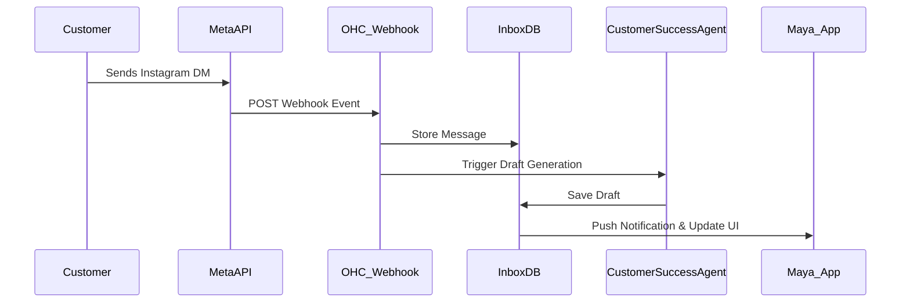
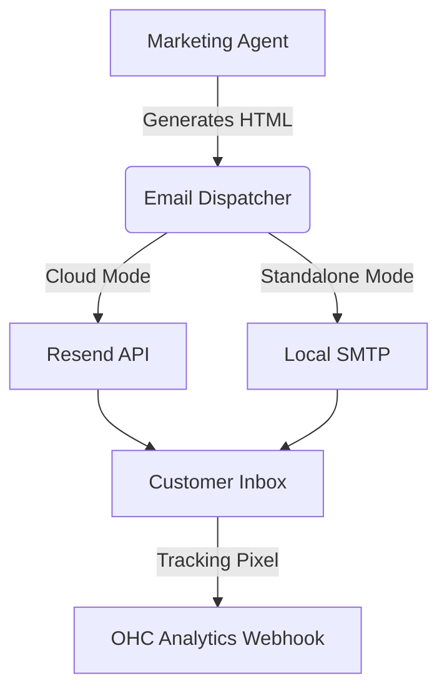
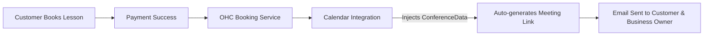

# 🔍 Scout: Tool Integration Research Q3

## Executive Summary
This research report investigates critical third-party integrations necessary to empower OHC's small business personas. It evaluates 7 key functional domains, analyzing options for Cloud (multi-tenant) and Standalone environments, and providing actionable issue briefs for implementation.

---

## 1. Social Media Integration

### [Social] Unified Social Inbox Integration (Meta + TikTok)

**Problem Statement:**
Business owners like Maya (The Home Baker) receive orders and inquiries across Instagram DMs, Facebook comments, and WhatsApp. Managing multiple apps leads to missed messages and lost revenue. They need a single, unified inbox where OHC's Customer Success agent can automatically draft replies while they sleep.

**Persona Pain Points:**
- **Maya (Baker):** Overwhelmed by DMs across Instagram and WhatsApp; loses track of custom cake orders.
- **Priya (Boutique):** Needs to answer product sizing questions on Facebook instantly to convert sales.

**Research Report:**
- **Tool Evaluated:** Meta Graph API (Instagram/FB/WhatsApp) & TikTok Marketing API.
- **Benefits:** Direct access to the platforms where users actually conduct business.
- **Evaluation:**
  - *OAuth Complexity:* High (Meta app review process is notoriously complex, requiring video screencasts and business verification).
  - *Message Parsing:* Standardized JSON, but media handling (voice notes, images) requires careful storage/proxying.
  - *Webhook Reliability:* High, but requires strict SLA responses (must respond within 20s or webhooks are disabled).
  - *Pricing:* Free API access, but WhatsApp Business API charges per conversation (approx. $0.015-$0.08 depending on country).
- **Cloud vs Standalone:** In Cloud, OHC manages the Meta App. In Standalone, users must create their own Meta Developer App (high friction) or use a bring-your-own-token approach.

**Comparative Table:**

| Provider | Setup Friction | Pricing | Webhook Reliability | Media Support |
|---|---|---|---|---|
| Meta API (IG/FB) | High (App Review) | Free | Very High | Full |
| WhatsApp API | Medium | Per Conversation | High | Full |
| TikTok API | Medium | Free | Medium | Text/Video |

**Design Doc:**
- **Trigger:** Webhook from Meta/TikTok arrives at OHC edge.
- **Action:** Event routed to the tenant's unified inbox. If unread, triggers "The Ambassador" (Customer Success Agent) to draft a reply using RAG over past business data.
- **UI:** A unified chat interface in the OHC mobile app, indistinguishable from iMessage, with a small "AI Draft" badge on suggested replies.

**Implementation Prompt:**
The user should see a "Connect Instagram/Facebook" button in their dashboard. Once connected, incoming DMs should appear in a new "Inbox" tab. The system should automatically generate draft replies for incoming messages using the tenant's context.

**Specific Actionable Recommendations:**
1. Start with Instagram DMs first, as it's the highest converting channel for visual businesses.
2. Ensure the OAuth flow handles both successful authentication and permission denial states gracefully.

**Priority:** P0
**Estimated Scope:** Large

---

## 2. Calendar & Scheduling

### [Scheduling] Universal Calendar Sync (Google Workspace / Outlook)

**Problem Statement:**
Service providers like Carlos (Handyman) and Leo (Music Tutor) manage availability in their personal Google Calendars. If OHC allows a booking when they are busy, they have to cancel and apologize, losing trust. They need two-way sync to block out booked times automatically.

**Persona Pain Points:**
- **Carlos (Handyman):** Double-books plumbing jobs because personal doctor appointments aren't synced.
- **Leo (Tutor):** Has to manually copy OHC bookings into his Google Calendar to see his daily schedule.

**Research Report:**
- **Tool Evaluated:** Nylas vs. Cronofy vs. Direct Native Integration (Google/MSFT).
- **Benefits:** Nylas/Cronofy abstract away the awful OAuth and sync nuances of Exchange/Google. Native is cheaper but harder to build.
- **Evaluation:**
  - *Conflict Resolution:* Complex. OHC must win on OHC bookings, but respect external busy blocks.
  - *Timezone Handling:* Critical risk. Must normalize all times to UTC but display in user's local timezone.
  - *Pricing:* Nylas ($0.99/account/mo), Cronofy similar. Native is free (API usage limits apply).
- **Cloud vs Standalone:** Nylas/Cronofy are Cloud-only SaaS. Standalone requires Native integrations using direct OAuth tokens. Therefore, Native is required for the long-term OHC architecture.

**Comparative Table:**

| Integration | Dev Time | Pricing | Standalone Support | Reliability |
|---|---|---|---|---|
| Nylas | Low | High ($/mo/user) | No | High |
| Cronofy | Low | High ($/mo/user) | No | High |
| Native (Google) | High | Free | Yes | High |

**Design Doc:**
- **Trigger:** User connects Google/Outlook via OAuth. Periodic background job or webhook syncs events.
- **Action:** Read external events and store as "Busy" blocks in OHC DB. Write OHC bookings to external calendar.
- **UI:** A simple calendar view showing OHC bookings in blue, and external busy times in grey.

**Implementation Prompt:**
Users should authenticate via Google OAuth. Once connected, their availability on the public OHC booking page should instantly reflect busy slots from their Google Calendar. New OHC bookings should automatically appear on their Google Calendar.

**Specific Actionable Recommendations:**
1. Evaluate using native Google Workspace and Microsoft Graph APIs to ensure compatibility with Standalone mode.
2. Ensure robust timezone handling to prevent cross-timezone booking errors.

**Priority:** P0
**Estimated Scope:** Medium

---

## 3. Email Marketing

### [Marketing] Smart Email Campaigns via Amazon SES / SendGrid

**Problem Statement:**
Business owners like Priya (Boutique) need to notify customers when new stock arrives. Managing a separate Mailchimp account is too expensive and complex. She needs a simple way to say "email all my past customers about the summer sale."

**Persona Pain Points:**
- **Priya (Boutique):** Mailchimp costs $20/mo and she doesn't know how to export/import CSVs.
- **Maya (Baker):** Wants to email customers who bought a birthday cake last year to see if they need one this year.

**Research Report:**
- **Tool Evaluated:** Amazon SES vs. SendGrid vs. Resend.
- **Benefits:** Resend offers the best developer experience and modern templates. Amazon SES is the cheapest.
- **Evaluation:**
  - *List Management:* OHC owns the customer list; the provider just sends the emails.
  - *Template Quality:* React Email (via Resend) allows generating beautiful layouts natively.
  - *Open Rate Analytics:* Requires webhook handling for open/click tracking.
  - *Pricing:* SES ($0.10/1k emails), SendGrid ($19/mo base), Resend ($20/mo base for 50k).
- **Cloud vs Standalone:** Cloud can use OHC's global Resend/SES account (metered billing to tenant). Standalone requires users to provide their own SMTP credentials.

**Comparative Table:**

| Provider | Developer Experience | Pricing | Deliverability | Standalone SMTP Support |
|---|---|---|---|---|
| Resend | Excellent | Medium | High | Yes (via SMTP fallback) |
| Amazon SES | Poor | Very Low | Medium (needs warmup)| Yes |
| SendGrid | Good | Medium | High | Yes |

**Design Doc:**
- **Trigger:** User asks "The Promoter" (Marketing Agent) to create a campaign.
- **Action:** Agent designs the email template using React Email components. OHC batches the dispatch via Resend/SMTP.
- **UI:** A visual preview of the email on a mobile screen, with a single "Send to X Customers" button.

**Implementation Prompt:**
Create a UI where users can type a plain text prompt ("Send a 10% off coupon to VIP customers") and the Marketing Agent generates and sends the styled email. Display open and click rates in the dashboard. Ensure the integration supports standard SMTP for standalone environments.

**Specific Actionable Recommendations:**
1. Consider using a cloud-native provider for hosted customers to leverage webhook analytics.
2. Provide a clear fallback configuration UI for standalone users to input SMTP credentials.

**Priority:** P1
**Estimated Scope:** Medium

---

## 4. Payment Processing

### [Finance] Global Payment Gateways (Mercado Pago, Razorpay, Alipay)

**Problem Statement:**
While Stripe is excellent, it is not supported in many developing markets. Small business owners outside the US/EU cannot accept local payment methods, severely limiting their sales.

**Persona Pain Points:**
- **Fatima (Food Cart):** Wants to accept payments but many of her customers use local digital wallets, not credit cards.
- **International Users:** Cannot use OHC because Stripe is unavailable in their country.

**Research Report:**
- **Tools Evaluated:** Mercado Pago (LATAM), Razorpay (India), Alipay (China), Paystack (Africa).
- **Benefits:** Opens OHC to massive underserved SMB markets globally.
- **Evaluation:**
  - *Settlement Speed:* Varies. Mercado Pago is fast, others take T+2 days.
  - *Currency Support:* Highly localized.
  - *Failure Rate:* Higher than Stripe; requires robust webhook retry mechanisms and pending-state UI.
  - *Pricing:* Typical 2-3% + fixed fee.
- **Cloud vs Standalone:** Both modes require the user to input their API keys for the respective gateways.

**Comparative Table:**

| Region | Primary Gateway | Local Wallets Supported | Webhook Reliability |
|---|---|---|---|
| LATAM | Mercado Pago | Pix, Boleto | Medium |
| India | Razorpay | UPI, Paytm | High |
| Africa | Paystack | Mobile Money | High |

**Design Doc:**
- **Trigger:** Checkout flow initiated by customer.
- **Action:** Dynamic payment gateway routing based on tenant's configured region.
- **UI:** Native mobile payment sheet offering local options (e.g., "Pay with Pix").

**Implementation Prompt:**
Update the checkout UI to dynamically display the correct payment provider based on the merchant's settings. Ensure orders stay in a "Pending" state until the respective payment webhook confirms success. Implement Mercado Pago as the first alternative to Stripe.

**Specific Actionable Recommendations:**
1. Abstract the payment provider configuration so new gateways can be added without changing the core checkout flow.
2. Design the user interface to gracefully handle delayed payment confirmations common in some international markets.

**Priority:** P2
**Estimated Scope:** Large

---

## 5. Shipping & Logistics

### [Operations] Real-time Shipping via Shippo / EasyPost

**Problem Statement:**
Business owners like Priya (Boutique) spend hours copying addresses into USPS/FedEx websites to generate labels. They need to click one button to buy and print a shipping label directly from their phone.

**Persona Pain Points:**
- **Priya (Boutique):** Wastes 2 hours a day manually printing labels.
- **Maya (Baker):** Needs to know exactly how much to charge for shipping a heavy cake box across the country.

**Research Report:**
- **Tools Evaluated:** EasyPost vs. Shippo.
- **Benefits:** Unified API for USPS, UPS, FedEx, DHL. Automatic tracking webhooks.
- **Evaluation:**
  - *Carrier Coverage:* Both cover 100+ global carriers.
  - *API Reliability:* EasyPost is extremely developer-friendly with high uptime.
  - *Pricing:* EasyPost (free for <120k shipments/yr), Shippo ($0.05/label).
- **Cloud vs Standalone:** EasyPost is ideal as it allows users to bring their own carrier accounts.

**Comparative Table:**

| Provider | Dev Experience | Pricing | International Support | Label Format |
|---|---|---|---|---|
| EasyPost | Excellent | Free Tier (High) | Yes | PDF/ZPL |
| Shippo | Good | $0.05/label | Yes | PDF/ZPL |

**Design Doc:**
- **Trigger:** Order marked as "Ready to Ship" in Operations Dashboard.
- **Action:** Fetch rates from EasyPost, purchase label, return PDF URL to UI.
- **UI:** A "Buy Shipping Label" button on the order detail screen. Shows the PDF label on screen for easy AirPrint to a thermal printer.

**Implementation Prompt:**
The user should be able to input package dimensions, see rate options, purchase a label, and print it via their mobile device. The system should automatically send a tracking email to the customer.

**Specific Actionable Recommendations:**
1. Default to generating 4x6 labels in PDF format, as most SMBs use basic thermal printers (e.g., Rollo) via their phones.
2. Ensure tracking details are accessible to the customer via the order status page.

**Priority:** P1
**Estimated Scope:** Medium

---

## 6. SMS & Notifications

### [Operations] Global SMS via Twilio / MessageBird

**Problem Statement:**
Some customers ignore emails. For food pickup or urgent service updates, SMS is required. Fatima (Food Cart) needs her customers to get an SMS saying "Your order is ready at the cart!"

**Persona Pain Points:**
- **Fatima (Food Cart):** Customers don't check email; food gets cold waiting for pickup.
- **Carlos (Handyman):** Needs to text clients "I am 15 minutes away."

**Research Report:**
- **Tools Evaluated:** Twilio vs. MessageBird (Bird) vs. AWS SNS.
- **Benefits:** Instant, 98% open rate communication.
- **Evaluation:**
  - *Global Coverage:* Twilio is best, but expensive. MessageBird is stronger in EU/Asia.
  - *Delivery Reliability:* High, but subject to A2P 10DLC regulations in the US (massive friction).
  - *Pricing:* Twilio (~$0.0079/msg US, much higher internationally).
- **Cloud vs Standalone:** In Cloud, OHC handles A2P 10DLC registration (hard). In Standalone, user brings their own Twilio keys.

**Comparative Table:**

| Provider | A2P 10DLC Friction | Pricing (US) | Pricing (Intl) | Standalone Auth |
|---|---|---|---|---|
| Twilio | High (Requires Biz Verification) | $0.0079 | High | Easy (API Key) |
| MessageBird | High | $0.0050 | Low | Easy (API Key) |
| AWS SNS | Low (if unregistered) | $0.0064 | Medium | Hard (IAM Auth) |

**Design Doc:**
- **Trigger:** State change in Order (e.g., `status = ready_for_pickup`).
- **Action:** Dispatch SMS task to background worker.
- **UI:** A simple toggle in the dashboard: "Send customer SMS updates for this order."

**Implementation Prompt:**
Add a feature to the Order Management screen where the business owner can tap "Notify Ready for Pickup", which sends an automated, localized SMS to the customer. Ensure the system handles opt-outs (STOP messages) securely.

**Specific Actionable Recommendations:**
1. Due to US A2P 10DLC rules, restrict SMS to transactional updates only (no marketing via SMS initially) to simplify registration.
2. Provide an alternative notification channel (like email or push notification) if SMS delivery fails.

**Priority:** P1
**Estimated Scope:** Medium

---

## 7. Video Conferencing

### [Operations] Auto-Generated Meetings via Zoom / Google Meet

**Problem Statement:**
Business owners like Leo (Music Tutor) sell online sessions. Manually creating a Zoom link for every booking and emailing it to the student is tedious and error-prone.

**Persona Pain Points:**
- **Leo (Tutor):** Forgets to send Zoom links, causing students to miss paid lessons. Needs the link automatically attached to the calendar invite.

**Research Report:**
- **Tools Evaluated:** Zoom API vs. Google Meet (via Google Calendar API).
- **Benefits:** Zero-touch booking fulfillment for digital services.
- **Evaluation:**
  - *Link Generation Speed:* Instant for both.
  - *Calendar Invite Quality:* Google Meet is native to Google Calendar (seamless). Zoom requires installing a Zoom app.
  - *Join Experience:* Zoom is ubiquitous; Meet requires a Google account sometimes.
- **Cloud vs Standalone:** Standalone requires OAuth to Zoom/Google.

**Comparative Table:**

| Tool | Dev Complexity | User Friction | Reliability |
|---|---|---|---|
| Google Meet | Low (via Calendar API) | Low | High |
| Zoom | High (OAuth + App Approval) | Medium | High |

**Design Doc:**
- **Trigger:** A "Service" product is booked and paid for via the storefront.
- **Action:** If the service is marked "Online", OHC calls the respective API to generate a meeting link and injects it into the confirmation email and calendar event.
- **UI:** A toggle on the Service creation page: "Location: [Online/In-Person]. Select Provider: [Zoom/Meet]."

**Implementation Prompt:**
The booking confirmation email sent to the customer must prominently feature a "Join Meeting" button linked to this auto-generated URL. The system should attach the link to the calendar event if applicable.

**Specific Actionable Recommendations:**
1. Start with a unified provider like Google Meet if building out a Google Workspace integration, as the meeting link can often be generated alongside calendar events.
2. Ensure meeting URLs are clearly visible in the customer-facing booking dashboard.

**Priority:** P2
**Estimated Scope:** Small

