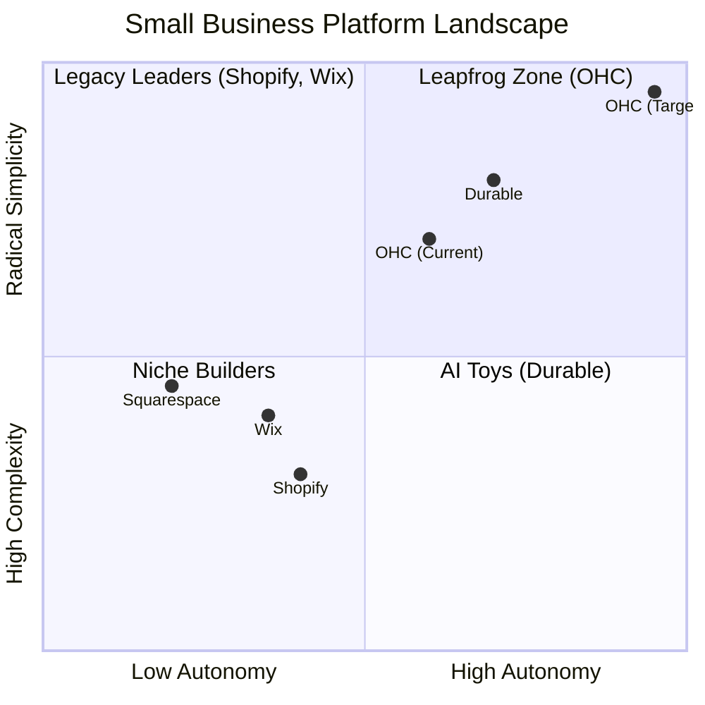

# OHC Market Research & Feature Gap Report

## Overview
This report synthesizes a deep dive into the SMB platform market, identifying critical pain points for non-technical small business owners and mapping them to actionable "Issue Briefs" for the OneHumanCorp (OHC) engineering swarm. The central thesis is that OHC must shift the paradigm from **AI as a Tool** (reactive, prompt-based) to **AI as a Teammate** (proactive, autonomous, event-driven).

## 1. Market Insight: The "Operational Fatigue" Epidemic
Our research across Reddit, App Store reviews, and Trustpilot reveals that setup complexity is only the first barrier. The long-term killer for small businesses is **Operational Fatigue**—the relentless daily grind of managing inboxes, tracking inventory, chasing payments, and generating marketing content. Competitors like Shopify and Wix offer excellent tools, but they still require the owner to *do the work*.

OHC's differentiation lies in autonomous, background execution.

## 2. Competitive Landscape

## 3. Generated Issue Briefs (Stored in `docs/research/`)
We have generated several highly actionable P1/P2 issue briefs based on verified market gaps.

### [feature]_unified_ai_messaging_inbox.md
*   **Target Persona:** Maya (Home Baker), Fatima (Food Cart)
*   **Problem:** 30% of sales are lost due to slow response times in fragmented channels (IG, WhatsApp).
*   **Solution:** A unified webhook ingestion layer where "The Ambassador" agent proactively drafts responses based on business context for 1-tap approval.

### [feature]_smart_booking_deposit_system.md
*   **Target Persona:** Carlos (Handyman), Leo (Music Tutor)
*   **Problem:** High friction in securing serious commitments; manual setup of calendars and deposits is too complex.
*   **Solution:** A streamlined booking primitive that automatically collects Stripe deposits and uses "The Manager" to send contextual pre-appointment instructions.

### [feature]_automated_social_media_calendar.md
*   **Target Persona:** Priya (Boutique Owner)
*   **Problem:** "Marketing Dread." Store owners lack the time and skill to post consistently.
*   **Solution:** When a new product is added, "The Promoter" agent automatically drafts a 7-day social media calendar (images + captions) for 1-tap scheduling.

### [feature]_plain_language_financial_advisory.md
*   **Target Persona:** All
*   **Problem:** "Financial Fog." Complex charts (Shopify Analytics) alienate non-technical users.
*   **Solution:** A weekly cron job that feeds metrics to "The Advisor" to generate a simple, text-message style summary ("You made $450 this week. Raise your prices.")

### [feature]_one_tap_legal_compliance.md
*   **Target Persona:** Carlos (Handyman), Maya (Home Baker)
*   **Problem:** Fear of liability and the high cost of legal templates.
*   **Solution:** "The Protector" agent automatically generates context-aware Terms of Service, Privacy Policies, and custom liability waivers based on the business profile.

### [feature]_automated_inventory_purchasing_manager.md
*   **Target Persona:** Priya (Boutique Owner), Fatima (Food Cart)
*   **Problem:** Manual inventory tracking leads to unexpected stockouts and lost sales.
*   **Solution:** "The Manager" agent predicts depletion velocity and proactively drafts supplier restock emails or suggests toggling items to "Sold Out" before they hit zero.

## 4. Strategic Next Steps
1.  **Prioritize the Unified Inbox:** Communication lag is the most immediate revenue killer for our target personas. Implementing the webhook ingestion and background drafting for Meta channels is the highest ROI initiative.
2.  **Solidify the "1-Tap" Mobile UX:** The success of these autonomous agents relies entirely on the Flutter UI presenting a frictionless "Action Feed" on a 375px screen.
3.  **Execute Issue Briefs:** The engineering swarm should begin implementation of these P1/P2 briefs immediately, utilizing the existing KAIROS Orchestrator and NATS mesh.
