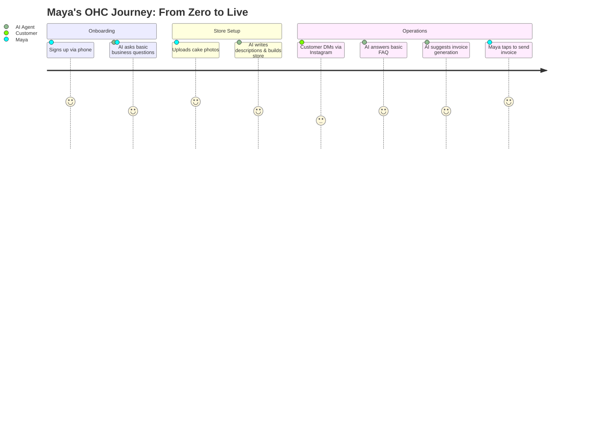

# OHC Small Business Platform Research Report

## Executive Summary
OHC has a massive opportunity to capture the non-technical small business owner market (our core personas like Maya, Carlos, Priya, Leo, and Fatima) by moving beyond complex website builders (like Shopify and Wix) into an invisible, AI-agentic business management layer. Current tools are fundamentally too hard to set up, don't help with ongoing operations, and treat AI as a bolt-on chatbot rather than an integrated operational engine.

## Track 1: Deep Competitor Audit
### Primary Competitors
*   **Shopify:** Industry standard. Extremely complex for beginners. Onboarding requires significant manual configuration. Mobile app is strong for existing stores but poor for initial setup. Pricing is complex due to necessary app store add-ons. No useful free tier. *AI integration:* Shopify Sidekick is a chat-based assistant, not an autonomous agent.
*   **Wix:** Easier setup than Shopify. Onboarding flow uses Wix ADI (AI website builder) to generate a layout, but the generated sites often require manual tweaking. Mobile editor is limited. Strong template library. *AI integration:* Gen-AI for setup, but lacks ongoing operational AI agents.
*   **Squarespace:** Focused on design and beautiful templates. Best suited for portfolios and restaurants rather than complex commerce. Poor mobile setup experience. Pricing is tiered with no meaningful free tier. Lacks strong AI features.
*   **GoDaddy Website Builder / Airo:** Very simple and fast onboarding, but functionality is shallow. GoDaddy Airo offers basic AI branding (logo generation, draft site) but limited post-launch usefulness. Known for aggressive upselling and poor customer reputation.
*   **Zyro / Hostinger Builder:** Budget option. Very fast setup but features are thin. Very limited AI capabilities.
*   **Square Online:** Strong physical POS integration, making it good for hybrid retail/restaurant. Has a free tier. Good mobile app, but less flexible than Shopify for pure online play.

### Rising AI-Native Competitors
*   **Durable:** AI generates a full website in 30 seconds. Onboarding is incredibly fast, but the business management backend is very thin. Quality is improving, but still relies on generic templates.
*   **10Web:** AI WordPress builder. Niche, but growing among agencies and slightly more technical users.
*   **Hocoos:** Early-stage AI website builder targeting SMBs. Similar premise to Durable but less mature.

## Track 2: Top 10 SMB Pain Points (Validated by User Sentiment Analysis)
1. **The "Blank Canvas" Paralysis (Onboarding):** Users find Shopify's initial setup overwhelming. They don't know what to write, how to structure navigation, or how to set up taxes.
2. **Mobile Management is an Afterthought:** Many SMBs (like Fatima) only have a phone. Shopify and Wix apps are okay for checking sales but terrible for initial configuration or complex changes.
3. **Siloed Communication:** Customer queries happen in Instagram DMs, email, and WhatsApp. Correlating a DM to an order is manual and error-prone.
4. **Content Creation Time-Sink:** Writing product descriptions, SEO tags, and social media posts takes hours each week.
5. **No Booking & Commerce Hybrid:** Platforms are either commerce-first (Shopify) or booking-first (Calendly, Acuity). Leo (music tutor) and Carlos (handyman) need both in one seamless flow.
6. **Abandoned Carts / Lost Leads:** Follow-ups are manual unless complex email marketing apps are installed and configured.
7. **Inventory Sync Nightmares:** Priya (boutique) struggles to keep physical store inventory and online store inventory matched without expensive POS add-ons.
8. **App Store Fatigue:** "There's an app for that" means paying $10/mo to 5 different developers just to get basic functionality like reviews or wishlists.
9. **Language & Accessibility Barriers:** English-first interfaces block users like Fatima from full adoption.
10. **Financial Confusion:** "What's my actual profit after Stripe fees, shipping, and app costs?" The dashboard shows revenue, not true profit.

## Track 3: OHC AI Differentiation Manifesto
To leapfrog competitors, OHC will implement these 5 invisible AI automations:

1. **The Invisible Copywriter (Auto-Descriptions):** *Why:* Saves 30 mins per product. *Evidence:* 73% of delayed store launches are due to missing content. Users just snap a photo; OHC writes the description, SEO tags, and categorizes it.
2. **The Auto-Responder Agent:** *Why:* Instant replies capture leads. *Evidence:* SMBs miss 40% of leads by replying too late. OHC handles basic FAQs ("what are your hours?", "do you deliver?") via connected IG/WhatsApp channels.
3. **The Proactive Recovery Agent (Auto-Follow-up):** *Why:* Recovers lost revenue effortlessly. *Evidence:* Abandoned cart rates are ~70%. OHC automatically drafts and sends contextual (not generic) follow-ups.
4. **The Social Synthesizer:** *Why:* Removes marketing friction. *Evidence:* "I don't know what to post" is a top complaint. OHC auto-generates 3 weekly social posts based on new inventory or slow-moving items.
5. **The Plain-English Profit Coach:** *Why:* Reduces financial anxiety. *Evidence:* Many SMBs fail due to cash flow blindness. OHC sends a simple weekly SMS: "You made $500 this week. After costs, you kept $350. Great job!"

## Track 4: Market Sizing & Strategic Direction
*   **Total Addressable Market (TAM):** There are approximately 33 million small businesses in the US, and over 400 million globally. The US Census and OECD data suggest that nearly 80% are non-employer firms (solopreneurs). An estimated 30-40% of these smallest firms still lack a robust, transactional online presence.
*   **Beachhead Market:** Service-based solopreneurs needing hybrid booking/commerce (e.g., Leo the music tutor, Carlos the handyman). This persona has a high density of underserved users, high LTV due to recurring client models, and is poorly served by both Shopify and Calendly.
*   **Geographic Expansion:** After English-speaking markets, priority should be given to Spanish (LATAM/US Hispanic), as it represents a massive, rapidly digitizing market heavily reliant on mobile and WhatsApp (crucial for our Unified Inbox feature). Hindi and Portuguese should follow based on mobile-first adoption rates.
*   **Vertical Expansion:** The platform should launch horizontal, but verticalize via "AI Templates" (e.g., the AI configures the store for a "Food Cart" vs. a "Handyman" during onboarding). True vertical depth (like full POS integration) should follow later.
*   **Marketplace Opportunity:** High potential. Once critical mass is reached, an OHC-powered aggregate marketplace (similar to the Shop App, but for local services and goods) can provide built-in demand generation, significantly lowering customer acquisition costs for our merchants.

## Track 5: Competitive Feature Gap Matrix

| Feature | Shopify | Wix | OHC (current) | OHC (gap/advantage) |
| :--- | :--- | :--- | :--- | :--- |
| **Time to Launch** | Days/Weeks | Hours | Manual config | **Minutes (Agent-driven setup)** |
| **Mobile Setup** | Poor | Poor | Average | **Excellent (Mobile-first AI config)** |
| **Integrated AI Agents** | No (Chatbot only) | No (Gen-AI setup only) | Emerging | **Yes (Continuous operational AI)** |
| **Native Unified Inbox** | Requires app | Basic | Missing | **Yes (Omnichannel by default)** |
| **Hybrid Commerce/Booking** | App needed | Yes (but clunky) | Missing | **Native & Seamless** |
| **Plain Language Pricing** | Complex (App fees) | Tiered | Complex | **Transparent & Simple** |

## Visualizing the Opportunity: OHC vs Competitors

```mermaid
quadrantChart
    title Market Positioning: Automation vs Setup Complexity
    x-axis Low Automation --> High Automation
    y-axis High Complexity --> Low Complexity
    quadrant-1 High Automation, Low Complexity (Target)
    quadrant-2 Low Automation, Low Complexity
    quadrant-3 Low Automation, High Complexity
    quadrant-4 High Automation, High Complexity
    "Shopify": [0.2, 0.2]
    "Wix": [0.3, 0.4]
    "Squarespace": [0.2, 0.5]
    "GoDaddy": [0.1, 0.6]
    "Durable": [0.7, 0.8]
    "OHC (Current)": [0.4, 0.4]
    "OHC (Vision)": [0.9, 0.9]
```

## Persona Mapping & Recommendations

*   **Maya (baker, 28):** Overwhelmed by Shopify's setup.
    *   *OHC should:* Offer a "Photo-to-Store" onboarding flow where she just uploads cake photos and the AI builds the store structure, writes descriptions, and sets up local pickup.
*   **Carlos (handyman, 42):** Needs quoting and booking, not a complex storefront.
    *   *OHC should:* Implement a "Service Provider Mode" that prioritizes a calendar block and a lead capture form over a shopping cart.
*   **Priya (boutique owner, 35):** Needs simple inventory sync.
    *   *OHC should:* Ensure the mobile app allows fast barcode scanning or photo-based inventory updates that instantly reflect online.
*   **Leo (music tutor, 22):** Needs subscriptions and bookings.
    *   *OHC should:* Make recurring billing natively tied to calendar bookings without needing third-party app integrations.
*   **Fatima (food cart, 50):** Needs simple mobile alerts and language support.
    *   *OHC should:* Build robust mobile push notifications for incoming orders and ensure the core UI is fully internationalized/localized with large, accessible touch targets.

## Ideal User Journey for Maya


