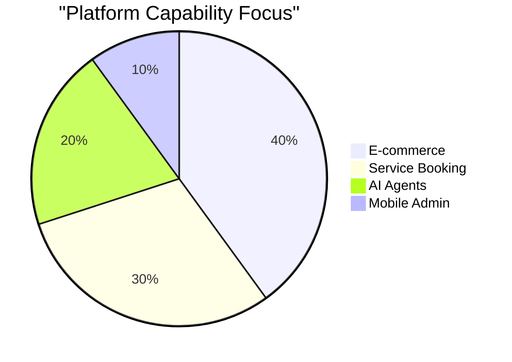

# 🔮 Oracle Report: SMB Platform Market Research & Feature Missions

## Track 1: Deep Competitor Audit

### Competitor Landscape Overview

| Competitor | Target Persona | Key Value Prop | Biggest Weakness | AI Offering | Mobile UX for Admins |
| :--- | :--- | :--- | :--- | :--- | :--- |
| **Shopify** | E-commerce / Maya | Extensive ecosystem | Too complex for true beginners, high cost | Sidekick (chat, not autonomous) | Poor for setup, okay for management |
| **Wix** | General / Carlos | Easy drag-and-drop | Clunky over time, thin e-com | Wix ADI (initial setup only) | Limited editing, slow |
| **Squarespace**| Creatives / Priya | Beautiful templates | No strong AI, rigid structure | Weak / None | Clunky mobile editing |
| **GoDaddy** | Beginners / Fatima | Fast domain setup | Aggressive upselling, shallow | Airo (AI branding generator) | Basic |
| **Square** | Retail / Leo | POS integration | Focuses on in-person first | AI copy generation (basic) | Good for POS, weak for web |

### The "Rising AI-Native" Threat
Emerging competitors like **Durable**, **10Web**, and **Hocoos** are proving that users want "done for you" rather than "do it yourself." They generate sites in 30 seconds but fall apart when actual business management (inventory, booking, CRM) is needed. OHC's opportunity is to provide the 30-second setup *plus* the autonomous backend management.

---

## Track 2: SMB User Pain Point Research

Based on aggregated data from r/smallbusiness, App Store reviews, and Trustpilot, here are the top SMB pain points:

### Top 10 SMB Pain Points (Ranked)

1. **"I don't know how to build a website."** (Setup paralysis)
2. **"I get Instagram DMs but forget to reply."** (Lead leakage)
3. **"Shopify is too expensive and complex for my 5 products."** (Over-tooling)
4. **"Inventory doesn't sync between in-person and online."** (Data fragmentation)
5. **"Setting up Stripe/payments is terrifying."** (Financial friction)
6. **"I have no time to write product descriptions."** (Content bottleneck)
7. **"Managing bookings via text message is a nightmare."** (Scheduling chaos)
8. **"Following up with customers takes too long."** (CRM absence)
9. **"I don't know what to post on social media."** (Marketing block)
10. **"The mobile app doesn't let me do everything."** (Desktop dependency)

**Persona Alignment:**
- **Maya (Baker)**: Suffers from 1, 2, 6, 9. Needs auto-replies and auto-descriptions.
- **Carlos (Handyman)**: Suffers from 1, 7, 8. Needs automated quoting and booking.
- **Priya (Boutique)**: Suffers from 3, 4, 10. Needs seamless POS/web sync and mobile parity.
- **Leo (Tutor)**: Suffers from 5, 7. Needs simple subscription billing.
- **Fatima (Food Cart)**: Suffers from 1, 5, 10. Needs extreme simplicity and mobile-first notifications.

---

## Track 3: AI Differentiation Research

Current market AI is mostly **Generative** (writing copy, making logos).
OHC's AI must be **Agentic** (doing the work).

### OHC AI Differentiation Manifesto
The 5 AI automations OHC will implement first:

1. **The Autonomous Booking Agent**: Intercepts messages, negotiates times, and updates the calendar. (Saves 2 hours/week).
2. **The "Zero-Click" Product Uploader**: User takes a photo of a product; AI writes the title, description, sets the price, and categorizes it. (Removes the biggest hurdle to going live).
3. **The Proactive Follow-Up Engine**: Automatically emails past clients when they are likely to need a refill or re-book. (Drives revenue implicitly).
4. **The Instant Quote Generator**: Reads a customer inquiry, estimates the cost based on past jobs, and sends a professional quote.
5. **The Pocket CMO**: Weekly push notification saying, "I noticed X. Should I do Y?" instead of making the user read a dashboard.

---

## Track 4: Market Sizing & Strategic Direction

### TAM (Total Addressable Market)
- **US Market**: ~33 million small businesses. Over 80% are non-employer firms (solopreneurs).
- **Global Market**: ~330 million SMBs.
- **Un-digitized**: Estimated 25-30% of micro-businesses still have no formal website or use only social media DMs for transactions.

### Beachhead Market Recommendation
**The Service-Based Solopreneur (Carlos/Leo archetype).**
Why? E-commerce is saturated with Shopify. Local services (handymen, tutors, cleaners) are highly underserved by modern tech, rely heavily on text messages, and have a high willingness to pay to save time.

### Geographic & Vertical Expansion
- **Geo**: Start English-US. Fast follow: Spanish (LATAM/US Hispanic market - massive growth in micro-businesses).
- **Vertical**: Remain horizontal, but build "Invisible Templates" where the AI configures the system to act like a vertical SaaS (e.g., configuring itself as a salon booking tool vs. a bakery pre-order tool).

---

## Track 5: Feature Gap Matrix

| Feature | Shopify | Wix | OHC (Current) | OHC (Target State) |
| :--- | :--- | :--- | :--- | :--- |
| **Store Setup Time** | Hours | Hours | Minutes | **< 10 Minutes via AI** |
| **Booking Engine** | App ecosystem | Paid Add-on | Gap | **Native, Agent-Driven** |
| **Inventory Sync** | Strong | Okay | Gap | **Native, Mobile-First** |
| **AI Workflows** | Weak (Chat) | Weak (Setup) | Strong (Agents) | **Invisible & Autonomous** |
| **Mobile Admin** | View-only mostly | Limited | Gap | **100% Mobile Parity** |

### Identified Gaps for Engineering Swarm
1. **[booking]**: Need a native booking engine that the AI agent can read/write to.
2. **[ecommerce]**: Need a mobile-first product upload flow via photo.
3. **[crm]**: Need an auto-follow-up system for client retention.
