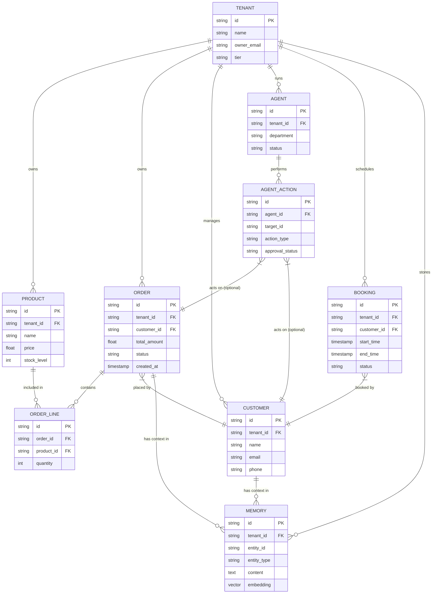

# Issue Brief: Data Model Architecture Evolution for Multi-Tenant Small Businesses

## Title
Data Model Architecture: Robust Multi-Tenancy and AI Agent Memory

## Problem Statement
Small business owners depend on the OHC platform to manage all aspects of their business, from inventory to customer interactions. Currently, as the system expands to include proactive AI agents ("Teammates"), the underlying data model needs to evolve to support advanced memory retrieval, bulletproof tenant isolation, and unified access patterns. Non-technical users require a completely seamless experience where their data is secure, always available (even offline), and instantly queryable by AI to automate their operations without cognitive overhead.

## Research Report
- **Multi-Tenancy Requirements:** Every entity in the system must be strongly associated with a specific business (Tenant). Our architecture requires Row-Level Security (RLS) in PostgreSQL using a mandatory `tenant_id` column to prevent data leakage and provide hard boundaries.
- **AI Integration (Memory):** AI agents (like "The Ambassador" and "The Manager") need both structured data (Orders, Inventory) and unstructured context (Customer Preferences, Past Communications). This necessitates a unified memory model integrating traditional relational structures with vector embeddings (`pgvector`) for similarity search.
- **Offline-First Synchronization:** Standalone clients (e.g., mobile apps, desktop POS) require synchronization via CRDTs or delta updates. The core data model needs explicit mechanisms to track changes over time (e.g., `updated_at`, `version`, `synced_to_cloud`).
- **Competitive Landscape:** Platforms like Shopify and Wix often struggle with extending their data models for AI, resulting in bolted-on solutions. By baking AI memory and RLS into the foundational schema, OHC gains a significant architectural advantage.

## Design Doc

### Key Invariants
1. **Tenant Isolation:** A business owner (and their corresponding AI agents) can ONLY access data belonging to their own `tenant_id`. This is enforced at the database level via PostgreSQL RLS. All application queries must set the context (e.g., `SELECT set_config('app.current_tenant', <tenant_id>, true)`).
2. **Offline Data Integrity:** Local modifications (Standalone mode) use CRDTs or delta updates to sync.
3. **Immutable Auditing:** Financial transactions and AI agent actions (Drafts, Approvals) must be append-only or maintain an immutable history log for trust and compliance.

### Migration Strategy
- **Phase 1 (Schema Additions):** Introduce `tenant_id` to all relevant tables and enable RLS policies. Add vector extension (`pgvector`) and `autodream_memories` table for AI context.
- **Phase 2 (Application Layer):** Update the Go backend to inject `tenant_id` into database connections before query execution.

### Access Patterns
- **AI Agent Querying Customer History:** The Ambassador agent receives a new message. It queries the `MEMORY` table using a vector similarity search (`pgvector`) against the message embedding, filtered by `tenant_id` and `customer_id`, to retrieve relevant past interactions and preferences.
- **Mobile App Fetching Orders:** The mobile dashboard (acting as a Standalone client or online) fetches orders by querying the `ORDER` table filtered by `tenant_id`. For offline sync, it requests records where `updated_at` is greater than the last sync timestamp.

### UI Wireframes / Mobile UX Flow
- **Data Model Diagnostic View (375px):** A simple diagnostic screen in the mobile app (under Settings > Advanced) showing sync status: "Last synced: 2 mins ago", "Offline changes pending: 5".
- **Agent Memory View (375px):** When viewing a Customer Profile, a small "AI Context" card shows: "The Ambassador remembers: Customer prefers vegan options."

### Entity-Relationship Diagram

## Implementation Prompt
"Implement the foundational Multi-Tenant Data Model structures and Go backend integration to support AI Agent Memory and offline sync. The user-facing outcome is a seamlessly syncing mobile app where a business owner never sees 'data conflict' errors, and AI agents immediately 'remember' past interactions.

**Critical User Journey (CUJ):**
1. The business owner opens the app offline and creates a new product.
2. The owner comes back online.
3. The Ambassador agent receives a customer question about the new product and instantly retrieves it from memory to draft a response.

**Acceptance Criteria:**
- Backend tests verify that cross-tenant data access is strictly blocked.
- Vector search returns relevant historical context for a given customer within 100ms.
- E2E tests verify that creating an entity offline successfully syncs to the cloud backend without conflicts upon reconnection."

## Priority
P0

## Estimated Scope
Large
