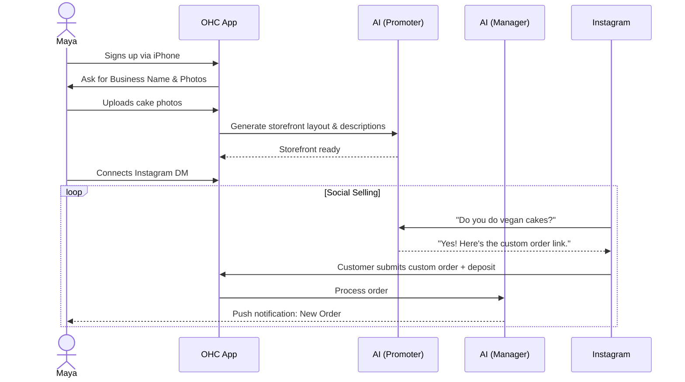
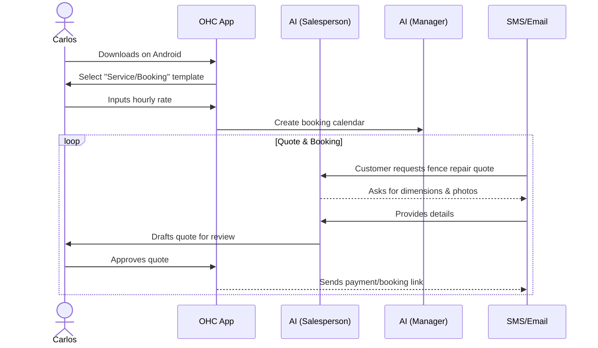
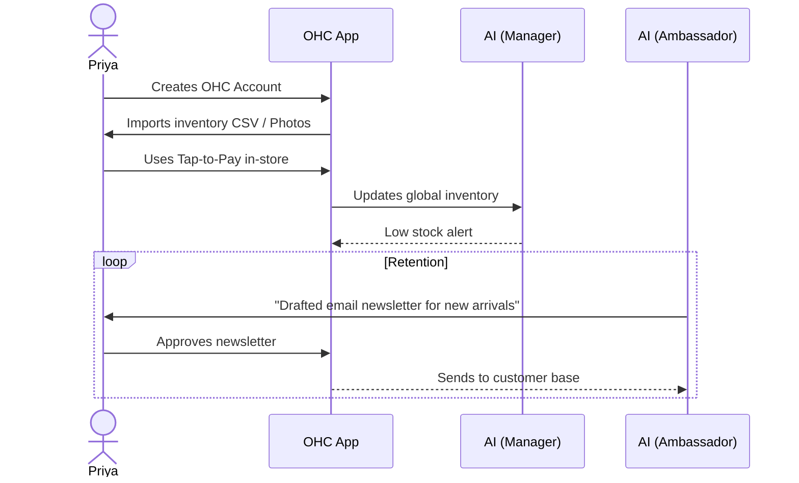
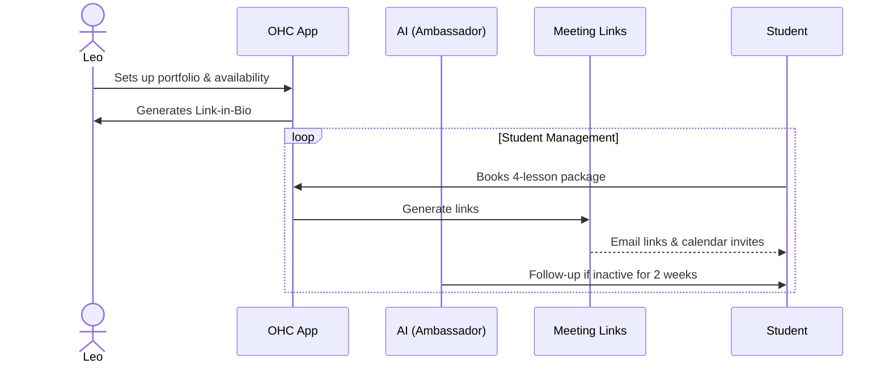
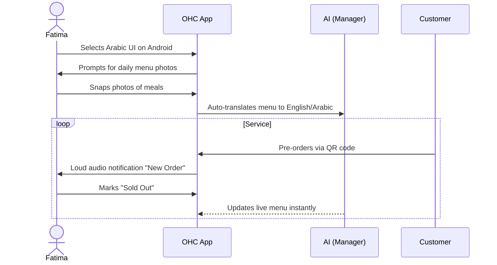

# [Architecture] Business Journey Definition & Mapping

## Title
End-to-End Business Journey Architecture & Mobile UX Flows

## Problem Statement
Small business owners (like bakers, handymen, tutors, and food cart operators) are overwhelmed by the technical friction of getting their business online. They don't have the time to read manuals, learn about domains, or build websites. Existing tools like Shopify, Wix, and Squarespace require desktop computers and hours of technical setup, resulting in high abandonment rates. Our users need a platform where they can launch a real business directly from their phone in under 10 minutes, with AI seamlessly handling the complex back-office work, so they can focus on what they love doing.

## Research Report
### Findings & Competitive Analysis
- **Shopify**: Excellent for e-commerce, but overly complex for service-based businesses (Carlos, Leo). Requires desktop for comprehensive setup. High learning curve.
- **Wix/Squarespace**: Generalist website builders. Very visual, but the mobile editing experience is notoriously clunky. Poor handling of native integrations like POS (tap-to-pay) and AI-driven automated DM replies.
- **GoDaddy**: Fast onboarding, but basic templates limit growth. Lack of native AI agent operations.
- **OneHumanCorp Opportunity**: Mobile-first, zero-configuration setup driven by conversational AI. We unify physical products, services, digital goods, and food pre-orders under one simplified mental model. "Launch in 10 minutes from your phone."

## Design Doc
### Architecture Diagrams (Mermaid.js)

#### 1. Maya (Baker) - Custom Orders & Social Selling

#### 2. Carlos (Handyman) - Word of Mouth & Quotes

#### 3. Priya (Boutique) - Omni-channel Retail

#### 4. Leo (Music Tutor) - Subscriptions & Reminders

#### 5. Fatima (Food Cart) - Localization & High-Volume Pre-orders

### UI Wireframes & Screen Flow (375px Mobile-First)
1. **Onboarding Wizard**:
   - Screen 1: "What do you do?" (Grid of visual icons: Bake, Teach, Fix, Sell).
   - Screen 2: "What is your business called?"
   - Screen 3: "Add your first item/service" (Camera opens immediately).
   - Screen 4: "Your store is live!" (Confetti animation, sharing link).
2. **Dashboard**:
   - Top banner: Action-oriented AI suggestions ("Drafted reply to 3 customers", "Review weekend analytics").
   - Middle: Big bold buttons: "Add Product", "View Orders", "Share Link".
   - Bottom Tab bar: Home | Orders | Chat | Settings.
3. **Chat/Inbox**: Unified inbox mixing IG DMs, SMS, and site chat. AI suggested replies visible inline as drafts.

### Mobile UX Flow
- **Acquisition**: User taps Instagram Ad -> Lands on App Store -> Opens App.
- **Onboarding**: Minimal text. High reliance on native camera and voice dictation. Deferred account creation (allow them to see the storefront *before* asking for a password).
- **Activation**: Success = First product live, sharing link copied to clipboard.
- **Retention**: Push notifications for every sale. Weekly AI-generated "Health Report" summarizing views and revenue.
- **Revenue**: Free tier hits 10 products -> Soft lock with prompt "Upgrade to Starter to add more products and unlock a custom domain".
- **Referral**: "Get a free month by helping another business owner launch."

### AI Agent Integration Points
- **The Manager (Operations)**: Automatically manages inventory counts, generates calendar slots, translates menus (for Fatima).
- **The Promoter (Marketing)**: Generates initial storefront copy from photos, drafts newsletters.
- **The Salesperson (Sales)**: Handles custom order inquiries via DM, generates quotes (for Carlos).
- **The Ambassador (Customer Success)**: Re-engages inactive students (for Leo), replies to FAQs.

### Key Design Decisions
- **Unified Catalog Model**: Products, services, and digital goods all use the same core data structure but render differently on the storefront to simplify the mental model.
- **Draft-First AI**: AI never executes destructive actions or sends external emails without user approval (drafts appear for review in the mobile inbox).
- **Optimistic UI**: All actions (like marking an item sold out) update the UI immediately, handling network syncing in the background to support poor connections (e.g., Fatima's food cart).

## Implementation Prompt
**Context**: Implement the end-to-end Onboarding and Dashboard flow for mobile web and native desktop (Slint UI).
**Outcome**: A seamless, zero-friction mobile onboarding experience where a user can select their business type, add a single item via photo, and land on a dashboard that presents actionable AI insights.
**CUJ (Critical User Journey)**:
1. User opens the app.
2. User selects business type (e.g., "Food & Beverage").
3. User names the business.
4. User uploads one photo and sets a price.
5. User arrives at the Dashboard and sees their live storefront link.
**Acceptance Criteria**:
- Must pass the "Grandmother Test" (usable in under 30 seconds).
- The onboarding wizard must require no more than 4 taps to reach the dashboard.
- The UI must strictly follow mobile-first 375px responsive design.
- The dashboard must have a unified "Inbox" component for AI drafts.
- Must include at least 5 Playwright E2E tests validating the entire onboarding flow.

## Priority
P0

## Estimated Scope
Large
