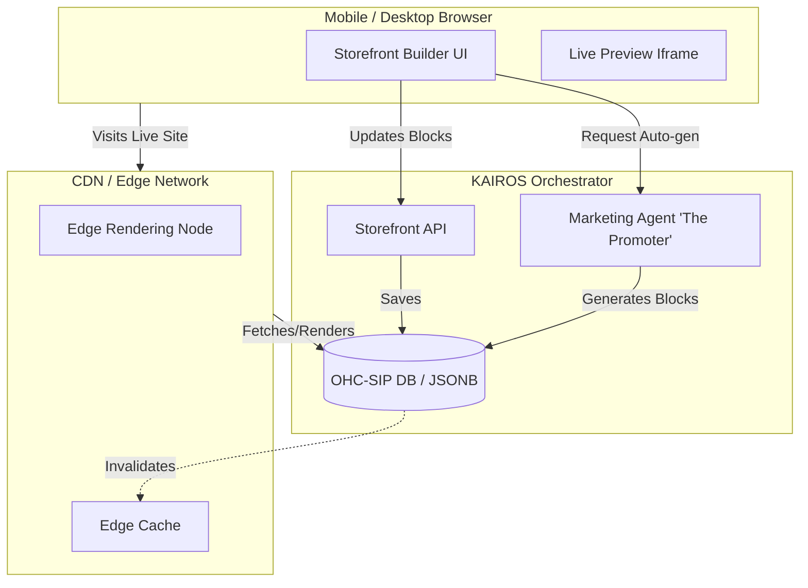

# OHC Website & Storefront Builder Architecture Research Report

## Problem Statement
Small business owners (our core personas like Maya the baker, Carlos the handyman, and Priya the boutique owner) need to launch a professional online presence instantly without writing code, dealing with DNS, or navigating complex design tools. The current market solutions (Shopify, Wix, Squarespace) are powerful but often overwhelming for a non-technical user trying to go from 0 to live in under 10 minutes on a mobile phone. OHC needs a drag-and-drop website builder that is primarily mobile-first, deeply integrated with our AI agents, and dead-simple to use.

## Research & Competitive Analysis

### Competitors
1.  **Shopify:**
    *   *Strengths:* Massive ecosystem, powerful liquid templating, deep e-commerce features.
    *   *Weaknesses:* Steeper learning curve, overwhelming for simple service businesses (like Carlos), heavily desktop-biased for initial setup.
2.  **Wix / Squarespace:**
    *   *Strengths:* Beautiful templates, true drag-and-drop.
    *   *Weaknesses:* Complex editors that are difficult to use on mobile devices. E-commerce is often bolted on rather than native.
3.  **Link-in-Bio (Linktree, Beacons):**
    *   *Strengths:* Instant setup, perfect mobile UX.
    *   *Weaknesses:* Too limited. Cannot scale to a full storefront with variants, cart, and booking calendars.

### Market Gap for OHC
There is a gap for a builder that provides the simplicity of a Link-in-Bio tool on mobile, but scales to the functionality of Shopify. The builder must be modular, driven by "Content Blocks" rather than free-form pixel-perfect layouts, and highly automated by the "Marketing & Advertising" AI department.

## Architectural Design

### 1. Core Principles
*   **Mobile-Parity & Mobile-First Setup:** The entire builder must work flawlessly on a 375px screen.
*   **Block-Based Composition:** Sites are built using predefined, intelligent Content Blocks, not free-form text or image elements.
*   **AI-Driven Generation:** The Marketing Agent ("The Promoter") can auto-generate the initial site based on a brief chat (e.g., "I sell vegan cakes in Austin").
*   **Zero-Config Publishing:** Domains (OHC subdomains or custom) and SSL are provisioned invisibly.

### 2. Entity Model & Storage (Conceptual)
*   **`Storefront`**: Top-level entity linked to a `Tenant`.
*   **`Page`**: Belongs to a Storefront (Home, About, Products, Booking).
*   **`ContentBlock`**: The atomic unit of design. Stored as JSONB in the database. Examples:
    *   `HeroBlock` (Headline, Subheadline, CTA, Background Image)
    *   `ProductGridBlock` (Links directly to the Operations product catalog)
    *   `ServiceBookingBlock` (Links to the calendar system)
    *   `ContactFormBlock` (Routes to the Customer Success agent)
    *   `TestimonialBlock`
*   **`Theme`**: A set of design tokens (Colors, Typography, Spacing) applied globally. Adheres to the Visual Excellence Mandate (Glassmorphism, Outfit + Inter).

### 3. Architecture Diagram

### 4. Key Design Decisions

*   **JSONB Block Storage:** Storing page definitions as a JSONB array of blocks allows for extreme flexibility, easy versioning (draft vs. published), and simple manipulation by the AI agent.
*   **Edge Rendering:** Live storefronts should be rendered at the edge (e.g., Cloudflare Workers or similar) for maximum performance, reading the JSONB payload and compiling it into HTML/CSS on the fly.
*   **Separation of Content and Theme:** The Theme (design tokens) is applied at render time. This allows a user to switch themes instantly with 1 tap without rebuilding their content.
*   **AI Integration Point:** The AI Agent does not write HTML. It generates or mutates the JSONB block structure based on intent.

### 5. AI Integration: The Promoter
*   **Onboarding:** The Promoter asks 3 questions and generates a fully functional draft site by assembling `HeroBlock`, `ProductGridBlock`, and `ContactFormBlock`.
*   **Ongoing:** If the Advisor agent detects low conversion, it prompts the Promoter to suggest an A/B test (e.g., adding a `TestimonialBlock`). The owner approves this with 1 tap.

### 6. Multi-Tenant Tier Handling
*   **Free Tier:** Published to `[tenant].ohc.site`. Limited blocks.
*   **Starter/Pro Tier:** Custom domain support. The platform handles DNS verification and automated Let's Encrypt SSL provisioning.

## Next Steps
Implement the core `ContentBlock` JSONB schema and the Edge Rendering pipeline.

## Implementation Prompt
Design and implement the core engine for the Block-Based Website & Storefront Builder.

**User-Facing Outcome:**
A business owner can open the OHC mobile app, navigate to the Website section, and instantly see a draft storefront assembled from pre-defined Content Blocks (e.g., Hero, Products, Contact). They can add, reorder, and edit these blocks with a simple, mobile-first interface, and then publish the site to their OHC subdomain or custom domain with one tap.

**CUJ (Critical User Journey):**
1.  User opens the "Website" tab.
2.  User sees a default page structure composed of a `HeroBlock` and a `ProductGridBlock`.
3.  User taps "Add Block", selects `ContactFormBlock`, and it appears at the bottom.
4.  User edits the text in the `HeroBlock`.
5.  User taps "Publish". The changes are live instantly on their domain.

**Acceptance Criteria:**
*   Implement the core entity model (`Storefront`, `Page`, `Theme`).
*   Implement the JSONB schema structure for `ContentBlock`.
*   Provide an API endpoint to fetch the page definition (JSONB array of blocks).
*   Provide an API endpoint to update the page definition (saves as draft).
*   Provide an API endpoint to publish the draft to live.
*   Ensure the structure supports integration with the AI Promoter agent for automated block generation.

## Priority
P0

## Estimated Scope
Large
