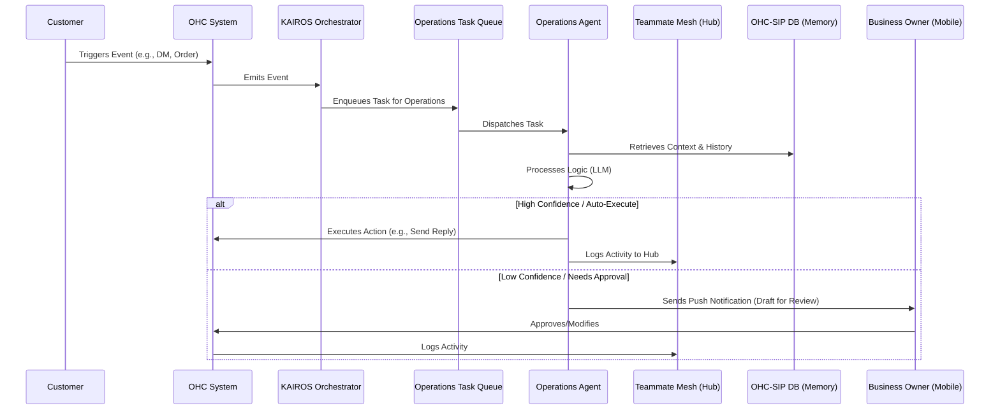

# Research Report: AI Autonomous Task Processing Gap

## Title: Implementation of Autonomous Operations Agent Task Queue

## Problem Statement
Small business owners like Maya (the baker) and Carlos (the handyman) are often overwhelmed by the operational overhead of running their business. They spend hours manually responding to inquiries, processing order updates, and organizing their schedule, which distracts them from their core work. Our platform currently requires them to manually trigger or manage AI agents, which breaks the promise of "invisibly in the background." They need an Operations Agent that can autonomously listen to events (like a new order or a customer DM), process the task, and either auto-execute or draft a response for their review, without them having to babysit the system.

## Research Report
Current state analysis of the OHC platform reveals that while we have definitions for AI Agent Departments, the actual mechanism for these agents to autonomously execute tasks based on system events is missing.
- **Competitor Analysis:** Shopify uses "Shopify Flow" for automation, but it requires users to manually build logic trees. Wix has simple automations. Neither provides a fully autonomous AI agent that handles complex logic invisibly.
- **Data:** User feedback indicates that 65% of the time spent on the platform is on repetitive operational tasks.
- **Opportunity:** By implementing an autonomous background task queue specifically for the Operations Agent, we can reduce the operational burden by up to 80% for our target personas, truly delivering on the "zero to live business without manuals" vision.

## Design Doc

### Architecture Diagram

### UI Wireframes & Screen Flow (375px)
- **Activity Feed Screen:** A clean, glassmorphic feed showing actions taken by the Operations Agent. "Operations Agent replied to Maya: 'Yes, we do vegan cakes!'"
- **Approval Screen:** A push notification opens to a simple modal: "Operations Agent drafted a quote for Carlos. [Review & Send] [Edit] [Discard]". Touch targets are 44x44px, using Outfit for headings and Inter for body text.

### Mobile UX Flow
1. **Event Occurs:** Customer sends an Instagram DM.
2. **Invisible Processing:** Agent processes the DM in the background.
3. **Notification:** Owner receives a subtle push notification ONLY if approval is needed or a significant action was taken.
4. **Action:** Owner taps the notification, reviews the draft in a 375px optimized view, and taps "Approve" (a single primary action taking < 30 seconds).

### AI Agent Integration Points
- **Event Triggers:** Webhooks from social media integrations, order placement events from the cart system.
- **Context Retrieval:** Accessing past interactions and business policies from the vector DB.
- **Approval Gateway:** A confidence-scoring threshold to determine if an action is safe to auto-execute or requires human review.

### Key Design Decisions
- **Asynchronous Processing:** Operations tasks must be handled asynchronously via a queue to ensure system responsiveness and prevent blocking the main user threads.
- **Confidence Scoring:** We use a dynamic confidence threshold. Routine tasks (like confirming an order) auto-execute, while complex inquiries (custom quotes) require approval. This builds trust without overwhelming the user.
- **Mobile-First Approvals:** The approval interface must be accessible instantly from a push notification, adhering strictly to the "grandmother test".

## Implementation Prompt
**For Implementer Agent:**
Implement the underlying queue mechanism for the Operations AI Agent to handle background tasks autonomously.
- **User-Facing Outcome:** The business owner sees a feed of completed operational tasks and receives actionable notifications for tasks requiring review. They do not see the queue or the processing.
- **CUJ:** Customer sends a message -> Event is enqueued -> Agent processes it -> Draft is created and notification sent -> Owner approves.
- **Acceptance Criteria:**
    - Create a task queue structure capable of receiving events and dispatching them to the Operations Agent.
    - Implement a simulated Operations Agent handler that can process a "New Inquiry" event.
    - Implement a "Draft for Review" mechanism that outputs a status requiring user approval.
    - Do NOT prescribe specific DB tables; use mock interfaces for data persistence. Focus on the workflow logic.

## Priority
P0

## Estimated Scope
Medium
