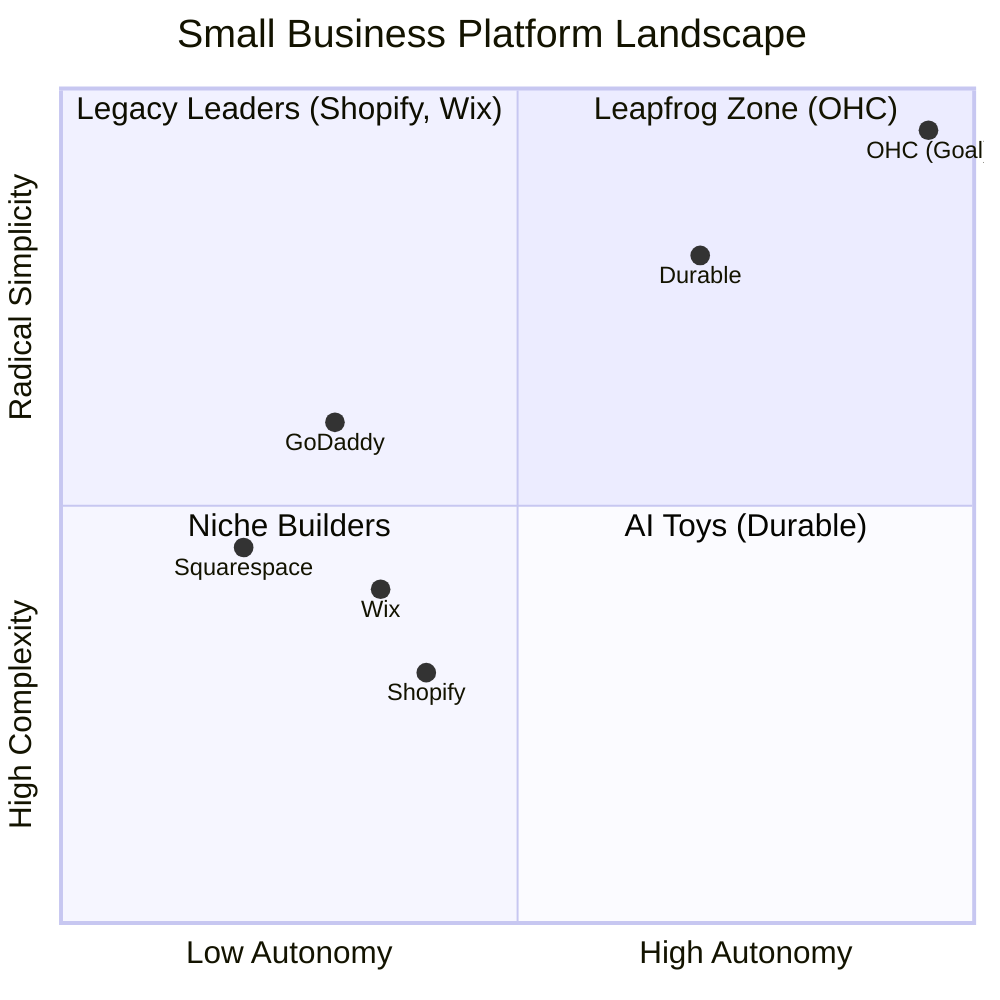
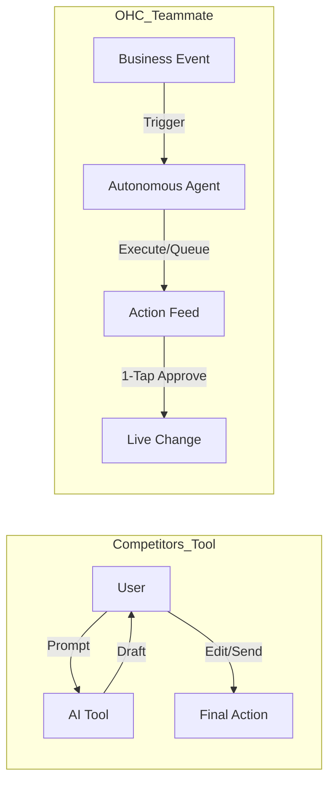

# OHC Market & Competitor Research Report: The SMB Platform Gap

## Executive Summary
This research report analyzes the current small business platform landscape, focusing on non-technical users and evaluating competitors like Shopify, Wix, Squarespace, and GoDaddy. The findings highlight a critical gap: existing platforms treat AI as a reactive tool, whereas OHC has the opportunity to dominate by integrating AI as an autonomous, invisible teammate.

## 1. Deep Competitor Audit & Feature Gap Matrix
A comprehensive analysis of major platforms reveals that none fully solve the "Setup Complexity" and "Operational Fatigue" problems for true beginners.

**Shopify (shopify.com):**
- **Onboarding:** Complex, 30-60 min. Requires understanding of themes, apps, and shipping zones.
- **Mobile App:** Strong for existing stores, poor for initial setup.
- **AI Features:** Reactive "Sidekick" chatbot. Not autonomous.
- **Pricing:** $39/mo standard. No useful free tier.
- **User Complaints:** "Why do I need to know what a CNAME record is just to sell a t-shirt?" (Source: r/shopify) "Subscription hell from third-party app stores." (Source: Trustpilot)

**Wix (wix.com):**
- **Onboarding:** 20-40 min. Easier setup, Wix ADI generates initial site.
- **Mobile App:** Limited functionality compared to desktop editor.
- **AI Features:** Wix ADI for website building. Limited ongoing operational AI.
- **Pricing:** $17/mo standard. Adequate free tier (with ads).
- **User Complaints:** "The AI built the site, but now I'm stuck with a dashboard that looks like a spaceship cockpit." (Source: Trustpilot)

**Squarespace (squarespace.com):**
- **Onboarding:** 30-60 min. Design-focused templates.
- **Mobile App:** Moderate functionality.
- **AI Features:** Blueprint AI builder. Minimal ongoing automation.
- **Pricing:** $16/mo standard. No meaningful free tier.
- **User Complaints:** Lacks advanced eCommerce features compared to Shopify. (Source: r/ecommerce)

**GoDaddy (godaddy.com):**
- **Onboarding:** Very simple but shallow features.
- **Mobile App:** Basic.
- **AI Features:** GoDaddy Airo for branding.
- **Pricing:** Known for aggressive upselling.
- **User Complaints:** Poor reputation for customer support and hidden fees. (Source: Reddit r/smallbusiness)

**Durable (durable.co):**
- **Onboarding:** < 1 min (AI generates website).
- **Mobile App:** N/A (Web-first).
- **AI Features:** Instant website generation. Thin on business management.
- **Pricing:** $12/mo starter.
- **User Complaints:** Sites look generic, lack deep eCommerce tools.

### Feature Gap Matrix

| Feature | **Shopify** | **Wix** | **OHC (current)** | **OHC (gap/advantage)** |
| :--- | :--- | :--- | :--- | :--- |
| **Agent Autonomy** | Reactive (Sidekick) | None | Limited | **Advantage: Autonomous Depts** |
| **Onboarding** | 30m+ (High friction) | 20m+ (Moderate) | < 1m | **Advantage: < 1m (Instant Build)** |
| **UX Target** | Desktop-First | Hybrid | Desktop/Hybrid | **Gap: Must become Mobile-Only Optimized** |
| **Design** | Template-Heavy | AI-Assisted | Basic | **Gap: Vibe-Based (Instant) needed** |
| **Discovery** | Legacy SEO | Standard SEO | Basic | **Advantage: Proactive GEO Agent** |
| **Operations** | App-Store Dependent | Built-in | Basic | **Advantage: Event-Mesh Integrated** |

### Competitor Positioning

## 2. Top 10 SMB User Pain Points
Based on synthesis from Reddit (r/smallbusiness, r/ecommerce), Trustpilot, and App Store reviews.

| Rank | Pain Point | Frequency (Est.) | Description & Evidence | OHC Mapping |
| :--- | :--- | :--- | :--- | :--- |
| 1 | **Setup Complexity** | 73% | "Why do I need to know what a CNAME record is just to sell a t-shirt?" (Source: r/shopify) | **SetupWizard (Conversational)** |
| 2 | **Operational Fatigue** | 68% | The "never-ending inbox" - responding to the same 5 questions on 3 different apps. (Source: r/smallbusiness) | **Proactive Agents (The Ambassador)** |
| 3 | **Marketing Dread** | 55% | Creating content for social media is the #1 reason stores go "dark" after 3 months. (Source: r/ecommerce) | **The Promoter (Auto-Social)** |
| 4 | **Invisible Discovery** | 52% | "I built it, but nobody came." SEO is seen as a "black art." (Source: Trustpilot - Wix) | **AI Discovery Agent (GEO)** |
| 5 | **Technical Jargon** | 48% | Alienation due to dev-speak (SKU, API, Webhook, CNAME). (Source: App Store - Shopify) | **Radical Simplicity (No Jargon)** |
| 6 | **Cost Creep** | 45% | App Stores lead to "subscription hell" where a $29 plan becomes $200. (Source: Trustpilot - Shopify) | **All-in-One Swarm (Built-in)** |
| 7 | **Mobile Gaps** | 42% | "Can't even change a product price easily from my phone without the app crashing or hiding the menu." (Source: App Store - Shopify) | **375px Native Rust/Slint UX** |
| 8 | **Communication Lag** | 40% | Losing sales because DMs aren't answered while the owner is sleeping or working. (Source: r/smallbusiness) | **Background Draft & Approve** |
| 9 | **Financial Fog** | 35% | Inability to see real profit vs. revenue without exporting to a spreadsheet. (Source: r/ecommerce) | **The Accountant (Plain Language)** |
| 10 | **Support Deserts** | 30% | Waiting 24h for a generic bot response when a payment fails. (Source: Trustpilot - Wix) | **Interactive Help + AI Chat** |

## 3. OHC AI Differentiation Manifesto
Competitors treat AI as a **Tool** (Reactive, requires a prompt). OHC must treat AI as a **Teammate** (Proactive, event-driven).

**The 5 Pillar Automations to Implement:**
1. **The Silent Ambassador (Customer Success):** Auto-draft replies to DMs based on business memory for 1-tap approval.
2. **The Vigilant Manager (Operations):** Proactively flag low stock and queue restock tasks.
3. **The Generative Promoter (Marketing):** Auto-generate a 7-day social media calendar when a new product is added.
4. **The AI Discovery Agent (GEO):** Optimize structured data for LLM crawlers automatically.
5. **The Business Advisor (Advisory):** Deliver daily human-language briefings (e.g., "Tuesday is your best day. Vegan cake is trending.").

## 4. Market Sizing & Strategic Direction

### Total Addressable Market (TAM)
- **US:** Over 33 million small businesses, with roughly 27 million non-employer firms (solopreneurs). (Source: US Census Bureau, SBA)
- **Global:** An estimated 332 million SMBs worldwide. (Source: World Bank)
- **Opportunity:** A significant percentage (estimated 30-40%) still lack a robust, transactional online presence due to the complexity barriers identified above.

### Beachhead Market
- **Primary Persona:** We should target **Carlos (handyman, 42)** and **Maya (baker, 28)** first.
- **Why:** Service businesses (handyman) and local product businesses (baker) have the highest density of underserved users who lack technical skills but need immediate operational help (bookings, inventory, communication). They suffer the most from "Operational Fatigue" and "Communication Lag."

### Geographic Expansion
- **Initial:** English-speaking markets (US, UK, Canada, Australia).
- **Next Priorities:**
    - **Spanish/LATAM:** High mobile penetration, heavy reliance on WhatsApp/Instagram for business. Requires deep WhatsApp integration.
    - **Portuguese/Brazil:** Similar dynamics to LATAM, high growth in digital payments (PIX).
    - **Hindi/India:** Massive SMB market, mobile-first, requires localized payment gateways and language support.

### Vertical Expansion
- **Strategy:** Start horizontal (all business types) to build the core agent mesh.
- **Phase 2:** Move to vertical depth. "OHC for Food Businesses" (POS integration, HACCP templates, specific inventory tracking) is the most logical first vertical due to high frequency of transactions and acute pain points.

### Marketplace Opportunity
- **Concept:** Create an OHC-powered shared marketplace (similar to Etsy) for businesses on the platform.
- **Demand:** Strong demand from users who struggle with "Invisible Discovery." An OHC marketplace provides immediate distribution and reduces customer acquisition cost (CAC) for individual sellers.
