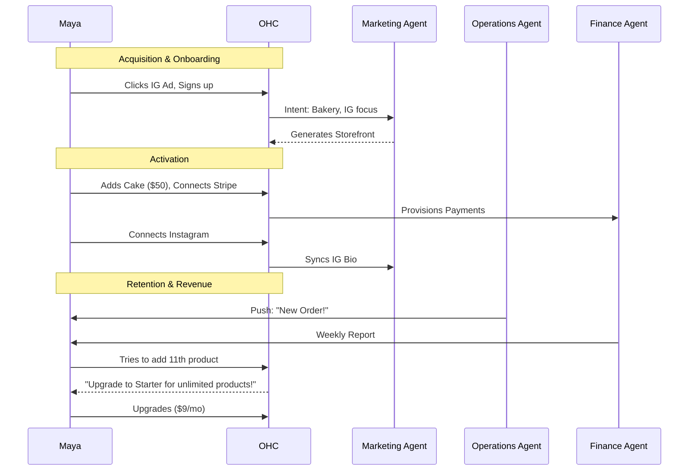
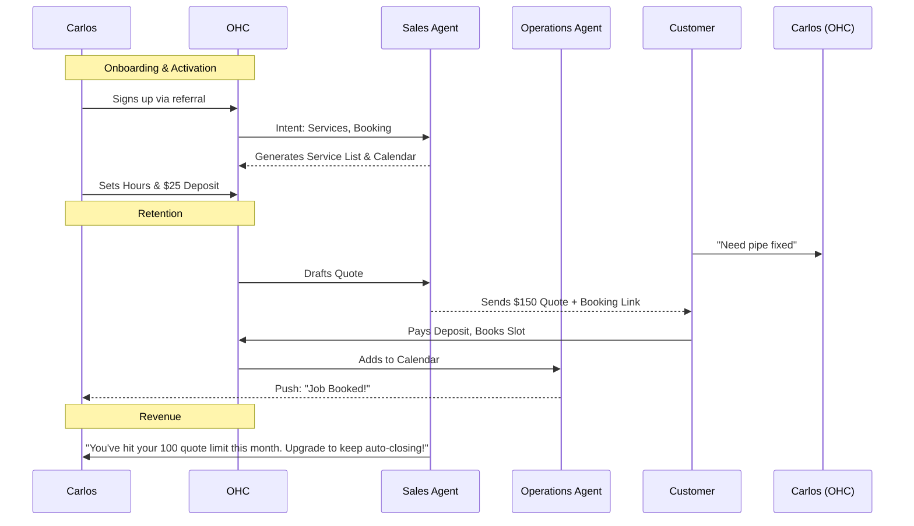
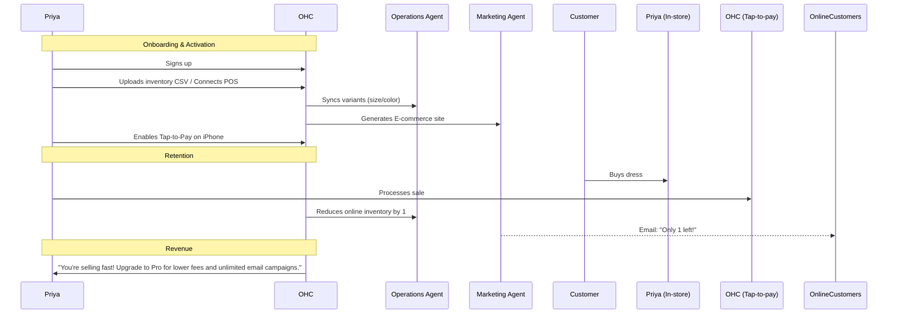
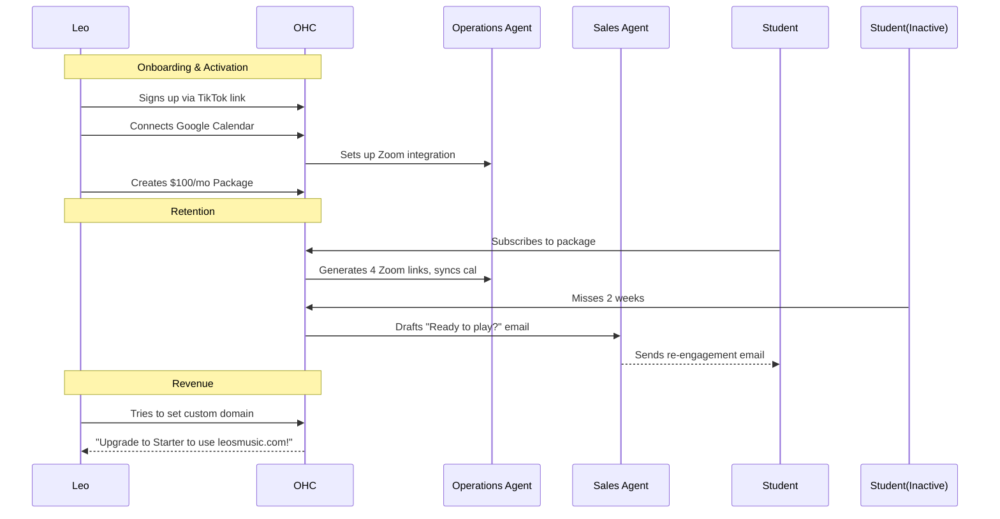
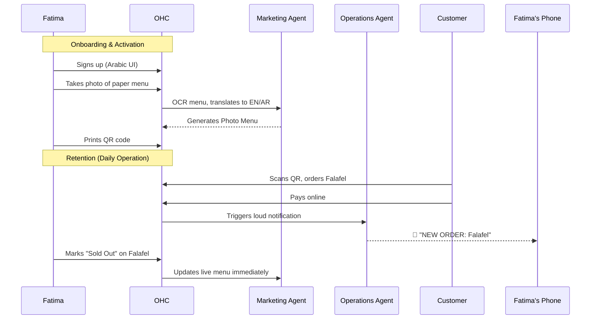

# Business Journey Architecture

## 1. Title
Business Journey Architecture: End-to-End User Journeys and AI Integration

## 2. Problem Statement
Small business owners (our core personas: Maya the Baker, Carlos the Handyman, Priya the Boutique Owner, Leo the Music Tutor, and Fatima the Food Cart Operator) currently face fragmented toolchains and overwhelming technical complexity when trying to launch, run, and scale their businesses. They need a unified, mobile-first platform where they can go from zero to a fully operational business in under 10 minutes, completely guided by AI, without needing to understand technical jargon or integrate disparate systems.

## 3. Research Report
### Key Findings
- **Market Gap:** Platforms like Shopify and Wix offer comprehensive e-commerce tools but require a steep learning curve and are not mobile-first for management. They rely on third-party integrations for essential features like booking and marketing, adding complexity.
- **Competitor Analysis:**
    - **Shopify:** Excellent for physical products and scale, but complex setup (30-60 mins), requires technical knowledge, and mobile management is secondary. "AI" is bolted on.
    - **Wix/Squarespace:** Good for visual design, complex for service/booking businesses, mobile management is an afterthought.
    - **GoDaddy:** Simpler setup but lacks depth in features and AI integration.
- **The OHC Opportunity:** A single platform handling diverse needs natively, driven by AI agents ("Departments") automating operations, marketing, sales, customer success, finance, and legal compliance, completely manageable from a smartphone.

## 4. Design Doc

### 4.1. Key Design Decisions
- **Mobile-First Everything:** Every user flow optimized for a 375px mobile screen.
- **AI as Infrastructure:** AI agents are the core engine (Departments: Operations, Marketing, Sales, Customer Success, Finance, Legal, Advisory).
- **Zero-Jargon Interface:** Plain language UI.
- **Premium Aesthetics:** OHC Premium Token library (Glassmorphism, Outfit/Inter typography).
- **Hybrid State Synchronization:** Local SQLite for offline resilience, synchronized with cloud PostgreSQL.

### 4.2. Business Journey Maps & Architecture Diagrams (Mermaid.js)

#### 4.2.1 Overall System Architecture

```mermaid
graph TD
    subgraph Mobile Client (Flutter)
        UI[User Interface - 375px First]
        LocalDB[(Local SQLite)]
        UI --> LocalDB
    end

    subgraph Hybrid API Server (Go)
        API[API Gateway]
        Auth[SPIFFE/SPIRE Auth]
        Sync[State Synchronization Engine]
        API --> Auth
        API --> Sync
    end

    subgraph Orchestration & Agents (KAIROS)
        Hub[Agent Orchestration Hub]
        Ops[Operations Agent]
        Mkt[Marketing Agent]
        Sales[Sales Agent]
        CS[Customer Success Agent]
        Fin[Finance Agent]
        Leg[Legal Agent]
        Adv[Advisory Agent]
        Hub --> Ops
        Hub --> Mkt
        Hub --> Sales
        Hub --> CS
        Hub --> Fin
        Hub --> Leg
        Hub --> Adv
    end

    subgraph Cloud Persistence
        CloudDB[(PostgreSQL/pgvector)]
        Redis[(Redis - Distributed Locks)]
        Storage[(GCS/MinIO)]
    end

    MobileClient -->|REST/gRPC| HybridAPI
    HybridAPI --> KAIROS
    Sync <--> CloudDB
    KAIROS <--> CloudDB
    KAIROS <--> Redis
    KAIROS <--> Storage
```

#### 4.2.2 Maya (The Home Baker)

*   **Acquisition:** Discovers OHC via Instagram ad showcasing "Launch a bakery in 5 mins". CTA: "Start Baking".
*   **Onboarding:** Guided chat. Inputs: "Custom cakes, Instagram sales". Agents generate storefront template.
*   **Activation:** Uploads first cake photo, sets price ($50), links bank account. Live by Day 1.
*   **Retention:** Push notification on new orders. Weekly revenue report from Advisory Agent.
*   **Revenue:** Upgrades to Starter ($9/mo) when she exceeds 10 products or needs a custom domain (`mayascakes.com`). Trigger: Reaching the 10-product limit. Upgrade CTA: "Unlock unlimited products & your own domain to look even more professional."
*   **Referral:** Shares "Powered by OHC" link in her bio. Mentions it in a "day in the life" reel.


*   **Friction Points:** Linking Stripe/bank account requires leaving the app context; potential drop-off if she doesn't have high-quality photos ready immediately.

#### 4.2.3 Carlos (The Freelance Handyman)

*   **Acquisition:** Referral from another contractor. CTA: "Get Booked Today".
*   **Onboarding:** Inputs: "Plumbing, General Repairs". Agents generate service listing and booking calendar.
*   **Activation:** Sets working hours, defines deposit amount ($25). Live by Day 1.
*   **Retention:** Daily SMS/push agenda. "The Salesperson" agent auto-sending quotes to leads.
*   **Revenue:** Upgrades to Starter when he needs automated follow-ups for more than 100 quotes/month. Trigger: Agent hits action limit. Upgrade CTA: "Let the AI close more deals for you. Upgrade for unlimited quotes."
*   **Referral:** Invites subcontractors to collaborate on larger jobs via the platform.


*   **Friction Points:** Defining availability rules can be complex; trusting the AI to generate accurate quotes initially.

#### 4.2.4 Priya (The Boutique Owner)

*   **Acquisition:** Searches Google for "sync physical and online store easily". CTA: "Sell Everywhere".
*   **Onboarding:** Connects existing simple POS or uploads CSV. Agents generate full e-commerce site.
*   **Activation:** Verifies synced inventory, configures shipping rules, enables tap-to-pay on phone.
*   **Retention:** Daily analytics dashboard (sales trends). "The Ambassador" sends "back in stock" emails.
*   **Revenue:** Upgrades to Pro ($29/mo) to unlock advanced AI departments (e.g., unlimited email campaigns) and lower transaction fees. Trigger: High sales volume.
*   **Referral:** Recommends platform at local business owner meetups.


*   **Friction Points:** Initial inventory import formatting; understanding the difference between online and offline state if internet drops in-store.

#### 4.2.5 Leo (The Music Tutor)

*   **Acquisition:** Sees another tutor using the OHC link-in-bio on TikTok. CTA: "Create your Profile".
*   **Onboarding:** Connects Google Calendar. Agents build portfolio and subscription packages.
*   **Activation:** Creates first monthly lesson package ($100/mo). Adds testimonial videos.
*   **Retention:** Automated Zoom link generation. "The Salesperson" follows up with inactive students.
*   **Revenue:** Upgrades to Starter for custom domain to look more professional. Trigger: Wants to print business cards.
*   **Referral:** Students share his booking link.


*   **Friction Points:** Granting calendar permissions can feel intrusive; setting up recurring billing (Stripe Connect requirements).

#### 4.2.6 Fatima (The Food Cart Operator)

*   **Acquisition:** Community outreach or localized search ("app for food cart pre-orders"). CTA: "Take Orders Now".
*   **Onboarding:** Snaps photos of her menu. Agents extract text and create digital menu in English and Arabic.
*   **Activation:** Turns on "Accepting Orders" toggle. Prints QR code for the cart.
*   **Retention:** Big, loud push notifications for new orders on her low-end Android. Simple end-of-day printout.
*   **Revenue:** Stays on Free tier mostly; OHC monetizes slightly via transaction fees. Upgrades to Starter only if she opens a second cart.
*   **Referral:** Word of mouth among other cart operators in the same plaza.


*   **Friction Points:** Data connection reliability in a street cart setting; reading small text on a cheap phone screen (requires high contrast, large UI).

### 4.3. UI Wireframes / Screen Flow (375px Mobile)

**Screen 1: The Onboarding Chat**
- **Header:** OHC Logo, Glassmorphic background.
- **Content:** Friendly chat interface. "Hi! Let's get your business running. What do you do?"
- **Input:** Native mobile keyboard input.

**Screen 2: The Agent Proposal**
- **Header:** "Here's what we built for you."
- **Content:** Visually rich card showing proposed storefront, required features, and assigned AI agents.
- **Action:** "Looks Great, Let's Go" (Primary Button, Touch target > 44px).

**Screen 3: The Daily Dashboard (Activation)**
- **Header:** "Good Morning, [Name]." (with daily brief).
- **Widgets:**
    - **Action Needed:** "1 New Message needs review."
    - **Today's Tasks:** "2 Orders due today."
    - **Quick Actions:** Floating Action Button (FAB) for "Add Item", "Share Link".

### 4.4. AI Agent Integration Points
- **Operations:** Inventory and fulfillment management.
- **Marketing:** Storefront building, social media APIs, OCR for menus.
- **Customer Success:** Unified Inbox, automated replies.
- **Finance:** Stripe integration, payment flow management.

## 5. Implementation Prompt

**Role:** Full-Stack Implementer (Flutter + Go)
**Task:** Implement the core data model and API endpoints necessary to track the diverse business types across the full user journey (Acquisition to Referral) and support the AI Department routing.

**Context:** The system must support the diverse needs of the 5 personas described above within a single multi-tenant structure.

**User Journey (CUJ):**
1. User completes onboarding chat.
2. The Go backend receives the intent and provisions a new `Tenant`.
3. The backend assigns the appropriate initial `AI Departments` (e.g., Marketing, Ops) based on the business type.
4. The backend initializes the appropriate feature flags (e.g., `enable_booking`, `enable_pos`, `enable_menu`).

**Acceptance Criteria:**
- The PostgreSQL schema (managed via Go migrations) must robustly handle the entity relationships (Tenant -> Products/Services, Tenant -> Assigned Agents).
- Row-Level Security (RLS) must be enforced on all new tables via `tenant_id`.
- The API must provide endpoints for the Flutter client to retrieve the user's specific journey state (e.g., "needs Stripe setup", "ready for first sale").
- **Mandatory:** Add a comprehensive integration test ensuring that a newly provisioned tenant for a "Service" business correctly receives the "Booking" feature flag and the "Salesperson" agent, while a "Food Cart" receives the "Menu" flag.

## 6. Priority
`P0` (Critical - This is the core architectural foundation for all personas)

## 7. Estimated Scope
Large
