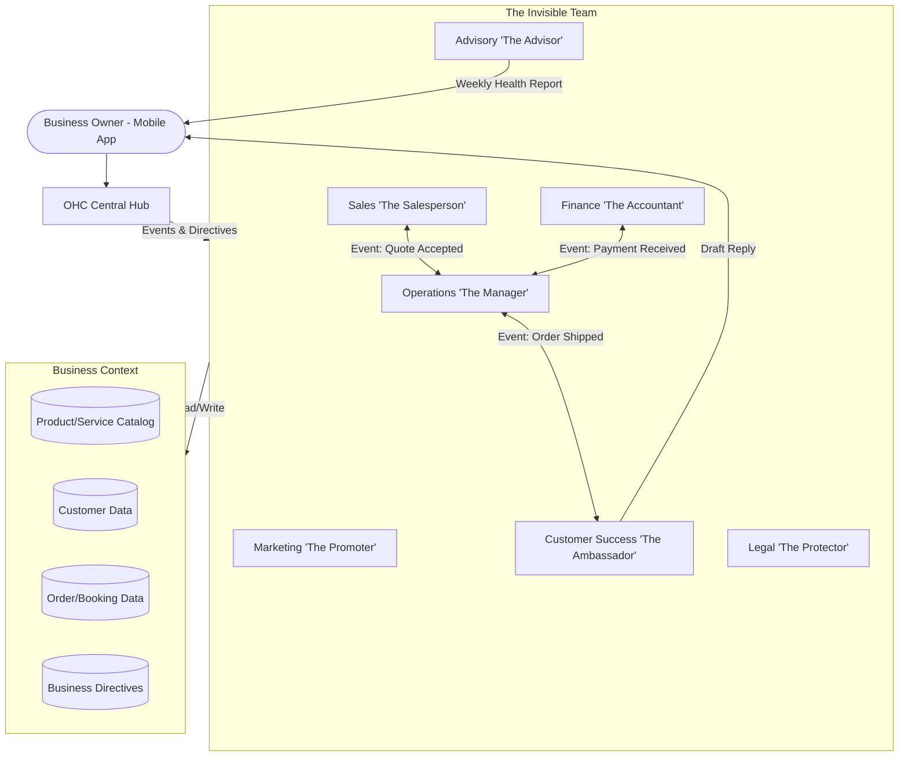

# AI Agent Department Architecture

## Problem Statement

Small business owners—bakers, handymen, boutique owners, tutors—do not want to act as IT administrators, HR managers, marketers, and legal counsel for their businesses. They want to focus on their craft and their customers. Current market solutions require stitching together 5-10 different software platforms, leading to cognitive overload, high monthly software costs, and significant context switching. Our business owners need an "invisible team" that simply takes care of the operational complexity in the background.

From the perspective of a non-technical small business owner: "I want a manager, an accountant, a marketer, and a sales rep, but I can't afford to hire them. I need my phone to do these jobs for me while I sleep."

## Research Report

Our target users operate primarily on mobile devices and have minimal tolerance for complex configuration.

**Competitive Analysis:**
*   **Shopify/Wix:** Rely heavily on app marketplaces. Users must evaluate, install, configure, and pay for separate apps for marketing (Klaviyo), customer support (Gorgias), and accounting (QuickBooks). This pushes integration work onto the user.
*   **Squarespace/GoDaddy:** Offer built-in marketing and basic CRM but require active, manual usage. They lack proactive, autonomous agents that perform work *for* the user.
*   **OHC Approach:** A unified "Department" model where AI agents are native to the platform, pre-integrated with all data, and operate semi-autonomously based on clear business directives.

**Key Findings:**
1.  **Anthropomorphism Works:** Small business owners respond well to assigning tasks to a "role" (e.g., "The Manager") rather than configuring a "workflow automation rule."
2.  **Trust is Earned:** Users need a "draft-for-review" mode initially. Once the AI proves reliable, they will enable "auto-execute" mode.
3.  **Cross-Department Coordination is Crucial:** An order placed (Operations) must trigger a welcome email (Customer Success) and update financial reports (Finance) seamlessly.

**Persona Summaries:**
*   **Maya (Baker):** Wants "The Customer Success Ambassador" to reply to Instagram DMs and "The Manager" to update custom order status based on a deposit payment.
*   **Carlos (Handyman):** Needs "The Salesperson" to generate quotes from customer text messages and "The Accountant" to chase late payments automatically.
*   **Priya (Boutique):** Relies on "The Promoter" to generate weekly email newsletters highlighting new inventory and "The Operations Manager" to sync in-store and online stock.

## Design Doc

The AI Agent Department Architecture models a real-world business organizational structure.

### Architecture Diagram

### Mobile UX Flow (375px)

The primary interaction pattern is through a conversational interface and a unified activity feed.

1.  **The Hub Screen:** A single feed showing activity from all departments. (e.g., "The Salesperson generated 3 quotes today. Review them?").
2.  **Department Detail:** Tapping a department shows its specific activity and settings.
3.  **Interaction:** The user can explicitly instruct a department ("Hey Promoter, create an Instagram post for the new vegan cake.") or rely on scheduled/event-driven actions.
4.  **Approvals:** A dedicated "Requires Approval" inbox where users can review drafted emails, social posts, or refund authorizations before they are sent.
5.  **Settings (Progressive Disclosure):** Initially, users only set a high-level "tone of voice" and business goals. Advanced toggle reveals specific behavioral constraints.

### Key Design Decisions
*   **Unified Context:** All departments share a single, unified view of the business data. There are no data silos between "Marketing" and "Operations".
*   **Event-Driven Coordination:** Departments communicate via an event bus. "The Manager" doesn't need to know how "The Ambassador" sends an email; it just emits an "Order Shipped" event.
*   **Draft First by Default:** To build trust, any external communication or significant financial action defaults to "Draft for Review" unless explicitly granted "Auto-Execute" permission.
*   **Budgeting at the Department Level:** AI compute resources (tokens/actions) are budgeted per tenant based on their SaaS tier and allocated across departments to prevent runaway costs.

## Implementation Prompt

**Goal:** Implement the foundational event-driven coordination for the "Operations" and "Customer Success" departments.
**CUJ:** A customer places an order. The Operations department processes the event and transitions the order state. This triggers the Customer Success department to draft a personalized welcome/confirmation message, which appears in the business owner's "Requires Approval" inbox on their mobile device.
**Acceptance Criteria:**
*   When a new order event is ingested, the system routes it to the Operations department.
*   The Operations department successfully updates the order status.
*   The Customer Success department receives a trigger and generates a drafted message contextually relevant to the order items.
*   The drafted message is surfaced in the owner's approval queue.
*   The feature must be fully usable on mobile (375px viewport) and follow the progressive disclosure pattern.

## Priority
`P0`

## Estimated Scope
Large
