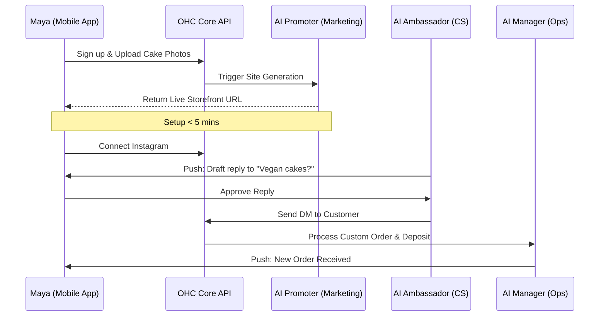
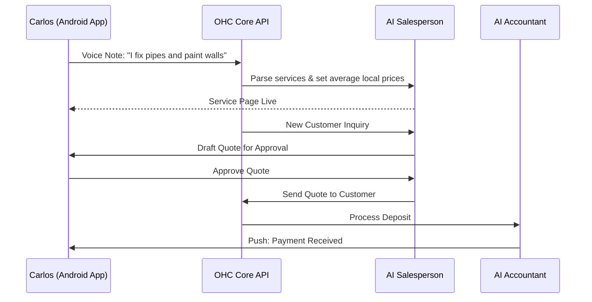
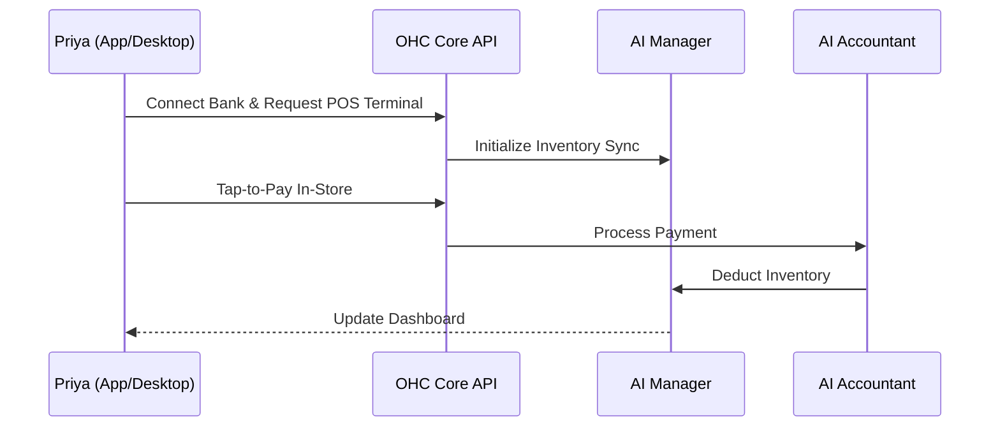
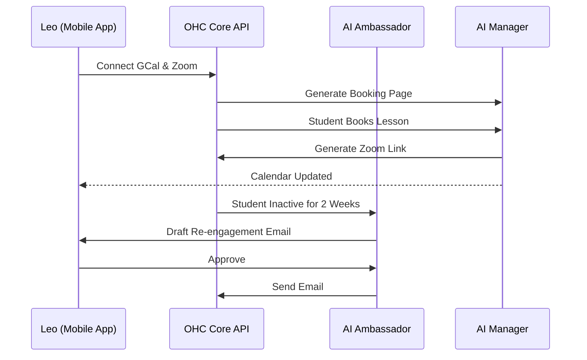
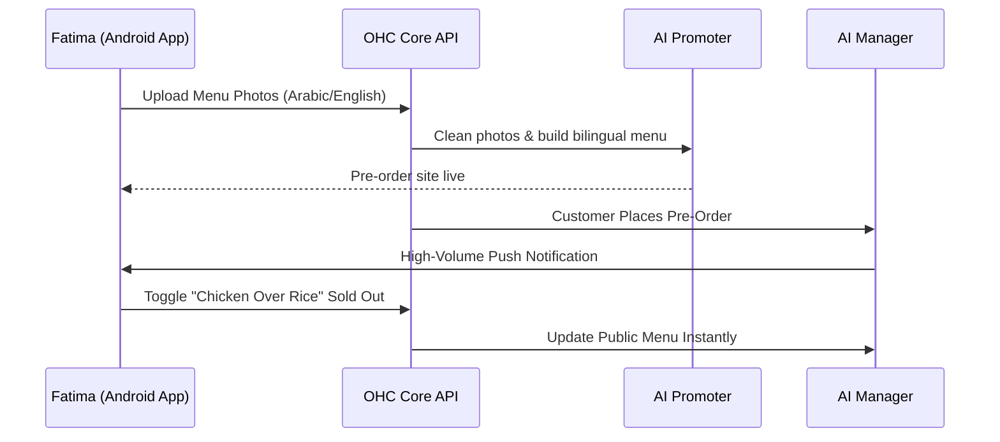

# [architecture] Business Journey Architecture

## Problem Statement
Small business owners (our core personas: Maya, Carlos, Priya, Leo, Fatima) span a diverse range of technical abilities, industries, and primary devices. The current onboarding and daily management flows must cater to this diversity without introducing friction or requiring technical knowledge. A non-technical user must be able to go from zero to a live business in under 10 minutes. The challenge is designing an end-to-end user journey—from acquisition and onboarding through daily activation, retention, and scaling—that relies invisibly on AI Agent Departments to handle the complexity, while remaining entirely mobile-first and intuitive.

## Research Report
Competitive analysis reveals that platforms like Shopify, Wix, and Squarespace present generic, one-size-fits-all onboarding flows that eventually dump the user into a complex dashboard requiring manual setup of products, themes, and integrations.
- **Shopify/Wix:** 30-60 min setup time, requires some technical knowledge, AI is an add-on.
- **OHC's Approach:** Ask minimal upfront questions, defer non-critical setup, and immediately provision a live, AI-generated storefront.

Key findings for our personas:
- **Maya (Home Baker):** Needs mobile-first photo upload and DM integration immediately. Setup should focus on capturing her Instagram handle and auto-generating her menu.
- **Carlos (Handyman):** Relies on Android. Needs a service listing and booking calendar. Setup should extract his services from a simple text prompt or voice note.
- **Priya (Boutique Owner):** Needs POS and inventory sync. Setup must connect to her existing in-store processes.
- **Leo (Music Tutor):** Needs booking and subscriptions. Setup should prioritize calendar sync and Zoom integration.
- **Fatima (Food Cart):** Needs a simple, multi-lingual interface on a low-end device. Setup should focus on photo menu and pre-order toggles.

## Design Doc

### UI Wireframes or Screen Flow Description (375px first)
- **Onboarding Wizard**: 1-3 simple inputs (Name, Category, Upload). Loading screen with "Building your business..." animation.
- **Home Dashboard**: Feed of AI Action Cards instead of dense charts.
- **Unified Inbox**: Aggregates Instagram DMs, SMS, Email into one conversational UI.

### AI Agent Integration Points
- **Promoter**: Triggered during onboarding for site generation.
- **Manager (Ops)**: Triggered by order placement or booking.
- **Ambassador (CS)**: Triggered by incoming messages or inactive customers.
- **Accountant (Fin)**: Triggered by payments.
- **Salesperson**: Triggered by quote requests.
- **Advisor**: Triggered on a schedule (e.g., weekly health report).

### User Journeys & Sequence Diagrams

#### 1. Maya (The Home Baker) - Product & Instagram Focus
**Acquisition:** Clicks an Instagram ad for "Turn your baking into a business in 10 mins."
**Onboarding:** Enters business name, uploads a few cake photos. AI Promoter department auto-generates the site.
**Activation:** Receives her first custom order with a deposit.
**Retention:** Push notifications for new orders; AI Customer Success drafts replies to her Instagram DMs.
**Revenue:** Maya upgrades from Free to Starter when she receives her 11th order in a month.
**Referral:** Maya shares her OHC store link with her baking friends on Instagram.

#### 2. Carlos (The Freelance Handyman) - Service & Booking Focus
**Acquisition:** Word of mouth from another tradesperson.
**Onboarding:** Types or speaks his services ("Plumbing, Painting"). AI generates a service listing and booking page.
**Activation:** A customer books a time slot and pays a deposit.
**Retention:** Uses the mobile inbox daily; AI Advisor gives weekly revenue summaries.
**Revenue:** Upgrades to Starter after reaching 100 bookings.
**Referral:** Carlos recommends OHC to other tradespeople on site.

#### 3. Priya (The Boutique Owner) - Omni-channel Focus
**Acquisition:** Organic search for "easy POS and online store sync."
**Onboarding:** Connects existing bank, sets up Stripe Terminal.
**Activation:** Completes first in-person tap-to-pay and first online order in the same day.
**Retention:** Checks daily mobile analytics (revenue today vs. yesterday) and uses AI Promoter for email newsletters.
**Revenue:** Priya starts on the Pro tier for POS access.
**Referral:** Priya shares OHC with other boutique owners in her area.

#### 4. Leo (The Music Tutor) - Subscription & Calendar Focus
**Acquisition:** Sees a TikTok link-in-bio showcasing OHC.
**Onboarding:** Connects Google Calendar and Zoom. Sets monthly lesson rates.
**Activation:** First student signs up for a monthly package.
**Retention:** AI Ambassador follows up with students who miss bookings.
**Revenue:** Upgrades from Free to Starter when he starts needing custom domain.
**Referral:** Leo shares his link-in-bio on TikTok and other tutors join.

#### 5. Fatima (The Food Cart Operator) - Speed & Simplicity Focus
**Acquisition:** Local community flyer.
**Onboarding:** Snaps photos of her menu items. AI strips backgrounds and sets up a pre-order page. Selects Arabic & English UI.
**Activation:** First pre-order notification rings loudly on her phone.
**Retention:** Prints daily order list directly from the app; easily toggles items as "sold out".
**Revenue:** Fatima upgrades to Starter when order volume increases.
**Referral:** Fatima shows the app to other cart operators.

### Mobile UX & Friction Points
- **Friction Point 1:** Complex initial configuration.
  *Resolution:* Defer all non-essential configuration to post-activation. The onboarding wizard must demand no more than 3 inputs (Name, Category, 1 Photo/Voice input).
- **Friction Point 2:** Overwhelming dashboards.
  *Resolution:* The mobile home screen is an AI feed of Action Cards (e.g., "Draft to approve", "Weekly report ready"), rather than a dense grid of charts and settings.
- **Friction Point 3:** Multi-channel inbox fragmentation.
  *Resolution:* Unified Inbox powered by the Customer Success Agent, presenting Instagram, email, and web chat in a single thread per customer.

## Implementation Prompt
**User-Facing Outcome:** Implement the modular Onboarding Wizard UI flow in the Flutter application that adapts dynamically to the user's selected business category (Physical, Service, Food, Digital, etc.). The wizard must enforce the "under 10 minutes to live" mandate by collecting only the absolute minimum required data points and instantly displaying a "Generating your business..." loading state while the AI Agent Departments provision the tenant backend.
**CUJ:**
1. User downloads app and taps "Start my business".
2. User selects category (e.g., "Food Cart") and provides a name.
3. User uploads 1-3 photos or records a short voice note describing their offering.
4. User taps "Launch".
5. UI shows an engaging building animation.
6. User lands on the Home Dashboard with a live public URL and their first AI Action Card waiting.
**Acceptance Criteria:**
- The Flutter onboarding flow must be entirely mobile-optimized (375px baseline) and utilize the OHC Premium Token library (Glassmorphism, Outfit/Inter typography).
- The flow must support branching logic based on the initial category selection.
- The UI must handle optimistic state updates and robust error recovery if backend provisioning takes longer than expected.
- E2E tests must verify the complete onboarding sequence from launch to dashboard landing without mocking backend service calls (LLMs may be mocked).

## Priority
P0

## Estimated Scope
Large
