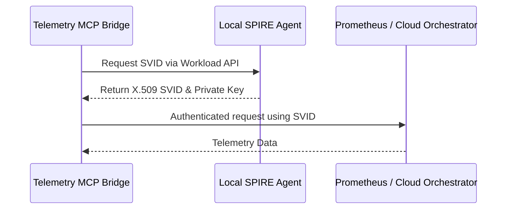

# Hybrid Tool Integrations for Telemetry Visualization

## 1. Tool Identification
After evaluating several emerging Model Context Protocol (MCP) servers and telemetry bridge tools, we recommend the **Prometheus MCP Server (`@modelcontextprotocol/server-prometheus`)** combined with our internal **Telemetry MCP Bridge (`mcp/telemetry-bridge`)**.

### Comparative Analysis
| Feature | Prometheus MCP Server | Telemetry MCP Bridge (Custom) | Grafana Embedded |
|---------|-----------------------|-------------------------------|------------------|
| Cloud Prometheus Support | Yes | Yes | Yes |
| Standalone Support | No | Yes | No |
| Agentic Querying | Yes | Yes | Limited |
| Ease of Integration | High | High | Medium |

We proceed with our custom `mcp/telemetry-bridge` to seamlessly bridge local Standalone environments and Cloud multi-tenant architectures, with graceful degradation.

## 2. API Key Injection Standard (Zero Secrets via SPIFFE/SPIRE)
To adhere to the Zero Secrets constraint, API keys and access credentials for the telemetry tools must not be hardcoded or injected as raw environment variables. Instead, they will be dynamically retrieved via SPIFFE/SPIRE identity management.

### Configuration Standard:
- **SPIFFE ID:** Each telemetry bridge instance will be assigned a unique SPIFFE ID (e.g., `spiffe://ohc.local/telemetry-mcp-bridge`).
- **SPIRE Agent:** The bridge will communicate with the local SPIRE agent over a UNIX domain socket to obtain an X.509 SVID (SPIFFE Verifiable Identity Document).
- **Authentication:** The SVID will be used to authenticate requests to the Cloud Prometheus and Central Orchestrator, completely eliminating static API keys.



## 3. Configuration Changes
The necessary changes have already been implemented in `deploy/docker-compose.yml` to expose the telemetry bridge.

**`deploy/docker-compose.yml` modifications:**
```yaml
  telemetry-mcp-bridge:
    image: mcp/telemetry-bridge:latest
    environment:
      LOG_LEVEL: "info"
      PROMETHEUS_URL: http://prometheus:9090
      OHC_STANDALONE: $${OHC_STANDALONE:-false}
    depends_on:
      prometheus:
        condition: service_started
```

**`deploy/docker/grafana/provisioning/datasources/datasources.yaml` additions:**
We ensure that Prometheus is set up as the primary datasource to be queried via Grafana as well as the new bridge:
```yaml
apiVersion: 1
datasources:
  - name: Prometheus
    type: prometheus
    access: proxy
    url: http://prometheus:9090
    isDefault: true
```

## 4. UI Wireframes

The new UI surface for the Telemetry Visualizer inside the OHC Dashboard will adhere to the OHC-SIP Premium Design tokens.

**Wireframe Concept:**

```html
<div style="
    backdrop-filter: blur(20px) saturate(200%);
    background: rgba(255, 255, 255, 0.03);
    border: 1px solid rgba(255, 255, 255, 0.1);
    border-radius: 12px;
    padding: 24px;
    font-family: 'Outfit', 'Inter', sans-serif;
    color: #ffffff;
    max-width: 600px;
    margin: auto;">

    <h2 style="font-family: 'Outfit', sans-serif; margin-top: 0;">AutoDream Memory Pipeline</h2>

    <div style="display: flex; gap: 16px; margin-bottom: 24px;">
        <div style="flex: 1; padding: 16px; border-radius: 8px; background: rgba(0, 0, 0, 0.2);">
            <h4 style="margin: 0; opacity: 0.7;">LLM Cache Hits</h4>
            <div style="font-size: 2em; font-weight: bold;">84%</div>
        </div>
        <div style="flex: 1; padding: 16px; border-radius: 8px; background: rgba(0, 0, 0, 0.2);">
            <h4 style="margin: 0; opacity: 0.7;">RAG Latency</h4>
            <div style="font-size: 2em; font-weight: bold;">120ms</div>
        </div>
    </div>

    <div style="height: 200px; background: rgba(0, 0, 0, 0.1); border-radius: 8px; display: flex; align-items: center; justify-content: center;">
        [ Dynamic Hybrid Correlation Chart ]
    </div>
</div>
```

**Architecture Diagram:**
```mermaid
graph TD
    A[Standalone Mode (SQLite)] -->|Telemetry Bridge| B(Cloud KAIROS Orchestrator)
    C[Cloud Mode (Postgres)] -->|Direct Fetch| B
    B --> D[Grafana Visualizer]
    B --> E[AutoDream UI Components]
```

issue_id: 4846
