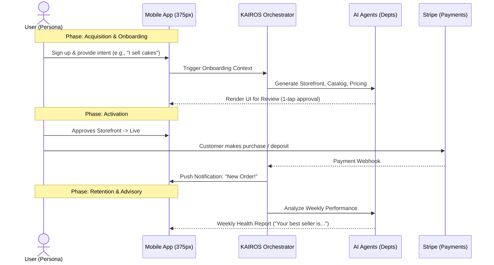

# OHC Business Journey Architecture

## Problem Statement
Small business owners—whether bakers, handymen, boutique owners, tutors, or food cart operators—currently face severe fragmentation and steep learning curves when establishing an online presence. Existing tools require them to act as system integrators: stringing together website builders, booking calendars, POS systems, and marketing tools. For our non-technical personas (Maya, Carlos, Priya, Leo, Fatima), this fragmentation causes them to abandon the process or settle for suboptimal workarounds like purely using Instagram DMs. OHC needs a unified, mobile-first journey where anyone can go from "idea to live business" in under 10 minutes without writing code or learning technical jargon.

## Research Report
**Market Feature Gap:**
- **Shopify:** Takes 30-60 mins. High complexity, geared towards tech-savvy SMBs. Sidekick is just a chat interface, not a proactive agent.
- **Wix / Squarespace:** Takes 20-60 mins. Better templates but still complex. Requires desktop for initial setup. Booking and Store are often separate addons.
- **GoDaddy:** 20-40 mins. Basic templates, limited AI generation (Airo). Weak mobile-first management.
- **OHC Opportunity:** Treat AI as invisible infrastructure. The user doesn't build a website; the AI builds the business based on a conversational intake. All setups must be manageable entirely from a 375px smartphone screen. The core journeys are Acquisition, Onboarding, Activation, Retention, Revenue, and Referral.

## Design Doc

### User Journeys

#### 1. Maya (The Home Baker)
- **Acquisition:** Clicks an Instagram ad showcasing a 1-tap store creation from Instagram content.
- **Onboarding:** AI imports her Instagram photos to generate a cake catalog.
- **Activation:** Receives her first deposit payment via Stripe custom order link.
- **Retention:** AI notifies her daily of DM inquiries it successfully answered ("Vegan cake options sent to 3 users").
- **Revenue:** Upgrades to Starter tier to get a custom domain for her bakery.

#### 2. Carlos (The Freelance Handyman)
- **Acquisition:** Word-of-mouth referral link from another contractor.
- **Onboarding:** Selects "Service Listing". AI generates descriptions for "Plumbing", "Painting" with standardized pricing blocks.
- **Activation:** First client books a timeslot and pays a deposit.
- **Retention:** Checks his unified inbox daily for new job quotes generated by the AI Salesperson.
- **Referral:** AI prompts him to share a review collection link after completing a job.

#### 3. Priya (The Boutique Owner)
- **Acquisition:** Organic search for "easy POS and online store sync".
- **Onboarding:** Scans barcode of 5 top-selling items to instantly populate her online storefront with AI-enhanced descriptions.
- **Activation:** First in-person tap-to-pay transaction.
- **Retention:** Uses the mobile dashboard to view daily inventory sync and sales performance.
- **Revenue:** Reaches the 100-product limit and upgrades to the Pro tier for unlimited products.

#### 4. Leo (The Music Tutor)
- **Acquisition:** Sees a TikTok video showing a link-in-bio page with booking integration.
- **Onboarding:** Connects Google Calendar; AI sets up Zoom integration and subscription packages.
- **Activation:** Student buys a monthly lesson package.
- **Retention:** AI Assistant auto-follows up with inactive students.
- **Referral:** Adds his OHC profile link to his TikTok bio.

#### 5. Fatima (The Food Cart Operator)
- **Acquisition:** Local community outreach program for street vendors.
- **Onboarding:** Takes photos of her menu items. AI translates menu to English/Arabic and sets up a pre-order system.
- **Activation:** Receives first pre-order pickup notification on her phone.
- **Retention:** Prints the daily AI-generated consolidated order list.
- **Revenue:** Remains on the free tier, processing <100 orders/month, acting as an acquisition channel for OHC in her community.

### Architecture Diagram (Mermaid.js)

### Mobile UX Flow (375px)
1. **Welcome Screen:** Large, friendly typography ("What do you want to build today?"). Single text input or voice note.
2. **AI Magic Loading:** Glassmorphism overlay showing agents "working" (e.g., "Designing storefront...", "Writing policies...").
3. **Review Screen:** A vertical scroll of the generated business. 44x44px touch targets to edit or tweak.
4. **Go Live:** A satisfying full-screen animation when the user taps "Launch Business".
5. **Dashboard:** Unified mobile view—revenue at the top, pending agent approvals in the middle, recent orders at the bottom.

### AI Agent Integration Points
- **Onboarding:** "The Promoter" designs the initial site; "The Protector" drafts standard terms of service.
- **Daily Usage:** "The Manager" handles the order lifecycle and calendar bookings; "The Advisor" sends push notifications with weekly insights.

### Key Design Decisions
- **Invisible AI:** Users don't "prompt" the AI; they state business goals. The orchestration layer translates goals to agent tasks.
- **Mobile-First Invariants:** All forms, tables, and settings are designed for 375px without horizontal scrolling. Native keyboard inputs are enforced.
- **Progressive Disclosure:** Advanced settings are hidden initially to achieve the <10 min activation metric.

## Implementation Prompt
**Task:** Implement the unified mobile-first Onboarding & Activation Journey in the Flutter application.
**Outcome:** A new user must be able to launch their business using the conversational intake flow within 10 minutes. The flow should capture the user's intent, trigger the KAIROS Orchestrator to generate the necessary business artifacts (storefront, policies, initial products), and present them in a 375px-optimized mobile UI for 1-tap approval.
**Acceptance Criteria:**
- The onboarding wizard completes entirely via a single text/voice intake step followed by a generation phase.
- The UI must correctly display the AI-generated preview using the OHC Premium Token library (Glassmorphism, Outfit/Inter fonts).
- All touch targets in the preview must be at least 44x44px.
- Triggering the "Launch Business" action successfully updates the business status to live and provisions the free-tier infrastructure.
- 100% E2E test coverage verifying the flow from intake to live dashboard using mocked AI responses.

## Metadata
**Priority:** P0
**Estimated Scope:** Large