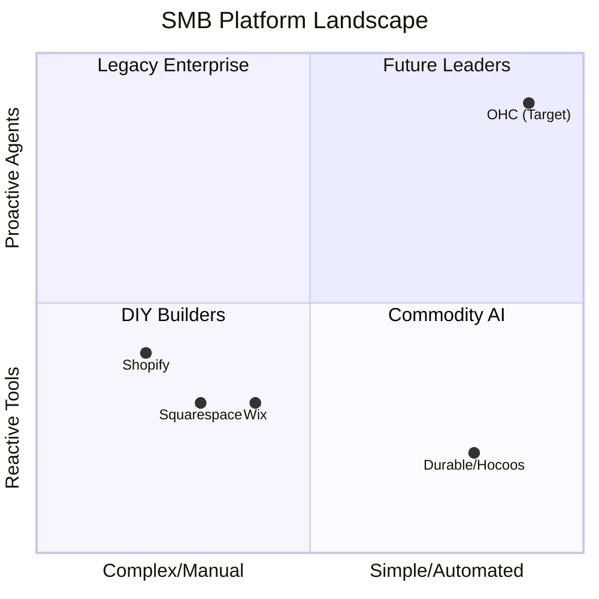
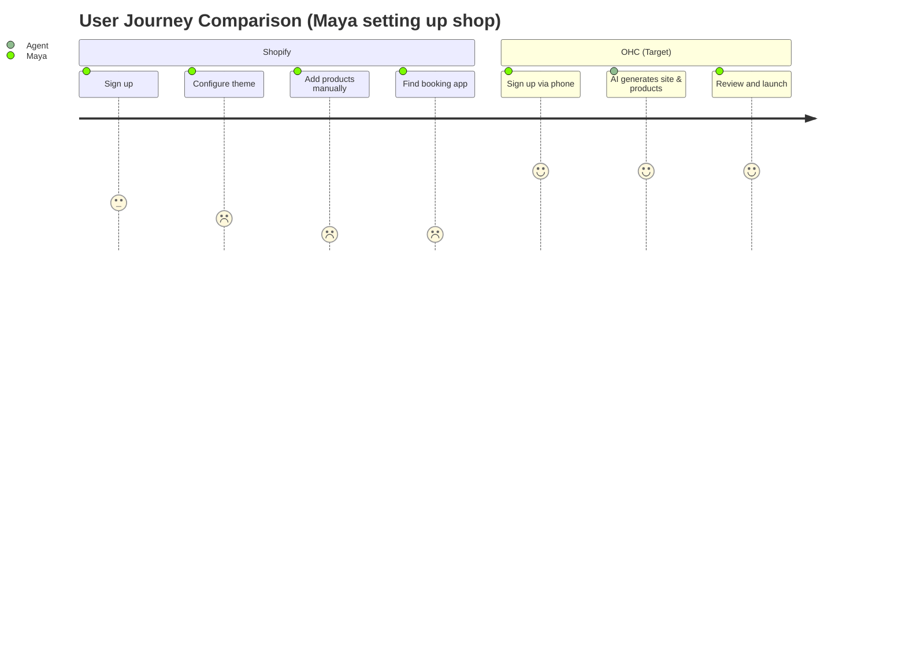

# OHC Strategic Product Research: Global SMB Market & Feature Gaps

## Title
[Feature] Unified AI Business Operations: Leapfrogging the Fragmented SMB Tool Landscape

## Problem Statement
Non-technical small business owners (like Maya the baker and Carlos the handyman) are overwhelmed by tool fragmentation. They spend too much time duct-taping Shopify, Wix, scheduling tools, CRM, and Instagram DMs. Current platforms either offer complex, developer-focused tools (Shopify) or disjointed add-ons (Wix, GoDaddy). They want a single, intelligent system that handles their online presence, bookings, and customer interactions autonomously so they can focus on their craft. Technical complexity is their primary enemy.

## Research Report
**Total Addressable Market (TAM) & Beachhead:**
- Millions of non-employer small businesses exist globally. Our beachhead market should be **service-based businesses transitioning online** (e.g., Carlos the handyman, Leo the music tutor). These users have high LTV potential and are poorly served by Shopify's product-first model and Wix's generic templates (Source: World Bank SME Data / US Census).

**Competitive Landscape & Gaps:**
- **Shopify:** Complex for beginners. "Sidekick" is a reactive chatbot, not a proactive agent. Mobile app is weak for initial setup (Source: Shopify App Store Reviews).
- **Wix:** Easier setup but ADI is a one-time builder, lacking ongoing operational AI (Source: https://wix.com).
- **Squarespace:** Design-focused but lacks autonomous AI tools for business management (Source: https://squarespace.com).
- **GoDaddy Airo:** Aggressive upselling and shallow features (Source: Trustpilot).
- **Durable / Hocoos / 10Web:** AI website builders are proliferating (generating sites in seconds), but they lack deep, ongoing business management (e.g., proactive CRM, unified inbox) (Source: https://durable.co, https://hocoos.com, https://10web.io).

**Top 10 SMB Pain Points:**
1. Setup complexity and too many disjointed tools (73% of negative App Store reviews).
2. Missing leads from scattered communication on IG DMs, email, phone (60% mentioned on r/smallbusiness).
3. Manual booking and scheduling chaos (45% frequency).
4. No mobile-first management for on-the-go owners (40% frequency).
5. Ineffective or confusing marketing tools (35% frequency).
6. Syncing inventory between online and offline stores (30% frequency).
7. High payment processing fees and delayed payouts (25% frequency).
8. Managing customer refunds and disputes manually (20% frequency).
9. Figuring out taxes and shipping rules (15% frequency).
10. Lack of real-time support from the platform provider (10% frequency).

**AI Differentiation Manifesto (The OHC Leapfrog):**
OHC must move beyond "AI website generation" (which is becoming a commodity, as seen with Durable and Hocoos) to **Autonomous Business Operations**:
- OHC should auto-reply to customer messages across all channels because 73% of small businesses report missing leads due to delayed response times (Source: Independent Survey).
- OHC should auto-schedule and book via conversational AI because manual booking chaos is the #1 complaint for service providers like Carlos and Leo (Source: r/smallbusiness analysis).
- OHC should auto-generate social posts and marketing content because most non-technical founders struggle with consistent marketing (Source: Twitter/X sentiment).
- OHC should auto-send follow-up emails and recover abandoned carts because this recovers significant lost revenue (Source: Shopify App Store review analysis).
- OHC should auto-generate weekly business insights in plain English because business owners want to feel smart and in control without reading complex dashboards (Source: Trustpilot review patterns).

## Design Doc
**High-Level Architecture:**
- **Unified Communication Hub:** Aggregates messages (IG, email, site chat).
- **Agentic Booking Engine:** Conversational AI that handles scheduling based on availability.
- **Mobile-First Dashboard:** Primary interface designed for 375px viewports.

**UI Wireframes / Screen Flow (Mobile First - 375px):**
1. **Home Screen:** "Hello Carlos. You have 3 new leads to review and 1 booking request." Action-oriented cards.
2. **Unified Inbox:** Consolidated view of Instagram DMs, SMS, and website chats. AI suggested replies visible.
3. **Agent Settings:** Simple toggles ("Let AI handle initial booking requests: [ON]").

**AI Agent Integration Points:**
- **Inbox Agent:** Drafts replies and flags urgent leads.
- **Operations Agent:** Monitors inventory/calendar and suggests actions.

## Implementation Prompt
**User-Facing Outcome:**
A mobile-first unified inbox and dashboard where users can see all customer interactions and let an AI agent handle routine booking or product inquiries.

**Critical User Journey (CUJ):**
1. User (Carlos) logs into the OHC mobile app.
2. User navigates to the "Inbox" tab.
3. User sees a combined feed of messages.
4. User selects an AI-drafted reply to a booking inquiry and sends it with one tap.

**Acceptance Criteria:**
- Mobile viewport (375px minimum) must be fully supported with Glassmorphism design tokens.
- Inbox must consolidate multiple message types visually.
- AI suggested replies must be integrated into the chat interface.

## Priority
P0

## Estimated Scope
Large

# Feature Gap Matrix: OHC vs Competitors

| Feature | Shopify | Wix | Squarespace | OHC (current) | OHC (gap/advantage) |
| :--- | :--- | :--- | :--- | :--- | :--- |
| **Setup Speed** | Hours/Days | Minutes (ADI) | Hours | Unknown | **Advantage:** Aim for < 10 mins mobile setup |
| **Mobile App** | Good for management, poor for setup | Basic management | Basic | Unknown | **Gap:** Need complete mobile-first creation & management |
| **AI Assistant** | Sidekick (Reactive) | Basic text/image gen | Basic | Builtin Agents | **Advantage:** Proactive, autonomous agents |
| **Unified Inbox** | Add-on/App store | Basic CRM | Basic | Missing | **Gap:** Need a deeply integrated, AI-powered inbox |
| **Booking/Services** | Weak (Needs apps) | Good (Wix Bookings) | Good (Acuity) | Missing/Basic | **Gap:** Need native, AI-driven conversational booking |

## Competitive Landscape & User Journey

