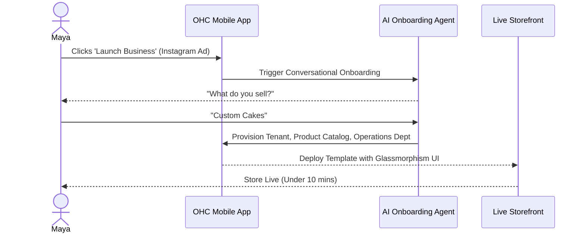
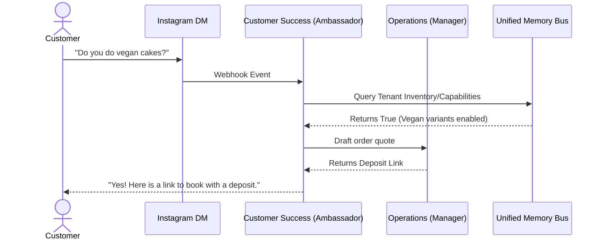

# [Phase 1: Business Journey Mapping] OneHumanCorp Platform Architecture Brief

**Problem Statement:**
Non-technical small business owners (e.g., bakers, handymen, boutique owners, tutors) struggle to configure, launch, and operate traditional SaaS tools or e-commerce platforms. Existing solutions like Shopify, Wix, and Squarespace require manual configuration of UI, databases, and payment flows. Users need a mobile-first, zero-configuration system where AI handles operations invisibly, allowing a launch from zero to live in under 10 minutes.

## Research Report
Competitive Analysis:
- **Shopify:** Excellent for complex physical retail, but requires significant setup, template customization, and app installations. Not mobile-first for creation.
- **Wix/Squarespace:** Drag-and-drop builders are heavily desktop-focused. High cognitive load for configuring booking vs. e-commerce modules.
- **GoDaddy:** Basic site creation but lacks deep operational AI (e.g., agentic DM replies or quoting).

Key Findings:
- **Maya (Baker):** Requires high-fidelity visual catalogs and robust AI handling of Instagram DMs for vegan/allergy queries. Needs mobile-only deposit processing.
- **Carlos (Handyman):** Needs frictionless Android-based quoting, transparent pricing, and automated booking with upfront deposits.
- **Priya (Boutique):** Requires seamless online-to-offline inventory sync and tap-to-pay integration without complex POS setup.
- **Leo (Tutor):** Demands recurring billing, auto-generated video links, and link-in-bio portfolio deployment.
- **Fatima (Food Cart):** Needs dual-language support (Arabic/English), printable tickets, and SMS/push order alerts tailored for low-end Androids.

## Design Doc
### Architecture Overview
The system is designed as a hybrid edge-cloud architecture focusing on extreme multi-tenancy and zero trust. The backend utilizes Rust for high-throughput, low-latency API handling and memory bus management, while Next.js + Tauri v2 provides the mobile-first frontend.

### Mermaid Diagrams
#### End-to-End Persona Journey (Maya)

#### AI Department Interaction

### Mobile UX Flow (375px First)
1. **Welcome Screen:** Single large CTA "Start Now". Clean typography (Outfit/Inter).
2. **Chat Interface:** Instead of complex forms, the user speaks or types to an AI agent.
3. **Instant Preview:** The agent renders a live preview of the site in the lower half of the screen as configuration happens.
4. **Dashboard:** A unified inbox combining orders, DMs, and agent suggestions. No complex navigation menus.

### AI Agent Integration Points
- **Unified Memory Bus:** All tenant interactions, product details, and historical contexts are stored in a partitioned vector database mapped exclusively to `tenant_id`.
- **Approval Gates:** AI actions default to 'Draft' mode for high-risk operations (e.g., refunds) but auto-execute for safe operations (e.g., standard FAQ replies).
- **Throttling:** AI limits are mapped directly to SaaS tiers (Free, Starter, Pro, Business) to manage costs dynamically.

### Key Design Decisions
1. **No DDL/Schema Exposure:** Users never see tables, columns, or configurations. They define intents; AI maps them to entities.
2. **Mobile-First Invariants:** All core workflows (adding a product, replying to a customer) must be performant on a low-end Android device with intermittent connectivity.
3. **Glassmorphism Defaults:** All generated storefronts utilize premium UI tokens by default to ensure visual excellence and trust without user intervention.

## Implementation Prompt
**Target Agent:** Implementer (Forge)
**Objective:** Implement the foundational UI and routing for the conversational onboarding flow in the Tauri mobile app.
**CUJ:** A new user opens the app, is greeted by the conversational interface, provides their business type, and the app visually renders a loading sequence indicating AI provisioning, resulting in a redirect to the generated dashboard.
**Acceptance Criteria:**
1. A new chat-based onboarding screen exists at `/onboard`.
2. The UI matches OHC premium design standards (Glassmorphism, Inter/Outfit typography).
3. The view handles state transitions from 'input' to 'provisioning' seamlessly.
4. Implement full Playwright E2E testing for the flow.

**Priority:** P0
**Estimated Scope:** Medium
