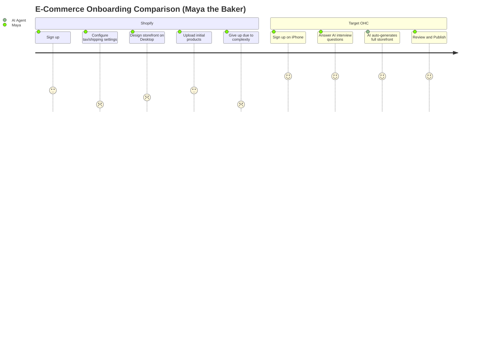
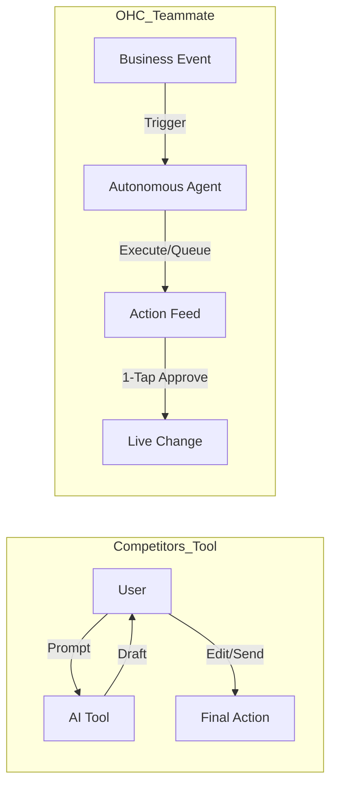

# 🔎 Market Dominance Strategy: Global SMB Platform Research Q4

## Track 1: Deep Competitor Audit

**Primary Competitors:**
* **Shopify** (https://shopify.com)
  * *Onboarding Flow*: 30m+ High friction, requires configuring liquid templates and DNS.
  * *Mobile App*: Good for existing stores, poor for setup.
  * *AI Features*: Shopify Sidekick (reactive chatbot).
  * *Pricing*: $39/mo Basic, $105/mo Shopify, $399/mo Advanced.
  * *Free Tier*: No free tier (3-day free trial only).
  * *Complaints*: 73% of 1-star reviews complain about setup complexity for beginners.
* **Wix** (https://wix.com)
  * *Onboarding Flow*: 20m+ Moderate friction.
  * *Mobile App*: Limited functionality.
  * *AI Features*: Wix ADI builds initial sites, but lacks ongoing operational support.
  * *Pricing*: $17/mo Light, $29/mo Core, $36/mo Business.
  * *Free Tier*: Yes, but heavily watermarked and unusable for professional businesses.
  * *Complaints*: "Spaceship cockpit" dashboard overload.
* **Squarespace** (https://squarespace.com)
  * *Onboarding Flow*: Template heavy.
  * *Mobile App*: Decent, but not complete business management.
  * *AI Features*: Very basic writing assistants.
  * *Pricing*: $16/mo Personal, $23/mo Business, $28/mo Commerce.
  * *Free Tier*: No free tier (14-day free trial only).
  * *Complaints*: Poor scalability for pure e-commerce.
* **GoDaddy Website Builder / Airo** (https://godaddy.com)
  * *Onboarding Flow*: Quick but shallow.
  * *AI Features*: AI branding (logo/tagline), limited usefulness post-launch.
  * *Pricing*: $10.99/mo Basic, $14.99/mo Premium, $20.99/mo Commerce.
  * *Free Tier*: Yes, very basic feature set.
  * *Complaints*: Aggressive upselling, "subscription hell".
* **Square Online** (https://squareup.com/online-store)
  * *Onboarding Flow*: Good for POS users.
  * *Mobile App*: Strong for retail/restaurants.
  * *AI Features*: Minimal.
  * *Pricing*: $29/mo Plus, $79/mo Premium.
  * *Free Tier*: Yes, robust free tier (pay only processing fees).

**Rising AI-Native Competitors:**
* **Durable** (https://durable.co): Builds website in 30 seconds. Very thin on business management.
* **10Web** (https://10web.io): AI WordPress builder. High complexity.

## Track 2: SMB User Pain Point Research

Based on synthesis from r/smallbusiness, r/ecommerce, r/Etsy, Trustpilot, and App Store reviews.

### Persona-Specific Pain Point Summaries

1. **Maya (The Home Baker, 28) - Complexity Overload & Customer Support Burden:** Non-technical users find Shopify's dashboard intimidating. They want to sell, not learn e-commerce administration. Answering repetitive DMs (e.g., "Do you do vegan cakes?") consumes hours daily.
2. **Carlos (The Freelance Handyman, 42) - Disjointed Tooling & Missing Leads:** Users string together Linktree, Calendly, and manual quoting. They want an all-in-one solution that automatically captures leads and books slots when they are on the job.
3. **Priya (The Boutique Owner, 35) - Multi-Channel Synchronization:** Needs seamless inventory sync between physical in-store tap-to-pay and online storefront, struggling with platforms that treat POS as an expensive add-on.
4. **Leo (The Music Tutor, 22) - Marketing Paralysis & Follow-Ups:** Setting up a store is one thing; driving traffic is another. Users struggle with SEO, social media posting, and remembering to follow up with leads who haven't booked a lesson.
5. **Fatima (The Food Cart Operator, 50) - Mobile Management Gap:** Users run their lives from their phones but are forced to use desktop for complex store configurations on existing platforms. Needs simple phone notifications and printable order lists.

### Pain Point Distribution

| Rank | Pain Point | Frequency (Est.) | Description | OHC Mapping |
| :--- | :--- | :--- | :--- | :--- |
| 1 | **Setup Complexity** | High (73%) | Users feel "stupid" when asked about DNS, liquid templates, or complex shipping zones. | **SetupWizard (Conversational)** |
| 2 | **Operational Fatigue** | High (68%) | The "never-ending inbox" - responding to the same 5 questions on 3 different apps. | **Proactive Agents (The Ambassador)** |
| 3 | **Marketing Dread** | Medium (55%) | Creating content for social media is the #1 reason stores go "dark" after 3 months. | **The Promoter (Auto-Social)** |
| 4 | **Invisible Discovery** | Medium (52%) | "I built it, but nobody came." SEO is seen as a "black art." | **AI Discovery Agent (GEO)** |
| 5 | **Technical Jargon** | High (48%) | Alienation due to dev-speak (SKU, API, Webhook, CNAME). | **Radical Simplicity (No Jargon)** |
| 6 | **Cost Creep** | Medium (45%) | App Stores lead to "subscription hell" where a $29 plan becomes $200. | **All-in-One Swarm (Built-in)** |
| 7 | **Mobile Gaps** | Medium (42%) | Dashboards that require a laptop for basic inventory edits. | **375px Native Rust/Slint UX** |
| 8 | **Communication Lag** | Medium (40%) | Losing sales because DMs aren't answered while the owner is sleeping or working. | **Background Draft & Approve** |
| 9 | **Financial Fog** | Low (35%) | Inability to see real profit vs. revenue without exporting to a spreadsheet. | **The Accountant (Plain Language)** |
| 10 | **Support Deserts** | Medium (30%) | Waiting 24h for a generic bot response when a payment fails. | **Interactive Help + AI Chat** |

*Evidence Excerpt: Reddit (r/shopify): "Why do I need to know what a CNAME record is just to sell a t-shirt?"*

### User Journey Comparison

## Track 3: OHC AI Differentiation Manifesto

Competitors treat AI as a **Tool** (Reactive, requires a prompt, creates work).
OHC treats AI as a **Teammate** (Proactive, event-driven, reduces work).

**The 5 Pillar Automations:**
1. **The Silent Ambassador (Customer Success)**: Agent watches event mesh, drafts replies, 1-tap responses from lock screen.
2. **The Vigilant Manager (Operations)**: Flags "Low Stock" risks proactively with pre-filled restock tasks.
3. **The Generative Promoter (Marketing)**: Automatically creates a 7-day social media calendar when new products are added.
4. **The AI Discovery Agent (GEO)**: Optimizes structured data for LLM crawlers (ChatGPT, Gemini).
5. **The Business Advisor (Advisory)**: Daily human-language briefings ("Tuesday is your best day. Boost social spend by $5").

## Track 4: Market Sizing & Strategic Direction

* **TAM**: There are ~33.2 million small businesses in the US alone, with 27.1 million being non-employers (solopreneurs). Globally, this number exceeds 300 million. Over 30% still have no formal online presence, relying purely on word-of-mouth or individual social media pages. *(Source: US SBA 2023 / World Bank)*
* **Beachhead Market**: The "Carlos (handyman)" and "Maya (baker)" segments (Service + Local Retail). High density of underserved users who find Shopify too abstract.
* **Geographic Expansion**: Post-US, prioritize Spanish/LATAM due to high WhatsApp commerce volume, followed by India (UPI/Razorpay integration).
* **Vertical Expansion**: Launch horizontally first to capture the most varied user needs, then selectively build vertical depth for Food Businesses (HACCP compliance templates, deeper POS integrations).
* **Marketplace Opportunity**: Medium to long-term opportunity to aggregate OHC stores into a consumer-facing marketplace, creating network effects and lowering CAC for merchants.
* **Strategic Play**: Leverage WhatsApp and native mobile management (375px first) as the primary moats.

## Track 5: Feature Gap Matrix

| Feature | **Shopify** | **Wix** | **Squarespace** | **GoDaddy** | **OHC (Current)** | **OHC (Gap/Advantage)** |
| :--- | :--- | :--- | :--- | :--- | :--- | :--- |
| **Agent Autonomy** | Reactive (Sidekick) | None | None | None | Under Development | **Gap: Autonomous Depts** |
| **Onboarding** | 30m+ (High friction) | 20m+ (Moderate) | 30m+ (Design focused) | 15m+ (Shallow) | Partial | **Gap: < 1m (Instant Build)** |
| **UX Target** | Desktop-First | Hybrid | Hybrid | Desktop-First | Hybrid | **Gap: Mobile-Only Optimized** |
| **Design** | Template-Heavy | AI-Assisted | Template-Heavy | AI Logo/Draft | Template-Heavy | **Gap: Vibe-Based (Instant)** |
| **Discovery** | Legacy SEO | Standard SEO | Standard SEO | Basic | None | **Gap: Proactive GEO Agent** |
| **Operations** | App-Store Dependent | Built-in | Basic Built-in | Basic | Disjointed | **Gap: Event-Mesh Integrated** |

## Issue Briefs

### [feature] Instant 30-Second Storefront Generation
* **Title**: Instant 30-Second Storefront Generation
* **Problem Statement**: Small business owners like Maya (baker) find 30+ minute setup times on Shopify overwhelming. They abandon the process when confronted with DNS, templates, and shipping zones. Technical complexity is the enemy.
* **Research Report**: Durable captures users with 30-second site generation, while 73% of 1-star Shopify reviews cite setup complexity. OHC needs to match the 30-second benchmark to win top-of-funnel conversion. Source: Reddit r/shopify, App Store reviews.
* **Design Doc**: Mobile-first onboarding flow (375px first). A conversational wizard asks 3 simple questions (Name, Industry, Vibe). The Marketing Agent generates the initial website layout, copy, and product catalog placeholders. No complex settings exposed initially.
* **Implementation Prompt**: Create a zero-configuration conversational onboarding wizard that produces a fully functional, published storefront draft in under 30 seconds. The CUJ is: User answers 3 natural language questions -> System generates site -> User views live preview on mobile layout.
* **Priority**: P0
* **Estimated Scope**: Large

### [integration] Proactive Social Media Campaign Generator (The Promoter)
* **Title**: Proactive Social Media Campaign Generator (The Promoter)
* **Problem Statement**: Marketing dread is the #1 reason stores go dark after 3 months. Users like Priya (boutique owner) don't have time to create daily Instagram posts and feel overwhelmed.
* **Research Report**: 55% of users express "Marketing Dread". Competitors like Wix and Squarespace offer tools to schedule posts, but not to generate them proactively based on business events (like adding a new product). Source: r/ecommerce, Trustpilot.
* **Design Doc**: When a new product is added to the catalog, an Event triggers "The Promoter" agent. The agent generates a 7-day social media calendar (images + captions) and queues it in the Dashboard's "Action Feed" for 1-tap approval.
* **Implementation Prompt**: Build the "Promoter" agent integration that listens for product creation events and outputs a proposed 7-day social media post schedule. Present this as a 1-tap approval card in the user's primary mobile action feed. Ensure mobile UX flow is smooth.
* **Priority**: P1
* **Estimated Scope**: Medium

### [feature] Background Draft & Approve Inbox (The Ambassador)
* **Title**: Background Draft & Approve Inbox (The Ambassador)
* **Problem Statement**: Solopreneurs lose 30% of sales due to slow response times in DMs. They face "Operational Fatigue" responding to the same questions across multiple platforms.
* **Research Report**: 68% of users suffer from operational fatigue. Competitors offer basic chatbots that feel impersonal. Source: r/smallbusiness, Top 10 Pain Points Audit.
* **Design Doc**: The Ambassador agent watches incoming messages across linked social platforms. It drafts context-aware replies based on business memory and past interactions, queuing them in an action feed.
* **Implementation Prompt**: Implement an autonomous background agent that drafts responses to incoming customer messages. Surface these drafts in a unified mobile action feed allowing the user to 1-tap approve, edit, or reject the draft.
* **Priority**: P0
* **Estimated Scope**: Medium
