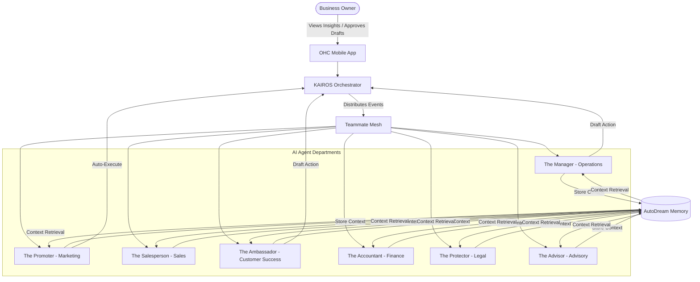

# [architecture] AI Agent Department Architecture

## Title
AI Agent Department Architecture: Designing Invisible Business Operators for OHC

## Problem Statement
Small business owners—such as Maya the baker, Carlos the handyman, and Fatima the food cart operator—need a seamless, automated way to handle daily operations, customer interactions, marketing, and finances. They lack the time, technical skills, or desire to configure complex software workflows, API integrations, or AI prompt engineering. The OneHumanCorp (OHC) platform must encapsulate AI capabilities into friendly, easily understandable "departments" that run invisibly in the background, mirroring a real-world business structure. If the agents require technical setup, OHC fails its core mission.

## Research Report
- **The Gap**: Traditional CRM and ERP tools require immense setup overhead. E-commerce platforms like Shopify have automation tools (Shopify Flow) that feel like programming visually. SMBs need "hire-and-forget" employees, not toolkits.
- **Competitor Landscape**:
  - Shopify Magic / Wix AI: Largely focused on content generation (descriptions, site building).
  - Zapier/Make: Excellent for automation, terrible for non-technical users ("What's a webhook?").
- **The OHC Advantage**: By conceptualizing AI as "Departments" (e.g., "The Manager", "The Promoter"), the user experience mimics hiring staff rather than configuring software.
- **Business Type Matrix**: Different personas have distinct AI needs. Maya needs "The Ambassador" to handle IG DMs; Carlos needs "The Salesperson" to draft quotes. The departments must adapt their behavior based on the business type.

### AI Department Matrix
| Department | Friendly Name | Key Responsibilities | User-Facing Value |
| :--- | :--- | :--- | :--- |
| **Operations** | The Manager | Order routing, inventory updates, fulfillment tracking | "Make sure I never oversell and orders go out." |
| **Marketing** | The Promoter | SEO optimization, social post drafting, promos | "Get more people to visit my shop." |
| **Sales** | The Salesperson | Quote generation, lead follow-ups, upsells | "Turn window shoppers into paying customers." |
| **Customer Success** | The Ambassador | Message replies (DMs, emails), review requests | "Keep my customers happy while I sleep." |
| **Finance** | The Accountant | Payment tracking, recurring billing, simple P&L | "Make sure I get paid on time." |
| **Legal/Compliance** | The Protector | Terms generation, policy updates | "Keep me out of trouble." |
| **Advisory** | The Advisor | Weekly insights, pricing suggestions, next steps | "Tell me what I should focus on this week." |

## Design Doc

### High-Level Architecture (Mermaid.js)

### Mobile UX Flow (375px First)
1. **Dashboard Home**: User opens the app. The "Advisor" presents a "Daily Briefing" card at the top (e.g., "Good morning, Maya. 3 new orders overnight. The Ambassador replied to 2 IG DMs. You have 1 draft quote to approve.").
2. **Department Management (The Team Screen)**: User navigates to the "Team" tab.
   - Shows a list of hired "Agents" (Departments).
   - E.g., tapping "The Manager" shows recent actions (updated inventory, flagged low stock).
3. **Approval Flow (Draft vs. Auto-Execute)**:
   - For sensitive actions (e.g., sending a $500 quote), "The Salesperson" generates a draft.
   - User sees a notification card: "Review quote for John Doe."
   - 1-Tap actions: [Approve & Send], [Edit], [Reject].
   - If User clicks [Approve], the Orchestrator executes the action and updates the UI instantly (Optimistic UI update).
4. **Onboarding Integration**: During the initial 10-minute setup, the wizard asks, "What do you want help with?" and automatically activates the relevant departments (e.g., checking "Replying to customers" turns on The Ambassador).

### Key Design Decisions
- **Event-Driven Coordination**: Departments communicate via events on the "Teammate Mesh." When Operations marks an order "Shipped", it broadcasts an event. Customer Success hears this and sends a thank-you email. The user never wires this together; it's implicit.
- **Draft-for-Review Default**: To build trust, newly activated departments default to "Draft" mode for outgoing communications. The user can toggle to "Auto-Execute" once they trust the agent's tone.
- **Shared Memory Base**: All departments read from the same "AutoDream" context. The Salesperson knows about a customer's past complaints handled by The Ambassador.
- **Progressive Disclosure**: The UI hides all prompt engineering. Advanced users can give specific instructions via a "Rules" text box (e.g., "Always use emojis"), but the default behavior requires zero configuration.

## Implementation Prompt
**To Implementer Agent:**
Implement the foundational framework for the 7 AI Agent Departments. Create the necessary internal domain models to represent each Department ("The Manager", "The Promoter", etc.) and their specific capabilities.

Your implementation must include:
1. An event listening structure connected to the KAIROS Orchestrator to route relevant business events to the appropriate department.
2. A context retrieval mechanism where agents pull from the shared Memory store before making a decision.
3. An action queue system that supports two execution paths: `DraftForReview` (requiring manual user approval via the app) and `AutoExecute`.
4. Ensure all user-facing outputs generated by the agents are structured for the mobile app (lean payloads, actionable options).

Do not concern yourself with the specific LLM models or vector database schemas; focus entirely on the domain logic, the event routing, and the Draft vs. Auto-Execute flow. The user experience must reflect hiring a human assistant, not configuring a bot.

## Priority
P0

## Estimated Scope
Large
