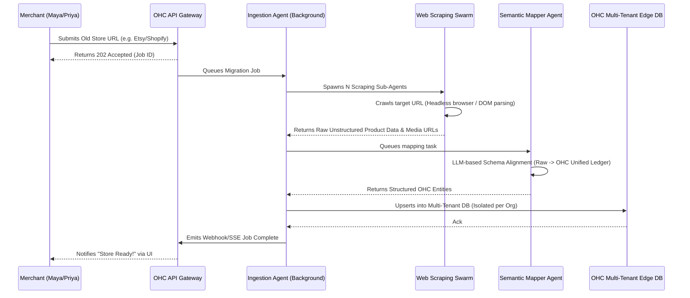

# [Architecture] Autonomous Platform Migration Engine

## Problem Statement

Small business owners (Maya, Priya) often start on rigid platforms like Shopify, Etsy, or Wix. When they hit technical limits, the cost and pain of migrating to a new platform are prohibitively high. They face manual CSV exports, rebuilding store layouts, reconnecting payment gateways, and losing SEO juice.

Currently, OneHumanCorp (OHC) requires users to manually upload inventory or recreate their services. This is a massive friction point during acquisition. We need a zero-touch "Migration by URL" capability where a user simply pastes their existing store or booking URL, and OHC's background agents autonomously crawl, structure, map, and import their entire business (products, variants, prices, descriptions, and images) into OHC's Multi-Tenant Data Mesh in under 5 minutes.

## Research Report

### Competitive Analysis

| Platform | Migration Capability | Underlying Tech | Key Constraint |
|---|---|---|---|
| Shopify | Store Importer App | CSV/XML parsing, basic API bridging | Requires technical CSV mapping. High friction. |
| Wix | Import tool | Limited scraping / CSV | Fails on complex variants or custom layouts. |
| WooCommerce| Migration plugins | Deep DB scraping | Requires WordPress technical knowledge. |
| **OHC (Target)** | **1-Tap URL Migration** | **Agentic Web Scraping + Vector-mapped ETL Queue** | **Zero manual mapping required by the user.** |

### Architectural Gaps in OHC
- OHC currently lacks an asynchronous, high-availability job queue specifically tailored for large-scale, long-running agentic scraping operations.
- There is no unified semantic mapping engine to translate disparate schemas (e.g., Etsy's listing format vs. Shopify's variant format) into OHC's Universal Capacity and Inventory Ledger.

### Integration with OHC Ecosystem
- The engine will utilize the **Sub-Agent Queue** to spawn multiple parallel scraping and mapping tasks.
- It will feed directly into the **AutoDream Pipeline** to ensure newly imported products are immediately available to the conversational AI search.

## Design Doc

### Architecture Diagram

### Mobile UX Flow (375px)
1. **Onboarding Screen:** A clean, glassmorphism card: "Bring your existing store to OHC. Paste your Shopify, Wix, or Etsy URL."
2. **Input:** Single text field + "Migrate Magic" button.
3. **Loading State:** A smooth, continuous animation showing AI agents "reading", "organizing", and "stocking the shelves". Real-time progress updates (e.g., "Found 45 products...", "Copying images...").
4. **Success:** "Your store is live!" button taking them directly to their new, populated OHC dashboard.
5. **No technical terms** like "CSV mapping", "ETL", or "Schema" should be visible.

### Multi-Tenant Isolation & Security (Zero-Trust)
- Scraping tasks are executed in ephemeral, isolated sandboxes with strict egress rules to prevent internal network scanning.
- Data written by the Ingestion Agent is strictly scoped to the `organization_id` using RLS (Row-Level Security) in PostgreSQL to ensure absolute tenant isolation.
- SPIFFE/SPIRE is used to authenticate the Ingestion Agent to the Edge DB.

## Implementation Prompt

**To the Implementer Swarm:**
Implement the Autonomous Platform Migration Engine.

**User Journey (CUJ):**
1. A new user signs up and is prompted to enter an existing website URL.
2. The user enters their URL and clicks "Migrate".
3. Within minutes, their entire catalog (products, variants, images, descriptions) is populated in their new OHC store, ready for immediate sale.

**Acceptance Criteria:**
- Expose a single asynchronous endpoint `POST /api/migrate` accepting a URL.
- Background jobs must be able to handle at least 1,000 SKUs per URL without timing out the client.
- The extraction process must use AI to intelligently map arbitrary product DOM structures into the OHC Universal Ledger format (no hardcoded CSS selectors if possible, utilize visual/semantic DOM parsing).
- Media files must be asynchronously downloaded and re-hosted on OHC's CDN.
- Provide a robust SSE or WebSocket endpoint for the mobile client to track real-time progress.
- Ensure strict multi-tenant isolation; one user's migration must never leak data into another's ledger.

**Constraints:**
- Do not prescribe the specific LLM parsing logic in the API layer; abstract it so the Sourcing/Ingestion Agents handle the variability.
- Maintain mobile-first API design (low payload overhead for status updates).

## Metadata
- **Priority:** P0 (Critical for fast acquisition)
- **Estimated Scope:** Large