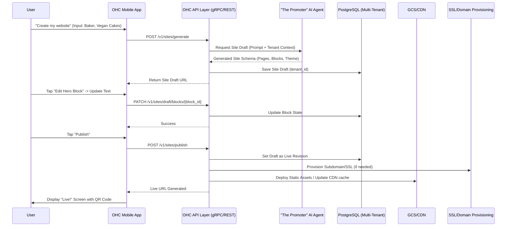

# [architecture] Website & Storefront Builder Architecture

## Title
Design Website & Storefront Builder Architecture for Non-Technical Users

## Problem Statement
Small business owners (our target personas: Maya the Baker, Carlos the Handyman, Priya the Boutique Owner, Leo the Music Tutor, Fatima the Food Cart Operator) lack the technical knowledge to build, maintain, and publish professional, fast, and SEO-optimized websites or storefronts. Existing platforms (Shopify, Wix, Squarespace) often require a minimum level of technical fluency, multi-hour onboarding, and complex drag-and-drop mechanics that confuse users on mobile devices. OHC needs a genuinely "no-code, zero-jargon" Website & Storefront Builder that allows any small business to launch their digital presence natively from a 375px mobile phone screen within 10 minutes, entirely assisted by the "Marketing & Advertising (The Promoter)" AI agent.

## Research Report
**Competitive Analysis:**
- **Shopify:** Complex theme architecture. Drag-and-drop sections exist but the onboarding relies heavily on web-based setup (30-60 min). Terminology is highly e-commerce specific.
- **Wix:** High customizability but prone to breaking on mobile screens if the user misaligns elements. "Wix AI" generates sites but editing them still demands understanding margins, padding, and layout rules.
- **Squarespace:** High aesthetic baseline, but limited structure flexibility without writing custom CSS. Mobile management app is restrictive compared to web.
- **GoDaddy:** "Airo" provides fast setup, but the end result looks generic and lacks deep feature integrations (e.g., seamless calendar bookings and deposits).

**Findings for OHC:**
- Our builder must NOT expose CSS, padding, margin, or layout properties. Instead, we offer high-level "Content Blocks" (Hero, Product Grid, Testimonials, Booking Calendar, Service List).
- The baseline aesthetic (Premium Glassmorphism, Outfit + Inter typography, 20px blur) must be enforced by the builder. The user only selects semantic themes (e.g., "Modern", "Playful", "Elegant") and the system computes the correct tokens.
- **Mobile First:** The builder must natively support 375px mobile drag-and-drop or tap-to-reorder. Adding sections should be conversational or tap-based rather than precision dragging.
- **SEO & Publishing:** SEO is fully managed by "The Promoter" AI agent (meta tags, sitemaps, structured data generation). SSL provisioning and subdomains (`<business>.ohc.app`) or custom domains must be one-click.
- **Offline & Low-Data Mode:** Edits to draft versions should be cached locally and synced to the backend seamlessly.

## Design Doc

### Key Entities
- **Site:** Represents the top-level container for a tenant's web presence.
- **Page:** A single URL endpoint (e.g., Home, About, Booking).
- **Block:** A specific component on a page (e.g., HeroBlock, ProductGridBlock, ContactFormBlock, CalendarBlock).
- **Theme Config:** High-level aesthetic choices (Color Palette, Font Pairing).
- **Domain:** Custom domain or OHC subdomain routing settings.

### AI Integration Points
- **"The Promoter" (Marketing & Advertising Agent):**
  - **Generation:** Analyzes the business's industry, name, and initial prompt ("I sell vegan custom cakes") to auto-generate the Site, initial Pages, and Blocks.
  - **SEO Optimization:** Auto-writes `<title>`, `<meta description>`, and alt-text for images uploaded to blocks.
  - **Content Suggestions:** If a user adds a "Testimonial Block" but has no reviews, the agent drafts placeholder text or suggests reaching out to past clients.
  - **Execution:** Edits to site copy can be done via chat interface ("Make the hero text sound more professional").

### Mobile UX Flow (375px)
1. **Onboarding:** User selects business type -> "The Promoter" generates the preview in 5 seconds.
2. **Editor:**
   - A single-column vertical list of Blocks.
   - User taps a block to open a bottom sheet.
   - Bottom sheet contains semantic inputs (e.g., Image Upload, Title Text, Button Link). No layout settings.
   - User can reorder blocks using native standard drag handles (ReorderableListView).
3. **Publishing:**
   - One tap "Publish" button.
   - Success screen with a confetti animation and shareable links (QR Code, Link-in-bio).

### Architecture Diagram

## Implementation Prompt
**Task:** Implement the backend services and initial frontend editor for the OHC Website & Storefront Builder.
**Frontend (Flutter):**
- Create a `SiteEditorScreen` that displays the current Site configuration in a vertical `ReorderableListView`.
- Implement semantic bottom-sheet editors for `HeroBlock` and `ProductGridBlock`.
- **Constraint:** Ensure touch targets are >= 44x44px. The UI must utilize OHC Premium Tokens (Glassmorphism, 20px blur).
**Backend (Go):**
- Define Protobuf messages for `Site`, `Page`, and `Block` entities.
- Implement the `SitesService` gRPC handlers (`GenerateSite`, `UpdateBlock`, `PublishSite`).
- Integrate the AI agent pipeline so `GenerateSite` calls the "Marketing & Advertising" agent to bootstrap the site layout based on business category.
**Acceptance Criteria:**
- A user can create a site draft, edit text in a Hero block, reorder blocks, and publish it to a mock live state.
- The entire process must be testable from a 375px mobile emulator viewport.
- Include a full E2E Playwright test (for the Web PWA) starting from user login to final site publication.

## Priority
P0

## Estimated Scope
Large
