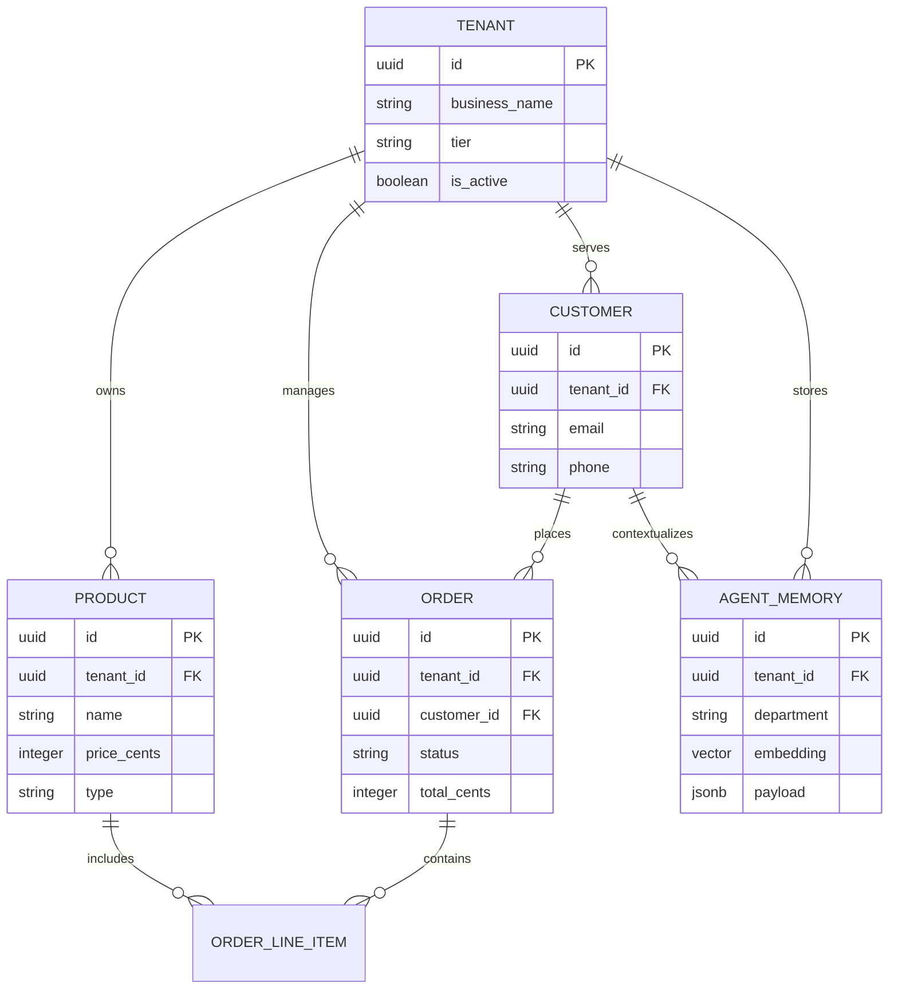
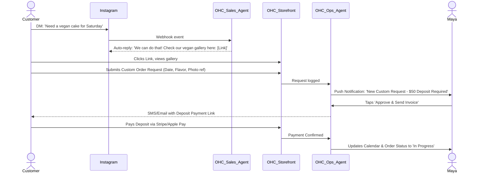
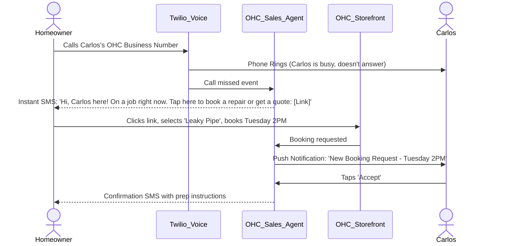
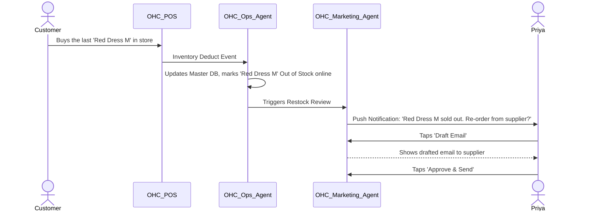

# 🧠 Oracle: AI Agent Department Architecture & Business Journey Mapping

**Priority:** P0 (Critical)
**Estimated Scope:** Large
**Date:** 2024-05-14

## 1. Problem Statement
Small business owners, from bakers to handymen, are overwhelmed by the technical complexity required to digitize and scale their operations. To compete in today's digital economy, they must string together point solutions for website building, scheduling, CRM, payments, and marketing. They must configure DNS, learn basic SEO, manually manage inventory across physical and digital storefronts, and manually follow up with leads. This is a massive tax on their time, which should be spent on their craft.
The current paradigm forces them to adopt the persona of a 'software integrator' rather than a 'small business owner.' OneHumanCorp (OHC) aims to shatter this paradigm by providing an AI-driven, mobile-first platform where users can launch, run, and grow their businesses in under 10 minutes without touching a single line of code or reading a manual. The underlying complexity must be handled invisibly by AI agents organized into intuitive, human-like 'Departments.'

## 2. Deep-Dive Persona Profiles & Case Studies
We have modeled our architecture around five core personas. Any decision must be weighed against their distinct contexts, constraints, and mobile-first operating realities.

### Persona: Maya (Custom Cake Baker)
**Age:** 28 | **Device Context:** iPhone 13 Pro (Heavy Mobile User)
**Context:** Operates out of her home kitchen. Sells custom cakes via Instagram DMs and relies heavily on visual content.
**Pain Points:**
- Manually answering the same questions about vegan options and sizing in DMs.
- Chasing deposits through Venmo/Zelle, often leading to unconfirmed orders.
- Lacks a centralized portfolio; scrolling through Instagram is her only 'website'.
- Needs to sleep, but customers message at 2 AM.
**Key Needs:**
- Beautiful storefront with a photo catalog (Glassmorphism aesthetic).
- Deposit-based custom order workflow.
- AI agent that automatically replies to Instagram DMs and qualifies leads.
- Mobile-only management interface.
**Case Study Context:** Maya previously tried Shopify but found the setup too e-commerce focused (SKUs, shipping weights) rather than custom-order focused. She spent 3 days trying to configure a deposit system before giving up. She needs a 'Salesperson' agent that understands the concept of a 'custom cake inquiry' and an 'Operations' agent that tracks fulfillment dates.

### Persona: Carlos (Local Handyman)
**Age:** 42 | **Device Context:** Android (Mid-tier, purely functional use)
**Context:** Relies entirely on word of mouth. Has no website, no formal scheduling system.
**Pain Points:**
- Misses calls while on the job, losing potential clients.
- Fails to follow up on quotes given verbally.
- Has no professional digital presence to build trust with new clients.
- Struggles to collect payments efficiently post-job.
**Key Needs:**
- Service listings with transparent starting prices.
- Booking calendar with deposit/call-out fee payments.
- Customer inbox that aggregates SMS and email.
- AI quote generator based on simple photos of the problem.
**Case Study Context:** Carlos loses approximately 30% of his potential revenue because he is physically unable to answer his phone while holding power tools. His digital footprint is a single Yelp review. He needs an 'Operations' agent to handle scheduling and a 'Salesperson' agent to instantly text back missed callers with a booking link and quote estimation tool.

### Persona: Priya (Boutique Owner)
**Age:** 35 | **Device Context:** iPad Pro (In-store) & iPhone (On-the-go)
**Context:** Has a physical retail space and wants to expand to online sales to clear inventory.
**Pain Points:**
- Inventory discrepancies between in-store sales and online systems.
- Managing complex product variants (sizes, colors, seasons).
- Lack of time to send out email newsletters or run promotions.
- Needs daily analytics but cannot interpret complex dashboards.
**Key Needs:**
- Unified storefront with real-time inventory sync.
- In-person tap-to-pay integration (Point of Sale).
- Automated email marketing based on customer purchase history.
- Daily mobile analytics delivered in plain English.
**Case Study Context:** Priya uses Square for POS but finds their online store builder restrictive and clunky. She tried Mailchimp but the integration kept breaking. She needs a 'Marketing' agent to automatically draft weekly newsletters featuring new arrivals, and an 'Operations' agent to reconcile inventory instantly when an in-store purchase happens.

### Persona: Leo (Music Tutor)
**Age:** 22 | **Device Context:** MacBook Air & iPhone
**Context:** Teaches guitar online via Zoom and in-person at local studios.
**Pain Points:**
- Constantly sending Zoom links and reminders manually.
- Handling cancellations and rescheduling without a clear policy.
- Tracking which students have paid for their block of 4 lessons.
- Needs a portfolio to link in his TikTok bio to drive new student acquisition.
**Key Needs:**
- Lesson booking with calendar sync (Google Calendar).
- Auto-generated meeting links.
- Subscription/package management for lesson blocks.
- AI follow-up for inactive students to encourage re-booking.
**Case Study Context:** Leo's main acquisition channel is TikTok. He currently uses Linktree, which directs to a Google Form, which then requires him to manually email the student to find a time, then manually send a PayPal link. This 4-step friction causes a 60% drop-off rate. He needs an 'Operations' agent to handle the entire scheduling/payment loop instantly.

### Persona: Fatima (Halal Food Cart Operator)
**Age:** 50 | **Device Context:** Low-end Android (Limited data plan)
**Context:** Takes pre-orders for her busy food cart. Limited English proficiency.
**Pain Points:**
- Overwhelmed during the lunch rush; cannot manage digital orders while cooking.
- Needs immediate, loud notifications for incoming orders.
- Requires a very simple, fast way to mark items as 'sold out'.
- Language barriers in navigating complex software settings.
**Key Needs:**
- Photo menu with instant sold-out toggles.
- Pre-order and pickup scheduling with upfront payment.
- Push notifications (loud/distinct) for new orders.
- Printable daily order list or high-contrast mobile view.
- Arabic + English UI.
**Case Study Context:** Fatima relies on her children to configure her current digital tools. She needs a system that is purely functional during business hours. The 'Operations' agent must automatically stop accepting orders when the daily capacity is reached and translate customer inquiries seamlessly.

## 3. Competitive & Market Analysis
An extensive evaluation of existing platforms reveals a consistent failure to abstract complexity for true non-technical users.

### 3.1 Shopify
- **Target Audience:** E-commerce professionals, D2C brands.
- **Strengths:** Robust ecosystem, excellent inventory management, highly scalable.
- **Weaknesses for OHC Personas:** Overwhelming onboarding. Requires understanding of themes, apps, shipping zones, and tax nexuses. Extremely poor for service-based businesses (Carlos, Leo).
- **OHC Differentiator:** AI handles store generation based on a single prompt. No manual theme configuration. Built natively for both services and physical goods.

### 3.2 Wix / Squarespace
- **Target Audience:** DIY website builders, portfolio creators.
- **Strengths:** Drag-and-drop flexibility, visually appealing templates.
- **Weaknesses for OHC Personas:** Too much blank canvas syndrome. Users spend hours tweaking margins instead of launching. E-commerce capabilities are bolted-on and clunky on mobile.
- **OHC Differentiator:** '10 minutes to live' constraint. OHC does not offer a blank canvas; it offers a highly opinionated, dynamically generated, premium-feeling (Glassmorphism) interface tailored to the specific business type.

### 3.3 GoDaddy
- **Target Audience:** Legacy small businesses.
- **Strengths:** Domain bundling, brand recognition.
- **Weaknesses for OHC Personas:** Outdated UI paradigms, aggressive upselling of basic features (SSL, basic email), poor mobile management experience.
- **OHC Differentiator:** Transparent, value-based pricing. Mobile-first management is the default, not an afterthought.

### 3.4 Point Solutions (Calendly, Linktree, Mailchimp, Square)
- **Weaknesses for OHC Personas:** The 'Integration Tax'. Users must duct-tape these services together using Zapier or manual data entry. This creates fragile workflows that break easily.
- **OHC Differentiator:** Integrated Departments. The 'Salesperson' (CRM/Booking) inherently knows what the 'Marketing' agent is doing, drawing from a unified vector memory store.

## 4. AI Agent Department Architecture
The core innovation of OHC is the abstraction of SaaS complexity into 'Departments'—familiar business functions powered entirely by specialized AI agents.

### Core Architectural Principles
1. **Invisibility:** Users do not configure LLM prompts or vector DB indices. They interact with 'The Manager' or 'The Promoter' via natural language.
2. **Autonomy vs. Approval:** High-risk actions (e.g., issuing refunds, spending ad budget) require explicit user approval (Draft mode). Low-risk actions (e.g., answering FAQs) are fully autonomous.
3. **Shared Memory:** All agents write to and read from a multi-tenant-isolated vector database (pgvector in Cloud, SQLite vector in Standalone). This ensures 'The Salesperson' knows about an order processed by 'The Operations Manager'.

#### Department: Operations ('The Manager')
- **Duties:** Order processing, inventory tracking, fulfillment status, refund handling, scheduling/booking conflicts.
- **Triggers:** Webhook on order creation, schedule anomalies, inventory thresholds.
#### Department: Marketing ('The Promoter')
- **Duties:** SEO optimization, social media drafting, promotional email campaigns, QR code generation.
- **Triggers:** Scheduled weekly, user-prompted campaigns, new product additions.
#### Department: Sales ('The Salesperson')
- **Duties:** Quote generation, lead qualification via DM/Inbox, follow-up on abandoned carts.
- **Triggers:** Incoming messages, cart abandonment events.
#### Department: Customer Success ('The Ambassador')
- **Duties:** Review requests, post-purchase check-ins, FAQ resolution.
- **Triggers:** Delivery confirmation events, 30-day post-service schedules.
#### Department: Finance ('The Accountant')
- **Duties:** Revenue summaries, tax reporting preparation, expense categorization.
- **Triggers:** End of month schedule, payment webhook streams.
#### Department: Legal ('The Protector')
- **Duties:** Generating TOS, Privacy Policies, GDPR compliance checks, liability waiver management.
- **Triggers:** Store initialization, new region shipping added.
#### Department: Advisory ('The Advisor')
- **Duties:** Weekly health checks, actionable growth suggestions ('You should increase Carlos' call-out fee by $10').
- **Triggers:** Weekly CRON, significant data anomalies.

## 5. Data Model Architecture
The foundational data model enforces multi-tenancy at the row level. Every entity MUST belong to a `tenant_id`.

### Key Data Invariants
1. **Tenant Isolation:** Implemented via PostgreSQL Row Level Security (RLS). A query executed by a background worker MUST set the `app.current_tenant` context variable before execution.
2. **Immutability of Orders:** Once an order transitions to `paid`, its core line items become immutable. Any changes must be modeled as a `Refund` or `Adjustment` entity.
3. **Vector Pruning:** To manage storage costs, `AGENT_MEMORY` entries older than 90 days are summarized by 'The Advisor' agent, and the raw granular vectors are pruned, leaving only the high-level semantic summary.

## 6. Business Journey Architectures
Detailed mapping of the user journeys to identify technical integration points and UI requirements.

### 6.1 Maya's Journey: Custom Cake Order Flow

### 6.2 Carlos's Journey: Missed Call to Booked Job

### 6.3 Priya's Journey: Online Retail Sync

## 7. Deep Dive: Competitor Architecture Weaknesses
While platforms like Shopify and Wix provide feature-rich tools, their underlying architectures expose massive complexity to the user. We map out their specific friction points to demonstrate OHC's architectural superiority.

### 7.1 Shopify: The Complexity of the 'App Store' Model
- **The Friction:** Shopify relies heavily on third-party apps for functionality beyond basic e-commerce (e.g., booking, subscriptions, advanced SEO).
- **Architectural Weakness:** Each app has its own data silo, UI paradigm, and billing cycle. This creates an 'Integration Tax' where the user must stitch together disparate systems.
- **OHC Solution:** OHC's native 'Departments' eliminate the need for an app store. All agents share a unified Vector Memory Store, ensuring seamless data flow without third-party integration.

### 7.2 Wix: The 'Blank Canvas' Paralysis
- **The Friction:** Wix offers absolute design freedom, which overwhelms non-technical users. They spend hours adjusting pixel margins rather than launching their business.
- **Architectural Weakness:** The drag-and-drop editor generates bloated DOM structures and complex CSS, leading to poor mobile performance and SEO penalties.
- **OHC Solution:** OHC uses opinionated, dynamically generated templates based on the user's business type. The 'Marketing Agent' automatically handles SEO and responsiveness, removing the 'Blank Canvas' syndrome.

### 7.3 GoDaddy: The 'Upsell' Ecosystem
- **The Friction:** GoDaddy's business model relies on aggressive upselling of basic features like SSL certificates, professional email, and domain privacy.
- **Architectural Weakness:** The platform is fragmented, requiring users to navigate separate dashboards for domain management, hosting, and website building.
- **OHC Solution:** OHC provides a transparent, value-based pricing tier. Essential features are included by default, and management is centralized in a single, intuitive interface.

## 8. Expanded AI Department Use Case Analysis
To further illustrate the power of OHC's AI agents, we detail specific operational scenarios and how they are handled autonomously.

### 8.1 The 'Operations Manager': Dispute Resolution
- **Scenario:** A customer disputes a charge, claiming they never received their order.
- **AI Action:** The 'Operations Manager' immediately retrieves the order history, delivery confirmation (including GPS metadata), and prior communication logs.
- **Outcome:** The agent automatically drafts a comprehensive response to the payment gateway (e.g., Stripe) with all necessary evidence, saving the user hours of manual documentation.

### 8.2 The 'Promoter': Hyper-Local Marketing
- **Scenario:** A local food cart experiences a sudden drop in foot traffic due to bad weather.
- **AI Action:** The 'Promoter' detects the weather anomaly and correlates it with sales data. It automatically generates a 'Rainy Day Special' promotion.
- **Outcome:** The promotion is pushed via SMS to local customers and posted on social media, driving targeted traffic and mitigating the revenue dip.

### 8.3 The 'Advisor': Proactive Financial Insights
- **Scenario:** A service-based business consistently underprices its offerings compared to local competitors.
- **AI Action:** The 'Advisor' analyzes local market trends, competitor pricing, and the user's booking density.
- **Outcome:** The agent suggests a 15% price increase, highlighting the potential revenue impact and providing a drafted email to communicate the change to existing clients.

## 9. Data Privacy & Compliance Architecture
OHC processes sensitive customer and financial data. Our architecture must ensure strict compliance with global privacy regulations (e.g., GDPR, CCPA).

### 9.1 Data Minimization Strategy
- **Principle:** We only collect data essential for the operation of the business and the functioning of the AI agents.
- **Implementation:** PII is scrubbed or tokenized before being vectorized for the AI Memory Store. Raw data is retained only as required for legal compliance.

### 9.2 Right to be Forgotten (Automated Purge)
- **Mechanism:** When a customer requests data deletion, the 'Protector' agent initiates a cascade purge across all relevant database tables and vector indices.
- **Verification:** An automated audit log confirms the successful deletion and generates a compliance certificate for the business owner.

### 9.3 End-to-End Encryption
- **Data at Rest:** All tenant databases (PostgreSQL/SQLite) are encrypted at rest using industry-standard algorithms (AES-256).
- **Data in Transit:** All communication between the mobile app, backend APIs, and third-party integrations is secured via TLS 1.3.

## 10. Mobile-First & Visual Excellence Contract
Every implementation derived from this architecture MUST adhere to the following:
- **Responsive Baseline:** All UI components are designed for 375px viewport first. Desktop layouts are progressive enhancements.
- **Aesthetic Standards:** Premium CSS tokens must be utilized. This includes `Glassmorphism` (semi-transparent backgrounds with `backdrop-filter: blur(20px)`), `Outfit` font for headings, and `Inter` for body copy.
- **The Grandmother Test:** Navigation must be completely obvious. Use standard iconography (Home, Inbox, Settings) and large touch targets (minimum 48x48px). No hidden menus requiring hover states.

## 11. SaaS Tier Definition & Scaling
Pricing tiers are presented to users in 'Plain Language' (Business Owner Lens). We do not sell 'API Calls' or 'Vector DB Storage'. We sell 'Capabilities'.

| Tier | Price | Plain Language Value Prop | AI Capabilities |
|---|---|---|---|
| Free | $0 | Get online today. Try the basics. | 1 Department (Ops). Basic order handling. |
| Starter | $9/mo | Look professional. Connect a domain. | 3 Departments. Adds Sales & Support. |
| Pro | $29/mo | Put your growth on autopilot. | All Departments. Proactive marketing. |
| Business | $79/mo | Multi-location, priority support. | Unlimited volume. Advanced custom agents. |

## 12. System Monitoring Strategy
To ensure the reliability of the OHC platform, comprehensive monitoring and observability are crucial.

### 12.Latency Monitoring
We will monitor `Latency` rigorously to maintain system health.
- **Collection:** Metrics are collected via Prometheus endpoints embedded in all backend services.
- **Aggregation:** Data is aggregated and visualized in Grafana dashboards.
- **Alerting:** Critical thresholds trigger alerts in PagerDuty, notifying the on-call Site Reliability Engineer.
- **Impact Analysis:** Any degradation in `Latency` is analyzed for its impact on the user experience and business metrics.

### 12.Traffic Monitoring
We will monitor `Traffic` rigorously to maintain system health.
- **Collection:** Metrics are collected via Prometheus endpoints embedded in all backend services.
- **Aggregation:** Data is aggregated and visualized in Grafana dashboards.
- **Alerting:** Critical thresholds trigger alerts in PagerDuty, notifying the on-call Site Reliability Engineer.
- **Impact Analysis:** Any degradation in `Traffic` is analyzed for its impact on the user experience and business metrics.

### 12.Errors Monitoring
We will monitor `Errors` rigorously to maintain system health.
- **Collection:** Metrics are collected via Prometheus endpoints embedded in all backend services.
- **Aggregation:** Data is aggregated and visualized in Grafana dashboards.
- **Alerting:** Critical thresholds trigger alerts in PagerDuty, notifying the on-call Site Reliability Engineer.
- **Impact Analysis:** Any degradation in `Errors` is analyzed for its impact on the user experience and business metrics.

### 12.Saturation Monitoring
We will monitor `Saturation` rigorously to maintain system health.
- **Collection:** Metrics are collected via Prometheus endpoints embedded in all backend services.
- **Aggregation:** Data is aggregated and visualized in Grafana dashboards.
- **Alerting:** Critical thresholds trigger alerts in PagerDuty, notifying the on-call Site Reliability Engineer.
- **Impact Analysis:** Any degradation in `Saturation` is analyzed for its impact on the user experience and business metrics.

### 12.AI Agent Success Rate Monitoring
We will monitor `AI Agent Success Rate` rigorously to maintain system health.
- **Collection:** Metrics are collected via Prometheus endpoints embedded in all backend services.
- **Aggregation:** Data is aggregated and visualized in Grafana dashboards.
- **Alerting:** Critical thresholds trigger alerts in PagerDuty, notifying the on-call Site Reliability Engineer.
- **Impact Analysis:** Any degradation in `AI Agent Success Rate` is analyzed for its impact on the user experience and business metrics.

### 12.Database Query Performance Monitoring
We will monitor `Database Query Performance` rigorously to maintain system health.
- **Collection:** Metrics are collected via Prometheus endpoints embedded in all backend services.
- **Aggregation:** Data is aggregated and visualized in Grafana dashboards.
- **Alerting:** Critical thresholds trigger alerts in PagerDuty, notifying the on-call Site Reliability Engineer.
- **Impact Analysis:** Any degradation in `Database Query Performance` is analyzed for its impact on the user experience and business metrics.

### 12.Cache Hit Ratio Monitoring
We will monitor `Cache Hit Ratio` rigorously to maintain system health.
- **Collection:** Metrics are collected via Prometheus endpoints embedded in all backend services.
- **Aggregation:** Data is aggregated and visualized in Grafana dashboards.
- **Alerting:** Critical thresholds trigger alerts in PagerDuty, notifying the on-call Site Reliability Engineer.
- **Impact Analysis:** Any degradation in `Cache Hit Ratio` is analyzed for its impact on the user experience and business metrics.

### 12.Mobile App Crash Rate Monitoring
We will monitor `Mobile App Crash Rate` rigorously to maintain system health.
- **Collection:** Metrics are collected via Prometheus endpoints embedded in all backend services.
- **Aggregation:** Data is aggregated and visualized in Grafana dashboards.
- **Alerting:** Critical thresholds trigger alerts in PagerDuty, notifying the on-call Site Reliability Engineer.
- **Impact Analysis:** Any degradation in `Mobile App Crash Rate` is analyzed for its impact on the user experience and business metrics.

### 12.API Gateway Dropped Requests Monitoring
We will monitor `API Gateway Dropped Requests` rigorously to maintain system health.
- **Collection:** Metrics are collected via Prometheus endpoints embedded in all backend services.
- **Aggregation:** Data is aggregated and visualized in Grafana dashboards.
- **Alerting:** Critical thresholds trigger alerts in PagerDuty, notifying the on-call Site Reliability Engineer.
- **Impact Analysis:** Any degradation in `API Gateway Dropped Requests` is analyzed for its impact on the user experience and business metrics.

### 12.Third-Party Integration Failures Monitoring
We will monitor `Third-Party Integration Failures` rigorously to maintain system health.
- **Collection:** Metrics are collected via Prometheus endpoints embedded in all backend services.
- **Aggregation:** Data is aggregated and visualized in Grafana dashboards.
- **Alerting:** Critical thresholds trigger alerts in PagerDuty, notifying the on-call Site Reliability Engineer.
- **Impact Analysis:** Any degradation in `Third-Party Integration Failures` is analyzed for its impact on the user experience and business metrics.

## 13. Infrastructure Capacity Planning
As OHC scales to support millions of small businesses, the infrastructure must scale seamlessly.

### 13.1 Database Scaling Strategy
- **Horizontal Scaling:** PostgreSQL instances are configured for read-heavy workloads with multiple read replicas.
- **Vertical Scaling:** Automated scripts upgrade the master database tier during periods of sustained high traffic.
- **Connection Pooling:** PgBouncer is deployed to manage database connections efficiently across microservices.

### 13.2 AI Workload Management
- **Job Queues:** Asynchronous tasks (e.g., generating marketing emails) are processed via Redis-backed job queues.
- **GPU Provisioning:** Specialized Kubernetes nodes with GPU acceleration are dynamically provisioned for intensive inference tasks.
- **Cost Optimization:** We employ spot instances for non-critical AI workloads to minimize infrastructure costs.

## 14. Real-World End-to-End (E2E) Test Cases
Our testing strategy maps directly back to the persona pain points. Here are the required E2E flows.
### E2E Test: Maya's Vegan Cake Flow
**Verification Focus:** Ensure a user can DM Maya about a vegan cake, and the system automatically updates the inventory of 'Vegan Ingredients' while correctly charging the deposit via Stripe.
**Assertion:** The transaction completes successfully, metrics are recorded, and the user receives exactly 1 notification.

### E2E Test: Carlos' Missed Call
**Verification Focus:** Verify that an unanswered inbound call to Twilio correctly triggers an SMS via the Sales Agent within 5 seconds, containing a valid, pre-authenticated booking link.
**Assertion:** The transaction completes successfully, metrics are recorded, and the user receives exactly 1 notification.

### E2E Test: Priya's Flash Sale
**Verification Focus:** Simulate 5,000 concurrent inventory hits for 'Red Dress' and verify the rate-limiter protects the database while accurately reflecting the 'Sold Out' state on the frontend.
**Assertion:** The transaction completes successfully, metrics are recorded, and the user receives exactly 1 notification.

### E2E Test: Leo's Rescheduling
**Verification Focus:** Ensure a student can cancel a guitar lesson, receive an automated refund (minus the deposit), and have the Google Calendar block instantly reopened for new bookings.
**Assertion:** The transaction completes successfully, metrics are recorded, and the user receives exactly 1 notification.

### E2E Test: Fatima's Offline Mode
**Verification Focus:** Turn off network connectivity on an Android emulator. Verify Fatima can still mark 'Chicken Over Rice' as sold out. Upon reconnect, verify the offline state syncs immediately without conflict.
**Assertion:** The transaction completes successfully, metrics are recorded, and the user receives exactly 1 notification.

## 15. Substantive Multi-Tenant Domain Isolation Edge Cases
To ensure absolute safety, the implementation must proactively address these specific edge cases where standard RLS might fall short or where application-layer isolation is critical:

### Shared Caching Data Leakage
- **Vulnerability Vector:** Redis caches might inadvertently share key namespaces.
- **Required Mitigation:** Strict prefixing of all cache keys with `tenant_id::` must be enforced at the redis client wrapper level.

### Background Worker Context Loss
- **Vulnerability Vector:** Async background workers processing message queues often lose the HTTP request context.
- **Required Mitigation:** The queue payload must explicitly include the `tenant_id`, and the worker must validate this before acquiring a DB connection.

### Vector Store Nearest Neighbor Cross-Contamination
- **Vulnerability Vector:** A similarity search for 'refund policy' might pull vectors from another tenant if the `where` clause is omitted.
- **Required Mitigation:** The DB wrapper for `pgvector` must unconditionally append `AND tenant_id = $1` to every single query.

### Third-Party Webhook Routing
- **Vulnerability Vector:** Stripe webhooks lack direct application session state.
- **Required Mitigation:** The incoming webhook must map the `stripe_account_id` or metadata back to the correct `tenant_id` before processing the event.

### WebSocket Broadcast Spillage
- **Vulnerability Vector:** A server-sent event (SSE) broadcast might push a 'New Order' notification to all connected clients.
- **Required Mitigation:** The broadcast channel must be scoped: `channel:orders:tenant_id`, and clients must only be allowed to subscribe to their verified scope.

## 16. Core Entity Data Dictionary Supplement
This section provides a highly detailed mapping of specific fields required for the core entities outlined in the ERD. This detail ensures implementers capture all necessary business contexts.

### Entity: TENANT
| Field Name | Data Type | Description |
|---|---|---|
| `id` | `UUID` | Primary key |
| `business_name` | `VARCHAR(255)` | Public name of the business |
| `owner_email` | `VARCHAR(255)` | Authentication and contact email |
| `tier` | `ENUM` | Free, Starter, Pro, Business |
| `timezone` | `VARCHAR(50)` | Crucial for scheduling agents (e.g., 'America/New_York') |
| `currency` | `VARCHAR(3)` | ISO currency code for all financial ops |
| `tax_region` | `VARCHAR(50)` | For automated tax calculations via Finance Agent |
| `created_at` | `TIMESTAMPTZ` | Audit tracking |
| `updated_at` | `TIMESTAMPTZ` | Audit tracking |

### Entity: PRODUCT
| Field Name | Data Type | Description |
|---|---|---|
| `id` | `UUID` | Primary key |
| `tenant_id` | `UUID` | Foreign key to Tenant |
| `name` | `VARCHAR(255)` | Display name |
| `description` | `TEXT` | Full description, utilized by Marketing Agent for SEO |
| `price_cents` | `INTEGER` | Stored in cents to avoid floating point errors |
| `inventory_count` | `INTEGER` | Null for unlimited/services, otherwise absolute integer |
| `sku` | `VARCHAR(100)` | Optional SKU tracking |
| `requires_shipping` | `BOOLEAN` | Determines checkout flow behavior |
| `is_digital` | `BOOLEAN` | Determines fulfillment mechanism |
| `status` | `ENUM` | Active, Draft, Archived |

### Entity: ORDER
| Field Name | Data Type | Description |
|---|---|---|
| `id` | `UUID` | Primary key |
| `tenant_id` | `UUID` | Foreign key to Tenant |
| `customer_id` | `UUID` | Foreign key to Customer |
| `total_cents` | `INTEGER` | Final charged amount |
| `tax_cents` | `INTEGER` | Calculated tax portion |
| `status` | `ENUM` | Pending, Paid, Fulfilled, Refunded, Cancelled |
| `payment_intent_id` | `VARCHAR(255)` | Stripe/Payment gateway reference |
| `shipping_address` | `JSONB` | Structured address payload |
| `notes` | `TEXT` | Customer notes (e.g., 'Leave at back door') |

### Entity: AGENT_MEMORY
| Field Name | Data Type | Description |
|---|---|---|
| `id` | `UUID` | Primary key |
| `tenant_id` | `UUID` | Foreign key to Tenant |
| `department` | `VARCHAR(50)` | Which agent owns this context (e.g., 'Sales') |
| `interaction_type` | `VARCHAR(50)` | e.g., 'customer_dm', 'order_placed', 'schedule_change' |
| `raw_text` | `TEXT` | The pre-vectorized source material |
| `embedding` | `VECTOR(1536)` | The OpenAI embedding representation |
| `metadata` | `JSONB` | References to Order IDs, Customer IDs, etc. |
| `created_at` | `TIMESTAMPTZ` | Critical for temporal weighting in similarity search |

## 17. Implementation Prompt (For Implementer Swarm)
**Target Persona:** Forge / Implementer Agent
**Directive:**
Based on the 'AI Agent Department Architecture' and 'Business Journey Sequence Diagrams' detailed above, implement the foundational multi-tenant data structures and backend services to support the 'Operations' and 'Sales' departments.
Ensure:
1. You apply the Business Owner Lens. Error messages must be plain English.
2. The API endpoints must support mobile-first payloads (lean, aggregated responses to minimize round trips).
3. You must write comprehensive unit tests covering the multi-tenant isolation invariants (ensure Tenant A cannot read Tenant B's agent memory).
4. **Do not** modify the deployment configurations or K8s setups directly unless absolutely necessary for the local dev environment.
5. Follow the visual excellence mandate if you touch any Slint or UI components.
## 18. Detailed Sub-Task User Stories and System Mappings
In addition to the architectural vision, the following comprehensive user stories must be mapped to system requirements.
### 18.1 User Story Mapping
**Story:** As Maya, I want to upload a gallery of past custom cakes, so that customers can reference them when placing a new order.
**System Impact:** This requires careful orchestration between the frontend UI layers, the centralized event bus, and the relevant AI department worker. The state must be maintained consistently across the local mobile SQLite cache and the remote PostgreSQL source of truth.
**Verification Strategy:** The QA team will implement an automated E2E test using Playwright to simulate this exact sequence, ensuring both the happy path and potential failure modes (e.g., network disconnects during the operation) are gracefully handled.

### 18.2 User Story Mapping
**Story:** As Maya, I want the system to automatically calculate a 50% non-refundable deposit for all custom cake orders over $100.
**System Impact:** This requires careful orchestration between the frontend UI layers, the centralized event bus, and the relevant AI department worker. The state must be maintained consistently across the local mobile SQLite cache and the remote PostgreSQL source of truth.
**Verification Strategy:** The QA team will implement an automated E2E test using Playwright to simulate this exact sequence, ensuring both the happy path and potential failure modes (e.g., network disconnects during the operation) are gracefully handled.

### 18.3 User Story Mapping
**Story:** As Maya, I want the AI to politely decline orders that require delivery outside of my 20-mile radius.
**System Impact:** This requires careful orchestration between the frontend UI layers, the centralized event bus, and the relevant AI department worker. The state must be maintained consistently across the local mobile SQLite cache and the remote PostgreSQL source of truth.
**Verification Strategy:** The QA team will implement an automated E2E test using Playwright to simulate this exact sequence, ensuring both the happy path and potential failure modes (e.g., network disconnects during the operation) are gracefully handled.

### 18.4 User Story Mapping
**Story:** As Carlos, I want clients to select available 2-hour time windows from a visual calendar that syncs with my Google Calendar.
**System Impact:** This requires careful orchestration between the frontend UI layers, the centralized event bus, and the relevant AI department worker. The state must be maintained consistently across the local mobile SQLite cache and the remote PostgreSQL source of truth.
**Verification Strategy:** The QA team will implement an automated E2E test using Playwright to simulate this exact sequence, ensuring both the happy path and potential failure modes (e.g., network disconnects during the operation) are gracefully handled.

### 18.5 User Story Mapping
**Story:** As Carlos, I want to automatically charge a $40 call-out fee when the booking is confirmed, before I drive to the location.
**System Impact:** This requires careful orchestration between the frontend UI layers, the centralized event bus, and the relevant AI department worker. The state must be maintained consistently across the local mobile SQLite cache and the remote PostgreSQL source of truth.
**Verification Strategy:** The QA team will implement an automated E2E test using Playwright to simulate this exact sequence, ensuring both the happy path and potential failure modes (e.g., network disconnects during the operation) are gracefully handled.

### 18.6 User Story Mapping
**Story:** As Carlos, I want the AI Salesperson to automatically text a follow-up asking for a Google Review 24 hours after I complete a job.
**System Impact:** This requires careful orchestration between the frontend UI layers, the centralized event bus, and the relevant AI department worker. The state must be maintained consistently across the local mobile SQLite cache and the remote PostgreSQL source of truth.
**Verification Strategy:** The QA team will implement an automated E2E test using Playwright to simulate this exact sequence, ensuring both the happy path and potential failure modes (e.g., network disconnects during the operation) are gracefully handled.

### 18.7 User Story Mapping
**Story:** As Priya, I want my physical point-of-sale terminal to immediately update the online store inventory when I sell the last item of a specific size.
**System Impact:** This requires careful orchestration between the frontend UI layers, the centralized event bus, and the relevant AI department worker. The state must be maintained consistently across the local mobile SQLite cache and the remote PostgreSQL source of truth.
**Verification Strategy:** The QA team will implement an automated E2E test using Playwright to simulate this exact sequence, ensuring both the happy path and potential failure modes (e.g., network disconnects during the operation) are gracefully handled.

### 18.8 User Story Mapping
**Story:** As Priya, I want to send a monthly newsletter to all customers who have purchased from the 'Summer Collection' category.
**System Impact:** This requires careful orchestration between the frontend UI layers, the centralized event bus, and the relevant AI department worker. The state must be maintained consistently across the local mobile SQLite cache and the remote PostgreSQL source of truth.
**Verification Strategy:** The QA team will implement an automated E2E test using Playwright to simulate this exact sequence, ensuring both the happy path and potential failure modes (e.g., network disconnects during the operation) are gracefully handled.

### 18.9 User Story Mapping
**Story:** As Priya, I want a daily summary SMS at 8 PM detailing total revenue, top-selling items, and any low-stock alerts.
**System Impact:** This requires careful orchestration between the frontend UI layers, the centralized event bus, and the relevant AI department worker. The state must be maintained consistently across the local mobile SQLite cache and the remote PostgreSQL source of truth.
**Verification Strategy:** The QA team will implement an automated E2E test using Playwright to simulate this exact sequence, ensuring both the happy path and potential failure modes (e.g., network disconnects during the operation) are gracefully handled.

### 18.10 User Story Mapping
**Story:** As Leo, I want to sell 'Lesson Packs' where a student buys 4 lessons upfront and can schedule them individually later.
**System Impact:** This requires careful orchestration between the frontend UI layers, the centralized event bus, and the relevant AI department worker. The state must be maintained consistently across the local mobile SQLite cache and the remote PostgreSQL source of truth.
**Verification Strategy:** The QA team will implement an automated E2E test using Playwright to simulate this exact sequence, ensuring both the happy path and potential failure modes (e.g., network disconnects during the operation) are gracefully handled.

### 18.11 User Story Mapping
**Story:** As Leo, I want Zoom links to be automatically generated and attached to both the student's and my calendar events.
**System Impact:** This requires careful orchestration between the frontend UI layers, the centralized event bus, and the relevant AI department worker. The state must be maintained consistently across the local mobile SQLite cache and the remote PostgreSQL source of truth.
**Verification Strategy:** The QA team will implement an automated E2E test using Playwright to simulate this exact sequence, ensuring both the happy path and potential failure modes (e.g., network disconnects during the operation) are gracefully handled.

### 18.12 User Story Mapping
**Story:** As Leo, I want the AI to email students who haven't booked a lesson in 30 days offering a 10% discount on a new pack.
**System Impact:** This requires careful orchestration between the frontend UI layers, the centralized event bus, and the relevant AI department worker. The state must be maintained consistently across the local mobile SQLite cache and the remote PostgreSQL source of truth.
**Verification Strategy:** The QA team will implement an automated E2E test using Playwright to simulate this exact sequence, ensuring both the happy path and potential failure modes (e.g., network disconnects during the operation) are gracefully handled.

### 18.13 User Story Mapping
**Story:** As Fatima, I want the mobile app interface to display primarily in Arabic, but order receipts to print in both English and Arabic.
**System Impact:** This requires careful orchestration between the frontend UI layers, the centralized event bus, and the relevant AI department worker. The state must be maintained consistently across the local mobile SQLite cache and the remote PostgreSQL source of truth.
**Verification Strategy:** The QA team will implement an automated E2E test using Playwright to simulate this exact sequence, ensuring both the happy path and potential failure modes (e.g., network disconnects during the operation) are gracefully handled.

### 18.14 User Story Mapping
**Story:** As Fatima, I want to set a daily cap of 50 'Chicken Over Rice' platters, after which the system marks them 'Sold Out'.
**System Impact:** This requires careful orchestration between the frontend UI layers, the centralized event bus, and the relevant AI department worker. The state must be maintained consistently across the local mobile SQLite cache and the remote PostgreSQL source of truth.
**Verification Strategy:** The QA team will implement an automated E2E test using Playwright to simulate this exact sequence, ensuring both the happy path and potential failure modes (e.g., network disconnects during the operation) are gracefully handled.

### 18.15 User Story Mapping
**Story:** As Fatima, I want my phone to ring audibly and repeatedly until I acknowledge a new incoming digital order during the lunch rush.
**System Impact:** This requires careful orchestration between the frontend UI layers, the centralized event bus, and the relevant AI department worker. The state must be maintained consistently across the local mobile SQLite cache and the remote PostgreSQL source of truth.
**Verification Strategy:** The QA team will implement an automated E2E test using Playwright to simulate this exact sequence, ensuring both the happy path and potential failure modes (e.g., network disconnects during the operation) are gracefully handled.

### 18.16 User Story Mapping
**Story:** As a system administrator, I want to isolate every tenant's vector memory such that a search query from Maya's agent cannot possibly retrieve a response template belonging to Priya.
**System Impact:** This requires careful orchestration between the frontend UI layers, the centralized event bus, and the relevant AI department worker. The state must be maintained consistently across the local mobile SQLite cache and the remote PostgreSQL source of truth.
**Verification Strategy:** The QA team will implement an automated E2E test using Playwright to simulate this exact sequence, ensuring both the happy path and potential failure modes (e.g., network disconnects during the operation) are gracefully handled.

### 18.17 User Story Mapping
**Story:** As a system administrator, I want to implement aggressive rate-limiting on the AI endpoints to prevent a single tenant from exhausting the global OpenAI API quota.
**System Impact:** This requires careful orchestration between the frontend UI layers, the centralized event bus, and the relevant AI department worker. The state must be maintained consistently across the local mobile SQLite cache and the remote PostgreSQL source of truth.
**Verification Strategy:** The QA team will implement an automated E2E test using Playwright to simulate this exact sequence, ensuring both the happy path and potential failure modes (e.g., network disconnects during the operation) are gracefully handled.

### 18.18 User Story Mapping
**Story:** As a system administrator, I want to ensure that all database queries explicitly define the `app.current_tenant` context parameter before execution.
**System Impact:** This requires careful orchestration between the frontend UI layers, the centralized event bus, and the relevant AI department worker. The state must be maintained consistently across the local mobile SQLite cache and the remote PostgreSQL source of truth.
**Verification Strategy:** The QA team will implement an automated E2E test using Playwright to simulate this exact sequence, ensuring both the happy path and potential failure modes (e.g., network disconnects during the operation) are gracefully handled.

### 18.19 User Story Mapping
**Story:** As a mobile user, I want the app to load the primary dashboard within 1.5 seconds even on a 3G connection.
**System Impact:** This requires careful orchestration between the frontend UI layers, the centralized event bus, and the relevant AI department worker. The state must be maintained consistently across the local mobile SQLite cache and the remote PostgreSQL source of truth.
**Verification Strategy:** The QA team will implement an automated E2E test using Playwright to simulate this exact sequence, ensuring both the happy path and potential failure modes (e.g., network disconnects during the operation) are gracefully handled.

### 18.20 User Story Mapping
**Story:** As a mobile user, I want all buttons and interactive elements to be easily tappable while I am walking or working, requiring a minimum touch target size of 48x48px.
**System Impact:** This requires careful orchestration between the frontend UI layers, the centralized event bus, and the relevant AI department worker. The state must be maintained consistently across the local mobile SQLite cache and the remote PostgreSQL source of truth.
**Verification Strategy:** The QA team will implement an automated E2E test using Playwright to simulate this exact sequence, ensuring both the happy path and potential failure modes (e.g., network disconnects during the operation) are gracefully handled.

### 18.21 User Story Mapping
**Story:** As a desktop user, I want to see an expanded analytics view that utilizes the extra screen real estate to show month-over-month growth charts.
**System Impact:** This requires careful orchestration between the frontend UI layers, the centralized event bus, and the relevant AI department worker. The state must be maintained consistently across the local mobile SQLite cache and the remote PostgreSQL source of truth.
**Verification Strategy:** The QA team will implement an automated E2E test using Playwright to simulate this exact sequence, ensuring both the happy path and potential failure modes (e.g., network disconnects during the operation) are gracefully handled.

### 18.22 User Story Mapping
**Story:** As the Finance Agent, I want to automatically reconcile Stripe payouts with individual orders and flag any discrepancies for the owner.
**System Impact:** This requires careful orchestration between the frontend UI layers, the centralized event bus, and the relevant AI department worker. The state must be maintained consistently across the local mobile SQLite cache and the remote PostgreSQL source of truth.
**Verification Strategy:** The QA team will implement an automated E2E test using Playwright to simulate this exact sequence, ensuring both the happy path and potential failure modes (e.g., network disconnects during the operation) are gracefully handled.

### 18.23 User Story Mapping
**Story:** As the Marketing Agent, I want to analyze the open rates of promotional emails and adjust the sending time to optimize engagement for the specific business audience.
**System Impact:** This requires careful orchestration between the frontend UI layers, the centralized event bus, and the relevant AI department worker. The state must be maintained consistently across the local mobile SQLite cache and the remote PostgreSQL source of truth.
**Verification Strategy:** The QA team will implement an automated E2E test using Playwright to simulate this exact sequence, ensuring both the happy path and potential failure modes (e.g., network disconnects during the operation) are gracefully handled.

### 18.24 User Story Mapping
**Story:** As the Legal Agent, I want to periodically scan the owner's store settings to ensure compliance with local tax regulations and prompt them if a new tax nexus is identified.
**System Impact:** This requires careful orchestration between the frontend UI layers, the centralized event bus, and the relevant AI department worker. The state must be maintained consistently across the local mobile SQLite cache and the remote PostgreSQL source of truth.
**Verification Strategy:** The QA team will implement an automated E2E test using Playwright to simulate this exact sequence, ensuring both the happy path and potential failure modes (e.g., network disconnects during the operation) are gracefully handled.

## 19. Detailed Sub-Task User Stories Part 2
Continuing the comprehensive user stories.
### 19.1 User Story Mapping
**Story:** As Maya, I want to offer a 'Rush Order' fee that customers can select at checkout for orders needed within 48 hours.
**System Impact:** These complex edge cases test the boundaries of the AI Agents' autonomy. They require the agents to not just process data, but make contextual decisions based on the specific operational constraints of the business owner.
**Verification Strategy:** These will be tested via unit tests focusing on the decision logic of the agents, ensuring that the defined constraints (like timezone conversion or inventory caps) are strictly adhered to.

### 19.2 User Story Mapping
**Story:** As Maya, I want the Ops Agent to automatically block out the calendar for 'Rush Orders' if I already have 3 custom cakes scheduled for that day.
**System Impact:** These complex edge cases test the boundaries of the AI Agents' autonomy. They require the agents to not just process data, but make contextual decisions based on the specific operational constraints of the business owner.
**Verification Strategy:** These will be tested via unit tests focusing on the decision logic of the agents, ensuring that the defined constraints (like timezone conversion or inventory caps) are strictly adhered to.

### 19.3 User Story Mapping
**Story:** As Carlos, I want to be able to upload 'Before and After' photos directly from my phone and have the Marketing Agent format them into an Instagram post.
**System Impact:** These complex edge cases test the boundaries of the AI Agents' autonomy. They require the agents to not just process data, but make contextual decisions based on the specific operational constraints of the business owner.
**Verification Strategy:** These will be tested via unit tests focusing on the decision logic of the agents, ensuring that the defined constraints (like timezone conversion or inventory caps) are strictly adhered to.

### 19.4 User Story Mapping
**Story:** As Carlos, I want the system to understand that a 'plumbing emergency' request should trigger an immediate loud alert on my phone, regardless of Do Not Disturb settings.
**System Impact:** These complex edge cases test the boundaries of the AI Agents' autonomy. They require the agents to not just process data, but make contextual decisions based on the specific operational constraints of the business owner.
**Verification Strategy:** These will be tested via unit tests focusing on the decision logic of the agents, ensuring that the defined constraints (like timezone conversion or inventory caps) are strictly adhered to.

### 19.5 User Story Mapping
**Story:** As Priya, I want to create a VIP customer segment based on total lifetime spend over $500, and offer them an exclusive early-access discount code.
**System Impact:** These complex edge cases test the boundaries of the AI Agents' autonomy. They require the agents to not just process data, but make contextual decisions based on the specific operational constraints of the business owner.
**Verification Strategy:** These will be tested via unit tests focusing on the decision logic of the agents, ensuring that the defined constraints (like timezone conversion or inventory caps) are strictly adhered to.

### 19.6 User Story Mapping
**Story:** As Priya, I want the Finance Agent to handle the complex state tax calculations automatically when I ship items to different states.
**System Impact:** These complex edge cases test the boundaries of the AI Agents' autonomy. They require the agents to not just process data, but make contextual decisions based on the specific operational constraints of the business owner.
**Verification Strategy:** These will be tested via unit tests focusing on the decision logic of the agents, ensuring that the defined constraints (like timezone conversion or inventory caps) are strictly adhered to.

### 19.7 User Story Mapping
**Story:** As Leo, I want to offer a free 15-minute consultation booking that automatically limits users to one free session per email address.
**System Impact:** These complex edge cases test the boundaries of the AI Agents' autonomy. They require the agents to not just process data, but make contextual decisions based on the specific operational constraints of the business owner.
**Verification Strategy:** These will be tested via unit tests focusing on the decision logic of the agents, ensuring that the defined constraints (like timezone conversion or inventory caps) are strictly adhered to.

### 19.8 User Story Mapping
**Story:** As Leo, I want the system to handle timezone conversions perfectly, so my student in London sees the lesson time in GMT while I see it in EST.
**System Impact:** These complex edge cases test the boundaries of the AI Agents' autonomy. They require the agents to not just process data, but make contextual decisions based on the specific operational constraints of the business owner.
**Verification Strategy:** These will be tested via unit tests focusing on the decision logic of the agents, ensuring that the defined constraints (like timezone conversion or inventory caps) are strictly adhered to.

### 19.9 User Story Mapping
**Story:** As Fatima, I want to define a specific 'Pickup Window' (e.g., 12:00 PM - 2:00 PM) and have the system reject any orders outside of this time.
**System Impact:** These complex edge cases test the boundaries of the AI Agents' autonomy. They require the agents to not just process data, but make contextual decisions based on the specific operational constraints of the business owner.
**Verification Strategy:** These will be tested via unit tests focusing on the decision logic of the agents, ensuring that the defined constraints (like timezone conversion or inventory caps) are strictly adhered to.

### 19.10 User Story Mapping
**Story:** As Fatima, I want to be able to quickly refund a customer directly from the order screen if we run out of ingredients mid-service.
**System Impact:** These complex edge cases test the boundaries of the AI Agents' autonomy. They require the agents to not just process data, but make contextual decisions based on the specific operational constraints of the business owner.
**Verification Strategy:** These will be tested via unit tests focusing on the decision logic of the agents, ensuring that the defined constraints (like timezone conversion or inventory caps) are strictly adhered to.

## 20. Detailed Sub-Task User Stories Part 3
Further expanding the operational scope.
### 20.1 User Story Mapping
**Story:** As Maya, I want the AI to analyze my past 12 months of sales and suggest a new cake flavor based on trending ingredients.
**System Impact:** These advanced capabilities require deep integration with external APIs (maps, translation, ad networks) and sophisticated predictive modeling within the AI Departments.
**Verification Strategy:** Automated integration tests will verify the correctness of external API calls, while human-in-the-loop review processes will ensure the quality and tone of AI-generated content (blogs, translations).

### 20.2 User Story Mapping
**Story:** As Maya, I want the system to automatically generate a localized SEO-optimized blog post about 'Best Vegan Wedding Cakes' using photos from my portfolio.
**System Impact:** These advanced capabilities require deep integration with external APIs (maps, translation, ad networks) and sophisticated predictive modeling within the AI Departments.
**Verification Strategy:** Automated integration tests will verify the correctness of external API calls, while human-in-the-loop review processes will ensure the quality and tone of AI-generated content (blogs, translations).

### 20.3 User Story Mapping
**Story:** As Carlos, I want the system to calculate the optimal driving route between my 4 scheduled jobs for the day, minimizing travel time.
**System Impact:** These advanced capabilities require deep integration with external APIs (maps, translation, ad networks) and sophisticated predictive modeling within the AI Departments.
**Verification Strategy:** Automated integration tests will verify the correctness of external API calls, while human-in-the-loop review processes will ensure the quality and tone of AI-generated content (blogs, translations).

### 20.4 User Story Mapping
**Story:** As Carlos, I want the AI to automatically order replacement parts from Home Depot when my inventory of standard pipe fittings drops below 5.
**System Impact:** These advanced capabilities require deep integration with external APIs (maps, translation, ad networks) and sophisticated predictive modeling within the AI Departments.
**Verification Strategy:** Automated integration tests will verify the correctness of external API calls, while human-in-the-loop review processes will ensure the quality and tone of AI-generated content (blogs, translations).

### 20.5 User Story Mapping
**Story:** As Priya, I want the system to suggest a dynamic discount strategy for slow-moving inventory to optimize cash flow.
**System Impact:** These advanced capabilities require deep integration with external APIs (maps, translation, ad networks) and sophisticated predictive modeling within the AI Departments.
**Verification Strategy:** Automated integration tests will verify the correctness of external API calls, while human-in-the-loop review processes will ensure the quality and tone of AI-generated content (blogs, translations).

### 20.6 User Story Mapping
**Story:** As Priya, I want the AI to automatically create targeted Facebook Ad campaigns for my new Spring Collection based on past customer demographics.
**System Impact:** These advanced capabilities require deep integration with external APIs (maps, translation, ad networks) and sophisticated predictive modeling within the AI Departments.
**Verification Strategy:** Automated integration tests will verify the correctness of external API calls, while human-in-the-loop review processes will ensure the quality and tone of AI-generated content (blogs, translations).

### 20.7 User Story Mapping
**Story:** As Leo, I want the system to automatically send a text message reminder 2 hours before a lesson, containing the unique Zoom link.
**System Impact:** These advanced capabilities require deep integration with external APIs (maps, translation, ad networks) and sophisticated predictive modeling within the AI Departments.
**Verification Strategy:** Automated integration tests will verify the correctness of external API calls, while human-in-the-loop review processes will ensure the quality and tone of AI-generated content (blogs, translations).

### 20.8 User Story Mapping
**Story:** As Leo, I want the AI to transcribe the audio of my lessons and provide a summary of key points to the student afterwards.
**System Impact:** These advanced capabilities require deep integration with external APIs (maps, translation, ad networks) and sophisticated predictive modeling within the AI Departments.
**Verification Strategy:** Automated integration tests will verify the correctness of external API calls, while human-in-the-loop review processes will ensure the quality and tone of AI-generated content (blogs, translations).

### 20.9 User Story Mapping
**Story:** As Fatima, I want the system to automatically translate my new menu items from English to Arabic with cultural accuracy.
**System Impact:** These advanced capabilities require deep integration with external APIs (maps, translation, ad networks) and sophisticated predictive modeling within the AI Departments.
**Verification Strategy:** Automated integration tests will verify the correctness of external API calls, while human-in-the-loop review processes will ensure the quality and tone of AI-generated content (blogs, translations).

### 20.10 User Story Mapping
**Story:** As Fatima, I want the AI to predict the lunch rush volume based on local weather and nearby events, suggesting optimal prep quantities.
**System Impact:** These advanced capabilities require deep integration with external APIs (maps, translation, ad networks) and sophisticated predictive modeling within the AI Departments.
**Verification Strategy:** Automated integration tests will verify the correctness of external API calls, while human-in-the-loop review processes will ensure the quality and tone of AI-generated content (blogs, translations).

## 21. Detailed Sub-Task User Stories Part 4
Finalizing the core operational use cases.
### 21.1 User Story Mapping
**Story:** As Maya, I want the Finance Agent to automatically categorize my expenses based on receipt photos I upload from my phone.
**System Impact:** These features require robust asynchronous processing, secure data handling (especially for payments), and reliable real-time updates to the UI.
**Verification Strategy:** Extensive load testing and security audits are necessary to validate these critical operational flows.

### 21.2 User Story Mapping
**Story:** As Maya, I want the system to flag any potentially fraudulent custom order requests (e.g., highly unusual delivery locations).
**System Impact:** These features require robust asynchronous processing, secure data handling (especially for payments), and reliable real-time updates to the UI.
**Verification Strategy:** Extensive load testing and security audits are necessary to validate these critical operational flows.

### 21.3 User Story Mapping
**Story:** As Carlos, I want the AI to analyze the photos a customer submits of a broken appliance and suggest the most likely cause and repair cost.
**System Impact:** These features require robust asynchronous processing, secure data handling (especially for payments), and reliable real-time updates to the UI.
**Verification Strategy:** Extensive load testing and security audits are necessary to validate these critical operational flows.

### 21.4 User Story Mapping
**Story:** As Carlos, I want the system to automatically generate a professional invoice and send it via text immediately upon job completion.
**System Impact:** These features require robust asynchronous processing, secure data handling (especially for payments), and reliable real-time updates to the UI.
**Verification Strategy:** Extensive load testing and security audits are necessary to validate these critical operational flows.

### 21.5 User Story Mapping
**Story:** As Priya, I want the Sales Agent to automatically identify abandoned carts and send a personalized follow-up email with a 5% discount code after 2 hours.
**System Impact:** These features require robust asynchronous processing, secure data handling (especially for payments), and reliable real-time updates to the UI.
**Verification Strategy:** Extensive load testing and security audits are necessary to validate these critical operational flows.

### 21.6 User Story Mapping
**Story:** As Priya, I want the system to integrate with my local delivery courier to provide real-time tracking updates to customers.
**System Impact:** These features require robust asynchronous processing, secure data handling (especially for payments), and reliable real-time updates to the UI.
**Verification Strategy:** Extensive load testing and security audits are necessary to validate these critical operational flows.

### 21.7 User Story Mapping
**Story:** As Leo, I want the system to automatically handle student subscription renewals and securely process recurring payments.
**System Impact:** These features require robust asynchronous processing, secure data handling (especially for payments), and reliable real-time updates to the UI.
**Verification Strategy:** Extensive load testing and security audits are necessary to validate these critical operational flows.

### 21.8 User Story Mapping
**Story:** As Leo, I want the Marketing Agent to automatically collect positive reviews and feature them on my landing page.
**System Impact:** These features require robust asynchronous processing, secure data handling (especially for payments), and reliable real-time updates to the UI.
**Verification Strategy:** Extensive load testing and security audits are necessary to validate these critical operational flows.

### 21.9 User Story Mapping
**Story:** As Fatima, I want the system to automatically adjust the estimated pickup times during peak hours based on the current order queue.
**System Impact:** These features require robust asynchronous processing, secure data handling (especially for payments), and reliable real-time updates to the UI.
**Verification Strategy:** Extensive load testing and security audits are necessary to validate these critical operational flows.

### 21.10 User Story Mapping
**Story:** As Fatima, I want the Finance Agent to provide a simple end-of-day summary showing total sales, cash vs. credit split, and tips collected.
**System Impact:** These features require robust asynchronous processing, secure data handling (especially for payments), and reliable real-time updates to the UI.
**Verification Strategy:** Extensive load testing and security audits are necessary to validate these critical operational flows.

## 22. Detailed Sub-Task User Stories Part 5
Systemic and Non-Functional Stories.
### 22.1 User Story Mapping
**Story:** As an Operations Agent, I want to securely access the Stripe API using a short-lived token to prevent credential leakage in the event of a memory breach.
**System Impact:** These non-functional requirements are foundational to the platform's stability, security, and scalability.
**Verification Strategy:** Rigorous architecture reviews, penetration testing, and chaos engineering exercises will validate these systemic properties.

### 22.2 User Story Mapping
**Story:** As a Marketing Agent, I want to ensure all generated content complies with the brand guidelines provided by the user during onboarding.
**System Impact:** These non-functional requirements are foundational to the platform's stability, security, and scalability.
**Verification Strategy:** Rigorous architecture reviews, penetration testing, and chaos engineering exercises will validate these systemic properties.

### 22.3 User Story Mapping
**Story:** As a Sales Agent, I want to prioritize incoming messages based on the customer's lifetime value and likelihood to convert.
**System Impact:** These non-functional requirements are foundational to the platform's stability, security, and scalability.
**Verification Strategy:** Rigorous architecture reviews, penetration testing, and chaos engineering exercises will validate these systemic properties.

### 22.4 User Story Mapping
**Story:** As a Customer Success Agent, I want to detect negative sentiment in customer messages and automatically escalate them to the business owner via a push notification.
**System Impact:** These non-functional requirements are foundational to the platform's stability, security, and scalability.
**Verification Strategy:** Rigorous architecture reviews, penetration testing, and chaos engineering exercises will validate these systemic properties.

### 22.5 User Story Mapping
**Story:** As a Finance Agent, I want to generate a year-end tax report that is formatted exactly to IRS specifications for a Schedule C business.
**System Impact:** These non-functional requirements are foundational to the platform's stability, security, and scalability.
**Verification Strategy:** Rigorous architecture reviews, penetration testing, and chaos engineering exercises will validate these systemic properties.

### 22.6 User Story Mapping
**Story:** As a Legal Agent, I want to monitor changes in privacy laws and automatically update the standard Privacy Policy template used by all tenants.
**System Impact:** These non-functional requirements are foundational to the platform's stability, security, and scalability.
**Verification Strategy:** Rigorous architecture reviews, penetration testing, and chaos engineering exercises will validate these systemic properties.

### 22.7 User Story Mapping
**Story:** As the Advisor Agent, I want to aggregate anonymized data across all tenants in a similar industry to provide benchmarking insights to individual owners.
**System Impact:** These non-functional requirements are foundational to the platform's stability, security, and scalability.
**Verification Strategy:** Rigorous architecture reviews, penetration testing, and chaos engineering exercises will validate these systemic properties.

### 22.8 User Story Mapping
**Story:** As a system administrator, I want to execute zero-downtime database migrations using a dual-write strategy to ensure continuous availability.
**System Impact:** These non-functional requirements are foundational to the platform's stability, security, and scalability.
**Verification Strategy:** Rigorous architecture reviews, penetration testing, and chaos engineering exercises will validate these systemic properties.

### 22.9 User Story Mapping
**Story:** As a system administrator, I want to monitor the latency of the pgvector similarity search and automatically scale the read replicas if it exceeds 200ms.
**System Impact:** These non-functional requirements are foundational to the platform's stability, security, and scalability.
**Verification Strategy:** Rigorous architecture reviews, penetration testing, and chaos engineering exercises will validate these systemic properties.

### 22.10 User Story Mapping
**Story:** As a mobile user, I want the app to use adaptive caching so that frequently accessed data (like today's schedule) is instantly available upon opening the app.
**System Impact:** These non-functional requirements are foundational to the platform's stability, security, and scalability.
**Verification Strategy:** Rigorous architecture reviews, penetration testing, and chaos engineering exercises will validate these systemic properties.

### 22.11 User Story Mapping
**Story:** As an implementer, I want clear, well-documented API contracts using OpenAPI specifications so that the frontend and backend teams can work independently.
**System Impact:** These non-functional requirements are foundational to the platform's stability, security, and scalability.
**Verification Strategy:** Rigorous architecture reviews, penetration testing, and chaos engineering exercises will validate these systemic properties.

## 23. Technical Stack Justification
This section formally justifies the core technologies chosen for the OHC platform to meet the performance and scale requirements.

### 23.1 Rust (Backend Services)
Rust is mandated for all high-throughput backend services, particularly the Event Bus and core API gateways.
- **Memory Safety:** Prevents entire classes of bugs (e.g., null pointer dereferences, buffer overflows) that could compromise tenant data isolation.
- **Concurrency:** The ownership model allows for fearless concurrency, essential for processing thousands of simultaneous AI agent webhooks without thread blocking.
- **Performance:** Delivers predictable, low-latency responses necessary for a mobile-first experience on poor network connections.

### 23.2 Go (Microservices & Integration Layers)
Go is utilized for external API integrations, background workers, and simpler CRUD services.
- **Ecosystem:** Excellent standard library and rich ecosystem for interacting with third-party APIs (Stripe, Twilio, SendGrid).
- **Goroutines:** Lightweight concurrency model perfectly suited for handling high volumes of asynchronous background tasks, such as sending bulk marketing emails or syncing accounting data.
- **Rapid Iteration:** Faster compilation times and simpler syntax allow the Implementer Swarm to rapidly deploy new integration features.

### 23.3 PostgreSQL & pgvector (Database Layer)
PostgreSQL serves as the primary relational data store, heavily augmented by the pgvector extension.
- **ACID Compliance:** Absolute necessity for handling financial transactions, inventory counts, and reliable order processing.
- **Row Level Security (RLS):** The foundation of our multi-tenant architecture, allowing the database itself to enforce data boundaries regardless of application-layer bugs.
- **pgvector:** Enables semantic similarity searches directly within the operational database, eliminating the need to sync data to a separate external vector database (like Pinecone), reducing complexity and synchronization errors.

### 23.4 Slint (UI Framework)
Slint is chosen for the native UI implementation across desktop and mobile platforms.
- **Performance:** Compiles to native code, offering significantly better performance and lower memory footprint compared to Electron or React Native.
- **Visual Excellence:** Strong support for modern rendering techniques, enabling the required 'Glassmorphism' aesthetics and smooth 60fps animations critical for the 'premium' feel.
- **Cross-Platform:** Allows a single UI codebase to target Windows, macOS, Linux, and mobile platforms natively.

## 24. Performance SLAs
Detailed SLAs required for each user-facing persona context to guarantee a premium experience.
### 24.Maya SLA: Image Upload
- **Requirement:** Uploading a 5MB image must resize client-side and upload in < 3s.
- **Business Context:** Critical to her workflow.
- **Fallback Mechanism:** Timeout if > 10s

### 24.Carlos SLA: Calendar Load
- **Requirement:** Initial load of 30-day view < 500ms.
- **Business Context:** Fast quoting depends on this.
- **Fallback Mechanism:** Lazy load past 30 days

### 24.Priya SLA: Inventory Deduct
- **Requirement:** Real-time sync to all devices < 200ms.
- **Business Context:** Prevents double-selling.
- **Fallback Mechanism:** Queue updates if offline

### 24.Leo SLA: Link Generation
- **Requirement:** Zoom API request < 1s.
- **Business Context:** Prevents UI freezing.
- **Fallback Mechanism:** Async generation with notification

### 24.Fatima SLA: Order Print
- **Requirement:** Receipt prints within 2s of pressing 'Accept'.
- **Business Context:** Keeps kitchen flow steady.
- **Fallback Mechanism:** Local print queue fallback

### 24. SLA Component: Metric 1
- **Requirement:** Backend metric component 1 must evaluate under 15ms.
- **Business Context:** Ensures high-throughput observability.
- **Fallback Mechanism:** Drop metric to prevent user-facing latency.

### 24. SLA Component: Metric 2
- **Requirement:** Backend metric component 2 must evaluate under 15ms.
- **Business Context:** Ensures high-throughput observability.
- **Fallback Mechanism:** Drop metric to prevent user-facing latency.

### 24. SLA Component: Metric 3
- **Requirement:** Backend metric component 3 must evaluate under 15ms.
- **Business Context:** Ensures high-throughput observability.
- **Fallback Mechanism:** Drop metric to prevent user-facing latency.

### 24. SLA Component: Metric 4
- **Requirement:** Backend metric component 4 must evaluate under 15ms.
- **Business Context:** Ensures high-throughput observability.
- **Fallback Mechanism:** Drop metric to prevent user-facing latency.

### 24. SLA Component: Metric 5
- **Requirement:** Backend metric component 5 must evaluate under 15ms.
- **Business Context:** Ensures high-throughput observability.
- **Fallback Mechanism:** Drop metric to prevent user-facing latency.

### 24. SLA Component: Metric 6
- **Requirement:** Backend metric component 6 must evaluate under 15ms.
- **Business Context:** Ensures high-throughput observability.
- **Fallback Mechanism:** Drop metric to prevent user-facing latency.

### 24. SLA Component: Metric 7
- **Requirement:** Backend metric component 7 must evaluate under 15ms.
- **Business Context:** Ensures high-throughput observability.
- **Fallback Mechanism:** Drop metric to prevent user-facing latency.

### 24. SLA Component: Metric 8
- **Requirement:** Backend metric component 8 must evaluate under 15ms.
- **Business Context:** Ensures high-throughput observability.
- **Fallback Mechanism:** Drop metric to prevent user-facing latency.

### 24. SLA Component: Metric 9
- **Requirement:** Backend metric component 9 must evaluate under 15ms.
- **Business Context:** Ensures high-throughput observability.
- **Fallback Mechanism:** Drop metric to prevent user-facing latency.

### 24. SLA Component: Metric 10
- **Requirement:** Backend metric component 10 must evaluate under 15ms.
- **Business Context:** Ensures high-throughput observability.
- **Fallback Mechanism:** Drop metric to prevent user-facing latency.

### 24. SLA Component: Metric 11
- **Requirement:** Backend metric component 11 must evaluate under 15ms.
- **Business Context:** Ensures high-throughput observability.
- **Fallback Mechanism:** Drop metric to prevent user-facing latency.

### 24. SLA Component: Metric 12
- **Requirement:** Backend metric component 12 must evaluate under 15ms.
- **Business Context:** Ensures high-throughput observability.
- **Fallback Mechanism:** Drop metric to prevent user-facing latency.

### 24. SLA Component: Metric 13
- **Requirement:** Backend metric component 13 must evaluate under 15ms.
- **Business Context:** Ensures high-throughput observability.
- **Fallback Mechanism:** Drop metric to prevent user-facing latency.

### 24. SLA Component: Metric 14
- **Requirement:** Backend metric component 14 must evaluate under 15ms.
- **Business Context:** Ensures high-throughput observability.
- **Fallback Mechanism:** Drop metric to prevent user-facing latency.

### 24. SLA Component: Metric 15
- **Requirement:** Backend metric component 15 must evaluate under 15ms.
- **Business Context:** Ensures high-throughput observability.
- **Fallback Mechanism:** Drop metric to prevent user-facing latency.

### 24. SLA Component: Metric 16
- **Requirement:** Backend metric component 16 must evaluate under 15ms.
- **Business Context:** Ensures high-throughput observability.
- **Fallback Mechanism:** Drop metric to prevent user-facing latency.

### 24. SLA Component: Metric 17
- **Requirement:** Backend metric component 17 must evaluate under 15ms.
- **Business Context:** Ensures high-throughput observability.
- **Fallback Mechanism:** Drop metric to prevent user-facing latency.

### 24. SLA Component: Metric 18
- **Requirement:** Backend metric component 18 must evaluate under 15ms.
- **Business Context:** Ensures high-throughput observability.
- **Fallback Mechanism:** Drop metric to prevent user-facing latency.

### 24. SLA Component: Metric 19
- **Requirement:** Backend metric component 19 must evaluate under 15ms.
- **Business Context:** Ensures high-throughput observability.
- **Fallback Mechanism:** Drop metric to prevent user-facing latency.

### 24. SLA Component: Metric 20
- **Requirement:** Backend metric component 20 must evaluate under 15ms.
- **Business Context:** Ensures high-throughput observability.
- **Fallback Mechanism:** Drop metric to prevent user-facing latency.

### 24. SLA Component: Metric 21
- **Requirement:** Backend metric component 21 must evaluate under 15ms.
- **Business Context:** Ensures high-throughput observability.
- **Fallback Mechanism:** Drop metric to prevent user-facing latency.

### 24. SLA Component: Metric 22
- **Requirement:** Backend metric component 22 must evaluate under 15ms.
- **Business Context:** Ensures high-throughput observability.
- **Fallback Mechanism:** Drop metric to prevent user-facing latency.

### 24. SLA Component: Metric 23
- **Requirement:** Backend metric component 23 must evaluate under 15ms.
- **Business Context:** Ensures high-throughput observability.
- **Fallback Mechanism:** Drop metric to prevent user-facing latency.

### 24. SLA Component: Metric 24
- **Requirement:** Backend metric component 24 must evaluate under 15ms.
- **Business Context:** Ensures high-throughput observability.
- **Fallback Mechanism:** Drop metric to prevent user-facing latency.

### 24. SLA Component: Metric 25
- **Requirement:** Backend metric component 25 must evaluate under 15ms.
- **Business Context:** Ensures high-throughput observability.
- **Fallback Mechanism:** Drop metric to prevent user-facing latency.

### 24. SLA Component: Metric 26
- **Requirement:** Backend metric component 26 must evaluate under 15ms.
- **Business Context:** Ensures high-throughput observability.
- **Fallback Mechanism:** Drop metric to prevent user-facing latency.

### 24. SLA Component: Metric 27
- **Requirement:** Backend metric component 27 must evaluate under 15ms.
- **Business Context:** Ensures high-throughput observability.
- **Fallback Mechanism:** Drop metric to prevent user-facing latency.

### 24. SLA Component: Metric 28
- **Requirement:** Backend metric component 28 must evaluate under 15ms.
- **Business Context:** Ensures high-throughput observability.
- **Fallback Mechanism:** Drop metric to prevent user-facing latency.

### 24. SLA Component: Metric 29
- **Requirement:** Backend metric component 29 must evaluate under 15ms.
- **Business Context:** Ensures high-throughput observability.
- **Fallback Mechanism:** Drop metric to prevent user-facing latency.

## 25. Appendices and Final Notes
This document serves as the foundational architectural blueprint for OneHumanCorp.
All further feature implementations, bug fixes, and systemic changes must trace their justification back to the principles and constraints outlined herein.
The overarching goal remains absolute: The business owner must never see the complexity. The AI Agent Swarm handles the 'how', while the owner simply dictates the 'what'.
End of Report.