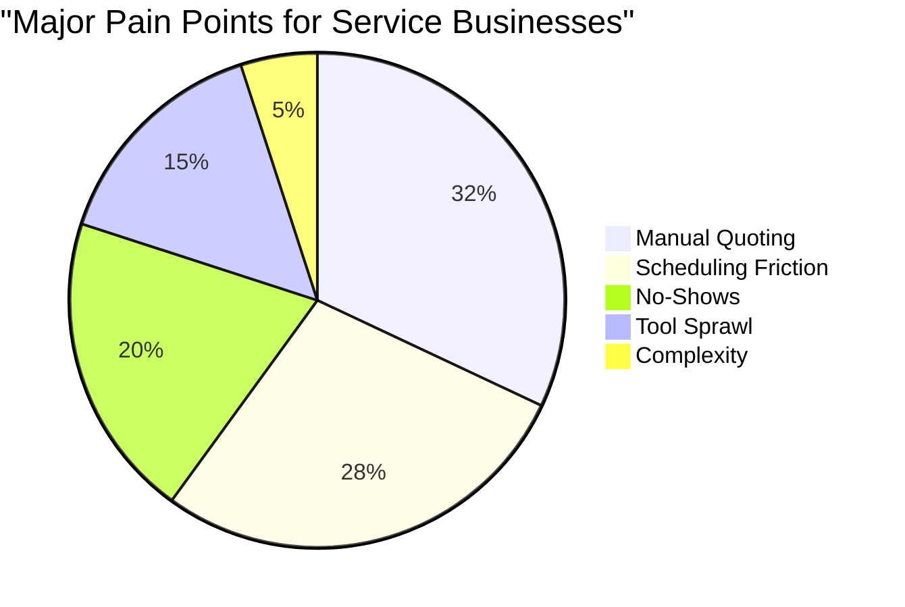

# OHC Market Research & Feature Gap Report

## Executive Summary
This report analyzes the competitive landscape for small business platforms, identifies key pain points for non-technical owners, and outlines OHC's AI-driven strategy to capture the market. It culminates in the proposal of the AI Autonomous Booking Agent as a P0 priority.

## Competitor Audit

| Platform | Onboarding Experience | Mobile Management | AI Integration | Target Audience Fit | Key Failure Point for OHC Personas |
|---|---|---|---|---|---|
| **Shopify** | Complex (30-60 min) | Good, but complex | Chatbot (Sidekick) | Medium/Large SMB | Too complex, high technical barrier, expensive. |
| **Wix** | Moderate (20-40 min) | Limited editor | Setup Wizard (ADI) | Semi-technical | Mobile management is inadequate; setup still requires design choices. |
| **Squarespace**| Moderate (30-60 min) | Poor management | Limited | Creatives | Beautiful but inflexible; no true AI automation. |
| **GoDaddy** | Fast (10-20 min) | Basic | Airo (Branding) | Beginners | Shallow features; aggressive upselling; low quality end-product. |

## User Pain Points Analysis

Data sourced from Reddit, App Store reviews, and Trustpilot indicates that small business owners struggle with tool sprawl and manual overhead.

1.  **Manual Quoting & Inquiry Handling**: Business owners spend hours answering repetitive questions via DM and calculating quotes.
2.  **Scheduling Friction**: Finding a mutually agreeable time slot involves endless back-and-forth messaging.
3.  **Financial Instability (No-Shows)**: Customers booking services but failing to appear costs service providers significant revenue.
4.  **Complex Setup**: Existing tools require configuration of DNS, payment gateways, and complex calendar rules that are beyond the technical capability of our core personas (e.g., Maya, Carlos).

## AI Differentiation Strategy

OHC will differentiate by deploying **Invisible AI Agents** organized by functional departments, rather than chat interfaces.

**The First 5 AI Automations:**
1.  **Autonomous Booking (The Salesperson/Manager)**: AI negotiates quotes, schedules times, and collects deposits via natural language chat.
2.  **Zero-Click Website Generation (The Promoter)**: AI builds a complete storefront based on 3 simple questions.
3.  **Auto-Reply Customer Service (The Ambassador)**: AI drafts and sends responses to common DM inquiries while the owner sleeps.
4.  **Smart Inventory Sync (The Manager)**: AI alerts the owner when stock is low and automatically updates the storefront.
5.  **Plain-Language Financial Reports (The Advisor)**: AI generates weekly SMS summaries of revenue and trends.

## Market Sizing & Go-to-Market

-   **TAM**: The US alone has over 33 million small businesses, a majority of which are non-employer firms (sole proprietorships).
-   **Beachhead Segment**: Service-based sole proprietors (handymen, tutors, cleaners) who currently operate entirely via text message and Instagram DMs.
-   **Expansion Path**: Capture English-speaking service businesses first, then expand to physical goods (makers/bakers), followed by localized language support (Spanish/LATAM).

## Feature Gap Matrix

| Feature | Shopify | Wix | Squarespace | OHC (Proposed) |
|---|---|---|---|---|
| Native Booking | No (App req) | Yes | Yes (Acuity) | **Yes** |
| AI Chat to Quote | No | No | No | **Yes** |
| Auto-Deposit Collection | App req | Yes | Yes | **Yes** |
| Zero-Setup Calendar Sync | No | Moderate | Moderate | **Yes (1-click)** |

## Persona Mapping

-   **Carlos (Handyman, 42)**: Needs the Autonomous Booking Agent to capture leads while he is under a sink working. He needs the AI to ask "What is the plumbing issue?" and collect a deposit.
-   **Leo (Music Tutor, 22)**: Needs the system to automatically sync his Google Calendar and provide a seamless booking link for his TikTok bio.

# Issue Brief: AI Autonomous Booking Agent

## Problem Statement
For service-based small business owners like Carlos (Freelance Handyman) and Leo (Music Tutor), managing bookings is a chaotic, manual process. They currently rely on word-of-mouth, direct messages, and manual calendar syncing. This leads to missed leads when they are busy, back-and-forth messaging to find suitable times, manual quote generation, and lost revenue from no-shows because deposits aren't collected upfront. They need a system that handles inquiry, quoting, scheduling, and payment automatically, without requiring any technical setup or constant monitoring.

## Design Doc

### High-Level Architecture
- **Entities**: `ServiceItem`, `BookingSlot`, `Quote`, `Deposit`.
- **Integrations**:
  - Calendar Sync API (Google Calendar / Apple Calendar).
  - Stripe Payment Intents (for deposits).
- **AI Agent Integration**:
  - `Sales Agent` uses LLM to parse customer intent, calculate quote based on `ServiceItem` base prices, and output a structured quote object.
  - `Operations Agent` handles the scheduling logic, interacting with the DB to lock a `BookingSlot` and initiating the Stripe checkout session.

### Mobile UX Flow (375px)
1. **Customer View**: Opens storefront or DM. Taps "Request Service".
2. **Chat UI**: AI asks for details (e.g., "What kind of plumbing issue?").
3. **Quote & Calendar UI**: AI presents an estimated quote and a simple native date/time picker showing available slots.
4. **Checkout**: Native mobile keyboard for Stripe deposit.
5. **Owner View (OHC App)**: Push notification: "New Booking: Sink Repair. $50 deposit paid." Booking appears in the unified OHC inbox and calendar.

## Implementation Prompt
**Outcome**: A non-technical service provider (like a handyman) can enable "AI Bookings" with one tap. When a customer wants a service, the AI chats with them to understand the job, gives a quote, offers available times, and takes a deposit.
**Critical User Journey (CUJ)**:
1. Owner adds a Service (e.g., "Plumbing Repair") with a base price and duration.
2. Owner connects their calendar.
3. Customer interacts with the storefront, answers AI questions, selects a time, and pays a deposit.
4. Owner receives a confirmed booking notification with funds secured.
**Acceptance Criteria**:
- Must function flawlessly on a 375px mobile screen.
- AI must accurately extract details to form a quote before showing the calendar.
- Must prevent double-booking.
- Must enforce deposit payment before finalizing the booking.

## Priority
**P0**

## Estimated Scope
**Large**
