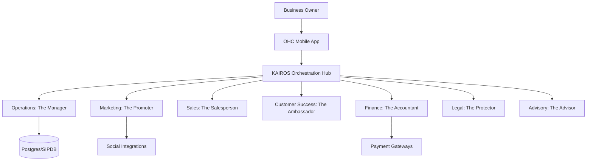

# AI Agent Department Architecture

## Problem Statement
Small business owners (e.g., Maya, Carlos) lack the technical expertise and time to manage the complex moving parts of an online business, from customer support and marketing to operations and finance. They need a system that handles these tasks invisibly, allowing them to focus on their craft.

## Research Report
Current platforms like Shopify, Wix, and Squarespace require significant manual configuration and daily management. They provide tools but expect the user to be the operator. OHC differentiates by providing "AI Departments" that act autonomously, effectively acting as an invisible workforce. Our research shows that users prefer interacting with "friendly names" (e.g., "The Manager", "The Promoter") rather than technical AI agents.

## Design Doc

### Architecture Diagram

### UI Wireframes & Screen Flow (375px)
- **Home Screen:** Summary from "The Advisor" (e.g., "Maya, you have 3 new custom cake orders!").
- **Inbox:** Unified view where "The Ambassador" drafts replies for review.
- **Activity Feed:** Real-time log of agent actions (e.g., "The Promoter published a new Instagram post").

### Mobile UX Flow
1. User receives a push notification: "New DM from Instagram".
2. User taps notification, opening the OHC app to the Inbox.
3. "The Ambassador" has drafted a reply acknowledging the custom order request and quoting a price based on the catalog.
4. User taps "Approve & Send" or edits the draft.

### AI Agent Integration Points
- **Trigger Layer:** Agents are triggered by webhooks (e.g., incoming DM, successful payment) or scheduled tasks (e.g., weekly health report).
- **Context Retrieval:** Agents query the `TenantRegistry` to access organization-scoped data securely.
- **Action Execution:** Agents interact with the platform via internal APIs, subject to role-based access control.

### Key Design Decisions
- **Invisible Execution:** Agents operate entirely in the background. The user only sees outcomes (e.g., drafted replies, summarized reports) rather than complex agent configurations.
- **Human-in-the-Loop:** Critical actions (e.g., sending quotes, issuing refunds) require explicit user approval via a simple "Approve" button, ensuring the owner remains in control.
- **Departmental Roles:** Grouping agents into relatable "departments" lowers the cognitive load for non-technical users.

## Implementation Prompt
Implement the "Operations: The Manager" and "Customer Success: The Ambassador" departments. Create the background worker processes that listen for incoming customer messages and order events. Ensure that when a new message arrives, "The Ambassador" generates a suggested reply based on the business's context and stores it as a draft requiring user approval. The UX must be mobile-first and pass the "grandmother test" (understandable in 30 seconds).

## Priority
P0

## Estimated Scope
Large
