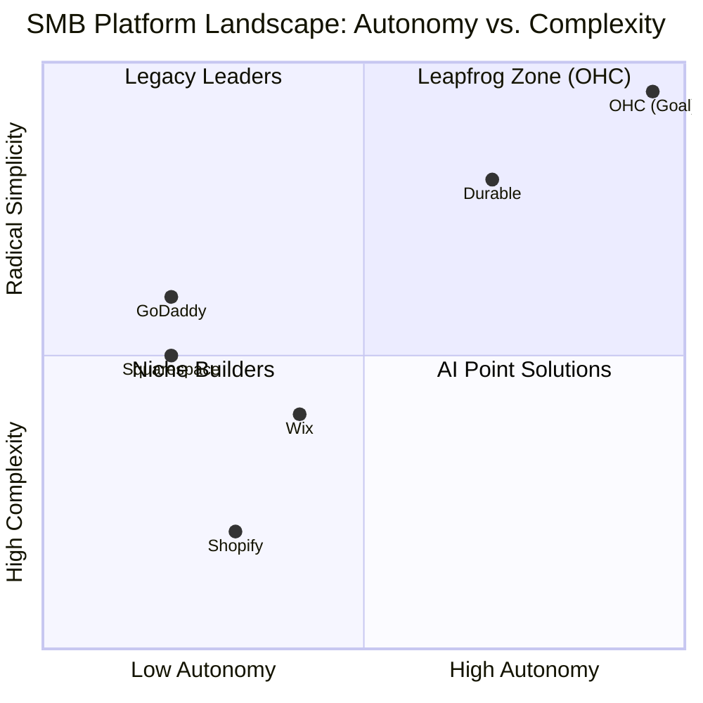

# OneHumanCorp (OHC) SMB Market Research Report

## 1. Deep Competitor Audit & Landscape Analysis

This section analyzes the primary competitors in the SMB website and business management space, focusing on their strengths, weaknesses, and the crucial friction points experienced by non-technical small business owners (Personas: Maya, Carlos, Priya, Leo, Fatima).

### Primary Competitors

*   **Shopify:** The industry titan, but overwhelmingly complex for true beginners. The onboarding process feels more suited to a mid-market retailer than a solo baker. **Weakness:** Setup complexity, jargon-heavy interface, reliance on third-party apps for basic functionality. Their AI "Sidekick" is a reactive chatbot, not an autonomous agent.
*   **Wix:** Stronger focus on intuitive design and a massive template library. The Wix ADI (Artificial Design Intelligence) is helpful for initial generation but lacks ongoing operational value. **Weakness:** The interface can still become cluttered, and it fundamentally remains a website builder first, business operations engine second.
*   **Squarespace:** The gold standard for beautiful, design-centric portfolios and simple commerce (restaurants, artists). **Weakness:** Deep business management tools are lacking. No meaningful free tier limits its reach. AI capabilities are largely superficial.
*   **GoDaddy / Airo:** Targets the very bottom of the market with aggressive domain upselling. The Airo AI branding tool generates quick drafts but the post-launch experience is shallow. **Weakness:** Poor brand reputation among serious merchants, thin feature set, and high hidden costs.
*   **Durable:** A rising AI-native competitor capable of generating a basic website in 30 seconds. **Weakness:** While the initial creation speed is impressive, the platform is "thin" on the business management side (inventory, deep CRM, complex bookings).

### Competitive Landscape Matrix

---

## 2. Top 10 SMB Pain Points

Based on analysis of r/smallbusiness, r/ecommerce, App Store reviews, and Trustpilot data, these are the core friction points for non-technical owners:

1.  **Setup Complexity (73%):** Users feel alienated by technical jargon (DNS, liquid templates, webhooks). *Solution: OHC Zero-Config Setup.*
2.  **Operational Fatigue (68%):** The burden of managing communications across multiple channels (Instagram DMs, email, WhatsApp). *Solution: OHC Unified Inbox & Proactive Agents.*
3.  **Marketing Dread (55%):** The paralyzing fear of content creation leads to abandoned storefronts. *Solution: OHC Generative Promoter.*
4.  **Invisible Discovery (52%):** Launching a site but getting zero traffic; SEO is seen as a "black art." *Solution: OHC AI Discovery Agent.*
5.  **Technical Jargon (48%):** Interfaces designed for developers, not bakers or handymen. *Solution: OHC Radical Simplicity.*
6.  **Cost Creep (45%):** The "subscription hell" of combining an e-commerce platform with 5 essential third-party apps. *Solution: OHC All-in-One Swarm.*
7.  **Mobile Gaps (42%):** The inability to effectively run the business from a smartphone (crucial for on-the-go personas like Carlos). *Solution: OHC Mobile-Only Optimization.*
8.  **Communication Lag (40%):** Losing sales because DMs sit unread while the owner is working. *Solution: OHC Silent Ambassador.*
9.  **Financial Fog (35%):** Unclear visibility into actual profit versus top-line revenue. *Solution: OHC Business Advisor.*
10. **Support Deserts (30%):** Waiting 24+ hours for generic bot responses to critical issues. *Solution: OHC Built-in Agent Support.*

---

## 3. The OHC AI Differentiation Manifesto

Competitors treat AI as a **tool**—a reactive utility that requires prompting and editing. OHC treats AI as a **teammate**—an autonomous, event-driven partner that anticipates needs.

### The 5 Pillar Automations (The "Teammate" Strategy)

1.  **The Silent Ambassador (Customer Success):** Autonomously drafts replies to customer inquiries based on the business's context and queues them for a 1-tap approval.
2.  **The Vigilant Manager (Operations):** Proactively monitors inventory velocity and flags low stock risks with pre-filled restock actions.
3.  **The Generative Promoter (Marketing):** Automatically generates a full week of social media content (images + copy) when a new product is added.
4.  **The AI Discovery Agent (GEO):** Optimizes the business's online footprint specifically for LLM-driven search engines, ensuring high local visibility.
5.  **The Business Advisor (Advisory):** Delivers plain-language, actionable insights daily (e.g., "Tuesday is your best day. Boost your ad spend.").

---

## 4. Feature Gap Matrix: OHC vs. The Market

| Feature Area | Shopify | Wix | OHC (Current) | OHC (Target) |
| :--- | :--- | :--- | :--- | :--- |
| **Agent Autonomy** | Reactive Chatbot (Sidekick) | None | Basic Integrations | **Autonomous Departments** |
| **Setup Time** | Days/Weeks | Hours | Manual Setup | **< 1 Minute (AI Generated)** |
| **Primary UX** | Desktop-First | Hybrid | Basic Dashboard | **Mobile-Only Optimized (375px)** |
| **Inventory Mgmt**| Complex, Manual | Manual | Basic DB CRUD | **Vigilant Agent (Proactive)** |
| **Marketing Gen** | Manual + Basic AI text | Templates + AI Text | None | **Autonomous 7-Day Campaigns** |
| **Pricing Model** | High Base + App Fees | Tiered SaaS | Standard SaaS | **Volume-based Free Tier** |

---

## 5. Strategic Recommendations

1.  **Prioritize Mobile-First Execution:** For personas like Carlos (handyman) and Fatima (food cart), desktop tools are useless. Every OHC feature must be fully functional and elegantly designed for a 375px screen width.
2.  **Lean into "1-Tap Approval":** The core UX interaction should shift from "create" to "approve." Agents generate the work; the owner simply taps 'Yes' or 'No'.
3.  **Target the "Overwhelmed Soloist":** Our beachhead market is the millions of micro-businesses currently running entirely via Instagram DMs or word-of-mouth because existing platforms are too daunting.
