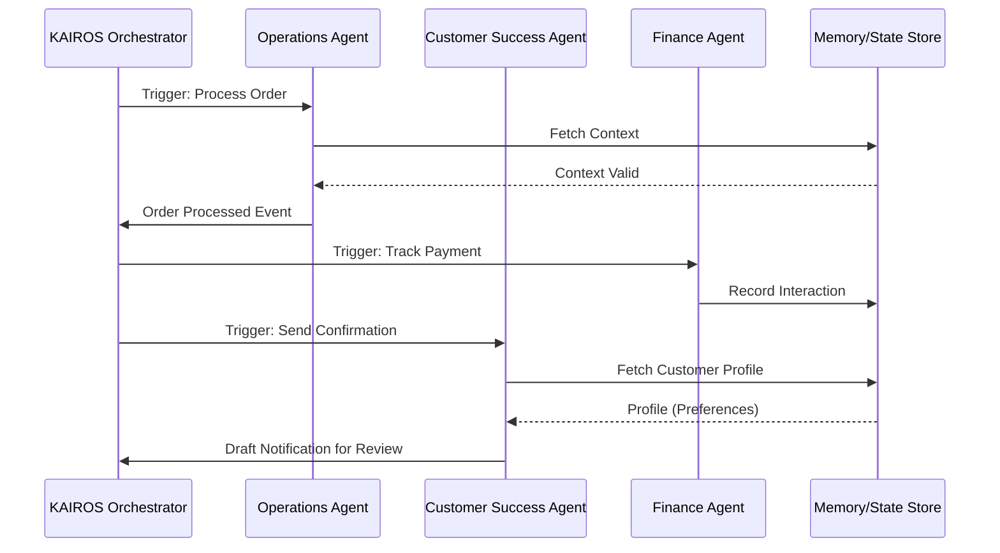

# AI Agent Department Architecture

## Title
Architectural Design for AI Agent Departments

## Problem Statement
Small business owners lack the time, resources, or expertise to manage every function of a real business—from operations and customer success to marketing and finance. OHC needs a cohesive architectural design for AI departments to run invisibly in the background, organized into understandable functional areas.

## Research Report
The OHC platform aims to offload cognitive overhead by organizing agents into 7 specific departments:
- **Operations ("The Manager")**
- **Marketing & Advertising ("The Promoter")**
- **Sales & Acquisition ("The Salesperson")**
- **Customer Success ("The Ambassador")**
- **Finance & Payments ("The Accountant")**
- **Legal & Compliance ("The Protector")**
- **Business Advisory ("The Advisor")**

**Comparative Analysis:**
- **Shopify/Wix:** Rely heavily on third-party apps and rigid workflows, forcing the business owner to become a system integrator.
- **OHC Advantage:** Built-in AI departments that automatically collaborate. For example, Operations finishes an order, and Customer Success drafts the confirmation, requiring only a 1-tap approval from the owner.

**Advantages:**
- Drastically reduces the time to value.
- Provides personalized support without the overhead of hiring.

**Risks:**
- Potential for unwanted autonomous actions; mitigated by a Draft-for-Review (1-tap approval) workflow for high-risk actions.
- Performance and scaling concerns when running multiple background agents per tenant.

**Pricing & Compatibility:**
- Tier-based access (Free, Starter, Pro, Business) regulates AI actions per month.
- Fully compatible with mobile-first constraints, displaying plain-language summaries on 375px screens.

## Design Doc
### Architecture Diagram (Mermaid.js)

### Key Design Decisions
- **Triggers:** Departments are activated via scheduled crons, event-driven orchestration events, or on-demand prompts.
- **Coordination:** The KAIROS Orchestrator manages inter-departmental communication utilizing `Bus` and `DistributedLock` traits.
- **Memory & Context:** Agents utilize short-term context and long-term memory to recall past interactions and trends.
- **Approval Workflows:** Actions are classified by risk. Low-risk actions auto-execute, while high-risk actions (e.g., sending emails) enter a "Draft-for-Review" state requiring 1-tap approval on the mobile dashboard.

### Mobile UX Flow
- 375px-first design.
- Action items are summarized in plain language (e.g., "Your vegan cake campaign is ready for review").
- Push notifications alert owners to pending draft approvals.

## Implementation Prompt
**To Implementer Agent:**
Implement the foundational event routing and "Draft-for-Review" approval workflow within the KAIROS Orchestrator for the Operations and Customer Success departments.
1. Define a risk level attribute in the agent task payload.
2. Create a pending approval queue or state representation for high-risk actions.
3. Build the mobile-first (375px) UI component to display these drafts and provide a 1-tap approve/reject mechanism.
4. Ensure cross-department coordination using the KAIROS Orchestrator.
Do not prescribe specific database schemas, API endpoints, LLM providers, or specific queue implementations. Ensure tests cover the approval lifecycle.

## Priority
P0

## Estimated Scope
Large
