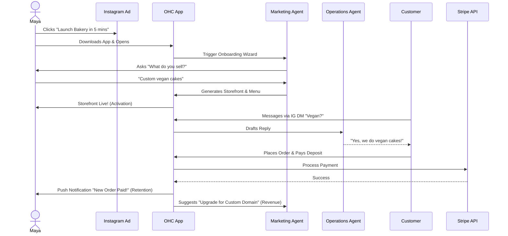
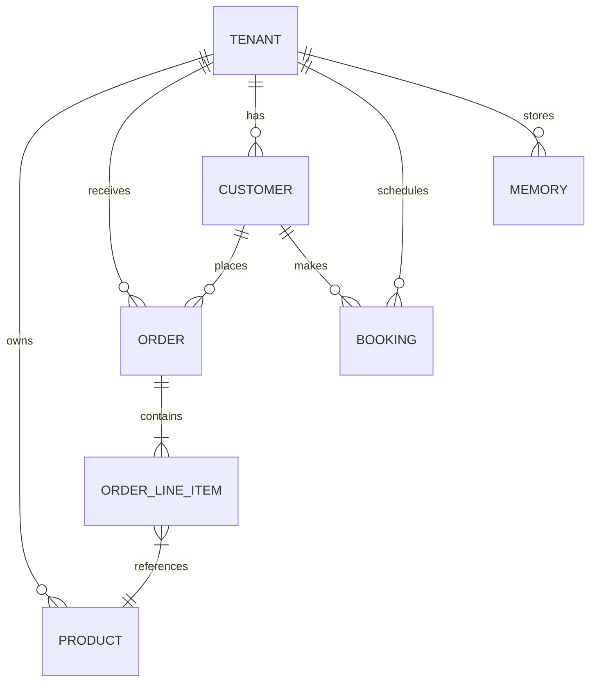
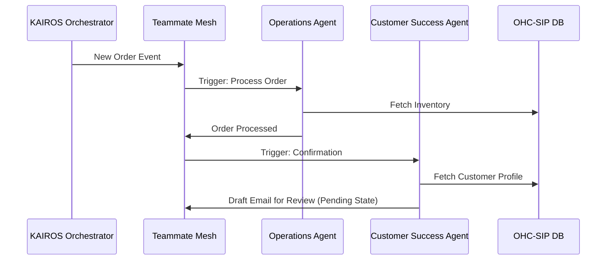
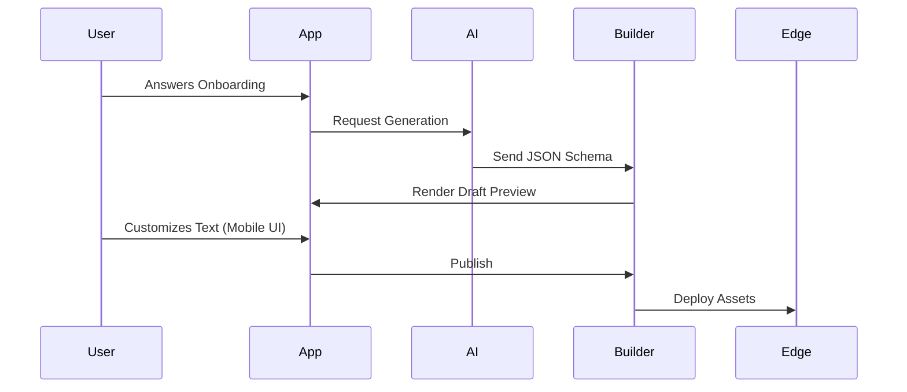
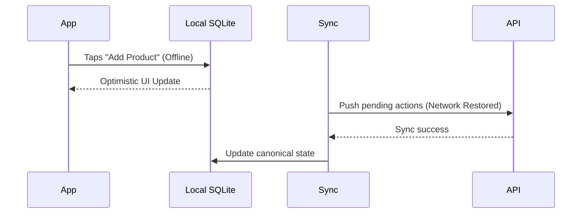
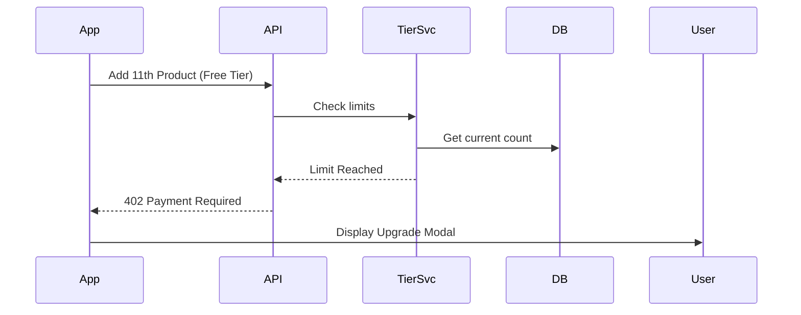

# OHC Universal Architecture Design Reports

## 1. Business Journey Architecture

### Title
Architectural Mapping of the End-to-End Business Journey for OHC Personas

### Problem Statement
The OHC platform must serve a diverse set of real-world small business owners (e.g., Maya the Baker, Carlos the Handyman, Priya the Boutique Owner, Leo the Music Tutor, and Fatima the Food Cart Operator) who share a common goal: launching and growing their business entirely from a mobile device without technical expertise. Currently, the overarching business journeys—from initial acquisition to sustainable revenue generation and referral loops—are fragmented. We need a unified architectural map of the end-to-end user journeys for these personas to ensure that the system naturally supports their progression through Acquisition, Onboarding, Activation, Retention, Revenue generation, and Referral, while identifying critical friction points where non-technical users might abandon the platform.

### Research Report
- **Context and Personas:** Evaluated against Maya (Home Baker), Carlos (Handyman), Priya (Boutique Owner), Leo (Music Tutor), and Fatima (Food Cart Operator).
- **Journey Stages:**
  - **Acquisition**: The entry point (e.g., Instagram/TikTok ads). CTA must clearly promise a functional business setup in under 10 minutes.
  - **Onboarding**: A highly guided, AI-driven wizard flow minimizing initial input.
  - **Activation**: The "Aha!" moment (e.g., live storefront, first booking) achieved within Day 1.
  - **Retention**: Engagement through actionable notifications and AI-generated health reports.
  - **Revenue**: Upgrading from free tier to paid plan triggered by milestones.
  - **Referral**: Incentivized sharing creating a viral loop.
- **Identified Friction Points:**
  - Cognitive overload during onboarding.
  - Payment gateway integration jargon.
  - Inventory/Calendar sync difficulties.
  - Language and accessibility barriers.
- **Competitive Analysis:** Unlike competitors that rely on heavy desktop dashboards, OHC uses AI-first, mobile-first progressive profiling to eliminate friction.

### Design Doc

#### Architecture Diagram

#### Key Design Decisions
- **Progressive Profiling:** Request absolute minimum required data upfront. Advanced settings are dynamically suggested post-activation.
- **AI-First Setup:** Marketing & Advertising Agent generates initial layout/copy.
- **Mobile-First Constraint:** All journey flows designed and tested starting at 375px.
- **Asynchronous Processing:** Non-critical tasks handled asynchronously.

#### Mobile UX Flow
- 375px First: Forms use native mobile keyboards.
- Progress Indicators: Clear visual cues during onboarding wizard.
- Optimistic UI: Immediate feedback on actions with background sync.

### Implementation Prompt
**To Implementer Agent:**
Implement the foundational user onboarding flow and dashboard state management supporting progression from Acquisition to Activation. Define required data models for minimal initial configuration. Build a mobile-first (375px) UI wizard deferring advanced configurations. Ensure the final step instantly generates a functional "Storefront/Booking Page". Include E2E test coverage verifying a successful run-through from login to the generated storefront. Focus on unified API contracts and resilient state transitions.

### Priority: P0 | Estimated Scope: Large

---

## 2. Data Model Architecture

### Title
Data Model Architecture: Entities, Relationships, and Multi-Tenancy Guarantees

### Problem Statement
As OneHumanCorp scales, the underlying data model must remain robust, scalable, and strictly isolated per tenant. A non-technical small business owner relies on the system to keep customer data, orders, and AI agent memories perfectly secure. We must define clear entity relationships, access patterns, and invariants guaranteeing row-level multi-tenancy without adding complexity to the business owner's experience.

### Research Report
- **Goal:** Evolve data model ensuring tenant isolation and optimized access patterns.
- **Findings:**
  - **Multi-Tenancy:** Row-level isolation in PostgreSQL using `tenant_id` and RLS is critical.
  - **Entities:** Business, Product, Order, Customer, Agent, Page, Booking, Memory.
  - **Access Patterns:** AI requires low-latency access to `autodream_memories` (pgvector). Mobile requires fast, aggregated queries.
- **Competitive Analysis:** Natively embedding vector memories directly into the tenant schema with enforced RLS gives OHC a significant advantage in secure, integrated AI over platforms like Shopify.

### Design Doc

#### Architecture Diagram

#### Key Design Decisions
- **Strict Tenant Isolation:** Every business table must have `tenant_id` with RLS policies.
- **AI Agent Scoping:** All AI queries must explicitly include `tenant_id` binding.
- **No Cross-Tenant Relationships:** Foreign keys cannot cross tenant boundaries.

### Implementation Prompt
**To Implementer Agent:**
Audit the PostgreSQL schema ensuring all business entities implement the `tenant_id` column and have RLS configured. Update backend repository layers (Rust and Go) to consistently pass the `tenant_id` context. Implement unit tests verifying RLS enforcement (e.g., cross-tenant queries return 0 rows). Maintain Auth layer's use of `organization_id` at the edge while strictly using `tenant_id` at the DB layer.

### Priority: P0 | Estimated Scope: Medium

---

## 3. AI Agent Department Architecture

### Title
AI Agent Department Architecture: Invisible Operations & Draft-for-Review Approvals

### Problem Statement
To allow non-technical owners to run businesses seamlessly, AI agents must handle complex operations invisibly. However, there's no formalized design for how agents operate, coordinate, recall memory, or manage high-risk actions. We need a functional mapping of "Departments" mirroring real-world roles, ensuring AI integration is natural, trusted, and strictly isolated per tenant.

### Research Report
- **Goal:** Design architecture for 7 core AI Departments (Operations, Marketing, Sales, CS, Finance, Legal, Advisory).
- **Findings:**
  - **Triggers:** Cron schedules, system events, on-demand prompts.
  - **Coordination:** Centralized via KAIROS using distributed locks.
  - **Memory:** `pgvector` for long-term recall.
  - **Approvals:** High-risk actions require explicit user approval (Draft-for-Review). Low-risk actions auto-execute.
  - **Tier Limits:** Agent activity metered based on subscription tier.

### Design Doc

#### Architecture Diagram

#### Key Design Decisions
- **Execution Triggers & Coordination:** KAIROS Orchestrator manages triggers and distributed locks (`ohc:lock:{tenant_id}:{resource_type}:{resource_id}`).
- **Approval Workflows (Draft-for-Review):** High-risk actions placed in pending state requiring 1-tap mobile approval.

### Implementation Prompt
**To Implementer Agent:**
Implement foundational event routing and approval workflow engine for KAIROS Orchestrator. Coordinate state handoffs using distributed locks. Implement 'Draft-for-Review' pending queue mechanism allowing explicit 1-tap approval from mobile UI. Ensure all operations are isolated via `tenant_id`. Include tests verifying event routing and approval state transitions.

### Priority: P1 | Estimated Scope: Large

---

## 4. Website & Storefront Builder Architecture

### Title
Website & Storefront Builder Architecture: Simplifying Digital Presence

### Problem Statement
Small business owners need professional websites but lack technical skills for traditional builders. We need an automated builder where a storefront is generated based on simple onboarding answers. It must default to a mobile view while allowing seamless transitions to custom domains.

### Research Report
- **Goal:** Design automated, mobile-first website and storefront builder.
- **Findings:**
  - AI Marketing Agent drives generation via JSON schema.
  - Strictly styled components (Hero, ProductGrid, Booking) ensure visual excellence.
  - Draft vs. Live states managed seamlessly.

### Design Doc

#### Architecture Diagram

#### Key Design Decisions
- **AI-Driven Generation:** AI generates complete JSON schema.
- **Component-Based Architecture:** Predefined blocks enforce OHC design system.
- **Mobile-First Editing:** Editing happens within 375px mobile view.

### Implementation Prompt
**To Implementer Agent:**
Implement the core engine for the AI-driven Website & Storefront Builder. Create internal JSON schema definition representing a storefront page. Build the rendering service translating schema into a live mobile-optimized webpage. Implement API endpoints for saving drafts and publishing. Ensure output adheres strictly to OHC design system.

### Priority: P1 | Estimated Scope: Large

---

## 5. Mobile-First Architecture Review

### Title
Mobile-First Architecture Review: Ensuring Platform Parity & Performance

### Problem Statement
The platform guarantees users can run businesses from mobile devices without desktop access. We need to verify offline capabilities, push notification delivery, and performance targets on low-end hardware, ensuring mobile-first constraints hold true.

### Research Report
- **Goal:** Audit architecture against mobile-first contract.
- **Findings:**
  - **Screen Parity:** Critical screens designed/tested at 375px.
  - **Offline Requirements:** Local SQLite caching for reads; optimistic updates for writes.
  - **Performance Targets:** <1MB initial payload.
  - **Notifications:** Resilient background push notifications.

### Design Doc

#### Architecture Diagram

#### Key Design Decisions
- **Local-First Architecture:** UI binds directly to local SQLite database.
- **Optimistic Updates:** Immediate UI feedback, background KAIROS sync.

### Implementation Prompt
**To Implementer Agent:**
Implement "Local-First" caching and sync architecture within mobile application layer. Establish local SQLite schema mirroring server entities. Implement sync worker handling push/pull when connectivity changes. Bind UI components to local state for optimistic feedback. Include E2E tests simulating offline mode and verifying background sync.

### Priority: P1 | Estimated Scope: Large

---

## 6. Multi-Tenant SaaS Tier Architecture

### Title
Multi-Tenant SaaS Tier Architecture: Transparent Pricing & Graceful Degradation

### Problem Statement
The platform requires a clear pricing model enforcing tier limits (Free, Starter, Pro, Business) gracefully without confusing users with technical errors.

### Research Report
- **Goal:** Design tier architecture, limit enforcement, and billing sync.
- **Findings:**
  - **Enforcement:** `TierService` middleware intercepts requests evaluating against limits.
  - **Graceful Degradation:** Custom `402` payloads trigger friendly mobile upgrade prompts.
  - **Billing Sync:** Stripe webhooks sync state asynchronously.

### Design Doc

#### Architecture Diagram

#### Key Design Decisions
- **Middleware Enforcement:** Gateway-level limit checks.
- **Action-Specific Payloads:** Plain-language upgrade modals triggered by 402 responses.
- **Webhook Synchronization:** Asynchronous Stripe sync.

### Implementation Prompt
**To Implementer Agent:**
Implement Multi-Tenant SaaS Tier enforcement. Create `TierService` middleware evaluating incoming requests against limits. Define tier structures in DB. Implement Stripe webhook listener for subscription sync. Update mobile UI to intercept limit-reached responses displaying graceful upgrade modals.

### Priority: P1 | Estimated Scope: Medium
