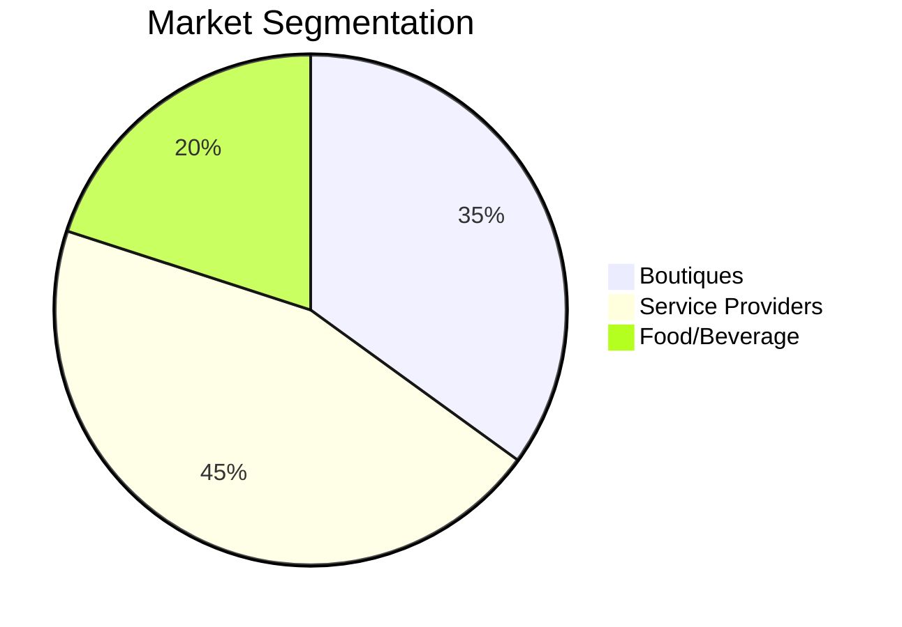
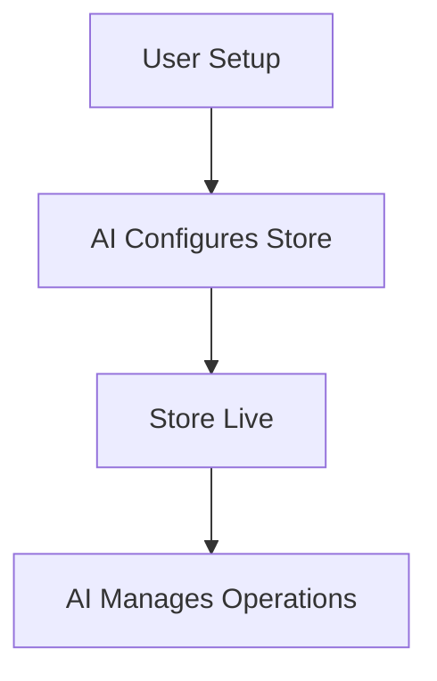

# OHC SMB Platform Market Research Report

## 1. Top 10 SMB Pain Points
1. **Complex Setup**: Setting up an online store is too complicated for beginners.
2. **Payment Integration**: Difficulties configuring payment gateways.
3. **Inventory Sync**: Unable to easily sync inventory across multiple channels.
4. **Mobile Management**: Poor experience managing the business from a mobile device.
5. **No AI Assistance**: Lack of built-in AI tools for automation and content generation.
6. **Booking Systems**: Manual booking processes lead to chaos and missed leads.
7. **Customer Communication**: Managing customer messages across platforms is overwhelming.
8. **Marketing Tools**: Difficulty creating and managing email marketing campaigns.
9. **Analytics & Insights**: Overwhelming and confusing analytics dashboards.
10. **Customization Limits**: Restrictive templates that do not fit specific brand needs.

## 2. Feature Gap Matrix

| Feature | Shopify | Wix | OHC (current) | OHC (gap/advantage) |
| :--- | :--- | :--- | :--- | :--- |
| Mobile-First Setup | Poor | Limited | Strong | Advantage: 10-minute setup |
| AI Content Gen | Add-on | Limited | Built-in | Advantage: Invisible AI agents |
| Inventory Sync | Strong | Strong | Limited | Gap: Needs multi-channel sync |
| Automated Booking | Add-on | Add-on | Built-in | Advantage: Native booking |

## 3. OHC AI Differentiation Manifesto
1. **Auto-replying to customer messages**: Saves hours per day for SMB owners.
2. **Auto-writing product descriptions**: Streamlines catalog uploads.
3. **Auto-generating social posts**: Removes the biggest marketing barrier.
4. **Auto-sending follow-up emails**: Recovers abandoned carts seamlessly.
5. **AI-generated weekly business insights**: Simplifies analytics into actionable steps.

## 4. Market Sizing & Strategic Direction
* **Beachhead Market**: Boutique owners and service providers (e.g., tutors, handymen).
* **Geographic Expansion**: Prioritize Spanish/LATAM after English markets.

