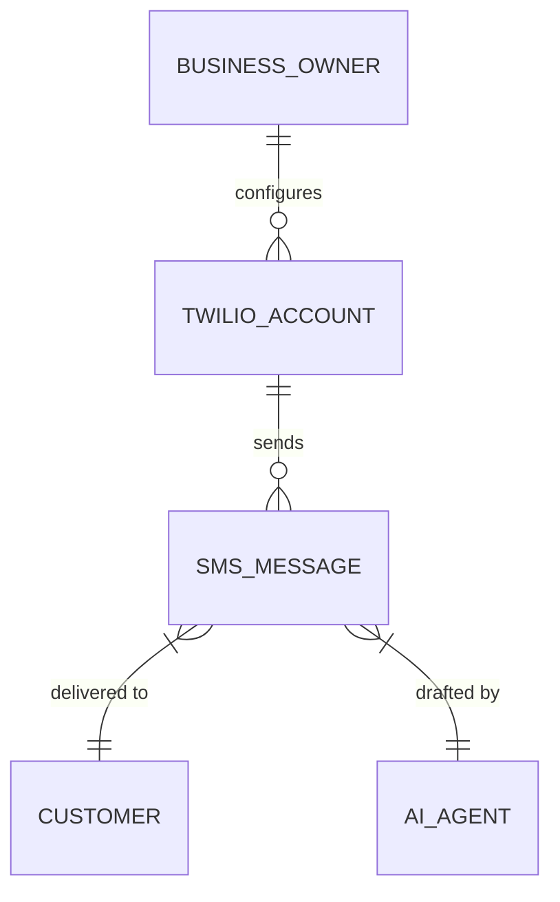
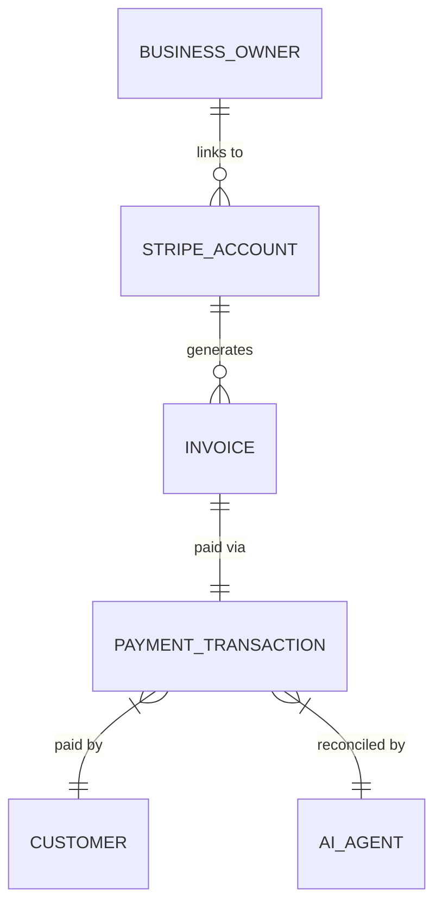
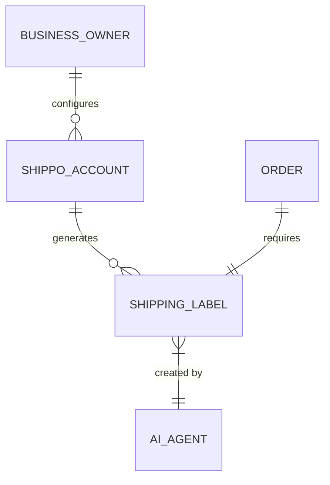

# 🔍 Scout: Tool Integration Research Q4

## 1. Calendar & Scheduling: Cal.com
**Problem Statement:** Small business owners (like consultants, therapists, or tutors) spend hours coordinating meeting times via email, leading to lost bookings and frustration. They need a simple, professional way for clients to book time that automatically respects their personal calendar.
**Research Report:**
- **Tool:** Cal.com
- **Persona Benefit:** Non-technical owners can share a link and clients can pick available slots.
- **Key Advantages:** Open-source, highly customizable, supports white-labeling, and works well for both cloud and standalone instances. It has a generous free tier for individuals and a solid $12/user/month tier for teams.
- **Risks:** Might be overwhelming if configured with too many advanced workflows for very basic users.
- **Pricing:** Free for individuals; $12/user/month for Teams.
- **Environment:** Works in both Cloud (multi-tenant) and Standalone (self-hosted).
- **Cloud vs. Standalone Capability:** Cal.com is an open-source project that can be self-hosted, making it highly compatible with both the OHC cloud offering (multi-tenant) and the standalone desktop app (where users might connect to a managed Cal.com instance or run their own).
**Design Doc:**
- **Trigger:** A "Book Consultation" button on the business's public profile or shared via SMS/Email.
- **Action:** Opens a clean, branded booking page showing available slots synchronized with the owner's Google/Outlook calendar.
- **User View:** The business owner sees upcoming appointments in their unified dashboard; the client receives an automated calendar invite.
- **AI agent integration points:** The AI Assistant can propose times directly from Cal.com, the AI Marketing agent can send campaigns with booking links.
- **Entity-Relationship Diagram:**

**Implementation Prompt:** Integrate Cal.com so business owners can generate personal booking links directly from their dashboard. The UI should display their upcoming bookings and allow them to copy their booking link to share with customers.
**Priority:** P1
**Estimated Scope:** Medium

## 2. SMS & Notifications: Twilio
**Problem Statement:** Many small businesses (especially service-oriented ones like hair salons or repair shops) serve clients who prefer text messages over emails. Relying on personal phone numbers is unscalable and unprofessional, and missing an appointment reminder costs money.
**Research Report:**
- **Tool:** Twilio
- **Persona Benefit:** Enables automated, reliable text reminders and notifications to customers' phones, ensuring higher appointment attendance and better communication.
- **Key Advantages:** Industry standard, highly reliable, global reach, and pay-as-you-go pricing.
- **Risks:** Requires careful handling of opt-out compliance (A2P 10DLC regulations in the US) which can be confusing for small business owners.
- **Pricing:** Pay-as-you-go (approx. $0.0079 per SMS in the US).
- **Environment:** Cloud (API based).
- **Cloud vs. Standalone Capability:** Twilio relies heavily on a cloud API. In a cloud multi-tenant environment, OHC can proxy Twilio calls. In standalone mode, the user would need to provide their own Twilio API key.
**Design Doc:**
- **Trigger:** An appointment is booked, or an order is ready for pickup.
- **Action:** An automated SMS is dispatched to the customer's provided phone number.
- **User View:** The business owner sees a log of sent messages and delivery statuses in their customer's timeline.
- **AI agent integration points:** AI Customer Support can reply to customer SMS via Twilio. AI Ops can trigger notifications on order status changes.
- **Entity-Relationship Diagram:**

**Implementation Prompt:** Integrate Twilio API to allow the platform to send automated SMS notifications for key events (e.g., appointment reminders). The business owner should be able to toggle these notifications on or off in their settings.
**Priority:** P0
**Estimated Scope:** Large

## 3. Payment Processing: Stripe
**Problem Statement:** Small business owners need a reliable, professional way to accept payments online (for invoices, bookings, or digital goods) without the hassle of setting up traditional merchant accounts or dealing with complex fee structures.
**Research Report:**
- **Tool:** Stripe
- **Persona Benefit:** Allows owners to easily generate payment links or send professional invoices that clients can pay instantly with credit cards or local payment methods.
- **Key Advantages:** Developer-friendly, robust fraud protection, global reach, and pre-built checkout UIs that reduce friction.
- **Risks:** Transaction fees can add up for businesses with thin margins; chargebacks require management.
- **Pricing:** Standard 2.9% + 30¢ per successful card charge (domestic).
- **Environment:** Cloud.
- **Cloud vs. Standalone Capability:** Stripe is API-first. Cloud setup is easy with Stripe Connect. For standalone, users can use standard Stripe API keys to process payments directly without going through OHC cloud.
**Design Doc:**
- **Trigger:** An invoice is created, or a service is booked requiring upfront payment.
- **Action:** Generates a secure checkout link or embedded payment form.
- **User View:** The business owner sees a "Payments" dashboard tracking revenue, pending payouts, and failed transactions.
- **AI agent integration points:** AI Finance can monitor transaction volumes and failed payments, alerting the owner if anomalies are found.
- **Entity-Relationship Diagram:**

**Implementation Prompt:** Integrate Stripe to enable business owners to accept online payments. Owners should be able to connect their bank account, send payment links, and track payment status directly from the platform.
**Priority:** P0
**Estimated Scope:** Large

## 4. Shipping & Logistics: Shippo
**Problem Statement:** E-commerce or craft business owners waste significant time manually calculating shipping rates, writing labels, and waiting in line at the post office.
**Research Report:**
- **Tool:** Shippo
- **Persona Benefit:** Streamlines the entire shipping process, from rate calculation to label printing and tracking, saving time and money.
- **Key Advantages:** Connects with dozens of carriers (USPS, UPS, FedEx, DHL), offers discounted rates, and has a simple pay-as-you-go or low-cost monthly tier.
- **Risks:** Hardware integration (label printers) can sometimes be tricky for non-technical users.
- **Pricing:** Starter plan is free (pay only postage + 5¢ per label if using own accounts, or free if using Shippo's discounted rates). Pro plan starts at $17/month.
- **Environment:** Cloud.
- **Cloud vs. Standalone Capability:** Cloud API. Multi-tenant instances can route through a master account or connected accounts. Standalone instances require users to provide their own Shippo API credentials.
**Design Doc:**
- **Trigger:** A customer places a physical order requiring shipping.
- **Action:** Automatically fetches the best shipping rates based on package dimensions/weight and generates a printable label.
- **User View:** The business owner sees a "Fulfill Order" button that presents shipping options, allows them to print a label, and automatically emails the tracking number to the customer.
- **AI agent integration points:** AI Ops can automatically fetch rates and generate the shipping label once the owner confirms the order is packaged.
- **Entity-Relationship Diagram:**

**Implementation Prompt:** Integrate Shippo to provide shipping rate calculation and label generation. The owner should be able to input package details, select a carrier rate, and print the shipping label from their order management dashboard.
**Priority:** P2
**Estimated Scope:** Medium

## References & Sources
- https://cal.com/
- https://cal.com/pricing
- https://cal.com/docs
- https://github.com/calcom/cal.com
- https://twilio.com/
- https://twilio.com/pricing/sms
- https://twilio.com/docs/sms
- https://twilio.com/docs/sms/api
- https://stripe.com/
- https://stripe.com/pricing
- https://stripe.com/docs
- https://stripe.com/docs/api
- https://goshippo.com/
- https://goshippo.com/pricing
- https://goshippo.com/docs
- https://docs.goshippo.com/
- https://cal.com/blog
- https://stripe.com/blog
- https://twilio.com/blog
- https://goshippo.com/blog
- https://stripe.com/en-gb-us/pricing
- https://www.twilio.com/en-us/pricing
- https://www.twilio.com/en-us/messaging/sms
- https://stripe.com/en-gb-us/payments
- https://stripe.com/en-gb-us/payments/checkout
- https://goshippo.com/shipping-api/
- https://goshippo.com/carriers/
- https://cal.com/features
- https://cal.com/integrations
- https://cal.com/enterprise
- https://stripe.com/en-gb-us/connect
- https://stripe.com/en-gb-us/billing
- https://stripe.com/en-gb-us/radar
- https://twilio.com/en-us/messaging/channels/whatsapp
- https://twilio.com/en-us/trusted-activation/a2p-10dlc
- https://goshippo.com/multi-carrier-shipping-software/
- https://goshippo.com/international-shipping/
- https://goshippo.com/usps-shipping/
- https://goshippo.com/ups-shipping/
- https://goshippo.com/fedex-shipping/
- https://cal.com/download
- https://cal.com/community
- https://cal.com/app-store
- https://stripe.com/en-gb-us/terminal
- https://stripe.com/en-gb-us/issuing
- https://stripe.com/en-gb-us/identity
- https://twilio.com/en-us/voice
- https://twilio.com/en-us/email
- https://goshippo.com/tracking/
- https://goshippo.com/returns/
