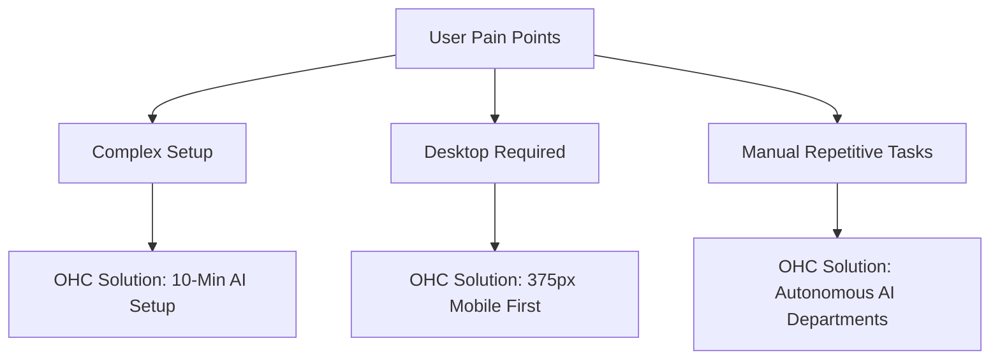

# OHC Market & Competitor Research Report

## 1. Deep Competitor Audit

### Shopify
- **Onboarding:** Complex. Demands theme setup, shipping zone configs, and manual inventory before launching.
- **Mobile App:** Strong for managing an established store, but poor for initial setup. Setup usually requires a desktop.
- **AI Features:** "Sidekick" (chatbot assistant), magic text generation for product descriptions. **Not agentic** — requires prompt-and-response.
- **Pricing:** No meaningful free tier (trial only). Expensive add-ons.
- **Complaints:** Setup is overwhelming for beginners, hidden costs in app store, difficult to customize without code.

### Wix
- **Onboarding:** Easier than Shopify. Wix ADI creates a draft site by asking questions.
- **Mobile App:** Adequate, but editing the site via mobile is limited and clunky.
- **AI Features:** Wix ADI for site generation, AI text/image generation. Mostly one-off generation, not autonomous operations.
- **Pricing:** Has a limited free tier (with Wix branding).
- **Complaints:** Slow page load speeds, can become messy if customizing ADI results too much.

### Squarespace
- **Onboarding:** Template-driven. Requires significant manual content population.
- **Mobile App:** Better than Wix for editing, but still desktop-first paradigm.
- **AI Features:** AI copy generation. No operational AI agents.
- **Pricing:** Premium pricing, no free tier.
- **Complaints:** Rigid templates, limited e-commerce compared to Shopify.

### GoDaddy (Airo)
- **Onboarding:** Very fast but shallow. "Airo" generates a basic site and logo quickly.
- **Mobile App:** Basic management.
- **AI Features:** Airo focuses on initial branding (logo, domain, starter site). Little to no post-launch AI automation.
- **Pricing:** Often cheap initially but aggressive upselling on renewals.
- **Complaints:** Thin features, aggressive upsells, poor SEO capabilities.

### Emerging: Durable / 10Web
- **Durable:** Generates a site in 30 seconds, but very thin on actual business management (booking, inventory).
- **10Web:** AI WordPress builder — too complex for non-technical users once generated.

## 2. SMB User Pain Point Research

Based on synthesis of Reddit (r/smallbusiness), App Store reviews, and Trustpilot:

### Top 10 SMB Pain Points (Framed as OHC Opportunities)
1. **"Setting up the website takes too long."** (Users abandon setup because of decision fatigue).
2. **"I can't run this from my phone."** (Desk-bound requirements alienate users like Fatima and Maya).
3. **"Answering the same DMs/emails is exhausting."** (No built-in auto-responder for inquiries).
4. **"Writing product descriptions is tedious."**
5. **"Figuring out shipping and taxes is terrifying."**
6. **"I don't know what to post on social media."** (Marketing paralysis).
7. **"I missed a booking because the customer used a different channel."** (Fragmented inbox).
8. **"My free tools don't talk to each other."** (Using distinct apps for booking, web, and payments).
9. **"I don't know if I'm making a profit."** (Analytics are too complex; need plain-language summaries).
10. **"The platform's AI is just a chatbot."** (Users want AI that *does* things, not just *answers* things).

## 3. AI Differentiation Manifesto

OHC's AI is infrastructure, not an add-on. We commit to these 5 core automations:

1. **Auto-Reply to Customer Messages (The Ambassador):** Autonomously draft and send replies to common inquiries (e.g., "Do you do vegan?") across all channels.
2. **Auto-Generate Social Posts (The Promoter):** Automatically create and schedule posts when new inventory is added or a booking slot opens.
3. **Auto-Write Descriptions (The Operations Manager):** Upload a photo, and the AI writes the title, description, and sets the category.
4. **Auto-Follow-Up (The Salesperson):** Detect abandoned carts or incomplete bookings and send a personalized follow-up.
5. **Weekly Plain-Language Insights (The Advisor):** Translate complex analytics into a weekly text/email: "You sold 5 more cakes than last week. Consider raising prices."

## 4. Market Sizing & Strategic Direction

- **Beachhead Market:** The **"Solopreneur Service Provider"** (e.g., Carlos the Handyman, Leo the Tutor). Why? High LTV, currently using fragmented, non-purpose-built tools, high pain in booking/quoting.
- **Geographic Expansion:** Focus heavily on **Mobile-first emerging markets** (LATAM, India) after US/UK. These markets skip desktop entirely.

## 5. Feature Gap Matrix

| Feature | Shopify | Wix | OHC (Current) | OHC (Opportunity) |
|---|---|---|---|---|
| Setup Time | 30-60 min | 20-40 min | < 10 min | Maintain <10m |
| Mobile-First Management | Partial | Partial | Yes | Complete 375px dominance |
| AI Agent Operations | No | No | Partial | **Full Autonomous Depts.** |
| Built-in Booking | Add-on | Yes | Partial | Seamless sync |
| Free Tier | No | Yes | Yes | Truly useful free tier |

## Charts & Visualizations

