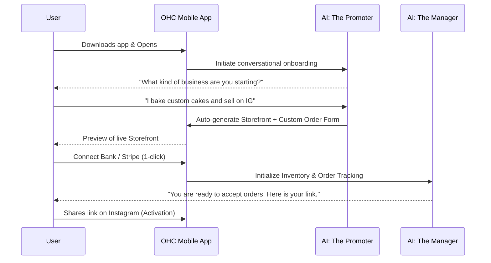
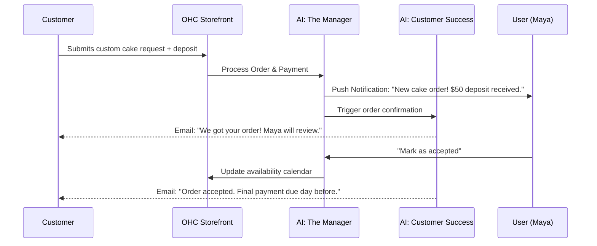

# [architecture] Business Journey Architecture: End-to-End User Flow

## Title
Business Journey Architecture: End-to-End User Flow

## Problem Statement
Small business owners (our personas like Maya the Baker, Carlos the Handyman, etc.) have a high friction experience creating and launching an online business using traditional platforms. They need a zero-configuration, seamless onboarding and management experience that takes them from "idea" to "live business" in under 10 minutes. The platform must guide them intuitively through acquisition, onboarding, activation, retention, revenue, and referral stages. This architecture document maps out the comprehensive end-to-end user journey for these personas to identify friction points and ensure AI agents handle the complexity invisibly.

## Research Report
### Competitive Landscape Analysis
- **Shopify**: Excellent for e-commerce, but onboarding is complex (30-60 mins). Requires understanding of themes, payment gateways, and shipping zones. Too heavy for Carlos or Leo.
- **Wix / Squarespace**: Good for portfolios, but requires 20-40 mins of template customization. E-commerce add-ons can be confusing.
- **GoDaddy**: Basic tools, fast setup, but limited functionality and poor AI integration.

### Persona Analysis & Frictions
1. **Maya (Baker)**: Needs visual portfolio + custom deposit flow. Friction: Custom orders usually require complex form builders.
2. **Carlos (Handyman)**: Needs local booking + deposit. Friction: Integrating a calendar that actually works on mobile and takes payments is hard on other platforms.
3. **Priya (Boutique)**: Needs online + POS sync. Friction: Managing two separate inventory systems or paying for an expensive enterprise POS.
4. **Leo (Tutor)**: Needs recurring subscriptions + video links. Friction: Stitching together Zoom + Stripe + Calendly.
5. **Fatima (Food Cart)**: Needs pre-orders + mobile notifications. Friction: Complex POS systems, slow performance, English-only interfaces.

### Opportunity
OneHumanCorp can eliminate these frictions by using AI to auto-generate the right structures based on a simple 2-minute chat onboarding, providing a mobile-first dashboard, and abstracting integrations (payments, calendar, etc.) into native features.

## Design Doc

### 1. Key Design Decisions & Why
- **Conversational AI Onboarding**: Replaces complex configuration forms. Users simply chat with "The Promoter" agent to explain what they do, and the platform auto-generates the necessary UI components (menu, calendar, storefront).
- **Unified Mobile Dashboard**: All personas use a single mobile dashboard focused on their critical actions (e.g., Fatima sees orders, Leo sees upcoming lessons), powered by "The Manager" operations agent.
- **Progressive Disclosure for Upgrades**: Avoid overwhelming users with pricing upfront. Present the Starter/Pro upgrade only when they try to perform an action outside the Free tier (e.g., adding the 11th product).
- **Built-in Shareable Assets**: Automatically generate QR codes and link-in-bio pages to drive immediate acquisition for the user.

### 2. Architecture Diagrams (Mermaid.js)

#### User Journey: Acquisition to Activation

#### User Journey: Retention & Revenue (Maya the Baker)

### 3. Mobile UX Flow (375px First)
1. **Onboarding Screen**: Chat interface taking up the full screen. Native keyboard pops up. Large, readable text (Outfit + Inter).
2. **Dashboard**:
   - **Top**: "At a glance" metrics (Today's revenue, active orders) generated by Business Advisory.
   - **Middle**: Action cards (e.g., "Review 1 new custom order", "Post new cake photo to IG").
   - **Bottom**: Persistent tab bar (Home, Orders, Messages, Marketing).
3. **Storefront Editor**: Glassmorphism overlays on top of the live preview. Drag-and-drop elements with touch targets >= 44x44px.

### 4. AI Agent Integration Points
- **Acquisition**: Marketing Agent creates SEO-optimized landing pages and social posts.
- **Onboarding**: Operations Agent acts as a setup wizard via natural language.
- **Retention**: Customer Success Agent handles post-purchase communications and review requests. Business Advisory sends weekly push notifications summarizing performance.

## Implementation Prompt
**Task**: Implement the end-to-end onboarding conversational flow in the Flutter application.
**Outcome**: A new user can launch the app, engage in a chat with the AI Promoter, and have a functional, customized storefront generated for them based on their inputs.
**CUJ**:
1. User opens the app for the first time.
2. User is greeted by a chat interface.
3. User types a description of their business (e.g., "I am a freelance handyman").
4. The app displays a loading animation while the backend AI processes the request.
5. The app transitions to a fully generated, interactive preview of their new mobile storefront, complete with placeholder services and a booking calendar.
**Acceptance Criteria**:
- UI matches the premium token library (Glassmorphism, Outfit+Inter, smooth animations).
- Chat interface uses native mobile keyboard effectively.
- AI correctly interprets the business type and returns a structured payload to build the UI dynamically.
- Graceful error handling (e.g., if AI request times out, show a friendly fallback UI to try again).
- Includes 100% test coverage and an E2E Playwright test simulating the chat and verifying the resulting storefront layout.

## Priority
P0

## Estimated Scope
Large
