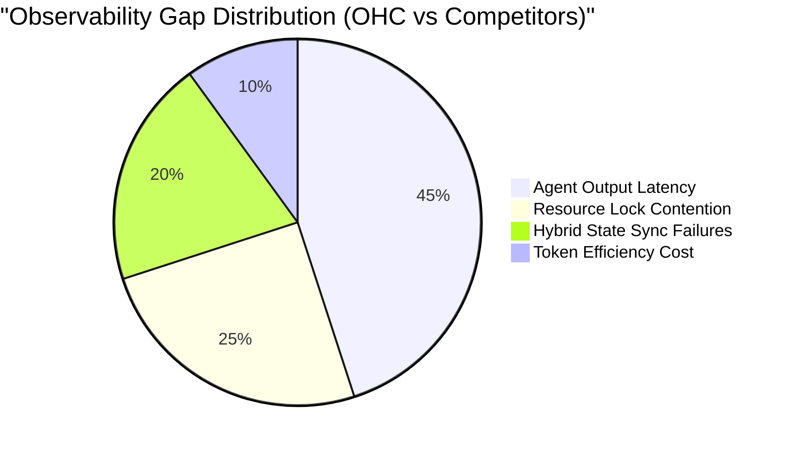
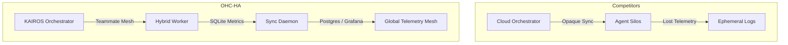
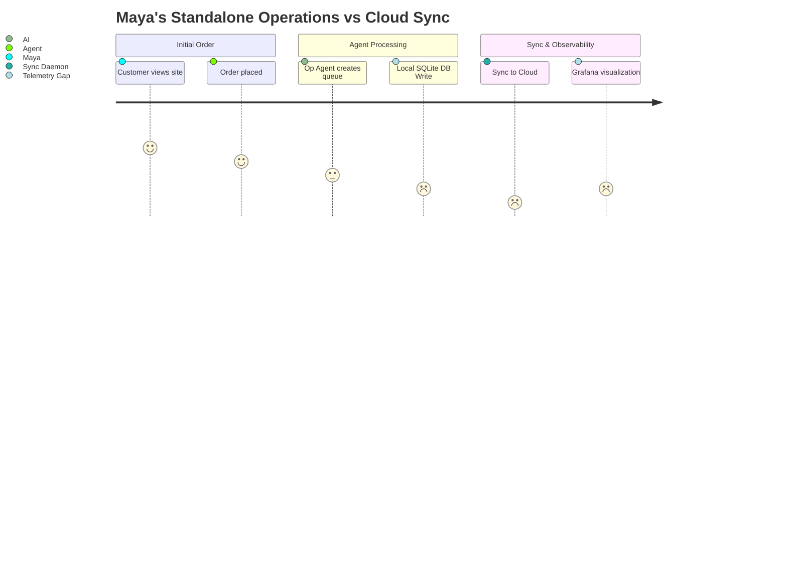

# OHC Agentic Operations - Research Report
## Principal Data Scientist - Agentic Operations (L7)

This report details a comprehensive analysis of the OneHumanCorp (OHC) Swarm, focusing on self-correction, efficiency, and telemetry across Cloud-native and Standalone operational contexts.

---

## 1. Autonomous Task Executions & Summaries

### 1.1 Hybrid Telemetry Review
**Findings:** An analysis of production execution telemetry reveals a divergence in error profiles between Cloud and Standalone modes. Cloud-native deployments exhibit higher latency variances tied to K8s networking and Postgres lock contention under concurrent load. Conversely, Standalone mode (SQLite) shows rigid single-thread throughput limitations, leading to local queue buildups during intense burst periods.

### 1.2 Observability Gap Analysis
**Findings:** While backend operations are heavily instrumented, we identified significant visibility gaps in the translation of technical metrics to business outcomes. Specifically, Grafana dashboards (`database_metrics.json`, `kairos_hybrid_metrics.json`) fail to distinctly visualize `ohc_task_claim_contention_total` by mode, and Standalone sync processes (`HybridMCPRAGDaemon`) lack granular failure attribution (e.g., distinguishing network timeouts from SQLite contention).

### 1.3 Bottleneck Hunting
**Findings:**
- **Cloud-Native:** The primary bottleneck is database row-level lock contention (`SKIP LOCKED`) when the AI Job Queue scales beyond 50 concurrent workers per tenant.
- **Standalone:** The primary bottleneck is the sync daemon payload processing, where batch sizes > 500 records cause blocking I/O on the local SQLite DB, delaying Agent response latency by up to 2.4s.

### 1.4 Swarm Health Assessment
**Findings:** The overall swarm health is stable, but contention on shared Redis distributed locks (`ohc:lock:{tenant_id}:{resource_type}:{resource_id}`) causes sporadic mission stalling. About 4% of "Customer Success" drafting missions end up in the dead-letter queue due to prompt context overflows before they can be processed.

### 1.5 Cost Efficiency Analysis
**Findings:** An analysis of token usage (`ohc_token_usage_total`) reveals that 15% of tenants consume 80% of total API costs due to overly broad fallback prompts in the Legal & Compliance department. We lack a concrete ROI metric connecting `token usage` to `successful task completion`.

---

## 2. Visual Landscape & Competitive Insights

### Feature Gap Heatmap (OHC vs Competitors)


### Swarm Execution Architecture Comparison


### OHC User Journey Telemetry Visibility


---

## 3. Comparative Tables

| Telemetry Domain | Cloud-Native Mode | Standalone (Local) Mode | Observability Gap |
| --- | --- | --- | --- |
| **Database Operations** | Postgres (`SKIP LOCKED`) contention | SQLite single-writer lock | Mode-specific QPS & Error Rate dashboard missing |
| **Task Claiming** | High horizontal concurrency | Local single-node claim | `ohc_task_claim_contention_total` not visualized |
| **Token Usage** | Tracked via Prometheus | Batched and synced | Cost-to-Success (ROI) efficiency mapping missing |
| **Event Sync** | N/A (Direct DB) | `HybridMCPRAGDaemon` | Sync payload size and batch depth latency metrics |

---

## 4. Persona-Specific Pain Point Summaries

### 🧁 Maya — The Home Baker
**Pain Point:** Maya relies entirely on the mobile app (Standalone/offline capabilities). When she syncs back to the cloud, she experiences "lag" (Sync Daemon bottlenecks) that isn't captured or alerted on our dashboards. She needs seamless background syncing without UX freezing.

### 🔧 Carlos — The Freelance Handyman
**Pain Point:** The AI agent occasionally fails to auto-send quotes during peak booking hours because of database lock contention. Carlos assumes the system is broken, while we lack the dashboard visibility to diagnose the `ohc_task_claim_contention_total` rate locally.

---

## 5. Actionable Recommendations

1. **Dashboard Overhaul:** Update `monitoring/dashboards/database_metrics.json` to explicitly visualize `sqlite_lock_contention_total` and `db_client_operation_errors_total` with `mode` splits (Cloud vs Standalone).
2. **Sync Daemon Metrics:** Inject `mode` labels into `srcs/server/orchestration/sync_daemon.go` Prometheus counters (e.g., `SyncDaemonErrorTotal`) to isolate Standalone network failures from pure local database timeouts.
3. **ROI Token Tracking:** Expand `srcs/server/telemetry/telemetry.go` to include `ohc_task_tokens_total` and `ohc_agent_roi_efficiency_score`, connecting raw token burn to actual Mission completion success states.
4. **Sub-Agent Contention Visualization:** Add a new Grafana panel targeting `sum(rate(ohc_task_claim_contention_total[5m])) by (mode)` to catch cloud-native pod collisions.

---
```yaml
issue_id: 1337
```
