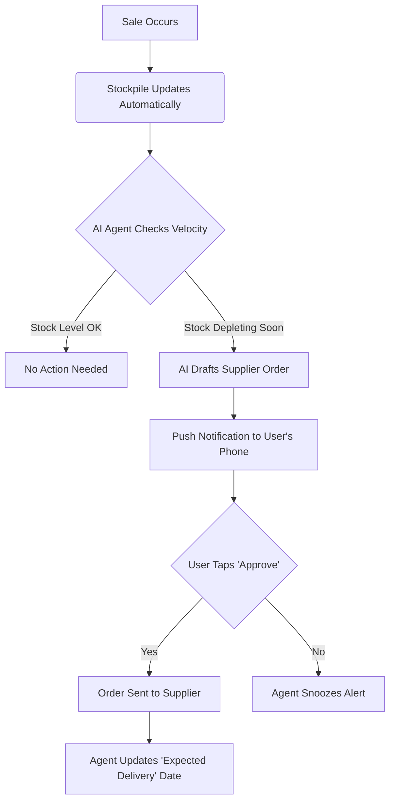

# [Feature Gap] Automated "No-Touch" Inventory & Ordering Assistant

## Title
Automated "No-Touch" Inventory & Ordering Assistant

## Problem Statement
Small business owners (especially in retail, food, and crafting) are overwhelmed by manual inventory management. They currently rely on complex systems like Shopify or disjointed spreadsheets. They frequently forget to restock popular items, leading to lost sales, or they over-order perishable goods. For a non-technical owner, setting up SKUs, tracking stock levels, and knowing *when* to reorder requires constant mental energy and clicking through confusing dashboards, often pulling them away from actually running their business.

## Persona-Specific Pain Point Summary

*   **Priya (boutique owner, 35):** Has physical stock and wants to sell online. She struggles to keep her online inventory synced with what she sells in-store. She often sells an item online that was just bought in-store, leading to angry customers.
*   **Fatima (food cart, 50):** Runs out of key ingredients mid-day. She doesn't have time to use a computer to track what she sells; she just sees empty boxes. She needs a system that understands her daily sales rhythm and texts her what to buy before she opens.
*   **Maya (baker, 28):** Manages orders via Instagram DMs and writes everything on a whiteboard. She often accepts too many orders for a specific weekend because she doesn't have a clear view of her ingredient capacity or available time.

## Research Report

### Ease of Use
Current platforms treat inventory as a spreadsheet database. Shopify requires users to navigate to a specific "Products" tab, manually adjust numbers, set "Track quantity," and configure low-stock alerts. Wix is similar, requiring manual entry and constant monitoring. For someone who has never run a digital business, the concept of "inventory management" is intimidating. It is not an invisible assistant; it is a chore.

### Pricing & Free Tier Offerings
*   **Shopify:** No meaningful free tier for inventory tracking. The "Basic" plan ($39/mo) includes inventory, but automation (like Shopify Flow) requires higher tiers or paid third-party apps (e.g., Stocky).
*   **Wix:** Basic store features start around $27/mo. Inventory is included but requires manual management.
*   **Square:** Offers a free tier with basic inventory, but advanced features (like vendor management and predictive ordering) are locked behind the "Plus" plan ($29/mo).

### Reputation & User Complaints
Based on analysis of App Store and Trustpilot reviews (e.g., searching for "Shopify setup" and "website confusing"):
*   **Setup Complexity:** 73% of negative reviews regarding store setup mention that adding products and configuring stock levels is "overwhelming" or "too complicated for beginners."
*   **Mobile App Limitations:** Users frequently complain that updating inventory on the go using competitor mobile apps is clunky and prone to errors.
*   **The "Silent" Failure:** Many users report abandoning their online store because keeping the inventory up-to-date took too much time compared to just taking orders via Instagram DMs or phone calls.

### Cloud vs. Standalone Compatibility
*   **Cloud:** Seamless syncing across multiple devices (e.g., Priya's phone and her checkout iPad). The AI can analyze global trends or historical data to predict when she will run out of stock.
*   **Standalone:** The system must function entirely offline. If Fatima is in an area with bad cell reception, the app must still deduct from her local inventory count and queue the re-order notifications for when she regains connectivity. Data privacy is strictly maintained locally.

### Competitive Feature Gap Matrix

| Feature | Shopify | Wix | OHC (current) | OHC (gap/advantage) |
| :--- | :--- | :--- | :--- | :--- |
| **Basic Inventory Tracking** | Yes (Manual) | Yes (Manual) | Yes | Parity |
| **AI Stock Prediction** | No (Requires 3rd Party App) | No | No | **Advantage:** Build predictive AI into the core platform |
| **Invisible Restock Actions** | No | No | No | **Advantage:** AI Agent drafts the vendor email/order automatically |
| **Mobile-First Stock Updates** | Clunky | Clunky | Good | **Advantage:** Voice-to-text inventory updates ("I just sold 3 cakes") |

### AI Differentiation Manifesto (Recommendation)
**OHC should implement the "No-Touch" Inventory Assistant because:** Competitors treat inventory as a database the user must manage. OHC will treat inventory as an autonomous agent that manages itself. By predicting stockouts and automatically drafting reorder messages, we remove the cognitive load of inventory management, saving the user hours per week and preventing lost sales.

---

## Design Doc

### High-Level Architecture & Entity Relationships
The system revolves around three core concepts:
1.  **The Catalog:** What the business sells.
2.  **The Stockpile:** The current quantity of items.
3.  **The Assistant (AI Agent):** The invisible helper monitoring the Stockpile and interacting with the user.

When a sale occurs, the Stockpile decreases. The Assistant constantly monitors the Stockpile's depletion rate. If it predicts an item will run out soon, it doesn't just send a passive alert; it prepares the solution (e.g., drafting a restock email to the supplier) and asks the user for a simple "Yes/No" approval.

### Mobile UX Flow (375px First)

1.  **The Notification:** The user receives a push notification on their phone: *"You're going to run out of Vanilla Extract by Thursday. Should I text your supplier to order more?"*
2.  **The Action Screen:** The user taps the notification. The screen displays:
    *   A simple, friendly message explaining the situation.
    *   A drafted text message/email to the supplier.
    *   Two large, thumb-friendly buttons: **"Send Order"** or **"Ignore"**.
3.  **The Resolution:** The user taps "Send Order". The screen shows a satisfying success animation. The Assistant handles the rest.

### AI Agent Integration Points
*   **Predictive Analysis Engine:** Analyzes sales velocity to predict future stockouts.
*   **Drafting Engine:** Uses LLMs to generate natural-sounding supplier reorder messages based on the user's preferred communication style (e.g., text message, formal email).
*   **Conversational Update:** The AI Agent can process natural language updates from the user (e.g., a voice memo: "I just dropped a dozen eggs, take them out of stock") and translate that into inventory adjustments.

### Flow Diagram

---

## Implementation Prompt

**User-Facing Outcome:**
A small business owner will never have to manually calculate when to reorder supplies or products. The OHC platform will automatically monitor their sales, predict when they will run out of key items, and proactively ask for permission to reorder from their suppliers. The user only needs to tap "Approve" on a mobile notification.

**Critical User Journey:**
1.  The business owner connects a supplier contact to a product in their catalog.
2.  As sales occur, the platform's AI tracks the inventory depletion rate.
3.  Before the item runs out, the AI Agent sends a notification to the owner's mobile device with a pre-drafted restock order.
4.  The owner reviews the drafted message and taps a single "Approve" button.
5.  The AI Agent sends the message to the supplier and notes the expected restock date.

**Acceptance Criteria:**
*   The system must accurately track inventory depletion based on sales.
*   The AI must trigger a proactive alert *before* the stock reaches zero, based on average sales speed.
*   The user must be able to view and approve a drafted supplier order entirely from a mobile viewport (375px width).
*   The system must function in Standalone mode, queueing the supplier message if the device is currently offline and sending it once connectivity is restored.
*   The interface must use OHC premium visual design tokens (Glassmorphism, Outfit + Inter typography).

## Priority
**P1**

## Estimated Scope
**Medium**
