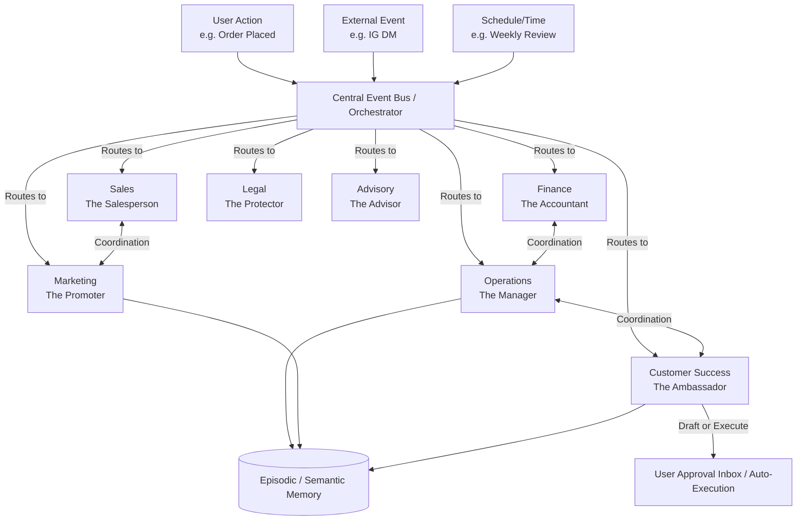

# [AI Agent Department Architecture] OHC Invisible Swarm Management

## Title
AI Agent Department Architecture: Invisible Background Operations for OHC

## Problem Statement
Small business owners (like Maya the baker or Carlos the handyman) are overwhelmed by the complexity of managing a business. They don't want to configure software or manage individual "AI Agents" or "Automations". They want a team that works for them invisibly. The current paradigm exposes too much technical complexity, such as job queues, context management, and manual agent routing. We need an architectural model that abstracts these technical concepts into universally understood "Business Departments" (Operations, Marketing, Sales, Customer Success, Finance, Legal, Advisory) that coordinate autonomously to drive business growth.

## Research Report
### Findings & Competitive Analysis
1. **Shopify / Wix / Squarespace:** They offer disparate AI features (e.g., "AI copywriter", "AI image generator"). These are tools, not team members. They require the user to act as the orchestrator.
2. **GoDaddy / Replit Agent:** Similar approach; they provide point-solutions that must be manually invoked and strung together by the user.
3. **OHC's Unfair Advantage:** True autonomy. OHC structures AI as invisible departments. A user doesn't "run a cron job to send abandoned cart emails." Instead, the "Customer Success Department" notices an abandoned cart, coordinates with "Marketing" for a discount code, and sends a friendly message.
4. **Persona Insights:**
   - *Maya (Baker):* Needs "Operations" to manage her deposit-based custom orders and "Customer Success" to reply to DMs.
   - *Fatima (Food Cart):* Needs "Operations" to notify her of pre-orders and "Marketing" to update the menu.
   - *Leo (Music Tutor):* Needs "Sales" to follow up with inactive students.

### Department Structure
- **Operations ("The Manager"):** Order and booking processing, inventory tracking, fulfillment, refunds.
- **Marketing & Advertising ("The Promoter"):** Website design, SEO, social media posts, promotional content, QR codes, link-in-bio pages.
- **Sales & Acquisition ("The Salesperson"):** Quote generation, lead follow-up, referral tracking, upsell suggestions.
- **Customer Success ("The Ambassador"):** Message replies, order updates, review requests, re-engagement campaigns.
- **Finance & Payments ("The Accountant"):** Payment processing, financial reports, subscription billing, tax summaries.
- **Legal & Compliance ("The Protector"):** Terms/policies, contracts, GDPR compliance, license tracking, liability disclaimers.
- **Business Advisory ("The Advisor"):** Weekly health reports, next-action suggestions, seasonal trends, pricing recommendations.

## Design Doc

### Architecture Diagram

### UI Wireframes / Screen Flow Description (375px first)
1. **The "My Team" Dashboard:** A simple, Glassmorphism-styled card layout. Each card represents a Department (e.g., "Customer Success", "Operations"). A glowing status indicator shows if they are "Active" or "Sleeping".
2. **Activity Feed (The Pulse):** A consolidated feed where departments post updates. E.g., "Customer Success: Sent follow-up to 3 inactive clients." with subtle animations and an Outfit/Inter typography hierarchy.
3. **Approval Inbox:** When an agent requires permission (e.g., "Marketing drafted a new Instagram post. Approve?"), it appears as a simple Tinder-style swipe interface. Swipe right to approve, swipe left to discard/edit.

### Mobile UX Flow
1. User receives a push notification: "Your Sales Agent generated a new quote for Carlos. Review?"
2. User taps notification, opening the OHC app instantly (offline-capable shell).
3. The screen displays the quote with a premium `backdrop-filter: blur(20px)` glass effect.
4. User taps a large, thumb-friendly "Approve & Send" button.
5. A smooth `@keyframes` animation confirms the action, and the user returns to the dashboard. Everything is passable by the "30-second rule."

### AI Agent Integration Points
- **Triggers:** Agents are triggered by scheduled events (e.g., end of week), real-time user actions (e.g., website update), or external webhooks (e.g., incoming payment, social media message).
- **Coordination:** The platform acts as a central switchboard. When "Operations" marks an order as fulfilled, it emits an event that "Customer Success" consumes to send a tracking link.
- **Memory:** Agents share a unified context space. When "Finance" flags a high-value customer, "Customer Success" instantly knows to prioritize their support tickets.
- **Approval Flow:** Departments have an "Auto-Execute" vs. "Draft-for-Review" mode. High-risk actions (spending money, sending contracts) default to "Draft".
- **Budgeting:** Each tenant has an AI action quota. The system enforces tenant-level budgeting invisibly, pausing low-priority tasks when nearing limits and notifying the user.

### Key Design Decisions and Why
- **Abstracted Terminology:** We use terms like "The Manager" instead of "Operations Agent Worker" so non-technical users immediately understand the value.
- **Unified Event Bus:** Prevents tightly coupled agents. Departments listen for events rather than calling each other directly.
- **Layered Approvals:** Solves the trust gap. Users start by approving every action, then gradually toggle "Auto-Execute" as they trust the AI.
- **Shared Memory:** Prevents the "amnesic agent" problem where different departments ask the user for the same information.

## Implementation Prompt
**Outcome:** Implement the internal orchestrator logic to support Department-based AI coordination and the user-facing "My Team" approval inbox.
**CUJ:**
1. Maya receives a custom cake inquiry via Instagram DM.
2. The "Customer Success" department intercepts the DM, parses the request, and queries the "Operations" department for calendar availability.
3. "Customer Success" drafts a response with a proposed date and price, but sends it to Maya's Approval Inbox instead of sending it directly.
4. Maya opens her phone, sees the draft in her Inbox, taps "Approve", and the message is sent.
**Acceptance Criteria:**
- The orchestration layer must reliably route external events to the correct AI department.
- Departments must be able to communicate via a shared context/event mechanism.
- The system must support a "Draft for Review" state that holds an action until user approval.
- The approval inbox must function seamlessly on a mobile device (375px width) adhering to the 30-second rule and OHC Visual Excellence constraints (glassmorphism, no technical jargon).

## Priority
P0

## Estimated Scope
Large
