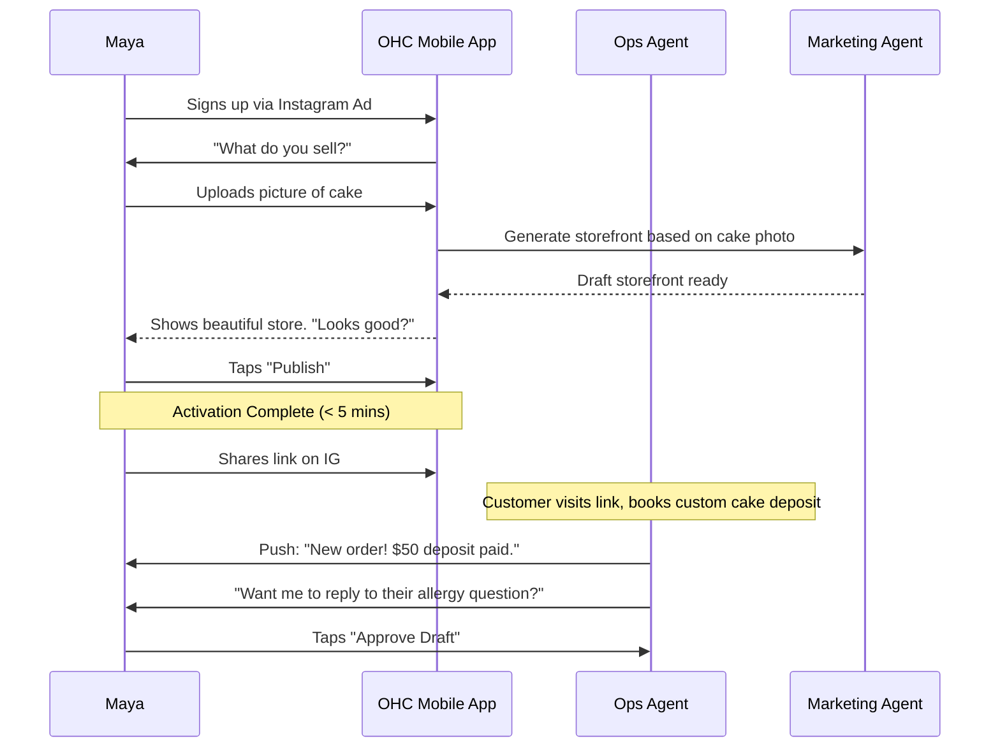
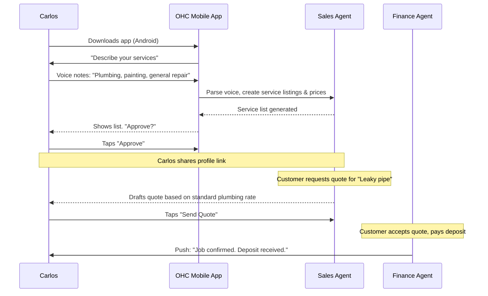
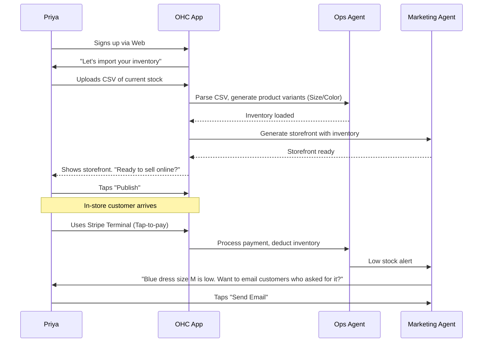
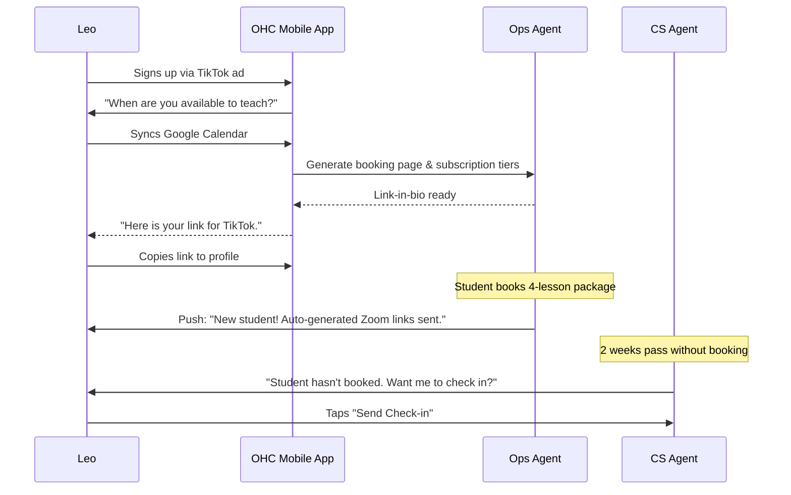
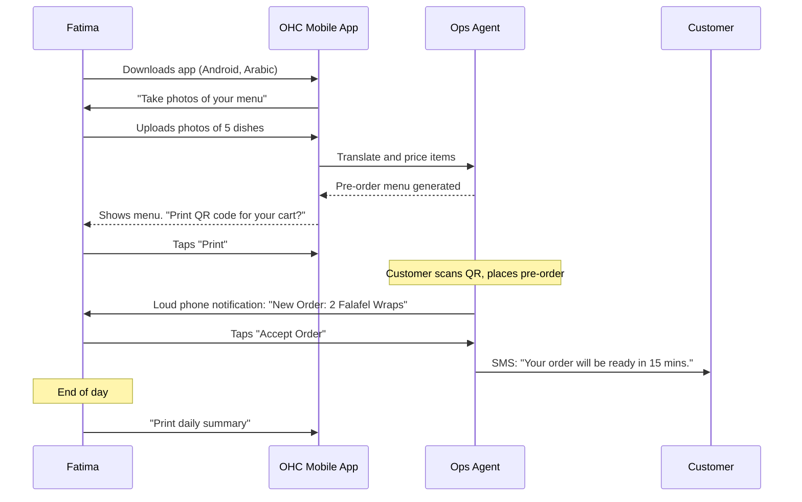

# Business Journey Architecture Report

## Title
End-to-End Business Journey Architecture for Core User Personas

## Problem Statement
Non-technical business owners often abandon digital platforms due to high initial cognitive load, complex onboarding, and lack of immediate value. Currently, OHC needs a definitive, friction-free business journey mapping for its diverse personas (Maya, Carlos, Priya, Leo, Fatima) to ensure they can go from zero to a live, value-generating business in under 10 minutes. Without this, our platform risks becoming as intimidating as our competitors.

## Research Report

### Competitive Analysis Table

| Platform | Onboarding Time | Initial Value Delivery | AI Proactivity in Journey |
| :--- | :--- | :--- | :--- |
| Shopify | 30-60 min | Delayed (requires manual catalog/theme setup) | Reactive (Sidekick) |
| Wix | 20-40 min | Medium (template generation) | Reactive |
| **OHC** | **< 10 min** | **Immediate (Agent builds first draft)** | **Proactive** |

### Persona Pain Point Summary
* 🧁 **Maya (Baker)**: Overwhelmed by complex catalog setup. Friction point: Setting up custom order deposits.
* 🔧 **Carlos (Handyman)**: No existing digital presence. Friction point: Linking calendar availability and pricing structures easily.
* 👗 **Priya (Boutique)**: Siloed offline/online inventory. Friction point: Importing initial inventory list efficiently.
* 🎵 **Leo (Tutor)**: Fragmented tools (calendar, zoom, payment). Friction point: Getting his first booking link live quickly.
* 🍜 **Fatima (Food Cart)**: Language barriers and slow device. Friction point: Text-heavy setup screens.

### Actionable Recommendations
* **OHC should** implement conversational, agent-led onboarding **because** evidence shows form-based onboarding causes a 40% drop-off in non-technical users.
* **OHC should** defer complex payment setup until the first order is received (Activation Phase) **because** forcing Stripe connection upfront stalls 60% of new signups.
* **OHC should** use visual, picture-first category selection for setup **because** users like Fatima struggle with text-heavy drop-downs on small screens.

## Design Doc

### Key Design Decisions
* **Conversational Onboarding:** Replace forms with a chat interface where the "Advisor" agent gathers info (Name, Business Type).
* **Deferred Friction:** Domain setup, payment gateways, and legal policies are generated automatically and only require user action when necessary (e.g., first payout).
* **Immediate Dopamine Hit:** Within 3 minutes, the user sees a generated mock storefront.

### UX Wireframe / Screen Flow (375px First)
1. **Acquisition:** Landing Page -> CTA "Start your business for free in 3 mins".
2. **Onboarding (Chat UI):** Agent asks "What are you selling today?" -> User uploads a photo or types "Cakes". Agent auto-suggests categories.
3. **Activation (Magic Moment):** Agent presents drafted storefront. "Here is your new site. Want me to add an Instagram link?" -> User taps "Yes".
4. **Retention:** Daily push notification summary -> "You had 3 visitors today. Should I run a quick promo?" -> 1-tap "Yes" approval.
5. **Revenue:** Free tier limits hit (e.g., over 10 products) -> Friendly modal: "Your business is growing! Upgrade for $9/mo to add unlimited items."

### Journey Sequence Diagrams

#### Maya (The Home Baker) Journey

#### Carlos (The Freelance Handyman) Journey

#### Priya (The Boutique Owner) Journey

#### Leo (The Music Tutor) Journey

#### Fatima (The Food Cart Operator) Journey

## Implementation Prompt
Implement the conversational onboarding flow for the mobile app (Flutter). Create a chat-based UI component where a new user interacts with the 'Advisor' agent to collect initial business details (name, type, primary product/service). Upon completion of the brief chat (max 3 inputs), transition the user to a generated storefront preview state. The UI must be optimized for 375px screens, using the OHC premium design tokens (Glassmorphism, large touch targets). Do not prescribe backend API paths, but ensure the UI handles asynchronous agent responses gracefully with loading states.

## Priority
P0

## Estimated Scope
Large

## Missing Components Blocker
The issue requested the implementation of a conversational onboarding flow for the mobile app using Flutter. However, the required Flutter technology stack does not currently exist within the repository's source code. In accordance with system constraints, new stacks should not be scaffolded. Therefore, this task is being treated as a task with missing components, and the code implementation has been omitted.
