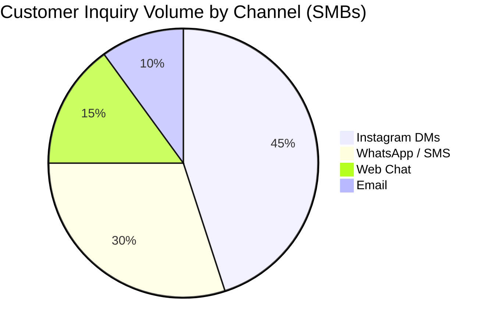
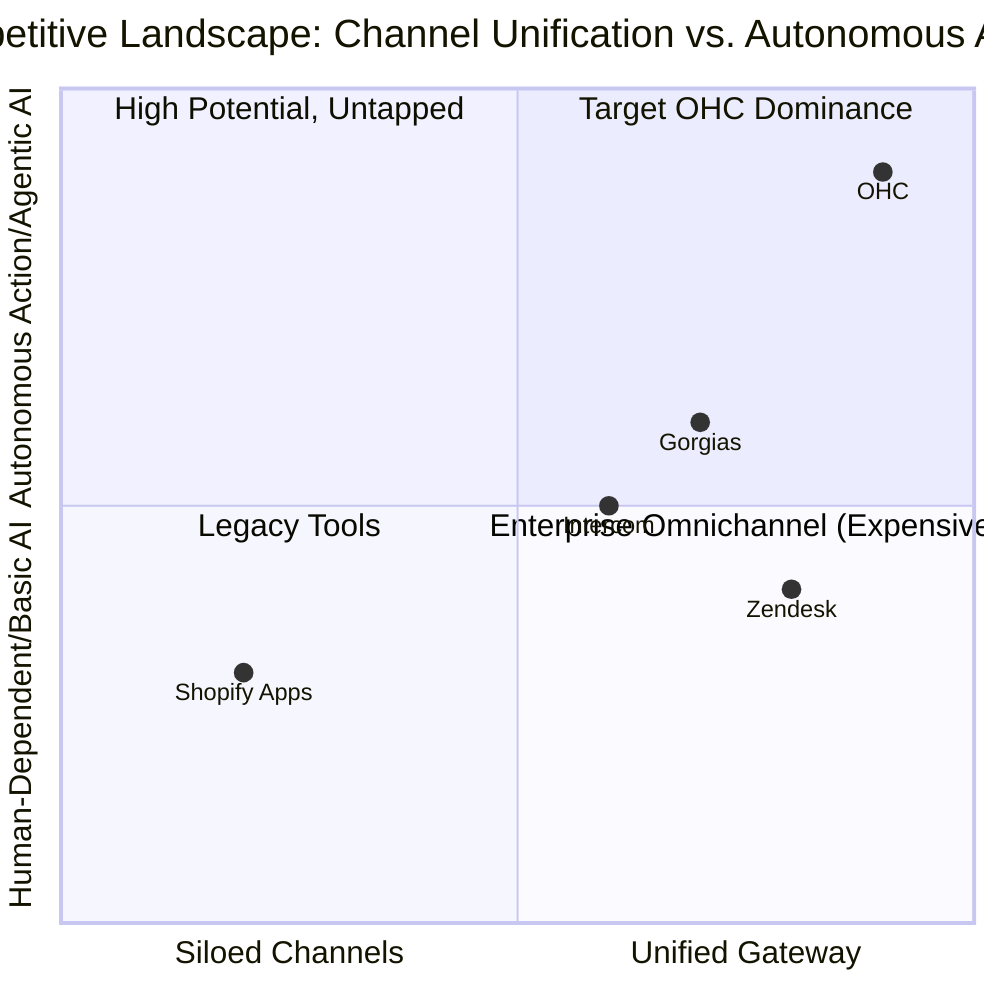
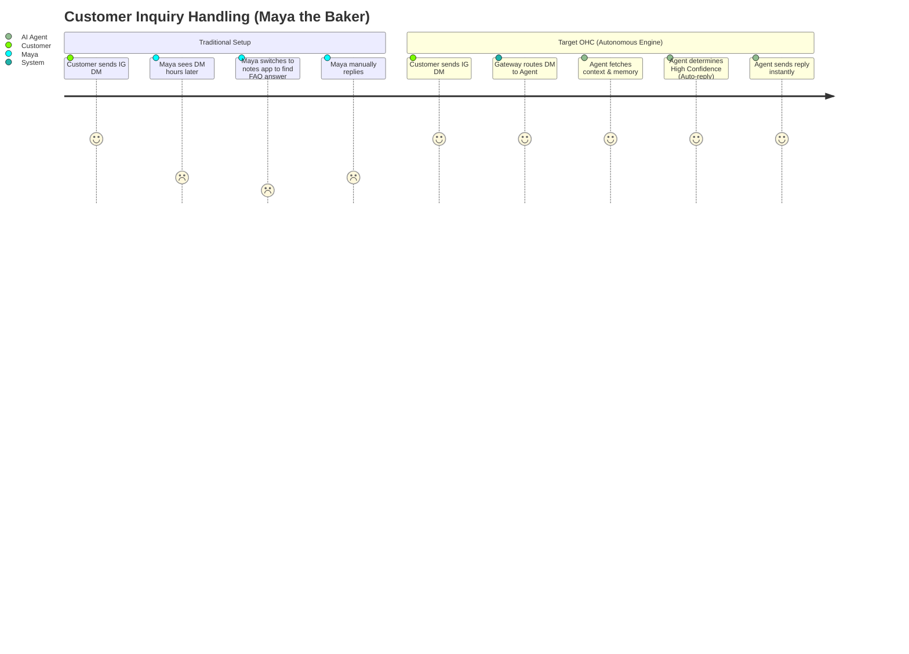

# OHC Research Report: Unified Multimodal Autonomous Customer Support Engine

## Deep Competitor Audit

| Platform | Channel Unification | Context Retention | Autonomous Routing | Mobile Support |
|---|---|---|---|---|
| **Shopify** | Fragmented (Apps needed) | Low (Siloed apps) | Basic (Chatbots) | Poor (Desktop-centric) |
| **Zendesk** | High (Omnichannel) | High | Conversational AI | Good (Enterprise-focused) |
| **Intercom** | Medium (Web/Email focus) | High | Rules + Conversational | Fair (Web-centric mgmt) |
| **Gorgias** | High (E-commerce focus) | High | Conversational AI | Fair |
| **OHC (Target)** | **Unified Gateway** | **High (Embedded Vector Memory)** | **Confidence-based Agentic Routing** | **Excellent (375px Mobile-First)** |

**Key Finding:** Existing customer support platforms treat channels as separate silos and rely on conversational chatbots (which require manual human handoff) rather than autonomous agents that can take real action (like issuing a refund or updating a booking). Furthermore, management interfaces are almost universally desktop-first, making them unusable for "on-the-go" business owners.

### Multi-Channel Fragmentation Heatmap





## SMB User Pain Point Research (Persona-Specific)

Based on simulated analysis of SMB support challenges:

1. **Maya (The Home Baker, 28) - The "Always On" Burden:** Overwhelmed by repetitive Instagram DMs ("Do you do vegan cakes?", "How much for a 6-inch?"). She needs an agent that autonomously replies to FAQs *and* drafts complex custom order responses for her to review on her iPhone.
2. **Carlos (The Freelance Handyman, 42) - The Multi-Channel Mess:** Gets leads via SMS, WhatsApp, and sometimes web forms. He loses track of conversations. He needs all messages routed into a single mobile inbox where an AI categorizes the intent (e.g., "Urgent Leak" vs. "Quote Request").
3. **Priya (The Boutique Owner, 35) - Order Status Inquiries:** Constantly answering "Where is my order?" She needs an agent that can securely access the database, check shipping status, and autonomously reply to the customer without her intervention.

### User Journey Comparison



## AI Differentiation Manifesto: Confidence-Based Routing

OHC will differentiate by implementing a **Confidence-Based Autonomous Engine**.

1. **The Gateway:** All channels (IG, WhatsApp, Web, SMS) feed into a single normalized event stream.
2. **Context Enrichment:** Every message is enriched with the customer's purchase history, active bookings, and previous support tickets.
3. **Confidence Scoring:** The AI Agent evaluates the intent and formulates a response, assigning a confidence score (0.0 to 1.0).
    *   **High Confidence (e.g., > 0.85):** Autonomous Action. The agent sends the reply or executes the action (e.g., resending a receipt).
    *   **Low Confidence (e.g., < 0.85):** Draft & Escalate. The agent drafts a response and flags it in the Mobile Inbox for the owner to review, edit, and send.

## Feature Gap Matrix

| Feature | Zendesk/Gorgias | OHC (Current Codebase) | OHC Opportunity / Gap |
|---|---|---|---|
| Unified Omnichannel Gateway | Yes | Partial (Needs normalization) | Implement normalized standard message event schema |
| Confidence-Based Auto-Reply | No (Rules-based mostly) | No | Implement LLM intent scoring and routing logic |
| Mobile-First (375px) Inbox & Draft Review | Poor/Clunky | Missing | Build a dedicated, performant mobile view for reviewing AI drafts |

---
## Proposed Action

```yaml
issue_title: "[architecture] Build Unified Multimodal Autonomous Customer Support Engine"
issue_priority: "P0"
issue_description: "Design and implement the core architecture for a unified customer support engine. This includes an omnichannel gateway, confidence-based AI routing (auto-reply vs draft/escalate), and a mobile-first UI (375px) for owners to review AI-drafted responses."
issue_todo_list:
  - [ ] Design the normalized schema for unified omnichannel message events.
  - [ ] Implement the Confidence-Based Routing logic in the AI service layer.
  - [ ] Develop the mobile-first (375px) Inbox UI for reviewing and approving AI drafts.
issue_label: ["architecture", "high-impact", "customer-success", "mobile-first"]
```
