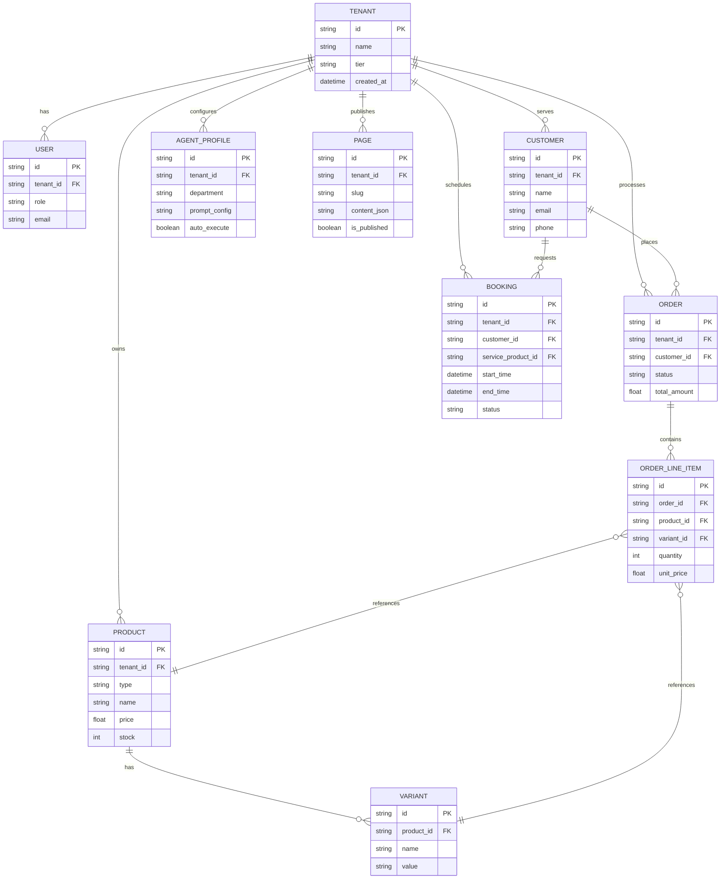

# [architecture] Data Model Architecture

## Title
Data Model Architecture: Entities, Relationships, and Multi-Tenancy

## Problem Statement
The OneHumanCorp (OHC) platform needs a unified and robust Data Model Architecture to power the end-to-end user journeys for zero-technical-knowledge small business owners. Currently, there is a lack of a consolidated design doc that clearly defines the core entity types (business, product, order, customer, agent, page, booking, etc.), their relationships, and how they seamlessly support both Cloud-Native PostgreSQL multi-tenancy and Standalone Desktop SQLite modes. We must establish a strong architectural foundation that guarantees data isolation (per-tenant) and provides optimized access patterns for both AI Agents and mobile clients. The goal is a highly flexible, yet secure data layer that natively supports OHC's various business type templates (e.g., Physical Products, Services, Portfolios) without manual database schema changes by the user.

## Research Report
- **Goal**: Design a comprehensive Data Model Architecture that scales from a local desktop instance to a multi-tenant cloud while maintaining strict row-level security and fast querying capabilities.
- **Core Entities Identified**:
  - `Tenant` (Business)
  - `User` (Business Owner / Staff)
  - `Product` (Physical/Digital items, Services, Subscriptions)
  - `Variant` (Size, Color)
  - `Order` / `Booking`
  - `Customer`
  - `AgentProfile` (Config for AI Departments)
  - `Page` (Website/Storefront content)
- **Relationships**:
  - A `Tenant` has many `Products`, `Orders`, `Customers`, `Pages`, and `AgentProfiles`.
  - An `Order` belongs to a `Tenant` and a `Customer`, and contains `OrderLineItems` mapping to `Products`/`Variants`.
  - A `Booking` is a specialized form of `Order` linked to a time slot and service `Product`.
- **Multi-Tenancy & Isolation**:
  - **Cloud Mode (PostgreSQL)**: Every table must include a `tenant_id` column. PostgreSQL Row-Level Security (RLS) policies will enforce isolation, ensuring `tenant_id = current_setting('app.current_tenant')`.
  - **Standalone Mode (SQLite)**: SQLite lacks RLS, so isolation is enforced at the application layer via the data access (repository) interfaces, ensuring `tenant_id` is always scoped to the local instance's owner.
- **Access Patterns**:
  - AI Agents: Heavily query `Customer` history and `Order` status to construct memory context. Requires fast, indexed lookups by `tenant_id` and `customer_id`.
  - Mobile App: Needs real-time/optimistic updates on `Orders` and `Bookings` (leveraging Teammate Mesh).
- **Competitive Advantage**: Unlike Shopify or Wix, OHC's data model inherently integrates AI `AgentProfile` configurations directly into the tenant's relational graph, allowing agents to natively understand product inventory and customer context without external syncs.

## Design Doc

### Entity-Relationship Diagram

### Key Invariants
1. **Absolute Tenant Isolation**: A business owner (user) authenticated within a tenant context can *only* read and write records where `record.tenant_id == current_tenant.id`. This is the most critical invariant and must never be bypassed in application code.
2. **Unified Product Types**: `Products` and `Services` share the same core entity structure, differentiated by a `type` field. A `Booking` is effectively an `Order` for a service `Product` with time bounds.
3. **Agent Visibility**: AI Agents operating on behalf of a tenant assume that tenant's identity and are subject to the same `tenant_id` data visibility constraints as human users.
4. **Data Sync**: Standalone instances use local SQLite databases; when cloud-bursting or syncing via MCP, the `tenant_id` ensures data maps correctly into the multi-tenant PostgreSQL cluster.

### Migration Strategy
- Use Goose for schema migrations.
- Define identical schema definitions for both PostgreSQL and SQLite where possible, abstracting dialect-specific features (like vector indexes) behind provider interfaces.
- Ensure every new table creation script explicitly includes the `tenant_id` column.

## Implementation Prompt
"Implement the foundational Data Access Layer (Repositories) for the core OHC Data Model defined in the architecture. You need to create interfaces and implementations (for both PostgreSQL and SQLite) for `Tenant`, `Product`, `Customer`, `Order`, and `Booking` entities.
Ensure that every repository method accepts an `orgID` (tenant ID) and strictly scopes all queries (SELECT, UPDATE, DELETE) to that ID.
Do not prescribe the exact SQL DDL here; focus on the Go interfaces, struct definitions, and the row-level isolation logic in the data access methods. Write unit tests that confirm cross-tenant data leakage is impossible when using these repository methods."

## Priority
P0

## Estimated Scope
Medium
