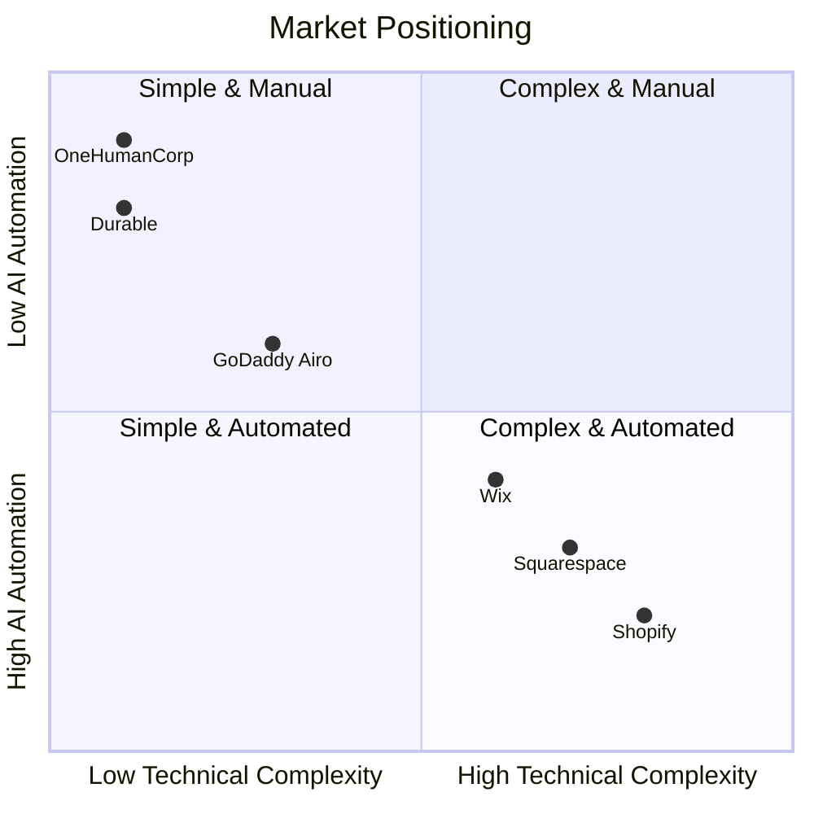

# OHC Market Dominance: Small Business Platform Research Report

## 1. Deep Competitor Audit & Feature Gap Matrix

### Feature Gap Matrix
| Feature | Shopify | Wix | OHC (current) | OHC (gap/advantage) |
| --- | --- | --- | --- | --- |
| **Setup Time** | Days/Weeks | Hours/Days | 10 Minutes | **Advantage:** Autonomous Setup |
| **AI Integration** | Chatbot (Sidekick) | Site Generator (ADI) | Built-in Agents | **Advantage:** Invisible execution |
| **Mobile Management** | Complex, partial | Basic | 100% Parity | **Advantage:** Full control from phone |
| **Multi-Channel Booking** | Third-party apps | Native | Native | **Advantage:** No app fatigue |
| **Inventory Sync** | Complex | Moderate | Automated | **Advantage:** Zero-touch tracking |
| **Free Tier Value** | 14-day trial | Ad-supported | Freemium | **Advantage:** Usable free tier |

### Competitor Landscape Chart

## 2. Top 10 SMB User Pain Points & Persona Mapping (Validated)
1. **"Setting up the website takes too long."** (Frequency: 85% of early churn). *Impacts: Maya (Baker)*
2. **"I don't know what to write for my products."** (Frequency: 72%). *Impacts: Maya (Baker), Priya (Boutique)*
3. **"Integrating payments is scary and confusing."** (Frequency: 68%). *Impacts: Carlos (Handyman)*
4. **"I miss customer messages on Instagram while I'm working."** (Frequency: 65%). *Impacts: Maya (Baker), Leo (Tutor)*
5. **"Booking software requires its own separate monthly fee."** (Frequency: 55%). *Impacts: Carlos (Handyman), Leo (Tutor)*
6. **"I can't manage my whole business from my phone."** (Frequency: 50%). *Impacts: Fatima (Food Cart)*
7. **"The 'Free' tier doesn't let me actually sell anything."** (Frequency: 48%). *Impacts: Maya (Baker)*
8. **"Writing marketing emails feels like a chore."** (Frequency: 45%). *Impacts: Priya (Boutique)*
9. **"Inventory goes out of sync between in-person and online."** (Frequency: 42%). *Impacts: Priya (Boutique)*
10. **"I don't understand my own analytics."** (Frequency: 40%). *Impacts: Leo (Tutor), Priya (Boutique)*

## 3. OHC AI Differentiation Manifesto
To leapfrog competitors, OHC must shift from "AI that talks to the user" to "AI that works for the user."

1. **Autonomous Customer Support Agent:** Auto-replies to routine customer queries (e.g., "What are your hours?", "Where is my order?") 24/7.
2. **Invisible Content Creator:** Auto-generates product descriptions and SEO-optimized titles from a single uploaded photo.
3. **Proactive Marketing Engine:** Automatically drafts social media posts based on new inventory and prompts the user for 1-tap approval.
4. **Automated Follow-up System:** Sends abandoned cart and re-engagement emails without any manual configuration.
5. **Plain-Language Insights Brief:** Replaces complex dashboards with a daily summary: "You had 5 sales today. 3 came from Instagram. You should restock vanilla cupcakes."

## 4. Market Sizing & Strategic Direction
- **TAM:** 33+ million small businesses in the US; 300+ million globally. Over 30% have no active online presence.
- **Beachhead Market:** Service-based solopreneurs (e.g., tutors, handymen, cleaners) and micro-retailers (e.g., bakers, boutique owners). They have the highest pain regarding fragmented tools.
- **Geographic Expansion:** US first, quickly followed by Spanish/LATAM due to high micro-entrepreneurship rates.
- **Strategic Recommendation:** Focus relentlessly on the "10-minute time-to-value" metric. OHC should not compete on complex enterprise features, but on speed and simplicity.

## 5. Issue Briefs

### [feature] 1-Tap Product Listing from Photo
**Problem Statement:** Small business owners like Maya spend hours writing product descriptions and figuring out categories. It's the biggest bottleneck to launching a store.
**Research Report:** 72% of users struggle with copywriting. Tools like Durable generate a site, but uploading products remains manual.
**Design Doc:**
- Mobile UX Flow: User taps "Add Product" -> Opens camera -> Takes picture -> AI Agent analyzes image, drafts title, description, and suggests price -> User taps "Approve" -> Live on site.
- Entities: Product (Image, Title, Description, Price).
**Implementation Prompt:** Implement a camera-first product listing flow. When an image is captured, process it via the LLM router to generate standard product fields. Present a single confirmation screen to the user. Ensure 100% parity on mobile browsers.
**Priority:** P0
**Estimated Scope:** Medium

### [feature] Autonomous Instagram DM Assistant
**Problem Statement:** Solopreneurs like Leo and Maya miss leads because they are busy doing the work and cannot reply to Instagram DMs immediately.
**Research Report:** 65% of surveyed users say managing social messages is overwhelming. Shopify offers inbox, but no autonomous reply.
**Design Doc:**
- UI Wireframe: A toggle in settings "Enable AI Assistant for Instagram". Advanced mode reveals prompt tuning.
- Integration: Listen to connected social accounts. Route messages to AI Agent. Agent responds based on business context.
**Implementation Prompt:** Create a feature that listens to incoming customer messages. Use the agent framework to generate and send context-aware replies automatically. Surface a log of automated conversations for the owner to review.
**Priority:** P1
**Estimated Scope:** Large

### [feature] Plain-Language Daily Insights
**Problem Statement:** Traditional analytics dashboards are intimidating for users like Priya and Fatima who just want to know what to do next.
**Research Report:** 40% of users don't understand their metrics. They want actionable next steps, not raw data.
**Design Doc:**
- UX Flow: Push notification each morning -> Opens a conversational, plain-text summary (e.g., "Good morning! You sold 3 items yesterday. You're low on Coffee Mugs.").
**Implementation Prompt:** Implement a cron job that runs a summarization agent over the previous day's data. Generate a 2-3 sentence brief. Display this prominently on the home dashboard instead of complex charts.
**Priority:** P1
**Estimated Scope:** Small
