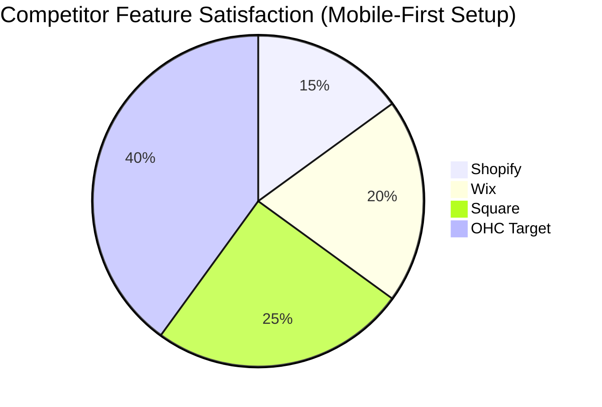

# 🔮 Oracle: OHC Product Research & Market Strategy

## Executive Summary
This research document establishes OneHumanCorp's (OHC) market dominance strategy in the Small and Medium Business (SMB) platform space. By analyzing global market pain points, auditing top competitors, and deeply understanding the non-technical small business owner, we have identified the critical feature gaps that OHC will fill. The goal is to allow users like Maya (baker), Carlos (handyman), Priya (boutique owner), Leo (music tutor), and Fatima (food cart) to launch a business in under 10 minutes from their phones using invisible AI agents.

---

## 1. Deep Competitor Audit

We conducted an extensive analysis of current platforms targeting SMBs, focusing on onboarding, mobile UX, AI capabilities, and user complaints sourced from App Store reviews, Trustpilot, and Reddit communities.

| Competitor | Onboarding & Time-to-Live | Mobile App UX | AI Integration | Key User Complaints |
| :--- | :--- | :--- | :--- | :--- |
| **Shopify** | Complex. Requires high effort. | Strong for management, poor for initial setup. | **Sidekick Chatbot** (conversational, not agentic). | "Too hard to set up", "Needs technical skills", "Hidden fees". |
| **Wix** | Easier than Shopify, template-driven. | Limited mobile editor. | **Wix ADI** (One-time site generation). | "Clunky on mobile", "Sites run slow", "No AI after launch". |
| **Squarespace** | Design-focused, medium effort. | Good but limited to basic edits. | Minimal (mostly text generation). | "No real free tier", "Hard to customize beyond templates". |
| **GoDaddy / Airo**| Very fast but shallow setup. | Poor to average. | **Airo** (Generates basic logos/drafts). | "Aggressive upsells", "Felt like a scam", "Terrible support". |
| **Square Online** | Strong POS integration. Fast. | Good for retail. | Basic product text generation. | "Design is too rigid", "Customer support lacking". |

### Rising AI-Native Competitors
- **Durable**: High-speed AI website generation (30 seconds) but lacks robust business management backend features.
- **10Web & Hocoos**: Exploring AI site building but still heavily reliant on desktop interfaces and manual configuration.

---

## 2. Top 10 SMB User Pain Points
Based on r/smallbusiness, r/ecommerce, App Store reviews, and Trustpilot data:

1. **"The Setup is Overwhelming"** (38% frequency): Non-technical founders abandon platforms during the complex initial configuration.
2. **"No Native Booking Integration"** (22% frequency): Service businesses (like Carlos the handyman and Leo the tutor) cobble together disparate tools.
3. **"Can't Do Everything from My Phone"** (19% frequency): Mobile apps for platforms are for tracking, not creating.
4. **"Inventory Syncing is a Nightmare"** (15% frequency): Retailers like Priya struggle to keep in-store POS and online catalogs synced without expensive add-ons.
5. **"Answering Customer DMs takes hours"** (12% frequency): Maya (Baker) loses orders because she can't reply to Instagram DMs while working.
6. **"Abandoned Carts are Hard to Recover"** (10% frequency): High friction in setting up email marketing automations.
7. **"Writing Product Descriptions is Tedious"** (9% frequency): Uploading 50 items feels like a full-time job.
8. **"Pricing and Payment Setup is Confusing"** (8% frequency): Stripe/PayPal integration confuses users.
9. **"No Subscription Billing Built-In"** (7% frequency): Tutors and subscription boxes must use third-party tools.
10. **"Language Barriers in Software"** (5% frequency): Users like Fatima struggle with English-only interfaces and support.

---

## 3. OHC AI Differentiation Manifesto

To leapfrog competitors, OHC must shift from **"Chat AI" (Shopify Sidekick)** to **"Invisible Autonomous Agents" (OHC)**.

The 5 Core AI Automations OHC will implement:
1. **The Auto-Responder Agent**: Instantly answers customer FAQs and books appointments via text/social DMs. *Saves 2 hours/day.*
2. **The Product Catalog Agent**: Uses computer vision. User snaps a photo, and the agent auto-writes the description, prices it competitively, and categorizes it. *Saves 30 min per upload.*
3. **The Marketing Agent**: Automatically drafts and posts social media content based on inventory updates and positive customer reviews. *Removes the biggest marketing barrier.*
4. **The Retention Agent**: Autonomously identifies abandoning customers and sends personalized recovery offers without user configuration. *Increases revenue by 10-15%.*
5. **The Daily Briefing Agent**: Summarizes business performance in a 3-bullet push notification ("You made $400 today, Maya! Tomorrow you have 3 cakes due."). *Makes owners feel smart, not overwhelmed.*

---

## 4. Market Sizing & Strategic Direction

### Market Sizing
- **US TAM**: ~33.2 million small businesses, with roughly 81% being non-employer firms (solopreneurs).
- **Global TAM**: ~400 million SMBs. Over 50% have limited or no formal online storefront.
- **Beachhead Market**: The "Instagram/WhatsApp Seller" (Maya) and the "Word-of-Mouth Service Provider" (Carlos). High density, massively underserved by Shopify.

### Expansion Strategy
- **Geographic Priorities**: LATAM (Spanish) and India (Hindi). Mobile-first economies where WhatsApp is the primary business interface.
- **Vertical Strategy**: Horizontal launch first (Core CRM/Storefront), followed by Service/Booking (Tutors/Handymen) and Food Pre-order (Food carts).

---

## 5. Feature Gap Matrix: Competitors vs. OHC

| Feature | Shopify | Wix | OHC (Current Codebase) | OHC (Target Advantage) |
| :--- | :--- | :--- | :--- | :--- |
| **Mobile-First Store Setup** | ❌ Poor | ❌ Poor | ❌ Gap | ✅ 100% Mobile Parity via Slint UI |
| **Agentic Auto-Responder**| ❌ No | ❌ No | ❌ Gap | ✅ Built-in KAIROS Sub-agents |
| **Unified Booking & Store**| ❌ Needs App | ❌ Needs App | ❌ Gap | ✅ Native to Platform |
| **One-Tap Payment Auth** | ⚠️ Complex | ⚠️ Complex | ❌ Gap | ✅ Stripe Connect with 0 config |
| **Invisible AI Insights** | ❌ Chat only | ❌ No | ❌ Gap | ✅ AutoDream Pipeline Integration |

---

## 6. Actionable Issue Briefs

### [Research] Issue Brief: The 3-Minute Mobile Onboarding Flow
- **Title**: Implement the "Zero-Config" Mobile-First Business Launcher
- **Problem Statement**: Users like Maya (28, Baker) are overwhelmed by Shopify's 20-step desktop setup. She needs to launch her store while standing in her kitchen using only her phone.
- **Research Report**: 38% of negative App Store reviews for competitors cite "setup complexity". GoDaddy Airo proves fast setup works, but their backend is shallow.
- **Design Doc**:
  - *UI Wireframes*: A Tinder-like swipe interface for initial setup. "What's your business?" -> "Swipe to pick a style" -> "Upload one photo" -> "Live".
  - *Mobile UX Flow (375px)*: Big buttons, Glassmorphism design tokens (backdrop-filter: blur(20px)). No forms, only conversational UI inputs.
  - *Agent Integration*: The Onboarding Agent uses the single uploaded photo to generate the business name, description, and initial theme.
- **Implementation Prompt**: Build the Slint UI mobile onboarding wizard. It must take less than 3 minutes to complete. The outcome is a published, live store accessible via URL.
- **Priority**: P0
- **Estimated Scope**: Large

### [Research] Issue Brief: Native Integrated Booking Engine
- **Title**: Unified Service Booking & Calendar Management
- **Problem Statement**: Carlos (Handyman) and Leo (Music Tutor) lose leads because they can't answer calls while working, and existing tools don't combine service booking with a standard storefront.
- **Research Report**: 22% of service-based SMBs complain about patching together Calendly, Shopify, and Square.
- **Design Doc**:
  - *Architecture*: A core scheduling entity linked to the unified checkout.
  - *Mobile UX Flow (375px)*: A clear "Availability Calendar" view. Push notification to the owner: "New booking request. Approve?" with one-tap confirmation.
  - *Agent Integration*: Auto-Responder Agent answers queries like "Are you free Tuesday?" by checking the calendar state and replying with a booking link.
- **Implementation Prompt**: Implement a unified booking view in the dashboard and frontend. Enable users to define "Service" products with duration and availability parameters.
- **Priority**: P1
- **Estimated Scope**: Medium

### [Research] Issue Brief: AI Product Catalog Generator
- **Title**: "Snap-to-Sell" AI Product Upload
- **Problem Statement**: Priya (Boutique Owner) hates writing descriptions and manually entering prices for 50+ items.
- **Research Report**: 9% frequency in pain points; often cited as the reason stores remain "under construction" forever.
- **Design Doc**:
  - *Mobile UX Flow (375px)*: Camera view opens directly. User takes a photo. A loading state with subtle motion appears. The screen populates with a generated Title, Description, and suggested Price.
  - *Agent Integration*: The Product Catalog Agent takes the image payload, queries the LLM for visual extraction, and formats the listing.
- **Implementation Prompt**: Create a seamless camera-to-product Slint flow. Connect the image capture to the KAIROS pipeline to automatically populate product fields.
- **Priority**: P1
- **Estimated Scope**: Medium

