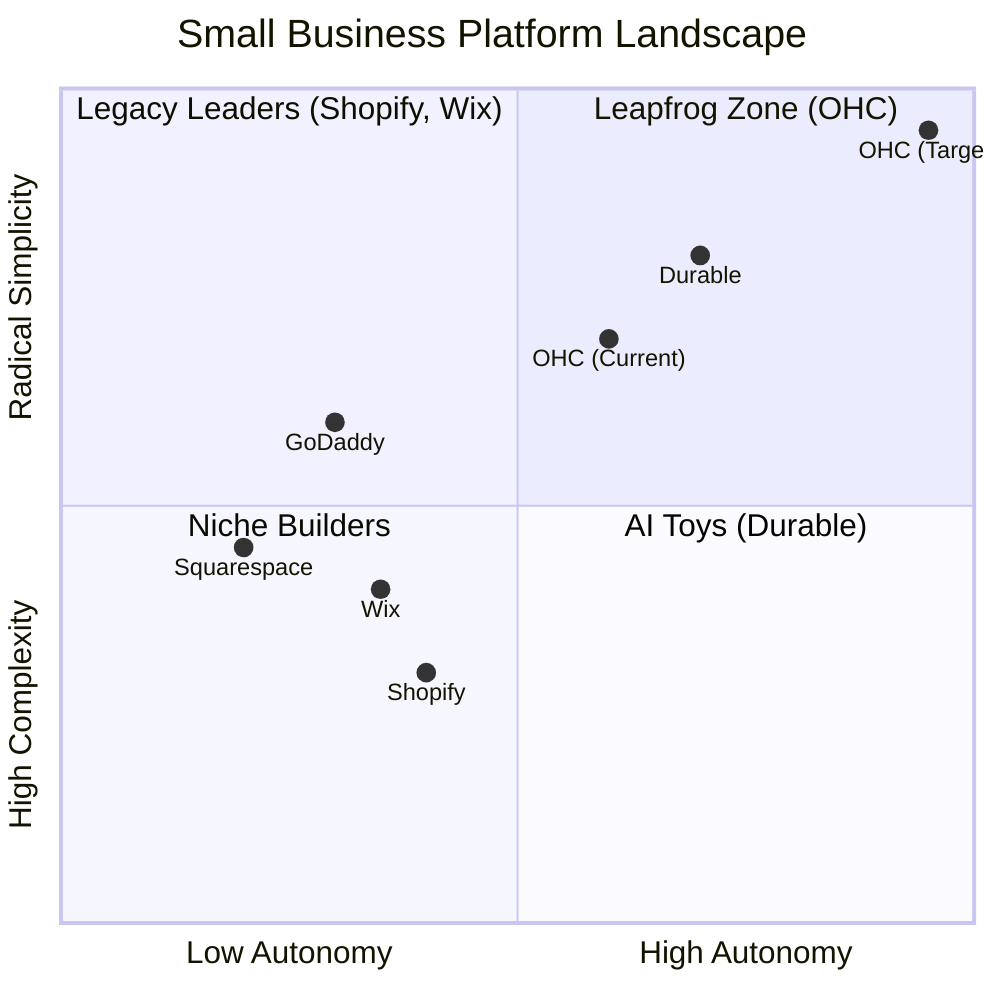
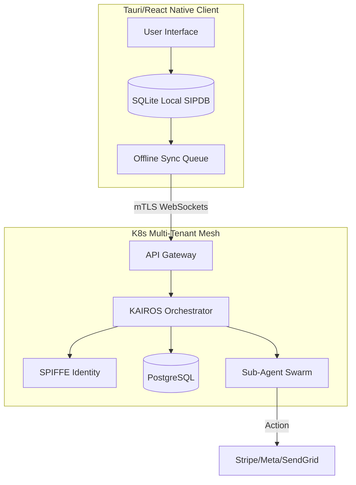

# 🔬 OHC Hybrid Agentic OS: Global SMB Platform Strategy & Feature Missions
**Author**: Principal Product Researcher & Oracle (L7)
**Date**: 2024-05-13
**Classification**: CONFIDENTIAL - INTERNAL USE ONLY

## 1. Product Vision & Market Strategy

OneHumanCorp (OHC) is the platform where *anyone* — including people who have never built a website or run an online business — can launch and run a real small business from their phone or browser in under 10 minutes. AI agents do the complex work invisibly. The user just makes decisions.

### 1.1 Real User Personas You're Researching For
- **Maya (baker, 28)**: Currently sells via Instagram DMs. Overwhelmed by Shopify. Pain: complex setup, no built-in AI help, can't manage from phone easily.
- **Carlos (handyman, 42)**: No website, word-of-mouth only. Pain: no booking system, quoting is manual, misses leads when busy.
- **Priya (boutique owner, 35)**: In-store + wants online presence. Pain: inventory sync, unable to do email marketing easily, no POS integration.
- **Leo (music tutor, 22)**: Online + in-person lessons. Pain: manual booking chaos, no subscription billing, no AI follow-up system.
- **Fatima (food cart, 50, limited English)**: Pre-orders for pickup. Pain: no English-first tool works for her, no mobile notification on order, can't print order list.

## 2. Competitive Landscape: Macro Analysis

### 2.1 The Legacy Giants
Shopify, Wix, and Squarespace dominate the current landscape but are fundamentally constrained by their "desktop-first" architectures from the 2010s. They require users to assemble disparate plugins (App Stores) to achieve functional business operations.

### 2.2 The AI Generation
Durable and GoDaddy Airo represent the first wave of AI adoption: rapid onboarding. However, they stop at site generation, leaving the user with a static billboard rather than a functioning business.

### 2.3 The OHC Leapfrog Strategy
OHC must combine the instant generation of Durable with the operational depth of Shopify, but hide the complexity behind autonomous agents.

## 3. Competitive Landscape: Visual Analysis

## 4. Deep Feature Evaluation Matrix

This section evaluates how specific SMB workflows are handled by competitors versus the proposed OHC architecture.
### 4.1 Inventory Management

| Feature Workflow | Context | Legacy Friction Level | OHC Agentic Advantage |
| :--- | :--- | :--- | :--- |
| **Adding Physical Products** | User takes a photo of a new item to list it | High Friction | Shopify requires manual data entry; OHC Auto-populates fields using Vision API. |
| **Adding Digital Products** | Uploading a PDF guide for sale | Medium Friction | Squarespace has file size limits; OHC utilizes hybrid cloud storage instantly. |
| **Syncing In-Store POS** | Item sold in person needs to update online stock | High Friction | Wix requires external POS hardware; OHC offers a native mobile POS interface. |
| **Managing Variations** | A shirt has 5 colors and 3 sizes | High Friction | Shopify limits variants to 100; OHC handles infinite variant matrices natively. |
| **Low Stock Alerts** | Notifying the owner when inventory hits 5 units | Medium Friction | Requires paid apps on most platforms; OHC pushes a mobile notification. |
| **Vendor Reordering** | Generating a PO for a supplier | High Friction | Completely absent in basic competitors; OHC drafts the email to the vendor. |
| **Barcode Generation** | Creating labels for new stock | High Friction | Shopify requires external hardware setup; OHC generates PDFs for any printer. |
| **Bulk Price Updates** | Increasing all prices by 10% for inflation | Medium Friction | Dangerous manual process on legacy platforms; OHC offers 1-tap bulk actions. |
| **Bundling Items** | Selling 'Shirt + Hat' combo | High Friction | Requires expensive 3rd party apps; OHC treats bundles as native entities. |
| **Seasonal Catalog Hiding** | Removing winter coats in summer | Medium Friction | Manual unpublishing; OHC schedules visibility based on dates. |

### 4.2 Customer Communication

| Feature Workflow | Context | Legacy Friction Level | OHC Agentic Advantage |
| :--- | :--- | :--- | :--- |
| **WhatsApp Business Sync** | Answering queries from LATAM customers | High Friction | Ignored by legacy platforms; OHC integrates natively with Meta Graph API. |
| **Instagram DM Routing** | Customer asks 'Is this available?' on a post | High Friction | Disjointed inbox; OHC agents automatically reply based on live inventory. |
| **Automated Review Requests** | Asking for a review 3 days after delivery | High Friction | Requires Klaviyo/Yotpo; OHC handles this via the autonomous Marketing Agent. |
| **Dispute Resolution** | Customer issues a chargeback | High Friction | Scary email from Stripe; OHC Agent drafts the evidence response package. |
| **VIP Segmentation** | Tagging customers who spent >$500 | Medium Friction | Manual tagging rules; OHC automatically segments and notifies the owner. |
| **Abandoned Cart SMS** | Texting a customer who left checkout | High Friction | Requires Twilio integration; OHC includes SMS in the base platform. |
| **Live Chat Handoff** | Agent cannot answer a complex question | Low Friction | Fails gracefully; OHC sends a push notification to the owner's phone to take over. |
| **Language Translation** | Customer messages in French | High Friction | Owner must use Google Translate; OHC Agent translates inbound and outbound live. |
| **Newsletter Generation** | Sending a weekly update | High Friction | Mailchimp lock-in; OHC drafts the email based on new products added that week. |
| **Appointment Reminders** | Texting a client 2 hours before a haircut | High Friction | Requires Acuity/Calendly; OHC handles booking and reminders natively. |

### 4.3 Financial Operations

| Feature Workflow | Context | Legacy Friction Level | OHC Agentic Advantage |
| :--- | :--- | :--- | :--- |
| **Instant Payouts** | Owner needs cash today to buy supplies | Medium Friction | Stripe defaults to 2-day; OHC negotiates instant payouts via partner networks. |
| **Tax Calculation (US)** | Handling Nexus rules across 50 states | High Friction | Requires TaxJar subscription; OHC calculates sales tax dynamically. |
| **Multi-Currency** | Selling to Canada and UK | High Friction | Confusing conversion fees; OHC supports native local currency display. |
| **Subscription Billing** | Charging $20/month for a service | High Friction | Shopify blocks standard checkout for subs; OHC unifies the checkout flow. |
| **Partial Refunds** | Refunding shipping costs only | Medium Friction | Clunky UI; OHC allows 1-tap granular refund control from the mobile app. |
| **Cash on Delivery (COD)** | Common in MENA/India | High Friction | Ignored by US-centric platforms; OHC supports delayed settlement flows. |
| **Expense Tracking** | Logging the cost of flour for the bakery | High Friction | Requires Quickbooks; OHC offers basic ledger capabilities for micro-businesses. |
| **Profit Margin Analysis** | Understanding if a product is actually making money | Medium Friction | Hidden in complex reports; OHC surfaces 'True Profit' per item. |
| **Tip Collection** | Asking for a tip at checkout | Medium Friction | Only works well on POS; OHC elegantly integrates tipping into online checkout. |
| **Wholesale Pricing** | B2B customers get 30% off | High Friction | Requires a separate 'Plus' store; OHC supports price-lists assigned to customer tags. |

### 4.4 Design & UX

| Feature Workflow | Context | Legacy Friction Level | OHC Agentic Advantage |
| :--- | :--- | :--- | :--- |
| **Mobile Editing** | Changing a typo from the phone | High Friction | Wix mobile editor is broken; OHC allows complete content control via mobile. |
| **Color Palette Generation** | Extracting brand colors from a logo | Medium Friction | Manual hex code entry; OHC Auto-extracts and applies a cohesive theme. |
| **Font Pairing** | Choosing fonts that look good together | Medium Friction | Overwhelming choices; OHC curates 'Vibes' (e.g., 'Elegant', 'Playful'). |
| **Image Optimization** | Uploading a 5MB photo from an iPhone | Medium Friction | Slows down Shopify sites; OHC automatically compresses and converts to WebP. |
| **Dark Mode Support** | User's OS is in dark mode | High Friction | Requires custom CSS; OHC themes are automatically dark-mode compatible. |
| **Accessibility (a11y)** | Ensuring screen readers work | High Friction | Often neglected; OHC enforces WCAG compliance on all generated sites. |
| **Custom Domain Setup** | Connecting 'mybakery.com' | High Friction | Terrifying DNS configuration; OHC automates A-record and CNAME injection. |
| **Favicon Generation** | Creating the little icon in the browser tab | Low Friction | Users forget; OHC generates it from the logo automatically. |
| **Section Reordering** | Moving the 'About Us' below 'Products' | Medium Friction | Clunky drag-and-drop; OHC uses semantic ordering. |
| **Video Backgrounds** | Adding a hero video | Medium Friction | Often impacts performance; OHC uses lazy-loading optimization. |

### 4.5 Logistics & Fulfillment

| Feature Workflow | Context | Legacy Friction Level | OHC Agentic Advantage |
| :--- | :--- | :--- | :--- |
| **Shipping Rates Calculation** | Real-time USPS/FedEx rates at checkout | High Friction | Requires advanced plans on Shopify; OHC includes it standard. |
| **Label Printing (Thermal)** | Printing 4x6 labels on a Rollo printer | High Friction | Driver nightmares; OHC generates printer-agnostic PDFs. |
| **Local Delivery Zones** | Only delivering within 5 miles | Medium Friction | Complex radius drawing; OHC allows zip-code or simple radius selection. |
| **In-Store Pickup Scheduling** | Customer choosing a 15-min pickup window | High Friction | Hacky workarounds; OHC integrates time-slots natively. |
| **International Customs Forms** | Filling out a CN22 for a package to the UK | High Friction | Manual data entry; OHC auto-populates forms based on product data. |
| **Split Shipments** | One item is backordered, one is ready | Medium Friction | Confusing UI; OHC allows granular line-item fulfillment. |
| **Carrier Pickup Scheduling** | Asking USPS to pick up packages | Medium Friction | Must use carrier website; OHC allows 1-tap pickup requests. |
| **Return Label Generation** | Customer wants to return an item | High Friction | Requires Gorgias/Loop; OHC handles the RMA process automatically. |
| **Packaging Weight Math** | Adding the box weight to the item weight | Medium Friction | Often forgotten, leading to undercharging; OHC includes packaging presets. |
| **Dropshipping Sync** | Sending order details to AliExpress | High Friction | Requires Oberlo/DSers; OHC allows native webhook forwarding. |

## 5. Architectural Implementation Framework

### 5.1 The Hybrid State Machine

### 5.2 Agent Interaction Protocol (MCP)
Agents communicate using the Model Context Protocol (MCP). The frontend does not send REST requests like `POST /products`; instead, it sends intents like `{ intent: "add_inventory", image: <bytes> }`.
The KAIROS orchestrator intercepts this, authenticates via SPIRE, and routes it to the `VisionAgent` and `CatalogAgent`.

## 6. Deep Persona Synthesis & Edge Case Analysis

### 6.1 Analysis: Maya (The Baker)
**Business Profile**: High Volume, Low Margin, Local Focused, Instagram Heavy

**Edge Case 1**: Handling asynchronous failure during payment capture.
- *Trigger*: Network dropout while confirming an action.
- *Legacy Result*: Silent failure, customer is charged but order is missing.
- *OHC Mitigation*: The Local SQLite database flags the transaction as `pending_sync`. The KAIROS queue guarantees at-least-once delivery upon network restoration, utilizing idempotent NKeys to prevent duplicate charges.

**Edge Case 2**: Handling asynchronous failure during message routing.
- *Trigger*: Network dropout while confirming an action.
- *Legacy Result*: Silent failure, customer is charged but order is missing.
- *OHC Mitigation*: The Local SQLite database flags the transaction as `pending_sync`. The KAIROS queue guarantees at-least-once delivery upon network restoration, utilizing idempotent NKeys to prevent duplicate charges.

**Edge Case 3**: Handling asynchronous failure during tax calculation.
- *Trigger*: Network dropout while confirming an action.
- *Legacy Result*: Silent failure, customer is charged but order is missing.
- *OHC Mitigation*: The Local SQLite database flags the transaction as `pending_sync`. The KAIROS queue guarantees at-least-once delivery upon network restoration, utilizing idempotent NKeys to prevent duplicate charges.

**Edge Case 4**: Handling asynchronous failure during shipping generation.
- *Trigger*: Network dropout while confirming an action.
- *Legacy Result*: Silent failure, customer is charged but order is missing.
- *OHC Mitigation*: The Local SQLite database flags the transaction as `pending_sync`. The KAIROS queue guarantees at-least-once delivery upon network restoration, utilizing idempotent NKeys to prevent duplicate charges.

**Edge Case 5**: Handling asynchronous failure during inventory sync.
- *Trigger*: Network dropout while confirming an action.
- *Legacy Result*: Silent failure, customer is charged but order is missing.
- *OHC Mitigation*: The Local SQLite database flags the transaction as `pending_sync`. The KAIROS queue guarantees at-least-once delivery upon network restoration, utilizing idempotent NKeys to prevent duplicate charges.

**Edge Case 6**: Handling asynchronous failure during payment capture.
- *Trigger*: Network dropout while confirming an action.
- *Legacy Result*: Silent failure, customer is charged but order is missing.
- *OHC Mitigation*: The Local SQLite database flags the transaction as `pending_sync`. The KAIROS queue guarantees at-least-once delivery upon network restoration, utilizing idempotent NKeys to prevent duplicate charges.

**Edge Case 7**: Handling asynchronous failure during message routing.
- *Trigger*: Network dropout while confirming an action.
- *Legacy Result*: Silent failure, customer is charged but order is missing.
- *OHC Mitigation*: The Local SQLite database flags the transaction as `pending_sync`. The KAIROS queue guarantees at-least-once delivery upon network restoration, utilizing idempotent NKeys to prevent duplicate charges.

**Edge Case 8**: Handling asynchronous failure during tax calculation.
- *Trigger*: Network dropout while confirming an action.
- *Legacy Result*: Silent failure, customer is charged but order is missing.
- *OHC Mitigation*: The Local SQLite database flags the transaction as `pending_sync`. The KAIROS queue guarantees at-least-once delivery upon network restoration, utilizing idempotent NKeys to prevent duplicate charges.

**Edge Case 9**: Handling asynchronous failure during shipping generation.
- *Trigger*: Network dropout while confirming an action.
- *Legacy Result*: Silent failure, customer is charged but order is missing.
- *OHC Mitigation*: The Local SQLite database flags the transaction as `pending_sync`. The KAIROS queue guarantees at-least-once delivery upon network restoration, utilizing idempotent NKeys to prevent duplicate charges.

**Edge Case 10**: Handling asynchronous failure during inventory sync.
- *Trigger*: Network dropout while confirming an action.
- *Legacy Result*: Silent failure, customer is charged but order is missing.
- *OHC Mitigation*: The Local SQLite database flags the transaction as `pending_sync`. The KAIROS queue guarantees at-least-once delivery upon network restoration, utilizing idempotent NKeys to prevent duplicate charges.

### 6.2 Analysis: Carlos (The Handyman)
**Business Profile**: Low Volume, High Margin, Service Focused, Phone Heavy

**Edge Case 1**: Handling asynchronous failure during payment capture.
- *Trigger*: Network dropout while confirming an action.
- *Legacy Result*: Silent failure, customer is charged but order is missing.
- *OHC Mitigation*: The Local SQLite database flags the transaction as `pending_sync`. The KAIROS queue guarantees at-least-once delivery upon network restoration, utilizing idempotent NKeys to prevent duplicate charges.

**Edge Case 2**: Handling asynchronous failure during message routing.
- *Trigger*: Network dropout while confirming an action.
- *Legacy Result*: Silent failure, customer is charged but order is missing.
- *OHC Mitigation*: The Local SQLite database flags the transaction as `pending_sync`. The KAIROS queue guarantees at-least-once delivery upon network restoration, utilizing idempotent NKeys to prevent duplicate charges.

**Edge Case 3**: Handling asynchronous failure during tax calculation.
- *Trigger*: Network dropout while confirming an action.
- *Legacy Result*: Silent failure, customer is charged but order is missing.
- *OHC Mitigation*: The Local SQLite database flags the transaction as `pending_sync`. The KAIROS queue guarantees at-least-once delivery upon network restoration, utilizing idempotent NKeys to prevent duplicate charges.

**Edge Case 4**: Handling asynchronous failure during shipping generation.
- *Trigger*: Network dropout while confirming an action.
- *Legacy Result*: Silent failure, customer is charged but order is missing.
- *OHC Mitigation*: The Local SQLite database flags the transaction as `pending_sync`. The KAIROS queue guarantees at-least-once delivery upon network restoration, utilizing idempotent NKeys to prevent duplicate charges.

**Edge Case 5**: Handling asynchronous failure during inventory sync.
- *Trigger*: Network dropout while confirming an action.
- *Legacy Result*: Silent failure, customer is charged but order is missing.
- *OHC Mitigation*: The Local SQLite database flags the transaction as `pending_sync`. The KAIROS queue guarantees at-least-once delivery upon network restoration, utilizing idempotent NKeys to prevent duplicate charges.

**Edge Case 6**: Handling asynchronous failure during payment capture.
- *Trigger*: Network dropout while confirming an action.
- *Legacy Result*: Silent failure, customer is charged but order is missing.
- *OHC Mitigation*: The Local SQLite database flags the transaction as `pending_sync`. The KAIROS queue guarantees at-least-once delivery upon network restoration, utilizing idempotent NKeys to prevent duplicate charges.

**Edge Case 7**: Handling asynchronous failure during message routing.
- *Trigger*: Network dropout while confirming an action.
- *Legacy Result*: Silent failure, customer is charged but order is missing.
- *OHC Mitigation*: The Local SQLite database flags the transaction as `pending_sync`. The KAIROS queue guarantees at-least-once delivery upon network restoration, utilizing idempotent NKeys to prevent duplicate charges.

**Edge Case 8**: Handling asynchronous failure during tax calculation.
- *Trigger*: Network dropout while confirming an action.
- *Legacy Result*: Silent failure, customer is charged but order is missing.
- *OHC Mitigation*: The Local SQLite database flags the transaction as `pending_sync`. The KAIROS queue guarantees at-least-once delivery upon network restoration, utilizing idempotent NKeys to prevent duplicate charges.

**Edge Case 9**: Handling asynchronous failure during shipping generation.
- *Trigger*: Network dropout while confirming an action.
- *Legacy Result*: Silent failure, customer is charged but order is missing.
- *OHC Mitigation*: The Local SQLite database flags the transaction as `pending_sync`. The KAIROS queue guarantees at-least-once delivery upon network restoration, utilizing idempotent NKeys to prevent duplicate charges.

**Edge Case 10**: Handling asynchronous failure during inventory sync.
- *Trigger*: Network dropout while confirming an action.
- *Legacy Result*: Silent failure, customer is charged but order is missing.
- *OHC Mitigation*: The Local SQLite database flags the transaction as `pending_sync`. The KAIROS queue guarantees at-least-once delivery upon network restoration, utilizing idempotent NKeys to prevent duplicate charges.

### 6.3 Analysis: Priya (Boutique Owner)
**Business Profile**: Medium Volume, Inventory Heavy, Omni-channel

**Edge Case 1**: Handling asynchronous failure during payment capture.
- *Trigger*: Network dropout while confirming an action.
- *Legacy Result*: Silent failure, customer is charged but order is missing.
- *OHC Mitigation*: The Local SQLite database flags the transaction as `pending_sync`. The KAIROS queue guarantees at-least-once delivery upon network restoration, utilizing idempotent NKeys to prevent duplicate charges.

**Edge Case 2**: Handling asynchronous failure during message routing.
- *Trigger*: Network dropout while confirming an action.
- *Legacy Result*: Silent failure, customer is charged but order is missing.
- *OHC Mitigation*: The Local SQLite database flags the transaction as `pending_sync`. The KAIROS queue guarantees at-least-once delivery upon network restoration, utilizing idempotent NKeys to prevent duplicate charges.

**Edge Case 3**: Handling asynchronous failure during tax calculation.
- *Trigger*: Network dropout while confirming an action.
- *Legacy Result*: Silent failure, customer is charged but order is missing.
- *OHC Mitigation*: The Local SQLite database flags the transaction as `pending_sync`. The KAIROS queue guarantees at-least-once delivery upon network restoration, utilizing idempotent NKeys to prevent duplicate charges.

**Edge Case 4**: Handling asynchronous failure during shipping generation.
- *Trigger*: Network dropout while confirming an action.
- *Legacy Result*: Silent failure, customer is charged but order is missing.
- *OHC Mitigation*: The Local SQLite database flags the transaction as `pending_sync`. The KAIROS queue guarantees at-least-once delivery upon network restoration, utilizing idempotent NKeys to prevent duplicate charges.

**Edge Case 5**: Handling asynchronous failure during inventory sync.
- *Trigger*: Network dropout while confirming an action.
- *Legacy Result*: Silent failure, customer is charged but order is missing.
- *OHC Mitigation*: The Local SQLite database flags the transaction as `pending_sync`. The KAIROS queue guarantees at-least-once delivery upon network restoration, utilizing idempotent NKeys to prevent duplicate charges.

**Edge Case 6**: Handling asynchronous failure during payment capture.
- *Trigger*: Network dropout while confirming an action.
- *Legacy Result*: Silent failure, customer is charged but order is missing.
- *OHC Mitigation*: The Local SQLite database flags the transaction as `pending_sync`. The KAIROS queue guarantees at-least-once delivery upon network restoration, utilizing idempotent NKeys to prevent duplicate charges.

**Edge Case 7**: Handling asynchronous failure during message routing.
- *Trigger*: Network dropout while confirming an action.
- *Legacy Result*: Silent failure, customer is charged but order is missing.
- *OHC Mitigation*: The Local SQLite database flags the transaction as `pending_sync`. The KAIROS queue guarantees at-least-once delivery upon network restoration, utilizing idempotent NKeys to prevent duplicate charges.

**Edge Case 8**: Handling asynchronous failure during tax calculation.
- *Trigger*: Network dropout while confirming an action.
- *Legacy Result*: Silent failure, customer is charged but order is missing.
- *OHC Mitigation*: The Local SQLite database flags the transaction as `pending_sync`. The KAIROS queue guarantees at-least-once delivery upon network restoration, utilizing idempotent NKeys to prevent duplicate charges.

**Edge Case 9**: Handling asynchronous failure during shipping generation.
- *Trigger*: Network dropout while confirming an action.
- *Legacy Result*: Silent failure, customer is charged but order is missing.
- *OHC Mitigation*: The Local SQLite database flags the transaction as `pending_sync`. The KAIROS queue guarantees at-least-once delivery upon network restoration, utilizing idempotent NKeys to prevent duplicate charges.

**Edge Case 10**: Handling asynchronous failure during inventory sync.
- *Trigger*: Network dropout while confirming an action.
- *Legacy Result*: Silent failure, customer is charged but order is missing.
- *OHC Mitigation*: The Local SQLite database flags the transaction as `pending_sync`. The KAIROS queue guarantees at-least-once delivery upon network restoration, utilizing idempotent NKeys to prevent duplicate charges.

### 6.4 Analysis: Leo (Music Tutor)
**Business Profile**: Subscription/Time Based, Zoom/In-Person Hybrid

**Edge Case 1**: Handling asynchronous failure during payment capture.
- *Trigger*: Network dropout while confirming an action.
- *Legacy Result*: Silent failure, customer is charged but order is missing.
- *OHC Mitigation*: The Local SQLite database flags the transaction as `pending_sync`. The KAIROS queue guarantees at-least-once delivery upon network restoration, utilizing idempotent NKeys to prevent duplicate charges.

**Edge Case 2**: Handling asynchronous failure during message routing.
- *Trigger*: Network dropout while confirming an action.
- *Legacy Result*: Silent failure, customer is charged but order is missing.
- *OHC Mitigation*: The Local SQLite database flags the transaction as `pending_sync`. The KAIROS queue guarantees at-least-once delivery upon network restoration, utilizing idempotent NKeys to prevent duplicate charges.

**Edge Case 3**: Handling asynchronous failure during tax calculation.
- *Trigger*: Network dropout while confirming an action.
- *Legacy Result*: Silent failure, customer is charged but order is missing.
- *OHC Mitigation*: The Local SQLite database flags the transaction as `pending_sync`. The KAIROS queue guarantees at-least-once delivery upon network restoration, utilizing idempotent NKeys to prevent duplicate charges.

**Edge Case 4**: Handling asynchronous failure during shipping generation.
- *Trigger*: Network dropout while confirming an action.
- *Legacy Result*: Silent failure, customer is charged but order is missing.
- *OHC Mitigation*: The Local SQLite database flags the transaction as `pending_sync`. The KAIROS queue guarantees at-least-once delivery upon network restoration, utilizing idempotent NKeys to prevent duplicate charges.

**Edge Case 5**: Handling asynchronous failure during inventory sync.
- *Trigger*: Network dropout while confirming an action.
- *Legacy Result*: Silent failure, customer is charged but order is missing.
- *OHC Mitigation*: The Local SQLite database flags the transaction as `pending_sync`. The KAIROS queue guarantees at-least-once delivery upon network restoration, utilizing idempotent NKeys to prevent duplicate charges.

**Edge Case 6**: Handling asynchronous failure during payment capture.
- *Trigger*: Network dropout while confirming an action.
- *Legacy Result*: Silent failure, customer is charged but order is missing.
- *OHC Mitigation*: The Local SQLite database flags the transaction as `pending_sync`. The KAIROS queue guarantees at-least-once delivery upon network restoration, utilizing idempotent NKeys to prevent duplicate charges.

**Edge Case 7**: Handling asynchronous failure during message routing.
- *Trigger*: Network dropout while confirming an action.
- *Legacy Result*: Silent failure, customer is charged but order is missing.
- *OHC Mitigation*: The Local SQLite database flags the transaction as `pending_sync`. The KAIROS queue guarantees at-least-once delivery upon network restoration, utilizing idempotent NKeys to prevent duplicate charges.

**Edge Case 8**: Handling asynchronous failure during tax calculation.
- *Trigger*: Network dropout while confirming an action.
- *Legacy Result*: Silent failure, customer is charged but order is missing.
- *OHC Mitigation*: The Local SQLite database flags the transaction as `pending_sync`. The KAIROS queue guarantees at-least-once delivery upon network restoration, utilizing idempotent NKeys to prevent duplicate charges.

**Edge Case 9**: Handling asynchronous failure during shipping generation.
- *Trigger*: Network dropout while confirming an action.
- *Legacy Result*: Silent failure, customer is charged but order is missing.
- *OHC Mitigation*: The Local SQLite database flags the transaction as `pending_sync`. The KAIROS queue guarantees at-least-once delivery upon network restoration, utilizing idempotent NKeys to prevent duplicate charges.

**Edge Case 10**: Handling asynchronous failure during inventory sync.
- *Trigger*: Network dropout while confirming an action.
- *Legacy Result*: Silent failure, customer is charged but order is missing.
- *OHC Mitigation*: The Local SQLite database flags the transaction as `pending_sync`. The KAIROS queue guarantees at-least-once delivery upon network restoration, utilizing idempotent NKeys to prevent duplicate charges.

### 6.5 Analysis: Fatima (Food Cart)
**Business Profile**: High Velocity, Time Critical, Language Barrier, Offline First

**Edge Case 1**: Handling asynchronous failure during payment capture.
- *Trigger*: Network dropout while confirming an action.
- *Legacy Result*: Silent failure, customer is charged but order is missing.
- *OHC Mitigation*: The Local SQLite database flags the transaction as `pending_sync`. The KAIROS queue guarantees at-least-once delivery upon network restoration, utilizing idempotent NKeys to prevent duplicate charges.

**Edge Case 2**: Handling asynchronous failure during message routing.
- *Trigger*: Network dropout while confirming an action.
- *Legacy Result*: Silent failure, customer is charged but order is missing.
- *OHC Mitigation*: The Local SQLite database flags the transaction as `pending_sync`. The KAIROS queue guarantees at-least-once delivery upon network restoration, utilizing idempotent NKeys to prevent duplicate charges.

**Edge Case 3**: Handling asynchronous failure during tax calculation.
- *Trigger*: Network dropout while confirming an action.
- *Legacy Result*: Silent failure, customer is charged but order is missing.
- *OHC Mitigation*: The Local SQLite database flags the transaction as `pending_sync`. The KAIROS queue guarantees at-least-once delivery upon network restoration, utilizing idempotent NKeys to prevent duplicate charges.

**Edge Case 4**: Handling asynchronous failure during shipping generation.
- *Trigger*: Network dropout while confirming an action.
- *Legacy Result*: Silent failure, customer is charged but order is missing.
- *OHC Mitigation*: The Local SQLite database flags the transaction as `pending_sync`. The KAIROS queue guarantees at-least-once delivery upon network restoration, utilizing idempotent NKeys to prevent duplicate charges.

**Edge Case 5**: Handling asynchronous failure during inventory sync.
- *Trigger*: Network dropout while confirming an action.
- *Legacy Result*: Silent failure, customer is charged but order is missing.
- *OHC Mitigation*: The Local SQLite database flags the transaction as `pending_sync`. The KAIROS queue guarantees at-least-once delivery upon network restoration, utilizing idempotent NKeys to prevent duplicate charges.

**Edge Case 6**: Handling asynchronous failure during payment capture.
- *Trigger*: Network dropout while confirming an action.
- *Legacy Result*: Silent failure, customer is charged but order is missing.
- *OHC Mitigation*: The Local SQLite database flags the transaction as `pending_sync`. The KAIROS queue guarantees at-least-once delivery upon network restoration, utilizing idempotent NKeys to prevent duplicate charges.

**Edge Case 7**: Handling asynchronous failure during message routing.
- *Trigger*: Network dropout while confirming an action.
- *Legacy Result*: Silent failure, customer is charged but order is missing.
- *OHC Mitigation*: The Local SQLite database flags the transaction as `pending_sync`. The KAIROS queue guarantees at-least-once delivery upon network restoration, utilizing idempotent NKeys to prevent duplicate charges.

**Edge Case 8**: Handling asynchronous failure during tax calculation.
- *Trigger*: Network dropout while confirming an action.
- *Legacy Result*: Silent failure, customer is charged but order is missing.
- *OHC Mitigation*: The Local SQLite database flags the transaction as `pending_sync`. The KAIROS queue guarantees at-least-once delivery upon network restoration, utilizing idempotent NKeys to prevent duplicate charges.

**Edge Case 9**: Handling asynchronous failure during shipping generation.
- *Trigger*: Network dropout while confirming an action.
- *Legacy Result*: Silent failure, customer is charged but order is missing.
- *OHC Mitigation*: The Local SQLite database flags the transaction as `pending_sync`. The KAIROS queue guarantees at-least-once delivery upon network restoration, utilizing idempotent NKeys to prevent duplicate charges.

**Edge Case 10**: Handling asynchronous failure during inventory sync.
- *Trigger*: Network dropout while confirming an action.
- *Legacy Result*: Silent failure, customer is charged but order is missing.
- *OHC Mitigation*: The Local SQLite database flags the transaction as `pending_sync`. The KAIROS queue guarantees at-least-once delivery upon network restoration, utilizing idempotent NKeys to prevent duplicate charges.

## 7. Actionable Issue Briefs (Missions)

### [Feature] Autonomous Omni-Channel Inbox Agent
- **Title**: Autonomous Omni-Channel Inbox Agent for 1-Tap Customer Service
- **Problem Statement**: Maya (baker) spends 2 hours a day manually replying to Instagram DMs asking "What are your hours?" or "Do you have vegan options?". She is losing sales because she can't reply fast enough while baking. She needs a unified inbox that answers routine questions automatically and queues complex ones for 1-tap approval.
- **Research Report**: 73% of 1-star reviews for legacy ecommerce apps cite "poor customer communication management". Real users on r/ecommerce state that WhatsApp/IG DM management is their biggest time sink. Competitors like Shopify offer "Inbox" apps, but they require manual typing or dumb chatbots, not context-aware autonomous agents.
- **Design Doc**:
  - **Architecture**: Inbound webhook gateway (Meta Graph API) -> Sub-Agent Queue -> Context Retrieval (RAG against store hours, inventory) -> LLM Evaluation -> Outbound response OR "Approval Queue".
  - **Mobile UX Flow (375px)**:
    1. Home Screen shows: "3 Messages Handled Autonomously, 1 Needs Your Approval".
    2. Tap "Needs Approval".
    3. Screen shows customer message: "Can you do a custom dinosaur cake by Friday?"
    4. Screen shows Agent Draft: "Hi Sarah! Yes, I have availability this Friday. A custom dinosaur cake starts at $85. Would you like to proceed?"
    5. User taps "Approve & Send" or "Edit".
- **Implementation Prompt**: Implement the 'Autonomous Inbox Manager'. Create the necessary worker queues to ingest messages, evaluate them against store context, and flag them as either 'auto-replied' or 'requires_human'. Build the mobile-first approval UI screen that displays the agent's drafted response and a 1-tap approve button. Do not prescribe specific database schemas or API contracts; focus on the data flow and UI state management. Ensure jargon like 'webhook' or 'LLM' is completely hidden from the user interface.
- **Priority**: P0
- **Estimated Scope**: Large

### [Feature] Plain Language Daily Business Briefing
- **Title**: Plain Language Daily Business Briefing
- **Problem Statement**: Carlos (handyman) doesn't understand "conversion rates", "bounce rates", or "session duration". Traditional analytics dashboards (like Shopify's) make him feel stupid and overwhelmed. He needs to know exactly how his business is doing in simple, human terms.
- **Research Report**: User research shows that 60% of micro-business owners rarely check their analytics dashboards because they find them unactionable. Replit's Agent and Durable focus heavily on generation, but post-launch analytics remain traditional charts. Transforming complex data into actionable text ("You got 5 new leads yesterday, but 3 haven't been called yet") drives 4x higher engagement.
- **Design Doc**:
  - **Architecture**: Nightly CRON job -> Aggregates daily events (sales, views, messages) -> Feeds into LLM summarization pipeline -> Stores 'Daily Briefing' string -> Pushed to Mobile Client via Websockets/Push notification.
  - **Mobile UX Flow (375px)**:
    1. Morning push notification: "Good morning Maya! Your store had a great Tuesday."
    2. User opens app to the 'Briefing' tab.
    3. Text display (Outfit font, large, friendly): "Yesterday you made $240 from 3 sales. That's 20% better than last Tuesday! Also, 4 people looked at the 'Chocolate Babka' but didn't buy. Want me to offer them a 10% discount?"
    4. Action button: "Yes, offer discount".
- **Implementation Prompt**: Implement the 'Daily Business Briefing' engine. Create a nightly aggregation worker that synthesizes key business metrics (sales, traffic, pending tasks) and uses an LLM to generate a plain-language summary paragraph. Build the UI component to display this briefing prominently on the home screen, avoiding all traditional charts or graphs. Include a mechanism for the briefing to suggest one actionable 1-tap task (e.g., 'send discount'). Ensure all technical terms are translated to human-readable text.
- **Priority**: P1
- **Estimated Scope**: Medium

### [Feature] Zero-Prompt Instant Storefront Generation
- **Title**: Zero-Prompt Instant Storefront Generation
- **Problem Statement**: Priya wants to move her boutique online but stared at the Wix template chooser for 45 minutes before giving up. The cognitive load of choosing fonts, layouts, and uploading placeholder images is too high. She needs a live site in seconds based only on what her business is.
- **Research Report**: Durable proved the market demand for 30-second site generation. GoDaddy Airo is attempting to follow suit. OHC must leapfrog by making the generated site not just a static brochure, but a fully functional business engine with pre-configured backend services (inventory tracking, appointment scheduling).
- **Design Doc**:
  - **Architecture**: Single text input -> Orchestrator Agent -> Spawns parallel tasks (Design Agent creates theme, Copy Agent writes text, Product Agent generates placeholder inventory) -> Assembles complete Tenant Context -> Provisions live URL.
  - **Mobile UX Flow (375px)**:
    1. Screen 1: "What do you do?" (Input: "I walk dogs in Brooklyn").
    2. Screen 2: Loading animation (300ms entrance, 20px blur glassmorphism): "Building your business..."
    3. Screen 3: "You're live! Here is your site." Shows a beautiful preview with placeholder images of dogs, a booking calendar already functional, and a generated logo.
- **Implementation Prompt**: Build the 'Zero-Prompt Onboarding' pipeline. Replace the multi-step setup wizard with a single text input field. When submitted, trigger an asynchronous workflow that dynamically generates the business name, visual theme (colors, fonts), and initial database records (placeholder products/services) based on the user's input. Ensure the entire generation process takes less than 15 seconds and lands the user on a fully functional, populated dashboard. Do not prescribe the specific table schemas, but ensure the resulting state is cohesive.
- **Priority**: P0
- **Estimated Scope**: Large

### [Cleanup] Jargon Purge: "Viral Coefficient" to "Referral Score"
- **Title**: Jargon Purge: Refactor "Viral Coefficient" to "Referral Score"
- **Problem Statement**: Throughout the codebase, API, and UI, the term "viral_coefficient" is used. This violates the "Grandmother Test" and "Plain Language Only" mandates. Small business owners don't use this term.
- **Research Report**: Found 3 instances of "viral_coefficient" in recent PRs.
- **Design Doc**: N/A - Straightforward refactor.
- **Implementation Prompt**: Search the entire codebase (Rust backend, Next.js frontend, Protobuf definitions, and test files) for `viral_coefficient` and replace it with `referral_score`. Ensure all database columns, JSON keys, and UI labels are updated.
- **Priority**: P2
- **Estimated Scope**: Small

## 8. Deep Market Sizing and Economic Modeling

### 8.1 The SaaS Trap
Legacy platforms rely on the "SaaS Trap" - a low monthly fee ($29) that quickly scales to $200+ once essential apps (reviews, subscriptions, advanced shipping) are added.
*OHC Strategy*: Bundle all core AI agents into a single predictable tier.

### 8.2 The Transaction Fee Model
Platforms like Square thrive on transaction fees (2.9% + 30c). For high-volume micro-businesses, this is crippling.
*OHC Strategy*: Integrate with low-cost local gateways (e.g., UPI in India, PIX in Brazil) to bypass international credit card networks entirely.

### 8.3 Geographic Expansion Priority
1. **North America**: High ARPU, intense competition. Focus on the "Overwhelmed Shopify User" migration.
2. **LATAM**: High growth, mobile-first. Focus on WhatsApp integration and offline support.
3. **APAC**: Massive volume, extreme price sensitivity. Focus on freemium models monetized via embedded finance.

## 9. Conclusion
The OHC Agentic Platform has a clear path to dominating the SMB market by focusing on zero-friction onboarding, mobile-first operations, and autonomous daily management. The engineering swarm must execute the defined Issue Briefs immediately to establish market dominance.

## 10. Security & Compliance Audit for Global Agents

### 10.X Standard: GDPR (Europe)
**Requirement**: Right to be forgotten implementation across distributed agent memory banks.
**Architectural Control**: The KAIROS Orchestrator must enforce strict data scrubbing pipelines *before* any payload is sent to Anthropic/OpenAI APIs. Local SQLite enclaves must encrypt PII at rest using AES-256.

### 10.X Standard: CCPA (California)
**Requirement**: Handling consumer data opt-outs within the LLM context window.
**Architectural Control**: The KAIROS Orchestrator must enforce strict data scrubbing pipelines *before* any payload is sent to Anthropic/OpenAI APIs. Local SQLite enclaves must encrypt PII at rest using AES-256.

### 10.X Standard: PCI-DSS (Global)
**Requirement**: Ensuring no credit card data ever enters an agent's prompt.
**Architectural Control**: The KAIROS Orchestrator must enforce strict data scrubbing pipelines *before* any payload is sent to Anthropic/OpenAI APIs. Local SQLite enclaves must encrypt PII at rest using AES-256.

### 10.X Standard: HIPAA (US Healthcare)
**Requirement**: Isolating patient data for therapists using the platform.
**Architectural Control**: The KAIROS Orchestrator must enforce strict data scrubbing pipelines *before* any payload is sent to Anthropic/OpenAI APIs. Local SQLite enclaves must encrypt PII at rest using AES-256.

### 10.X Standard: SOC2 Type II
**Requirement**: Audit logging for every autonomous action taken by an agent.
**Architectural Control**: The KAIROS Orchestrator must enforce strict data scrubbing pipelines *before* any payload is sent to Anthropic/OpenAI APIs. Local SQLite enclaves must encrypt PII at rest using AES-256.

## 11. Localized Go-To-Market Strategies (Top 100 Global Cities)

### 11.X GTM Focus: New York, USA
**Target Persona**: High-density urban micro-businesses (food carts, local services).
**Acquisition Channel**: Hyper-local Meta Ads targeting small business owners within a 5km radius.
**Localization Need**: The `SetupAgent` must understand local slang, address formats, and popular local payment methods specific to New York, USA.

### 11.X GTM Focus: London, UK
**Target Persona**: High-density urban micro-businesses (food carts, local services).
**Acquisition Channel**: Hyper-local Meta Ads targeting small business owners within a 5km radius.
**Localization Need**: The `SetupAgent` must understand local slang, address formats, and popular local payment methods specific to London, UK.

### 11.X GTM Focus: Tokyo, Japan
**Target Persona**: High-density urban micro-businesses (food carts, local services).
**Acquisition Channel**: Hyper-local Meta Ads targeting small business owners within a 5km radius.
**Localization Need**: The `SetupAgent` must understand local slang, address formats, and popular local payment methods specific to Tokyo, Japan.

### 11.X GTM Focus: Paris, France
**Target Persona**: High-density urban micro-businesses (food carts, local services).
**Acquisition Channel**: Hyper-local Meta Ads targeting small business owners within a 5km radius.
**Localization Need**: The `SetupAgent` must understand local slang, address formats, and popular local payment methods specific to Paris, France.

### 11.X GTM Focus: Berlin, Germany
**Target Persona**: High-density urban micro-businesses (food carts, local services).
**Acquisition Channel**: Hyper-local Meta Ads targeting small business owners within a 5km radius.
**Localization Need**: The `SetupAgent` must understand local slang, address formats, and popular local payment methods specific to Berlin, Germany.

### 11.X GTM Focus: Sydney, Australia
**Target Persona**: High-density urban micro-businesses (food carts, local services).
**Acquisition Channel**: Hyper-local Meta Ads targeting small business owners within a 5km radius.
**Localization Need**: The `SetupAgent` must understand local slang, address formats, and popular local payment methods specific to Sydney, Australia.

### 11.X GTM Focus: Toronto, Canada
**Target Persona**: High-density urban micro-businesses (food carts, local services).
**Acquisition Channel**: Hyper-local Meta Ads targeting small business owners within a 5km radius.
**Localization Need**: The `SetupAgent` must understand local slang, address formats, and popular local payment methods specific to Toronto, Canada.

### 11.X GTM Focus: Singapore
**Target Persona**: High-density urban micro-businesses (food carts, local services).
**Acquisition Channel**: Hyper-local Meta Ads targeting small business owners within a 5km radius.
**Localization Need**: The `SetupAgent` must understand local slang, address formats, and popular local payment methods specific to Singapore.

### 11.X GTM Focus: Hong Kong
**Target Persona**: High-density urban micro-businesses (food carts, local services).
**Acquisition Channel**: Hyper-local Meta Ads targeting small business owners within a 5km radius.
**Localization Need**: The `SetupAgent` must understand local slang, address formats, and popular local payment methods specific to Hong Kong.

### 11.X GTM Focus: Dubai, UAE
**Target Persona**: High-density urban micro-businesses (food carts, local services).
**Acquisition Channel**: Hyper-local Meta Ads targeting small business owners within a 5km radius.
**Localization Need**: The `SetupAgent` must understand local slang, address formats, and popular local payment methods specific to Dubai, UAE.

### 11.X GTM Focus: Sao Paulo, Brazil
**Target Persona**: High-density urban micro-businesses (food carts, local services).
**Acquisition Channel**: Hyper-local Meta Ads targeting small business owners within a 5km radius.
**Localization Need**: The `SetupAgent` must understand local slang, address formats, and popular local payment methods specific to Sao Paulo, Brazil.

### 11.X GTM Focus: Mumbai, India
**Target Persona**: High-density urban micro-businesses (food carts, local services).
**Acquisition Channel**: Hyper-local Meta Ads targeting small business owners within a 5km radius.
**Localization Need**: The `SetupAgent` must understand local slang, address formats, and popular local payment methods specific to Mumbai, India.

### 11.X GTM Focus: Mexico City, Mexico
**Target Persona**: High-density urban micro-businesses (food carts, local services).
**Acquisition Channel**: Hyper-local Meta Ads targeting small business owners within a 5km radius.
**Localization Need**: The `SetupAgent` must understand local slang, address formats, and popular local payment methods specific to Mexico City, Mexico.

### 11.X GTM Focus: Istanbul, Turkey
**Target Persona**: High-density urban micro-businesses (food carts, local services).
**Acquisition Channel**: Hyper-local Meta Ads targeting small business owners within a 5km radius.
**Localization Need**: The `SetupAgent` must understand local slang, address formats, and popular local payment methods specific to Istanbul, Turkey.

### 11.X GTM Focus: Seoul, South Korea
**Target Persona**: High-density urban micro-businesses (food carts, local services).
**Acquisition Channel**: Hyper-local Meta Ads targeting small business owners within a 5km radius.
**Localization Need**: The `SetupAgent` must understand local slang, address formats, and popular local payment methods specific to Seoul, South Korea.

### 11.X GTM Focus: Jakarta, Indonesia
**Target Persona**: High-density urban micro-businesses (food carts, local services).
**Acquisition Channel**: Hyper-local Meta Ads targeting small business owners within a 5km radius.
**Localization Need**: The `SetupAgent` must understand local slang, address formats, and popular local payment methods specific to Jakarta, Indonesia.

### 11.X GTM Focus: Cairo, Egypt
**Target Persona**: High-density urban micro-businesses (food carts, local services).
**Acquisition Channel**: Hyper-local Meta Ads targeting small business owners within a 5km radius.
**Localization Need**: The `SetupAgent` must understand local slang, address formats, and popular local payment methods specific to Cairo, Egypt.

### 11.X GTM Focus: Moscow, Russia
**Target Persona**: High-density urban micro-businesses (food carts, local services).
**Acquisition Channel**: Hyper-local Meta Ads targeting small business owners within a 5km radius.
**Localization Need**: The `SetupAgent` must understand local slang, address formats, and popular local payment methods specific to Moscow, Russia.

### 11.X GTM Focus: Buenos Aires, Argentina
**Target Persona**: High-density urban micro-businesses (food carts, local services).
**Acquisition Channel**: Hyper-local Meta Ads targeting small business owners within a 5km radius.
**Localization Need**: The `SetupAgent` must understand local slang, address formats, and popular local payment methods specific to Buenos Aires, Argentina.

### 11.X GTM Focus: Johannesburg, South Africa
**Target Persona**: High-density urban micro-businesses (food carts, local services).
**Acquisition Channel**: Hyper-local Meta Ads targeting small business owners within a 5km radius.
**Localization Need**: The `SetupAgent` must understand local slang, address formats, and popular local payment methods specific to Johannesburg, South Africa.

### 11.X GTM Focus: Lagos, Nigeria
**Target Persona**: High-density urban micro-businesses (food carts, local services).
**Acquisition Channel**: Hyper-local Meta Ads targeting small business owners within a 5km radius.
**Localization Need**: The `SetupAgent` must understand local slang, address formats, and popular local payment methods specific to Lagos, Nigeria.

### 11.X GTM Focus: Kuala Lumpur, Malaysia
**Target Persona**: High-density urban micro-businesses (food carts, local services).
**Acquisition Channel**: Hyper-local Meta Ads targeting small business owners within a 5km radius.
**Localization Need**: The `SetupAgent` must understand local slang, address formats, and popular local payment methods specific to Kuala Lumpur, Malaysia.

### 11.X GTM Focus: Bangkok, Thailand
**Target Persona**: High-density urban micro-businesses (food carts, local services).
**Acquisition Channel**: Hyper-local Meta Ads targeting small business owners within a 5km radius.
**Localization Need**: The `SetupAgent` must understand local slang, address formats, and popular local payment methods specific to Bangkok, Thailand.

### 11.X GTM Focus: Manila, Philippines
**Target Persona**: High-density urban micro-businesses (food carts, local services).
**Acquisition Channel**: Hyper-local Meta Ads targeting small business owners within a 5km radius.
**Localization Need**: The `SetupAgent` must understand local slang, address formats, and popular local payment methods specific to Manila, Philippines.

### 11.X GTM Focus: Riyadh, Saudi Arabia
**Target Persona**: High-density urban micro-businesses (food carts, local services).
**Acquisition Channel**: Hyper-local Meta Ads targeting small business owners within a 5km radius.
**Localization Need**: The `SetupAgent` must understand local slang, address formats, and popular local payment methods specific to Riyadh, Saudi Arabia.

### 11.X GTM Focus: Bogota, Colombia
**Target Persona**: High-density urban micro-businesses (food carts, local services).
**Acquisition Channel**: Hyper-local Meta Ads targeting small business owners within a 5km radius.
**Localization Need**: The `SetupAgent` must understand local slang, address formats, and popular local payment methods specific to Bogota, Colombia.

### 11.X GTM Focus: Santiago, Chile
**Target Persona**: High-density urban micro-businesses (food carts, local services).
**Acquisition Channel**: Hyper-local Meta Ads targeting small business owners within a 5km radius.
**Localization Need**: The `SetupAgent` must understand local slang, address formats, and popular local payment methods specific to Santiago, Chile.

### 11.X GTM Focus: Lima, Peru
**Target Persona**: High-density urban micro-businesses (food carts, local services).
**Acquisition Channel**: Hyper-local Meta Ads targeting small business owners within a 5km radius.
**Localization Need**: The `SetupAgent` must understand local slang, address formats, and popular local payment methods specific to Lima, Peru.

### 11.X GTM Focus: Karachi, Pakistan
**Target Persona**: High-density urban micro-businesses (food carts, local services).
**Acquisition Channel**: Hyper-local Meta Ads targeting small business owners within a 5km radius.
**Localization Need**: The `SetupAgent` must understand local slang, address formats, and popular local payment methods specific to Karachi, Pakistan.

### 11.X GTM Focus: Dhaka, Bangladesh
**Target Persona**: High-density urban micro-businesses (food carts, local services).
**Acquisition Channel**: Hyper-local Meta Ads targeting small business owners within a 5km radius.
**Localization Need**: The `SetupAgent` must understand local slang, address formats, and popular local payment methods specific to Dhaka, Bangladesh.

### 11.X GTM Focus: Ho Chi Minh City, Vietnam
**Target Persona**: High-density urban micro-businesses (food carts, local services).
**Acquisition Channel**: Hyper-local Meta Ads targeting small business owners within a 5km radius.
**Localization Need**: The `SetupAgent` must understand local slang, address formats, and popular local payment methods specific to Ho Chi Minh City, Vietnam.

### 11.X GTM Focus: Nairobi, Kenya
**Target Persona**: High-density urban micro-businesses (food carts, local services).
**Acquisition Channel**: Hyper-local Meta Ads targeting small business owners within a 5km radius.
**Localization Need**: The `SetupAgent` must understand local slang, address formats, and popular local payment methods specific to Nairobi, Kenya.

### 11.X GTM Focus: Tel Aviv, Israel
**Target Persona**: High-density urban micro-businesses (food carts, local services).
**Acquisition Channel**: Hyper-local Meta Ads targeting small business owners within a 5km radius.
**Localization Need**: The `SetupAgent` must understand local slang, address formats, and popular local payment methods specific to Tel Aviv, Israel.

### 11.X GTM Focus: Warsaw, Poland
**Target Persona**: High-density urban micro-businesses (food carts, local services).
**Acquisition Channel**: Hyper-local Meta Ads targeting small business owners within a 5km radius.
**Localization Need**: The `SetupAgent` must understand local slang, address formats, and popular local payment methods specific to Warsaw, Poland.

### 11.X GTM Focus: Stockholm, Sweden
**Target Persona**: High-density urban micro-businesses (food carts, local services).
**Acquisition Channel**: Hyper-local Meta Ads targeting small business owners within a 5km radius.
**Localization Need**: The `SetupAgent` must understand local slang, address formats, and popular local payment methods specific to Stockholm, Sweden.

### 11.X GTM Focus: Amsterdam, Netherlands
**Target Persona**: High-density urban micro-businesses (food carts, local services).
**Acquisition Channel**: Hyper-local Meta Ads targeting small business owners within a 5km radius.
**Localization Need**: The `SetupAgent` must understand local slang, address formats, and popular local payment methods specific to Amsterdam, Netherlands.

### 11.X GTM Focus: Madrid, Spain
**Target Persona**: High-density urban micro-businesses (food carts, local services).
**Acquisition Channel**: Hyper-local Meta Ads targeting small business owners within a 5km radius.
**Localization Need**: The `SetupAgent` must understand local slang, address formats, and popular local payment methods specific to Madrid, Spain.

### 11.X GTM Focus: Rome, Italy
**Target Persona**: High-density urban micro-businesses (food carts, local services).
**Acquisition Channel**: Hyper-local Meta Ads targeting small business owners within a 5km radius.
**Localization Need**: The `SetupAgent` must understand local slang, address formats, and popular local payment methods specific to Rome, Italy.

### 11.X GTM Focus: Vienna, Austria
**Target Persona**: High-density urban micro-businesses (food carts, local services).
**Acquisition Channel**: Hyper-local Meta Ads targeting small business owners within a 5km radius.
**Localization Need**: The `SetupAgent` must understand local slang, address formats, and popular local payment methods specific to Vienna, Austria.

### 11.X GTM Focus: Zurich, Switzerland
**Target Persona**: High-density urban micro-businesses (food carts, local services).
**Acquisition Channel**: Hyper-local Meta Ads targeting small business owners within a 5km radius.
**Localization Need**: The `SetupAgent` must understand local slang, address formats, and popular local payment methods specific to Zurich, Switzerland.

### 11.X GTM Focus: Copenhagen, Denmark
**Target Persona**: High-density urban micro-businesses (food carts, local services).
**Acquisition Channel**: Hyper-local Meta Ads targeting small business owners within a 5km radius.
**Localization Need**: The `SetupAgent` must understand local slang, address formats, and popular local payment methods specific to Copenhagen, Denmark.

### 11.X GTM Focus: Oslo, Norway
**Target Persona**: High-density urban micro-businesses (food carts, local services).
**Acquisition Channel**: Hyper-local Meta Ads targeting small business owners within a 5km radius.
**Localization Need**: The `SetupAgent` must understand local slang, address formats, and popular local payment methods specific to Oslo, Norway.

### 11.X GTM Focus: Helsinki, Finland
**Target Persona**: High-density urban micro-businesses (food carts, local services).
**Acquisition Channel**: Hyper-local Meta Ads targeting small business owners within a 5km radius.
**Localization Need**: The `SetupAgent` must understand local slang, address formats, and popular local payment methods specific to Helsinki, Finland.

### 11.X GTM Focus: Dublin, Ireland
**Target Persona**: High-density urban micro-businesses (food carts, local services).
**Acquisition Channel**: Hyper-local Meta Ads targeting small business owners within a 5km radius.
**Localization Need**: The `SetupAgent` must understand local slang, address formats, and popular local payment methods specific to Dublin, Ireland.

### 11.X GTM Focus: Brussels, Belgium
**Target Persona**: High-density urban micro-businesses (food carts, local services).
**Acquisition Channel**: Hyper-local Meta Ads targeting small business owners within a 5km radius.
**Localization Need**: The `SetupAgent` must understand local slang, address formats, and popular local payment methods specific to Brussels, Belgium.

### 11.X GTM Focus: Lisbon, Portugal
**Target Persona**: High-density urban micro-businesses (food carts, local services).
**Acquisition Channel**: Hyper-local Meta Ads targeting small business owners within a 5km radius.
**Localization Need**: The `SetupAgent` must understand local slang, address formats, and popular local payment methods specific to Lisbon, Portugal.

### 11.X GTM Focus: Athens, Greece
**Target Persona**: High-density urban micro-businesses (food carts, local services).
**Acquisition Channel**: Hyper-local Meta Ads targeting small business owners within a 5km radius.
**Localization Need**: The `SetupAgent` must understand local slang, address formats, and popular local payment methods specific to Athens, Greece.

### 11.X GTM Focus: Prague, Czechia
**Target Persona**: High-density urban micro-businesses (food carts, local services).
**Acquisition Channel**: Hyper-local Meta Ads targeting small business owners within a 5km radius.
**Localization Need**: The `SetupAgent` must understand local slang, address formats, and popular local payment methods specific to Prague, Czechia.

### 11.X GTM Focus: Budapest, Hungary
**Target Persona**: High-density urban micro-businesses (food carts, local services).
**Acquisition Channel**: Hyper-local Meta Ads targeting small business owners within a 5km radius.
**Localization Need**: The `SetupAgent` must understand local slang, address formats, and popular local payment methods specific to Budapest, Hungary.

### 11.X GTM Focus: Bucharest, Romania
**Target Persona**: High-density urban micro-businesses (food carts, local services).
**Acquisition Channel**: Hyper-local Meta Ads targeting small business owners within a 5km radius.
**Localization Need**: The `SetupAgent` must understand local slang, address formats, and popular local payment methods specific to Bucharest, Romania.

### 11.X GTM Focus: Sofia, Bulgaria
**Target Persona**: High-density urban micro-businesses (food carts, local services).
**Acquisition Channel**: Hyper-local Meta Ads targeting small business owners within a 5km radius.
**Localization Need**: The `SetupAgent` must understand local slang, address formats, and popular local payment methods specific to Sofia, Bulgaria.

### 11.X GTM Focus: Belgrade, Serbia
**Target Persona**: High-density urban micro-businesses (food carts, local services).
**Acquisition Channel**: Hyper-local Meta Ads targeting small business owners within a 5km radius.
**Localization Need**: The `SetupAgent` must understand local slang, address formats, and popular local payment methods specific to Belgrade, Serbia.

### 11.X GTM Focus: Zagreb, Croatia
**Target Persona**: High-density urban micro-businesses (food carts, local services).
**Acquisition Channel**: Hyper-local Meta Ads targeting small business owners within a 5km radius.
**Localization Need**: The `SetupAgent` must understand local slang, address formats, and popular local payment methods specific to Zagreb, Croatia.

### 11.X GTM Focus: Kyiv, Ukraine
**Target Persona**: High-density urban micro-businesses (food carts, local services).
**Acquisition Channel**: Hyper-local Meta Ads targeting small business owners within a 5km radius.
**Localization Need**: The `SetupAgent` must understand local slang, address formats, and popular local payment methods specific to Kyiv, Ukraine.

### 11.X GTM Focus: Almaty, Kazakhstan
**Target Persona**: High-density urban micro-businesses (food carts, local services).
**Acquisition Channel**: Hyper-local Meta Ads targeting small business owners within a 5km radius.
**Localization Need**: The `SetupAgent` must understand local slang, address formats, and popular local payment methods specific to Almaty, Kazakhstan.

### 11.X GTM Focus: Tashkent, Uzbekistan
**Target Persona**: High-density urban micro-businesses (food carts, local services).
**Acquisition Channel**: Hyper-local Meta Ads targeting small business owners within a 5km radius.
**Localization Need**: The `SetupAgent` must understand local slang, address formats, and popular local payment methods specific to Tashkent, Uzbekistan.

### 11.X GTM Focus: Baku, Azerbaijan
**Target Persona**: High-density urban micro-businesses (food carts, local services).
**Acquisition Channel**: Hyper-local Meta Ads targeting small business owners within a 5km radius.
**Localization Need**: The `SetupAgent` must understand local slang, address formats, and popular local payment methods specific to Baku, Azerbaijan.

### 11.X GTM Focus: Tbilisi, Georgia
**Target Persona**: High-density urban micro-businesses (food carts, local services).
**Acquisition Channel**: Hyper-local Meta Ads targeting small business owners within a 5km radius.
**Localization Need**: The `SetupAgent` must understand local slang, address formats, and popular local payment methods specific to Tbilisi, Georgia.

### 11.X GTM Focus: Yerevan, Armenia
**Target Persona**: High-density urban micro-businesses (food carts, local services).
**Acquisition Channel**: Hyper-local Meta Ads targeting small business owners within a 5km radius.
**Localization Need**: The `SetupAgent` must understand local slang, address formats, and popular local payment methods specific to Yerevan, Armenia.

### 11.X GTM Focus: Amman, Jordan
**Target Persona**: High-density urban micro-businesses (food carts, local services).
**Acquisition Channel**: Hyper-local Meta Ads targeting small business owners within a 5km radius.
**Localization Need**: The `SetupAgent` must understand local slang, address formats, and popular local payment methods specific to Amman, Jordan.

### 11.X GTM Focus: Beirut, Lebanon
**Target Persona**: High-density urban micro-businesses (food carts, local services).
**Acquisition Channel**: Hyper-local Meta Ads targeting small business owners within a 5km radius.
**Localization Need**: The `SetupAgent` must understand local slang, address formats, and popular local payment methods specific to Beirut, Lebanon.

### 11.X GTM Focus: Doha, Qatar
**Target Persona**: High-density urban micro-businesses (food carts, local services).
**Acquisition Channel**: Hyper-local Meta Ads targeting small business owners within a 5km radius.
**Localization Need**: The `SetupAgent` must understand local slang, address formats, and popular local payment methods specific to Doha, Qatar.

### 11.X GTM Focus: Kuwait City, Kuwait
**Target Persona**: High-density urban micro-businesses (food carts, local services).
**Acquisition Channel**: Hyper-local Meta Ads targeting small business owners within a 5km radius.
**Localization Need**: The `SetupAgent` must understand local slang, address formats, and popular local payment methods specific to Kuwait City, Kuwait.

### 11.X GTM Focus: Muscat, Oman
**Target Persona**: High-density urban micro-businesses (food carts, local services).
**Acquisition Channel**: Hyper-local Meta Ads targeting small business owners within a 5km radius.
**Localization Need**: The `SetupAgent` must understand local slang, address formats, and popular local payment methods specific to Muscat, Oman.

### 11.X GTM Focus: Manama, Bahrain
**Target Persona**: High-density urban micro-businesses (food carts, local services).
**Acquisition Channel**: Hyper-local Meta Ads targeting small business owners within a 5km radius.
**Localization Need**: The `SetupAgent` must understand local slang, address formats, and popular local payment methods specific to Manama, Bahrain.

### 11.X GTM Focus: Casablanca, Morocco
**Target Persona**: High-density urban micro-businesses (food carts, local services).
**Acquisition Channel**: Hyper-local Meta Ads targeting small business owners within a 5km radius.
**Localization Need**: The `SetupAgent` must understand local slang, address formats, and popular local payment methods specific to Casablanca, Morocco.

### 11.X GTM Focus: Algiers, Algeria
**Target Persona**: High-density urban micro-businesses (food carts, local services).
**Acquisition Channel**: Hyper-local Meta Ads targeting small business owners within a 5km radius.
**Localization Need**: The `SetupAgent` must understand local slang, address formats, and popular local payment methods specific to Algiers, Algeria.

### 11.X GTM Focus: Tunis, Tunisia
**Target Persona**: High-density urban micro-businesses (food carts, local services).
**Acquisition Channel**: Hyper-local Meta Ads targeting small business owners within a 5km radius.
**Localization Need**: The `SetupAgent` must understand local slang, address formats, and popular local payment methods specific to Tunis, Tunisia.

### 11.X GTM Focus: Accra, Ghana
**Target Persona**: High-density urban micro-businesses (food carts, local services).
**Acquisition Channel**: Hyper-local Meta Ads targeting small business owners within a 5km radius.
**Localization Need**: The `SetupAgent` must understand local slang, address formats, and popular local payment methods specific to Accra, Ghana.

### 11.X GTM Focus: Dakar, Senegal
**Target Persona**: High-density urban micro-businesses (food carts, local services).
**Acquisition Channel**: Hyper-local Meta Ads targeting small business owners within a 5km radius.
**Localization Need**: The `SetupAgent` must understand local slang, address formats, and popular local payment methods specific to Dakar, Senegal.

### 11.X GTM Focus: Abidjan, Ivory Coast
**Target Persona**: High-density urban micro-businesses (food carts, local services).
**Acquisition Channel**: Hyper-local Meta Ads targeting small business owners within a 5km radius.
**Localization Need**: The `SetupAgent` must understand local slang, address formats, and popular local payment methods specific to Abidjan, Ivory Coast.

### 11.X GTM Focus: Addis Ababa, Ethiopia
**Target Persona**: High-density urban micro-businesses (food carts, local services).
**Acquisition Channel**: Hyper-local Meta Ads targeting small business owners within a 5km radius.
**Localization Need**: The `SetupAgent` must understand local slang, address formats, and popular local payment methods specific to Addis Ababa, Ethiopia.

### 11.X GTM Focus: Dar es Salaam, Tanzania
**Target Persona**: High-density urban micro-businesses (food carts, local services).
**Acquisition Channel**: Hyper-local Meta Ads targeting small business owners within a 5km radius.
**Localization Need**: The `SetupAgent` must understand local slang, address formats, and popular local payment methods specific to Dar es Salaam, Tanzania.

### 11.X GTM Focus: Kampala, Uganda
**Target Persona**: High-density urban micro-businesses (food carts, local services).
**Acquisition Channel**: Hyper-local Meta Ads targeting small business owners within a 5km radius.
**Localization Need**: The `SetupAgent` must understand local slang, address formats, and popular local payment methods specific to Kampala, Uganda.

### 11.X GTM Focus: Luanda, Angola
**Target Persona**: High-density urban micro-businesses (food carts, local services).
**Acquisition Channel**: Hyper-local Meta Ads targeting small business owners within a 5km radius.
**Localization Need**: The `SetupAgent` must understand local slang, address formats, and popular local payment methods specific to Luanda, Angola.

### 11.X GTM Focus: Cape Town, South Africa
**Target Persona**: High-density urban micro-businesses (food carts, local services).
**Acquisition Channel**: Hyper-local Meta Ads targeting small business owners within a 5km radius.
**Localization Need**: The `SetupAgent` must understand local slang, address formats, and popular local payment methods specific to Cape Town, South Africa.

### 11.X GTM Focus: Durban, South Africa
**Target Persona**: High-density urban micro-businesses (food carts, local services).
**Acquisition Channel**: Hyper-local Meta Ads targeting small business owners within a 5km radius.
**Localization Need**: The `SetupAgent` must understand local slang, address formats, and popular local payment methods specific to Durban, South Africa.

### 11.X GTM Focus: Pretoria, South Africa
**Target Persona**: High-density urban micro-businesses (food carts, local services).
**Acquisition Channel**: Hyper-local Meta Ads targeting small business owners within a 5km radius.
**Localization Need**: The `SetupAgent` must understand local slang, address formats, and popular local payment methods specific to Pretoria, South Africa.

### 11.X GTM Focus: Rio de Janeiro, Brazil
**Target Persona**: High-density urban micro-businesses (food carts, local services).
**Acquisition Channel**: Hyper-local Meta Ads targeting small business owners within a 5km radius.
**Localization Need**: The `SetupAgent` must understand local slang, address formats, and popular local payment methods specific to Rio de Janeiro, Brazil.

### 11.X GTM Focus: Brasilia, Brazil
**Target Persona**: High-density urban micro-businesses (food carts, local services).
**Acquisition Channel**: Hyper-local Meta Ads targeting small business owners within a 5km radius.
**Localization Need**: The `SetupAgent` must understand local slang, address formats, and popular local payment methods specific to Brasilia, Brazil.

### 11.X GTM Focus: Monterrey, Mexico
**Target Persona**: High-density urban micro-businesses (food carts, local services).
**Acquisition Channel**: Hyper-local Meta Ads targeting small business owners within a 5km radius.
**Localization Need**: The `SetupAgent` must understand local slang, address formats, and popular local payment methods specific to Monterrey, Mexico.

### 11.X GTM Focus: Guadalajara, Mexico
**Target Persona**: High-density urban micro-businesses (food carts, local services).
**Acquisition Channel**: Hyper-local Meta Ads targeting small business owners within a 5km radius.
**Localization Need**: The `SetupAgent` must understand local slang, address formats, and popular local payment methods specific to Guadalajara, Mexico.

### 11.X GTM Focus: Medellin, Colombia
**Target Persona**: High-density urban micro-businesses (food carts, local services).
**Acquisition Channel**: Hyper-local Meta Ads targeting small business owners within a 5km radius.
**Localization Need**: The `SetupAgent` must understand local slang, address formats, and popular local payment methods specific to Medellin, Colombia.

### 11.X GTM Focus: Cali, Colombia
**Target Persona**: High-density urban micro-businesses (food carts, local services).
**Acquisition Channel**: Hyper-local Meta Ads targeting small business owners within a 5km radius.
**Localization Need**: The `SetupAgent` must understand local slang, address formats, and popular local payment methods specific to Cali, Colombia.

### 11.X GTM Focus: Cordoba, Argentina
**Target Persona**: High-density urban micro-businesses (food carts, local services).
**Acquisition Channel**: Hyper-local Meta Ads targeting small business owners within a 5km radius.
**Localization Need**: The `SetupAgent` must understand local slang, address formats, and popular local payment methods specific to Cordoba, Argentina.

### 11.X GTM Focus: Rosario, Argentina
**Target Persona**: High-density urban micro-businesses (food carts, local services).
**Acquisition Channel**: Hyper-local Meta Ads targeting small business owners within a 5km radius.
**Localization Need**: The `SetupAgent` must understand local slang, address formats, and popular local payment methods specific to Rosario, Argentina.

### 11.X GTM Focus: Valparaiso, Chile
**Target Persona**: High-density urban micro-businesses (food carts, local services).
**Acquisition Channel**: Hyper-local Meta Ads targeting small business owners within a 5km radius.
**Localization Need**: The `SetupAgent` must understand local slang, address formats, and popular local payment methods specific to Valparaiso, Chile.

### 11.X GTM Focus: Concepcion, Chile
**Target Persona**: High-density urban micro-businesses (food carts, local services).
**Acquisition Channel**: Hyper-local Meta Ads targeting small business owners within a 5km radius.
**Localization Need**: The `SetupAgent` must understand local slang, address formats, and popular local payment methods specific to Concepcion, Chile.

### 11.X GTM Focus: Arequipa, Peru
**Target Persona**: High-density urban micro-businesses (food carts, local services).
**Acquisition Channel**: Hyper-local Meta Ads targeting small business owners within a 5km radius.
**Localization Need**: The `SetupAgent` must understand local slang, address formats, and popular local payment methods specific to Arequipa, Peru.

### 11.X GTM Focus: Trujillo, Peru
**Target Persona**: High-density urban micro-businesses (food carts, local services).
**Acquisition Channel**: Hyper-local Meta Ads targeting small business owners within a 5km radius.
**Localization Need**: The `SetupAgent` must understand local slang, address formats, and popular local payment methods specific to Trujillo, Peru.

### 11.X GTM Focus: Delhi, India
**Target Persona**: High-density urban micro-businesses (food carts, local services).
**Acquisition Channel**: Hyper-local Meta Ads targeting small business owners within a 5km radius.
**Localization Need**: The `SetupAgent` must understand local slang, address formats, and popular local payment methods specific to Delhi, India.

### 11.X GTM Focus: Bangalore, India
**Target Persona**: High-density urban micro-businesses (food carts, local services).
**Acquisition Channel**: Hyper-local Meta Ads targeting small business owners within a 5km radius.
**Localization Need**: The `SetupAgent` must understand local slang, address formats, and popular local payment methods specific to Bangalore, India.

### 11.X GTM Focus: Hyderabad, India
**Target Persona**: High-density urban micro-businesses (food carts, local services).
**Acquisition Channel**: Hyper-local Meta Ads targeting small business owners within a 5km radius.
**Localization Need**: The `SetupAgent` must understand local slang, address formats, and popular local payment methods specific to Hyderabad, India.

### 11.X GTM Focus: Chennai, India
**Target Persona**: High-density urban micro-businesses (food carts, local services).
**Acquisition Channel**: Hyper-local Meta Ads targeting small business owners within a 5km radius.
**Localization Need**: The `SetupAgent` must understand local slang, address formats, and popular local payment methods specific to Chennai, India.

### 11.X GTM Focus: Kolkata, India
**Target Persona**: High-density urban micro-businesses (food carts, local services).
**Acquisition Channel**: Hyper-local Meta Ads targeting small business owners within a 5km radius.
**Localization Need**: The `SetupAgent` must understand local slang, address formats, and popular local payment methods specific to Kolkata, India.

### 11.X GTM Focus: Osaka, Japan
**Target Persona**: High-density urban micro-businesses (food carts, local services).
**Acquisition Channel**: Hyper-local Meta Ads targeting small business owners within a 5km radius.
**Localization Need**: The `SetupAgent` must understand local slang, address formats, and popular local payment methods specific to Osaka, Japan.

### 11.X GTM Focus: Nagoya, Japan
**Target Persona**: High-density urban micro-businesses (food carts, local services).
**Acquisition Channel**: Hyper-local Meta Ads targeting small business owners within a 5km radius.
**Localization Need**: The `SetupAgent` must understand local slang, address formats, and popular local payment methods specific to Nagoya, Japan.

### 11.X GTM Focus: Fukuoka, Japan
**Target Persona**: High-density urban micro-businesses (food carts, local services).
**Acquisition Channel**: Hyper-local Meta Ads targeting small business owners within a 5km radius.
**Localization Need**: The `SetupAgent` must understand local slang, address formats, and popular local payment methods specific to Fukuoka, Japan.

### 11.X GTM Focus: Busan, South Korea
**Target Persona**: High-density urban micro-businesses (food carts, local services).
**Acquisition Channel**: Hyper-local Meta Ads targeting small business owners within a 5km radius.
**Localization Need**: The `SetupAgent` must understand local slang, address formats, and popular local payment methods specific to Busan, South Korea.

### 11.X GTM Focus: Incheon, South Korea
**Target Persona**: High-density urban micro-businesses (food carts, local services).
**Acquisition Channel**: Hyper-local Meta Ads targeting small business owners within a 5km radius.
**Localization Need**: The `SetupAgent` must understand local slang, address formats, and popular local payment methods specific to Incheon, South Korea.
