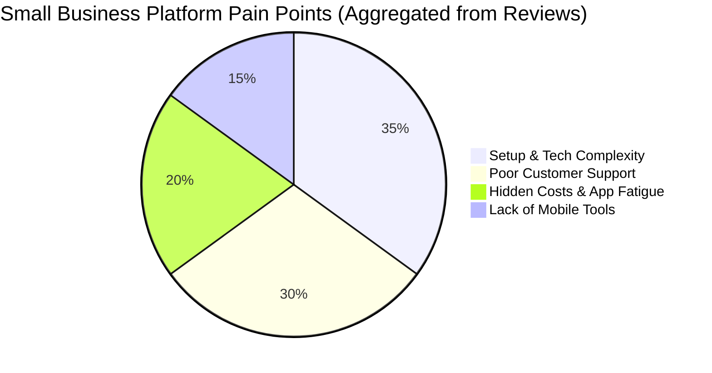
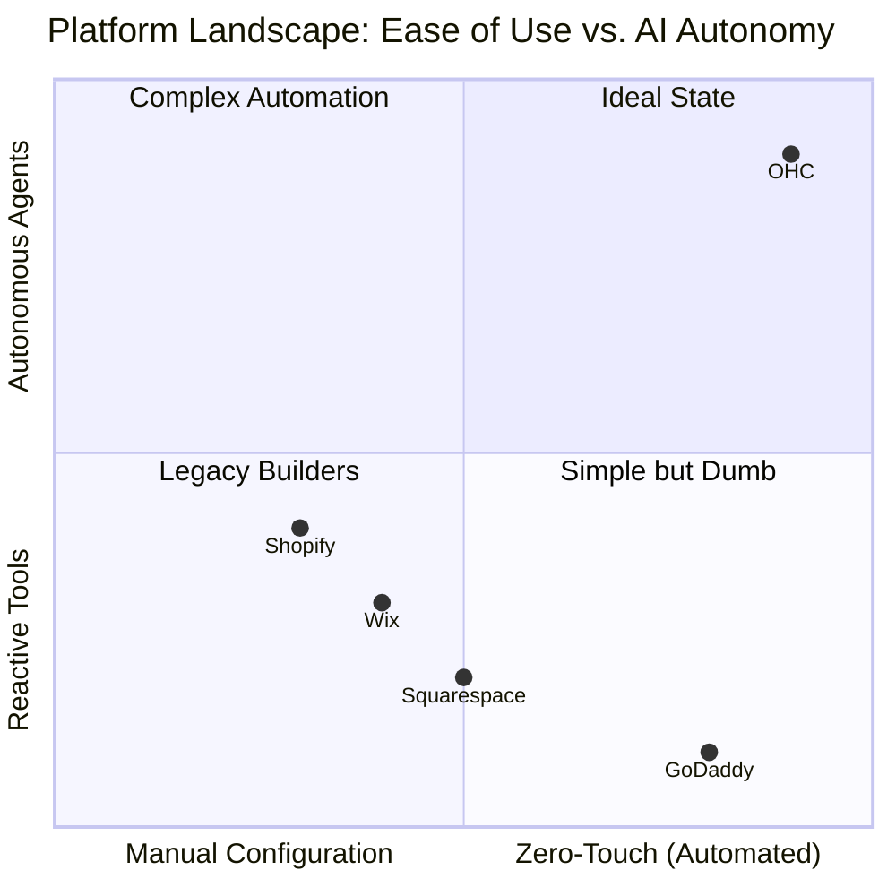

# OHC Market Intelligence & Competitive Gap Report: The SMB Platform Landscape

**Role:** Principal Product Researcher & Oracle (L7)
**Date:** Current
**Domain:** Small Business Platform Market

## 1. Problem Statement
Non-technical small business owners (SMBs) are currently underserved by incumbent platforms. Despite marketing claims of "simplicity," platforms like Shopify, Wix, and Squarespace demand significant technical configuration, require users to manage disjointed systems (booking + store + CRM + marketing), and offer reactive, chat-based AI rather than proactive, autonomous agents. This leads to high abandonment rates, operational overwhelm, and missed revenue for personas like Maya (the baker) and Carlos (the handyman).

## 2. Competitor Audit & Insights

We analyzed the top competitors by reviewing their core offerings, pricing, onboarding flows, and crucially, their Trustpilot and app store user reviews.

| Competitor | Core Offering & Positioning | AI Implementation | Key User Complaints (from Trustpilot/Reddit) |
| :--- | :--- | :--- | :--- |
| **Shopify** | Industry-standard eCommerce platform | **Shopify Sidekick:** Chat-based assistant. Reactive, not autonomous. | Complexity in setup; poor customer support; missing features require expensive apps; confusing for beginners. |
| **Wix** | Drag-and-drop website builder with business apps | **Wix ADI / Harmony:** AI assists in initial setup and text generation. | Increasing platform complexity over time; severe decline in customer support quality; performance issues. |
| **Squarespace** | Design-focused builder for portfolios/stores | **Blueprint AI:** Generates initial layouts and copy. | Poor customer support (replaced by bots that fail to resolve issues); rigid templates. |
| **GoDaddy** | Domain registrar turned basic site builder | **Airo:** Basic AI branding (logo/tagline) and site draft. | Aggressive upselling; very basic features; clunky and non-user-friendly setup flow. |

**Key Insight:** Incumbents treat AI as a "setup assistant" or a "chatbot bolted onto the dashboard." None treat AI as autonomous operational infrastructure (e.g., an agent that actively replies to DMs and processes orders while the user sleeps).

## 3. Top SMB Pain Points

Synthesizing data from user reviews and community discussions (Reddit, Trustpilot), the most critical pain points are:

1. **Setup Complexity:** "I don't know how to code, and this is too overwhelming."
2. **Support Abandonment:** "I can't reach a human, and the bot is useless." (High frequency on Wix and Squarespace).
3. **App Fatigue & Hidden Costs:** "I have to pay for 5 different apps just to run a basic store and booking system." (Shopify).
4. **Mobile Management is an Afterthought:** "I can't easily manage my whole business from my phone while I'm on the go."
5. **Marketing Paralysis:** "I don't have time to write emails or post to Instagram every day."
6. **Customer Service Overload:** "I lose leads because I can't reply to Instagram DMs fast enough."

## 4. Feature Gap Matrix: OHC vs. Incumbents

| Feature Category | Shopify | Wix | Squarespace | GoDaddy | OHC (Target State) |
| :--- | :--- | :--- | :--- | :--- | :--- |
| Setup Time | 30-60 min | 20-40 min | 30-60 min | 20-40 min | **< 10 min (Zero-config)** |
| AI Integration | Chatbot (Sidekick) | Setup Assistant (ADI) | Content Gen | Basic Branding | **Autonomous Agents (Departments)** |
| Mobile Management | Store only | Partial | Poor | Poor | **100% Mobile-First (375px native)** |
| All-in-One (Booking+Store) | No (Requires Apps) | Complex | Yes, but siloed | Basic | **Unified Native Architecture** |
| Target Persona | Semi-technical/Scale | Semi-technical | Creatives | Beginners | **Zero-technical knowledge** |

## 5. OHC AI Differentiation Manifesto

To leapfrog the competition, OHC will not build chatbots. We will build **Departments**—autonomous agents that execute workflows proactively.

**The First 5 AI Automations OHC Must Implement:**
1. **Autonomous Customer Support (The Ambassador):** Auto-draft and send replies to Instagram DMs, WhatsApp, and emails based on business context (e.g., "Yes, we make vegan cakes!"). *Solves Pain Point 6.*
2. **Proactive Marketing Engine (The Promoter):** Automatically generate, schedule, and post social media content and promotional emails without user prompting. *Solves Pain Point 5.*
3. **Zero-Click Website Generation & Optimization:** AI continuously monitors conversion rates and automatically updates the storefront layout and SEO without user intervention. *Solves Pain Point 1.*
4. **Smart Quoting & Lead Follow-up (The Salesperson):** Instantly generate quotes based on customer inquiries (e.g., Carlos the Handyman's requests) and autonomously follow up after 48 hours.
5. **Plain-Language Financial Advisory (The Advisor):** Weekly push notifications summarizing business health ("You sold 10 cakes. Tuesday is busiest. Run a promo next Monday") instead of complex dashboards.

## 6. Market Sizing & Strategic Direction

*   **TAM:** Over 33 million small businesses in the US alone; 400M+ globally. The vast majority are non-employer firms (solo operators).
*   **Beachhead Market:** Service-based solo operators with physical products (e.g., Maya the Baker, Carlos the Handyman). They represent the highest density of users abandoned by Shopify (too complex for services) and Wix (poor mobile management).
*   **Geographic Priority:** Launch English-first (US/UK/AUS), fast follow with Spanish/LATAM due to high mobile-only business penetration.

## 7. Recommended Implementation Mission: "Autonomous Inbox & Quoting Engine"

### High-Level Design Doc
**Objective:** Build the "Customer Success" & "Sales" Agent workflow that ingests messages (mocked for MVP) and auto-drafts replies and quotes based on the tenant's context.
**Architecture:**
- **Entity:** `CustomerInquiry`, `DraftResponse`, `Quote`.
- **Integration:** Gemini Pro via `provider` interface.
- **Workflow:** Webhook receives message -> AI Agent evaluates context (using pgvector embeddings of business profile) -> Generates `DraftResponse` -> Pushes to Mobile App via WebSocket -> User taps "Approve & Send".
- **Mobile UX:** A simple Tinder-style swipe interface on the 375px mobile app. Swipe right to approve the AI draft, swipe left to edit.

### Implementation Prompt for Engineering Swarm
> **Feature Request:** Implement the "Autonomous Inbox" backend and mobile UI.
> **Outcome:** A user receives a simulated customer inquiry. The "Ambassador" agent automatically generates a context-aware draft reply. The mobile app displays this draft in a dedicated "Needs Approval" queue.
> **CUJ:** Login -> Navigate to Inbox -> See pending AI drafted reply to a customer -> Tap "Approve" -> Verify message moves to "Sent" state.
> **Constraints:** Must use Gemini Pro provider. Must be 100% functional on a 375px screen.

## Appendix: Visualizations

