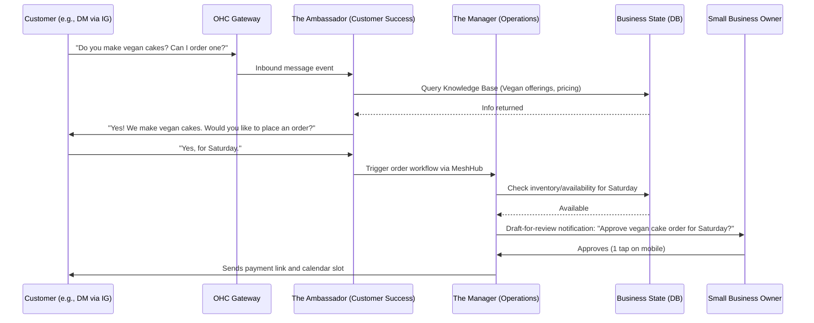

# [architecture] AI Agent Department Architecture

## Title
AI Agent Department Architecture and Integration

## Problem Statement
Small business owners like Maya (baker) and Carlos (handyman) wear too many hats. They handle everything from taking orders, scheduling, marketing, answering DMs, tracking finances, to dealing with legal matters. The sheer complexity of running a business limits their ability to grow and focus on their core product/service. They need a system that acts as a full team of employees working invisibly in the background. If a first-time smartphone user can't figure out how to configure or benefit from these agents in 30 seconds, it's a failure. We need to formalize how AI departments operate autonomously, interact, and integrate seamlessly into OHC without the user needing to understand AI, prompts, or configuration.

## Research Report
### Personas & Use Cases
- **Maya (Baker):** Sells custom cakes via Instagram. Needs "The Manager" to process custom orders, track inventory, and "The Ambassador" to automatically reply to DMs like "Do you do vegan cakes?" while she sleeps.
- **Carlos (Handyman):** Relies on word of mouth. Needs "The Salesperson" to generate quotes, and "The Manager" to schedule bookings with deposit payments.
- **Priya (Boutique Owner):** Needs "The Manager" to sync inventory and "The Accountant" to generate daily financial summaries.

### Competitive Analysis
- **Shopify:** Has "Shopify Magic" and generic AI assistance for copywriting, but it requires active prompting. Not an autonomous "team."
- **Wix:** Generates sites via AI but lacks continuous, autonomous operational agents.
- **Squarespace / GoDaddy:** Basic AI text generation. No concept of background departments handling daily business tasks.

### Market Gap
No platform offers a unified, autonomous "Business Department" model where users "hire" an invisible team (Operations, Marketing, Sales, etc.) to do the work. OHC will bridge this gap by abstracting complex job queues and LLM prompts into relatable roles.

## Design Doc

### Key Departments & Responsibilities
1. **Operations ("The Manager"):** Order and booking processing, inventory tracking, fulfillment, refunds.
2. **Marketing & Advertising ("The Promoter"):** Website design, SEO, social media posts, promotional content, QR codes, link-in-bio pages.
3. **Sales & Acquisition ("The Salesperson"):** Quote generation, lead follow-up, referral tracking, upsell suggestions.
4. **Customer Success ("The Ambassador"):** Message replies, order updates, review requests, re-engagement campaigns.
5. **Finance & Payments ("The Accountant"):** Payment processing, financial reports, subscription billing, tax summaries.
6. **Legal & Compliance ("The Protector"):** Terms/policies, contracts, GDPR compliance, license tracking, liability disclaimers.
7. **Business Advisory ("The Advisor"):** Weekly health reports, next-action suggestions, seasonal trends, pricing recommendations.

### Architecture Diagram

### Mobile UX Flow
- **Onboarding:** "Which of these tasks take up most of your time?" (Checkboxes: Replying to DMs, Bookings, Finances).
- **Activation:** "We've activated your new Manager and Ambassador."
- **Interaction:** Daily summaries push notification. "Your Ambassador answered 5 DMs today. You have 1 order waiting for approval."
- **Progressive Disclosure:** Simple mode defaults to auto-pilot or draft-for-review. Advanced mode allows adjusting tone of voice and specific rules.
- **Visuals:** Uses glassmorphism (`backdrop-filter: blur(20px) saturate(200%)`), minimum touch targets of 44x44px. Entrance motion <= 300ms, exit <= 200ms (`cubic-bezier(0.4, 0, 0.2, 1)`). Fonts: Outfit (headings), Inter (body).

### AI Agent Integration Points
- **Triggers:** Schedule-based (daily reports), Event-based (new order, new message), On-demand (user requests quote generation).
- **Memory/Context:** Agents share a persistent, tenant-isolated memory store representing business state.
- **Approval Flow:** High-risk actions (spending money, finalizing large quotes) are "draft-for-review." Low-risk actions (answering basic FAQs) are "auto-execute."
- **Rate Limits & Budgets:** Limits are tiered (Free: 100 actions/mo, Starter: 1000/mo). Soft rate limits prompt users to upgrade gracefully. Enforced server-side.

### Key Design Decisions
- Abstraction: Never show "AI," "LLM," or "Prompts." Use relatable job titles.
- Unified Memory: Departments must share context to prevent conflicting actions (e.g., Promoter shouldn't promote an out-of-stock item).
- Multi-Tenancy: Strict tenant isolation is mandatory to avoid cross-tenant leakage.
- Offline & Resilience: ML-Resilience Rules apply (60s timeout, max 3 retries, fallback logic, paused state on failure). Idempotent operations.

## Implementation Prompt
**Task:** Implement the core infrastructure and initial interfaces for the AI Agent Departments based on the architecture above.

**User-Facing Outcome:** The business owner should see an "Invisible Team" dashboard on their mobile device showing the active departments (e.g., The Manager, The Ambassador) and a summary of their recent actions. They should be able to toggle the approval mode (Auto-execute vs. Draft-for-review) for each department.

**Acceptance Criteria:**
- Create the core domain models and shared context interfaces for the departments.
- Implement the MeshHub broadcast event logic for inter-department communication.
- Implement ML-Resilience Rules (timeouts, retries, idempotent operations).
- Implement the "draft-for-review" vs "auto-execute" flow for one department (e.g., The Ambassador replying to a message).
- Ensure mobile-first UI with progressive disclosure (Simple vs. Advanced mode).
- Ensure 100% test coverage including UI/E2E tests with Playwright and Slint UI tests.
- Ensure strict multi-tenant isolation.
- Ensure all wizard/configuration state is persisted to the backend to allow seamless resuming.

## Priority
`P0`

## Estimated Scope
Large
