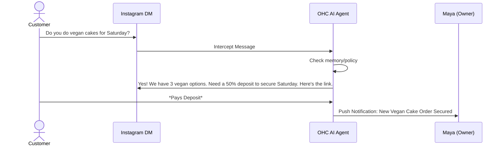
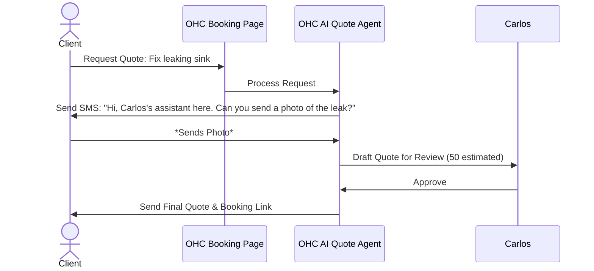
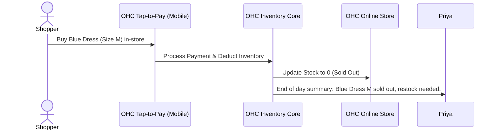
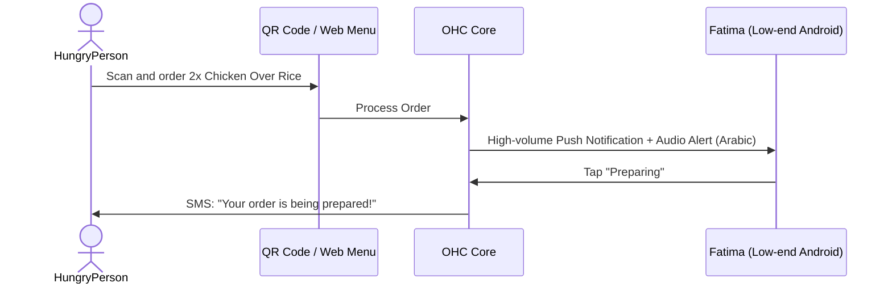

# OHC Business Journey Architecture Report

## Issue Brief

**Title**: Business Journey Architecture Definition
**Problem Statement**: Non-technical small business owners face high friction when setting up and running digital storefronts. We lack a formalized end-to-end user journey that dictates how AI departments integrate seamlessly to eliminate this friction from acquisition to referral.
**Implementation Prompt**: Implement the UI and backend flows necessary to support the 5 core personas detailed below, ensuring zero technical jargon and 100% mobile readiness. Friction points must be addressed via the background AI agents.
**Priority**: P0
**Estimated Scope**: Large

## Research Report & Design Doc

### 1. Maya (Baker, 28) - Custom Cakes via Instagram

**Acquisition:** Discovers OHC via a targeted Instagram ad showcasing an AI agent handling DMs. CTA: "Stop missing orders while you sleep. Go live in 5 mins."

**Onboarding:**
1. Enters business name: "Maya's Cakes"
2. Connects Instagram account.
3. Sets standard deposit percentage (50%).

**Activation:** AI instantly pulls 3 cake photos from Instagram to build the initial storefront. First DM reply by the agent acting on her behalf.

**Retention:** Wakes up to a push notification: "You have 2 new paid custom orders from overnight DMs."

**Revenue:** Reaches 100 orders, triggering a prompt to upgrade to Starter (/mo) to unlock the 'Customer Success' AI department for review requests.

**Referral:** "Get a month free when another baker joins through your link."

**Friction Points to Address:** Connecting the Instagram account requires OAuth, which can be confusing. The UI must explain *why* we need access in plain language. Setting up Stripe/payments can be overwhelming; we should defer full KYC until she receives her first payment.



### 2. Carlos (Handyman, 42) - Word of Mouth

**Acquisition:** Friend refers him with a text message link.

**Onboarding:**
1. Enters name/phone.
2. Selects "Handyman Services".
3. Enters hourly rate and rough service area.

**Activation:** OHC generates a clean mobile-friendly landing page with a "Get Quote" and "Book Now" button.

**Retention:** Uses the app daily to check his schedule and read AI-summarized customer requests before arriving on-site.

**Revenue:** Needs more than 10 products/services listed (plumbing, electrical, assembly, etc.), upgrading to Starter.

**Referral:** Sends his digital business card (OHC link) via SMS to every completed job.

**Friction Points to Address:** Carlos may not have high-quality photos of his work. The AI "Promoter" agent should suggest generic, professional stock images for his initial page, or offer to "enhance" the cell phone photos he uploads.



### 3. Priya (Boutique, 35) - Omnichannel

**Acquisition:** Searches "how to sync physical and online store inventory cheap". Finds OHC blog post.

**Onboarding:**
1. Imports existing CSV of products or takes photos.
2. Configures size/color variants.

**Activation:** Completes her first in-person tap-to-pay transaction using the OHC mobile app, which instantly updates online stock.

**Retention:** Weekly AI "Promoter" agent drafts a newsletter highlighting low-stock items and sends it to her email list.

**Revenue:** Readily pays for the Pro tier (9/mo) to get custom domain + SSL and unlimited AI actions for high volume.

**Referral:** Mentions the "magic inventory sync" in a Facebook group for local business owners.

**Friction Points to Address:** CSV imports are notoriously brittle. The system must use an LLM to auto-map her CSV headers (e.g., "Item_Name" -> "Title") instead of asking her to manually map them in a complex table UI.



### 4. Leo (Music Tutor, 22) - Digital & Booking

**Acquisition:** Sees a TikTok link-in-bio showcasing OHC's clean portfolio + booking features.

**Onboarding:**
1. Connects Google Calendar.
2. Sets 30min and 60min lesson packages.
3. Connects Zoom account.

**Activation:** Puts OHC link in TikTok bio. Gets first booking.

**Retention:** AI Agent automatically sends Zoom link 1 hour before, and follows up 2 days later asking if they want to book again.

**Revenue:** Uses Free tier initially, upgrades to Starter to offer recurring monthly subscription packages.

**Referral:** Shares a "how I automate my tutoring" video on TikTok using the OHC affiliate link.

**Friction Points to Address:** Two-way calendar sync often causes double-bookings if not perfectly reliable. The UI must clearly show which Google Calendar events are blocking OHC availability, using color coding and plain English explanations.

```mermaid
sequenceDiagram
    actor Student
    participant Link as TikTok Link-in-Bio
    participant Agent as OHC Booking Agent
    participant Leo as Leo (Tutor)

    Student->>Link: Book 60min Guitar Lesson
    Link->>Agent: Check Leo's Calendar Availability
    Agent->>Student: Show available slots
    Student->>Agent: Selects Tuesday 4PM & Pays
    Agent->>Leo: Block Calendar & Send Notification
    Agent->>Student: Send Confirmation with Auto-generated Zoom Link
```

### 5. Fatima (Food Cart, 50) - Pre-orders

**Acquisition:** Community organizer helps her set it up to avoid the 30% UberEats fees.

**Onboarding:**
1. Takes photos of 5 dishes.
2. Sets daily inventory limits (e.g., 20 plates of Biryani).
3. Sets pickup location/hours.

**Activation:** Customer orders via QR code at the cart; Fatima's phone rings loudly with the order notification.

**Retention:** Uses the "Print Daily List" feature every morning to know exactly how much to cook.

**Revenue:** Stays on Free tier; happy with the basic functionality. Represents the long-tail success of the platform.

**Referral:** Tells other cart owners in the commissary kitchen.

**Friction Points to Address:** Language barriers and tech anxiety. The app must default to Arabic based on her phone's locale. All critical alerts must use clear, loud audio cues, and the UI should use prominent iconography instead of text-heavy menus.



## Next Steps
1. Review the friction points with the design team.
2. Break down the onboarding improvements into actionable Jira tickets.
3. Validate the CSV import LLM mapping approach with the backend team.
