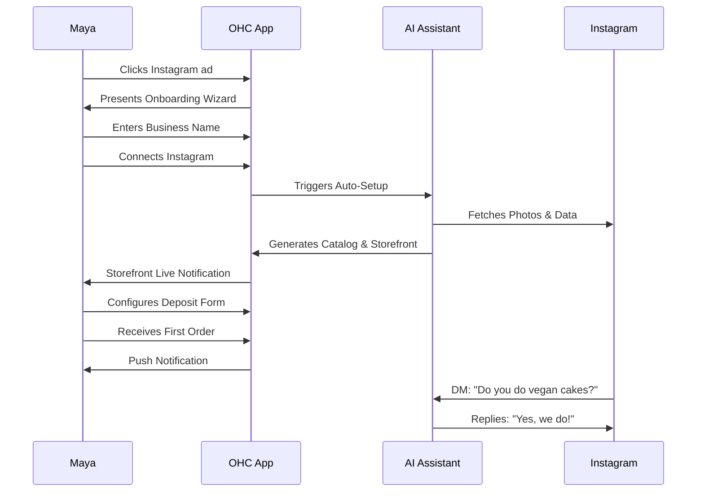
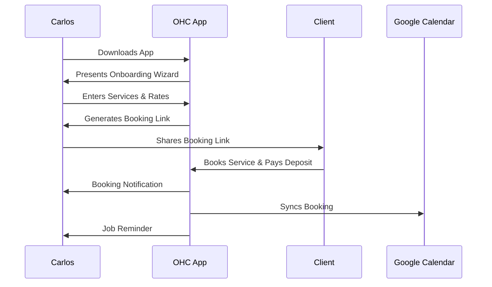
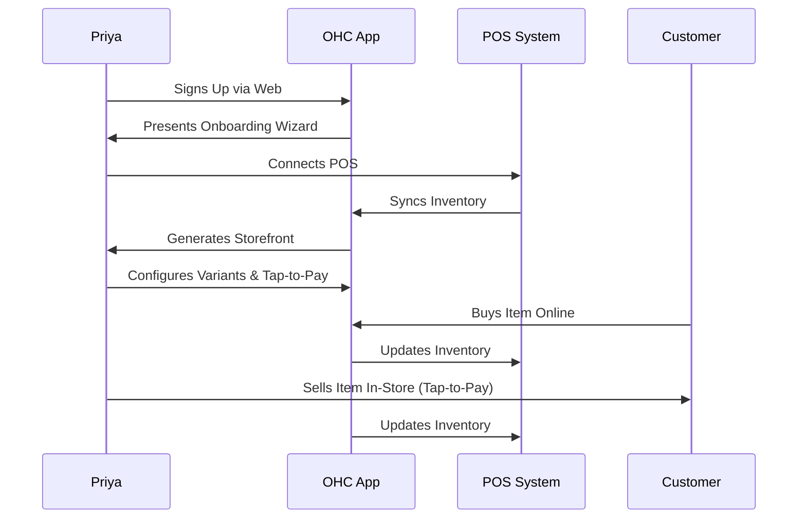
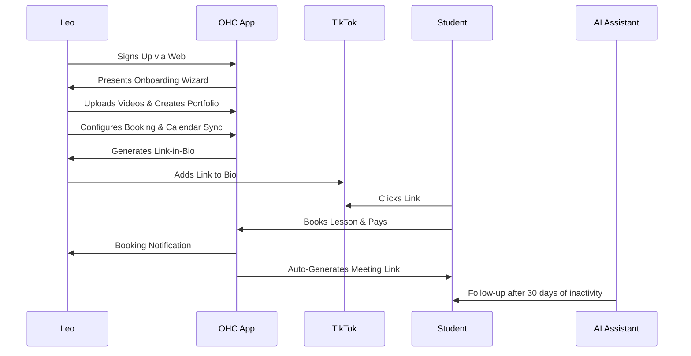
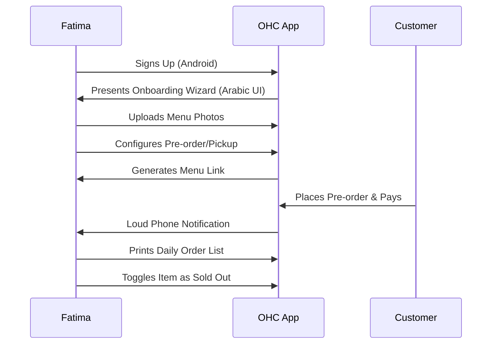

# Architecture Report

## Title
Business Journey Architecture

## Problem Statement
Small business owners often abandon the onboarding flow when they are overwhelmed by technical details. They need a simple, intuitive journey that guides them from zero to live business in under 10 minutes, with AI handling the complexity invisibly. Different personas have different needs, and the platform must cater to all of them seamlessly.

## Research Report
Current onboarding flows for similar platforms (e.g., Shopify, Wix, Squarespace) often require technical knowledge or manual configuration. Our goal is to eliminate this friction entirely, ensuring that non-technical users can launch their businesses effortlessly. The platform must support various business types (physical products, digital products, services, food & beverage, subscriptions, portfolios) and cater to specific personas with varying levels of technical expertise.

## Design Doc
### End-to-End User Journeys

#### Maya (Baker, 28) - Physical Products
- **Acquisition**: Discovers OHC via an Instagram ad showing a beautiful storefront. Clicks the CTA "Launch your bakery in 5 minutes".
- **Onboarding**: Enters her business name ("Maya's Vegan Cakes") and connects her Instagram account. The AI Setup Assistant automatically imports her photos and creates a product catalog.
- **Activation**: She sets up a deposit-based custom order form and receives her first order within 24 hours.
- **Retention**: She receives push notifications for new orders and a daily summary of her business's performance. The AI Customer Support agent handles common inquiries via Instagram DMs.
- **Revenue**: She upgrades to the Starter tier after reaching the 10-product limit on the Free tier to add more custom cake options.
- **Referral**: She shares a referral link on her Instagram story, offering a discount to followers who launch their own OHC storefront.

#### Carlos (Handyman, 42) - Services & Bookings
- **Acquisition**: Hears about OHC from a friend who uses it for their food cart. Downloads the Android app.
- **Onboarding**: Enters his services (e.g., "Plumbing Repair", "Electrical Work") and sets his hourly rates.
- **Activation**: He shares his OHC booking link with a client and receives his first booking with a deposit.
- **Retention**: The app automatically syncs his bookings with his Google Calendar and sends him reminders for upcoming jobs.
- **Revenue**: He upgrades to the Pro tier to access the AI Quote Generator and automated customer follow-ups.
- **Referral**: He recommends OHC to other local tradespeople he meets on the job.

#### Priya (Boutique Owner, 35) - Physical Products (In-Store + Online)
- **Acquisition**: Searches Google for "easy online store builder for boutiques". Clicks an OHC search ad.
- **Onboarding**: Connects her existing point-of-sale system or manually enters her inventory. Configures product variants (size/color).
- **Activation**: She launches her online storefront and sets up tap-to-pay for in-person sales.
- **Retention**: She uses the AI Marketing Agent to send email newsletters to her customer base, driving repeat business.
- **Revenue**: She upgrades to the Business tier to manage multiple locations and access advanced analytics.
- **Referral**: She writes a testimonial for the OHC website, which is featured in a marketing campaign.

#### Leo (Music Tutor, 22) - Services & Bookings (Online)
- **Acquisition**: Sees a TikTok video about OHC's link-in-bio features.
- **Onboarding**: Creates a portfolio page with videos of his performances. Sets up lesson booking with calendar sync.
- **Activation**: He adds his OHC link to his TikTok bio and receives his first lesson booking.
- **Retention**: The AI Customer Success agent automatically follows up with inactive students, offering them a discount on lesson packages.
- **Revenue**: He upgrades to the Pro tier to offer subscription lesson packages.
- **Referral**: He creates a TikTok tutorial on how he uses OHC, driving signups through his referral link.

#### Fatima (Food Cart, 50) - Food & Beverage
- **Acquisition**: A fellow food cart operator helps her set up OHC on her Android phone.
- **Onboarding**: She selects the Arabic UI. She uploads photos of her menu items and sets up pre-order/pickup options.
- **Activation**: She receives her first pre-order and receives a loud phone notification.
- **Retention**: She uses the app daily to print her order list and toggle sold-out items.
- **Revenue**: She remains on the Free tier as it meets all her needs.
- **Referral**: She tells other food cart operators in her community about OHC.

### Key design decisions and why
- **Mobile-first approach**: Ensures that users like Carlos and Fatima can manage their business entirely from their phones.
- **AI-driven setup**: Reduces the cognitive load on users like Maya by automating the configuration process (e.g., importing photos from Instagram).
- **Persona-specific flows**: The platform adapts to the user's business type, offering relevant features (e.g., booking calendar for Carlos, menu for Fatima) and hiding unnecessary complexity.
- **Frictionless onboarding**: Deferring complex settings (e.g., advanced SEO, custom domains) until the user is ready, focusing on getting them live in under 10 minutes.

### UI wireframes or screen flow description
1. **Welcome Screen**: A simple greeting with a clear CTA to start the setup process.
2. **Business Details**: A brief form to capture essential information (business name, type, and location).
3. **AI Configuration**: An automated process where AI agents configure the platform based on the user's input. For example, Maya's flow would prompt her to connect Instagram, while Carlos's flow would ask for his services and rates.
4. **Dashboard**: A clean, intuitive dashboard tailored to the persona. Maya sees her storefront and orders, while Carlos sees his booking calendar.

### Mobile UX flow
- A seamless, responsive experience that adapts to different screen sizes.
- Large, easy-to-tap buttons and clear typography to ensure readability on small screens.
- Contextual help and tooltips to guide users through complex tasks.

### AI agent integration points
- **Setup Assistant**: An AI agent that guides users through the onboarding process, asking relevant questions and providing helpful suggestions.
- **Customer Support**: An AI agent that handles common customer inquiries via various channels (e.g., Instagram DMs for Maya).
- **Marketing Agent**: An AI agent that helps users like Priya send email newsletters and run promotional campaigns.
- **Customer Success Agent**: An AI agent that follows up with inactive customers, such as Leo's students, to encourage re-engagement.

## Implementation Prompt
Implement the end-to-end user journeys defined in the Business Journey Architecture doc. Ensure that the onboarding flow is intuitive, mobile-friendly, and leverages AI agents to handle technical configurations invisibly. The platform must support the specific needs of the defined personas (Maya, Carlos, Priya, Leo, Fatima) and provide a seamless experience across all touchpoints.

## Priority
P0

## Estimated Scope
Large
