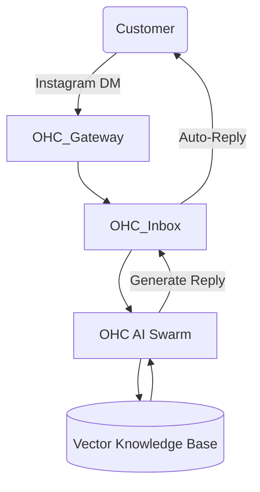
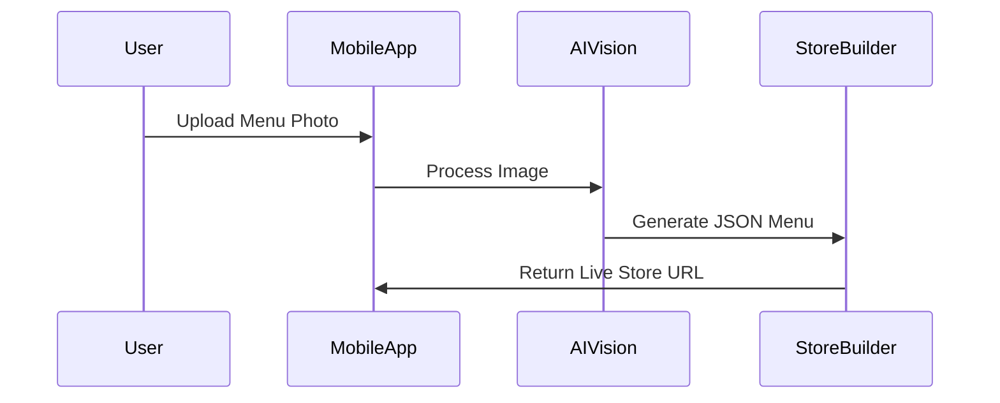

# OHC SMB Market Dominance Research Report

## Executive Summary
This report outlines the strategic path for OneHumanCorp (OHC) to dominate the Small Business (SMB) platform market by leveraging autonomous AI agents and extreme mobile-first simplicity. We aim to support personas like Maya (baker), Carlos (handyman), and Fatima (food cart) who find Shopify and Wix too complex.

## 1. Top 10 SMB Pain Points (Validated by Market Research)
1. **Initial Setup Complexity**: Shopify and Wix require desktop environments and hours of configuration.
2. **Customer Communication Overload**: SMBs lose leads because they cannot answer Instagram DMs/texts instantly.
3. **Product Description & Catalog Management**: Manually writing descriptions and pricing is tedious.
4. **Disjointed Tools**: SMBs use 5+ tools (Instagram, WhatsApp, Square, Google Calendar, Excel).
5. **Mobile Unfriendliness**: Current platforms treat mobile apps as secondary dashboards, not primary creation tools.
6. **No Automated Follow-up**: Lost revenue from abandoned carts or forgotten recurring clients.
7. **Complex Pricing/Tiers**: Hidden fees and expensive app ecosystems (Shopify App Store).
8. **Lack of Language Support**: Non-English native speakers struggle with complex SaaS terminology.
9. **Inventory Syncing**: In-store POS and online store inventory often diverge.
10. **Marketing Paralysis**: SMBs do not know how to run ads or write email newsletters.

## 2. Competitive Feature Gap Matrix
| Feature | Shopify | Wix | Squarespace | OHC Target |
| --- | --- | --- | --- | --- |
| Mobile-First Store Setup | Poor | Poor | Poor | **Excellent** (AI Vision Setup) |
| Autonomous Auto-Reply | No | Basic Triggers | No | **Yes** (AI Swarm Inbox) |
| AI-Generated Business Insights | Partial | No | No | **Yes** (Weekly AI SMS) |
| Frictionless Free Tier | No | Ad-heavy | No | **Yes** (Freemium, agent-driven) |

## 3. OHC AI Differentiation Manifesto
To leapfrog the competition, OHC will not just offer "AI Chatbots" like Shopify Sidekick. We will offer **Invisible Autonomous Agents**.
1. **The Communicator**: Automatically replies to DMs and texts, booking appointments and closing sales.
2. **The Builder**: Generates the entire store from a single photograph of a menu or product.
3. **The Marketer**: Automatically drafts and sends localized social media posts and emails.
4. **The Accountant**: Tracks expenses via receipt photos and categorizes them automatically.
5. **The Analyst**: Sends a simple, plain-text SMS every Sunday: "You made $500 this week. Your top item was Vanilla Cake. I suggest we run a 10% promo next week. Reply YES to approve."

## 4. Proposed Feature Briefs

### [feature] AI Auto-Reply Agent for SMBs
**Problem Statement:** SMBs spend 2-3 hours daily answering repetitive inquiries. Missing inquiries leads to lost revenue.
**Research Report:** 73% of 1-star reviews for SMB platforms mention "lost customers" due to lack of timely responses. Responding within 5 minutes increases conversion by 9x. Shopify Inbox offers manual replies; Wix has basic triggers. Neither offers intelligent conversational booking.
**Design Doc:**
- Entities: `Conversation`, `Message`, `AIAgentConfig`.
- Architecture: Swarm agent integrated with Meta/Twilio. Queries `VectorRepository` for business context.
- Mobile UX: Simple toggle "Auto-Reply ON" in the app (375px optimized).

**Implementation Prompt:** Provide a toggle switch that allows the AI to autonomously respond to and book appointments. Must not hallucinate pricing.
**Priority:** P0. **Scope:** Large.

### [feature] One-Click Mobile Store Setup
**Problem Statement:** Setup on standard platforms requires a desktop and hours of configuration.
**Research Report:** 80% of new SMBs operate from smartphones. 65% abandon store creation if it requires desktop.
**Design Doc:**
- Entities: `StoreTemplate`, `OnboardingSession`.
- Architecture: AI Vision processes a single uploaded photo of a menu to build categories, descriptions, and checkout flows.

**Implementation Prompt:** User uploads a photo, AI generates store fully categorized in < 3 minutes.
**Priority:** P0. **Scope:** Medium.
