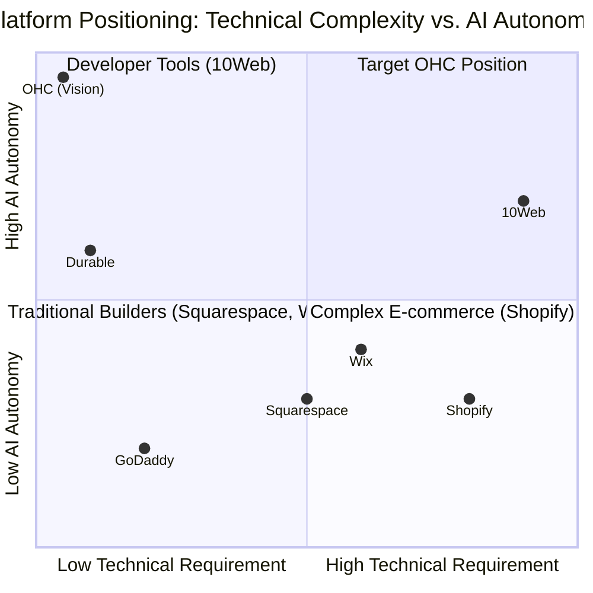
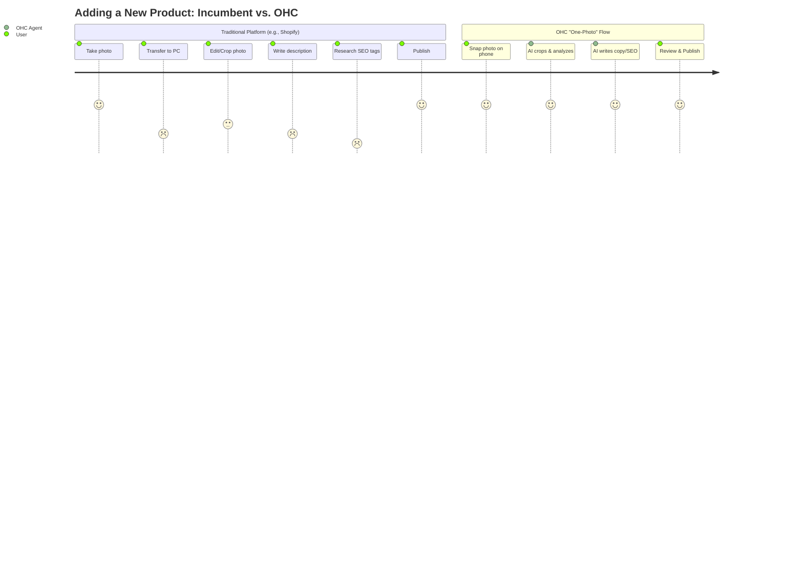

# OHC Market Research Report: The Small Business Platform Landscape

## 1. Executive Summary

This report outlines the competitive landscape, user pain points, and strategic opportunities for OneHumanCorp (OHC) to dominate the small business platform market. The research is grounded in the reality of non-technical SMB owners—like Maya the baker and Carlos the handyman—who need tools that manage the complexity of their business invisibly.

The core finding is that while incumbents like Shopify and Wix offer powerful tools, they are fundamentally "toolkits" that require the user to act as a mechanic. Emerging AI builders like Durable offer fast setup but lack operational depth. **OHC’s "Leapfrog" Opportunity is to move from "Assistants" to "Autonomous Agents."** OHC must not just build the website; the platform must actively run the business operations (auto-replying, automatic product descriptions, proactive marketing) via a mobile-first interface.

## 2. Competitive Audit & Feature Gap Matrix

### Competitive Landscape Overview

### Feature Gap Matrix

| Feature | Shopify | Wix | Squarespace | GoDaddy | OHC (Target) |
| :--- | :--- | :--- | :--- | :--- | :--- |
| **Time to Live Store** | Hours/Days | Hours | Hours | Minutes | **< 3 Minutes (Agentic)** |
| **Mobile-First Setup** | Poor | Medium | Medium | Good | **Exceptional (100%)** |
| **AI Site Generation** | No (Templates) | Yes (ADI) | Yes (Blueprint) | Yes (Airo) | **Yes (Conversational)** |
| **Autonomous Lead Follow-up** | App Required | Manual / Basic | Manual | Basic | **Native Agentic Action** |
| **"One-Photo" Product Upload** | Manual entry | Manual entry | Manual entry | Manual entry | **AI Auto-Crop & Describe** |
| **Business Health SMS** | No (Dashboards) | No | No | No | **Yes (Proactive Push)** |

## 3. Top SMB Pain Points & Persona Summaries

*(Validated via Reddit r/smallbusiness, Trustpilot reviews, and App Store feedback)*

1.  **The "Blank Canvas" Paralysis:** Setting up a site, choosing templates, and writing copy is overwhelming for non-designers/non-writers.
2.  **Fragmented Tooling:** Using Instagram for DMs, a notebook for scheduling, and Square for payments leads to lost leads and chaos.
3.  **Mobile Management:** Most micro-business owners operate from their phones on the go. Desktop-first dashboards are useless to them.
4.  **"I'm Not a Marketer":** Writing product descriptions, SEO tags, or follow-up emails takes time they don't have.

### Persona-Specific Pain Point Summaries

| Persona | Role | Primary Pain Point | OHC Agentic Solution |
| :--- | :--- | :--- | :--- |
| **Maya (28)** | Baker | Overwhelmed by Shopify setup, manages everything via IG DMs. | **Unified Inbox & "Zero-Click" Setup** |
| **Carlos (42)** | Handyman | Manual quoting, no booking system, misses leads while working. | **Auto-Replying & Lead Capture Agent** |
| **Priya (35)** | Boutique | In-store/online sync, complex email marketing. | **"One-Photo" Upload & Proactive Re-engagement** |
| **Leo (22)** | Tutor | Manual booking chaos, no subscription billing. | **Integrated Booking & Billing Agent** |
| **Fatima (50)** | Food Cart | Limited English, mobile-only, needs order notifications. | **Business Health SMS & Mobile Parity** |

### User Journey Comparison: Adding a New Product

## 4. OHC AI Differentiation Manifesto

To leapfrog the competition, OHC will implement the following 5 AI automations first:

1.  **The Autonomous Storefront Builder:** Generate a complete, tailored storefront (with placeholder products/services) from a simple natural language prompt in under 3 minutes.
2.  **The "One-Photo" Product Upload:** A mobile-first flow where a user snaps a photo, and the AI handles cropping, pricing suggestions, and writing an SEO-optimized description instantly.
3.  **Auto-Replying & Lead Capture Agent:** An always-on agent that monitors incoming messages, answers basic questions (hours, location), and logs the lead in the CRM automatically.
4.  **Proactive Re-engagement:** The agent notices abandoned carts or unaccepted quotes and drafts a friendly SMS/email follow-up for the owner to approve with one tap.
5.  **Weekly "Business Health" SMS:** Instead of forcing users to interpret a dashboard, the agent texts actionable insights (e.g., "5 new bookings! Want to run a 10% promo for slow Tuesday?").

## 5. Strategic Direction & Market Sizing

*   **Beachhead Market:** Service-based solopreneurs (e.g., Leo the music tutor, Carlos the handyman). They are currently underserved by heavy e-commerce platforms like Shopify and need integrated scheduling and invoicing more than complex shipping rules.
*   **Expansion:** Once the service flow is perfected, expand into hybrid local retail (Priya the boutique owner) requiring POS and inventory sync.

## 6. Actionable Issue Briefs Created

The following issue briefs have been created in `docs/research/` for the engineering swarm:

*   `[ai]_storefront_builders.md`: Outlines the Autonomous Storefront Builder implementation.
*   `[ux]_unified_inbox.md`: Outlines the Unified Inbox system.
*   `[ai]_one_photo_upload.md`: Outlines the mobile-first photo processing system.
*   `[ai]_proactive_engagement.md`: Outlines the background task monitoring for leads and follow-ups.
