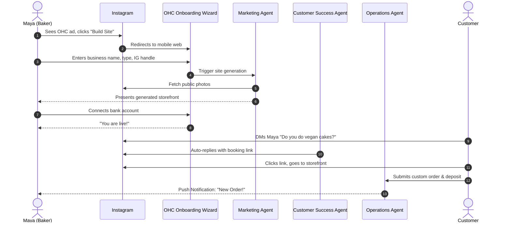
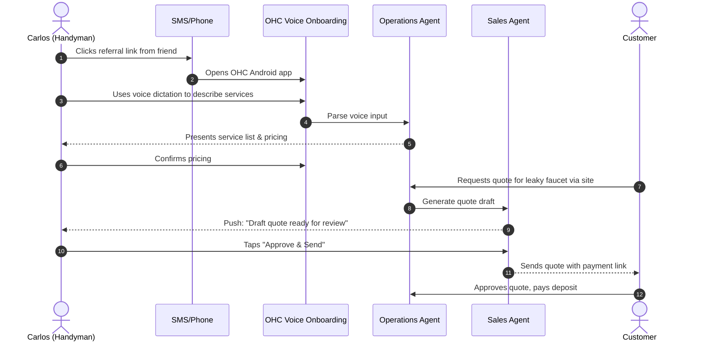
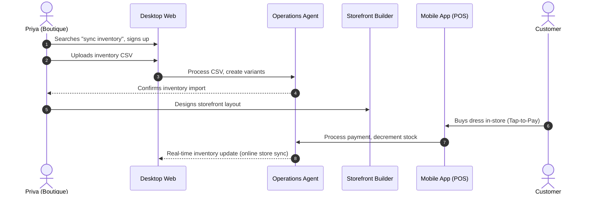
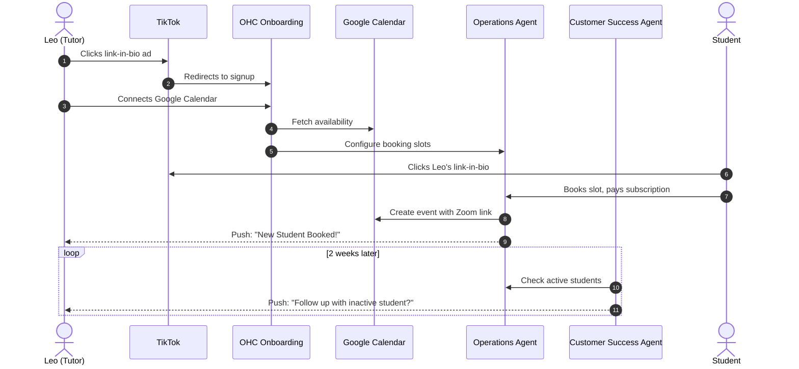
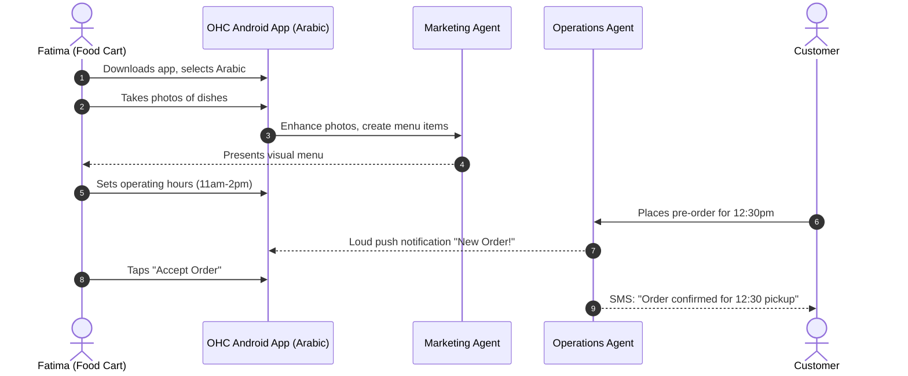

# OneHumanCorp (OHC) Business Journey Architecture Report

## 1. Executive Summary

This report maps the end-to-end user journeys for five primary business owner personas on the OneHumanCorp (OHC) platform. It details the steps each persona takes from discovery through onboarding, activation, retention, revenue scaling, and referral. Crucially, it identifies potential friction points where non-technical users might abandon the process, ensuring our architecture and design decisions strictly adhere to the OHC core value of "Radical Simplicity" and the guarantee of "idea → live business in under 10 minutes".

## 2. Core Personas and Their Key Needs

Before mapping the journeys, we ground our architecture in the specific needs of our target users:

1.  **Maya (The Home Baker, 28):** Mobile-only (iPhone), Instagram DM sales, deposit-based custom orders, visual storefront. Needs automated DM replies.
2.  **Carlos (The Freelance Handyman, 42):** Mobile-only (Android), word-of-mouth sales, service listings with prices, booking calendar with deposits. Needs automated quotes.
3.  **Priya (The Boutique Owner, 35):** Desktop & Mobile (iPhone), in-store and online sales, product variants, inventory sync, tap-to-pay. Needs automated email newsletters.
4.  **Leo (The Music Tutor, 22):** Online and in-person lessons, subscription packages, calendar sync, Zoom integration. Needs portfolio/link-in-bio page and inactive student follow-ups.
5.  **Fatima (The Food Cart Operator, 50):** Low-end Android, limited English, pre-orders/pickups, photo menu. Needs Arabic+English UI and simple daily printable order lists.

## 3. End-to-End User Journeys

### 3.1 Maya - The Home Baker

*   **Acquisition:** Maya sees an Instagram ad featuring another baker who launched their site from their phone in 5 minutes. The CTA is "Build your bakery site directly on your phone."
*   **Onboarding:** Guided mobile wizard.
    1.  *Input:* Name ("Maya's Sweets"), Type ("Bakery/Custom Orders"), Instagram handle.
    2.  *AI Action:* "Marketing Agent" imports 5 photos from her public Instagram to pre-populate her gallery and menu.
    3.  *Input:* Bank details for payouts.
*   **Activation:** Maya receives her first custom order inquiry via DM, which the "Customer Success Agent" automatically replies to ("Hi! Yes, I do vegan cakes. Here is my booking link: [link]"). The customer clicks the link, fills out the form, and pays the deposit.
*   **Retention:** Maya receives a daily push notification summarizing tomorrow's orders.
*   **Revenue:** She upgrades to the Starter tier when she needs a custom domain (e.g., mayassweets.com) instead of the OHC subdomain.
*   **Referral:** Maya shares her site link on Instagram; another baker clicks a small "Powered by OHC" link at the bottom of her page.

#### Journey Map: Maya

**Friction Points:** Bank connection (Stripe onboarding must be simplified). AI misinterpreting Instagram photos (needs easy "delete" or "replace" UI).

---

### 3.2 Carlos - The Freelance Handyman

*   **Acquisition:** A friend (another contractor) texts him a referral link. The CTA is "Stop losing jobs to missed calls. Get a booking page."
*   **Onboarding:** Voice-driven input (he's driving).
    1.  *Input:* "I fix plumbing and do general repairs in Austin, Texas."
    2.  *AI Action:* "Operations Agent" generates a standard service list with placeholder hourly rates.
    3.  *Input:* He adjusts the rate for plumbing.
*   **Activation:** Carlos gets a text from OHC: "Customer requested a quote for a leaky faucet." The "Sales Agent" drafted a quote; Carlos hits "Approve and Send". The customer accepts and pays the booking fee.
*   **Retention:** The "Business Advisory Agent" sends a weekly SMS: "You made $800 this week. You missed 2 calls, but the AI handled them."
*   **Revenue:** Upgrades to Starter to allow unlimited monthly bookings (Free tier limits to 10/month).
*   **Referral:** "Refer a contractor" button in his earnings summary text message.

#### Journey Map: Carlos

**Friction Points:** Voice dictation accuracy on noisy job sites. Understanding the difference between a "quote request" and a "booking".

---

### 3.3 Priya - The Boutique Owner

*   **Acquisition:** Organic Google search for "sync in-store and online inventory easily". The CTA is "One inventory. Everywhere you sell."
*   **Onboarding:** Desktop web onboarding.
    1.  *Input:* Uploads a CSV of her current inventory (or connects her existing clunky POS).
    2.  *AI Action:* "Operations Agent" categorizes products, standardizes variants (Size/Color).
    3.  *Input:* Designs storefront layout using the drag-and-drop builder.
*   **Activation:** Priya sells a dress in-store using the OHC mobile app's tap-to-pay feature. The online inventory automatically updates, preventing a double-sale.
*   **Retention:** Daily mobile dashboard check for "Sales Today" vs "Sales Yesterday".
*   **Revenue:** Upgrades to Pro for unlimited products and advanced multi-channel selling.
*   **Referral:** Invites her staff members to the platform (adding users).

#### Journey Map: Priya

**Friction Points:** CSV formatting issues during import. Connecting the tap-to-pay hardware/feature for the first time.

---

### 3.4 Leo - The Music Tutor

*   **Acquisition:** Sees a TikTok video about "How I run my teaching business from one link." The CTA is "Create your Link-in-Bio."
*   **Onboarding:** Mobile flow focused on profile creation.
    1.  *Input:* Connects Google Calendar.
    2.  *AI Action:* "Operations Agent" identifies free slots based on calendar availability.
    3.  *Input:* Sets up subscription packages (e.g., 4 lessons/month).
*   **Activation:** A student books a lesson from his TikTok link. They pay for a month upfront, and a Zoom link is automatically generated and emailed to both.
*   **Retention:** The "Customer Success Agent" notifies him: "3 students haven't booked a lesson in 2 weeks. Send them a follow-up?" (1-tap approve).
*   **Revenue:** Upgrades to Starter to unlock the recurring subscription billing feature.
*   **Referral:** Students share his booking link with friends.

#### Journey Map: Leo

**Friction Points:** Google Calendar OAuth permissions (can be intimidating). Explaining subscription terms to students clearly.

---

### 3.5 Fatima - The Food Cart Operator

*   **Acquisition:** Local community outreach or translated Facebook ad. The CTA is "Take pre-orders on your phone."
*   **Onboarding:** Low-data, offline-capable mobile app in Arabic.
    1.  *Input:* Takes photos of her 5 main dishes using her phone camera.
    2.  *AI Action:* "Marketing Agent" enhances the photos (brightness/contrast) and extracts the text menu.
    3.  *Input:* Sets pickup times (e.g., 11 AM - 2 PM).
*   **Activation:** Customer places an order for 12:30 PM pickup. Fatima's phone makes a loud, distinct sound. She taps "Accept".
*   **Retention:** The app provides a large-text, high-contrast, printable (or easily readable on a cracked screen) list of orders for the day.
*   **Revenue:** Likely stays on the Free tier; monetization might come from payment processing fees.
*   **Referral:** Word of mouth in the local vendor community.

#### Journey Map: Fatima

**Friction Points:** Initial app download size (must be small for low-data plans). Navigating the UI if translation is poor or font sizes are too small. Managing "sold out" items quickly during a rush.

## 4. Conclusion & Architectural Implications

These user journeys highlight that OHC's architecture must prioritize:
1.  **Mobile-First Orchestration:** The KAIROS Orchestrator must reliably deliver notifications and handle approvals primarily via mobile push and SMS.
2.  **Asynchronous AI Actions:** Heavy tasks (like importing Instagram photos or analyzing CSVs) must be non-blocking, allowing the user to complete the critical path of onboarding while agents work in the background.
3.  **Resilient Data Synchronization:** For users like Priya (desktop/mobile hybrid) and Fatima (potential spotty connectivity), offline-first capabilities and robust conflict resolution (e.g., CRDTs or robust queueing) are essential to prevent double-bookings or lost orders.
4.  **Tier Enforcement:** Feature gating (custom domains, subscriptions, booking limits) must be clear and smoothly integrated into the natural flow of the user's business growth, rather than feeling like a sudden paywall.