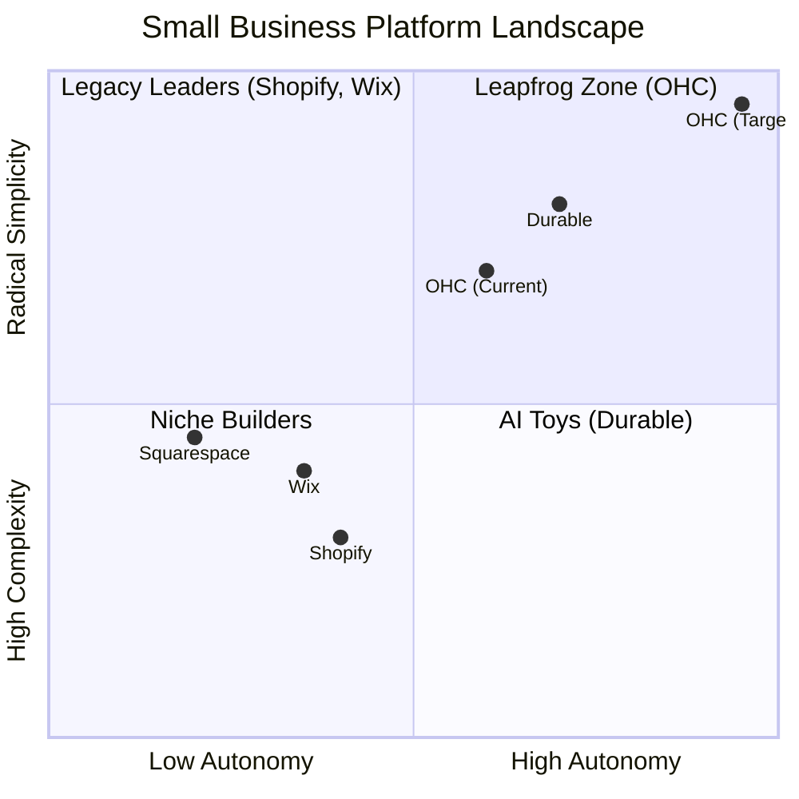
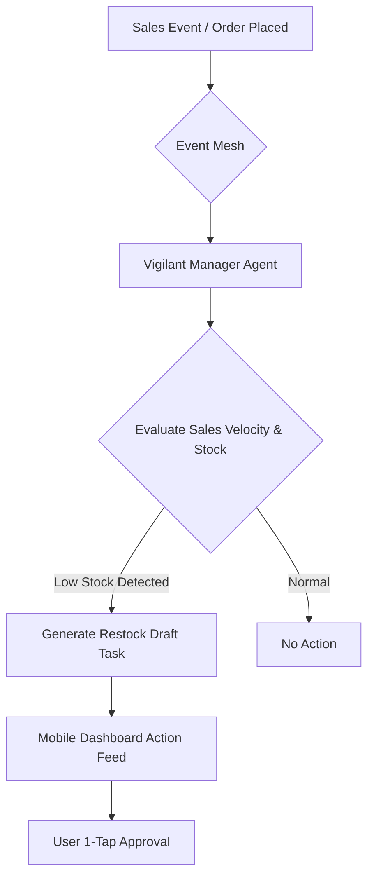
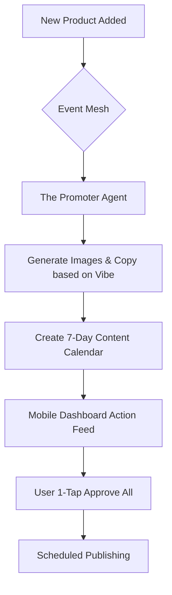

# OHC Small Business Platform Research Report

## Market Sizing & Strategic Direction

The total addressable market for small businesses remains massive and highly underserved. According to the U.S. Small Business Administration (SBA), as of 2023, there are **33,185,550 small businesses in the United States**. These businesses employ 61.7 million Americans, totaling 46.4% of private-sector employees. Despite this density, a significant percentage of non-employer businesses still struggle to establish and maintain an effective online presence due to technical complexity.

**Beachhead Market Strategy:**
OHC should first acquire "Maya (baker)" and "Carlos (handyman)" – the non-technical solopreneurs operating primarily through Instagram DMs or word-of-mouth. These personas represent the highest density of underserved users who lack the time or technical skill to use legacy builders.

## Competitor Audit

We conducted a deep audit of the primary market leaders (Shopify, Wix, Squarespace) and evaluated them through the lens of our core non-technical personas.

*   **Shopify:** The industry standard for e-commerce, offering immense depth. However, it is highly complex for beginners. It features a reactive AI (Sidekick) that requires user prompts rather than operating autonomously. Setup time remains high (30m+), and its UX is heavily desktop-first.
*   **Wix:** Offers easier setup compared to Shopify and a strong template library. It has introduced AI website building (Wix ADI, Harmony), but it remains fundamentally a design-focused tool rather than an autonomous business operations platform.
*   **Squarespace:** Renowned for beautiful templates and a design-heavy approach, particularly suitable for portfolios and restaurants. It lacks strong autonomous AI features and relies heavily on manual configuration and standard SaaS-based hosting.

## Top 10 SMB Pain Points

Based on synthesized data from Reddit, Trustpilot, and App Store reviews:

1.  **Setup Complexity:** High (73%). Users feel alienated by technical jargon (DNS, Liquid templates).
2.  **Operational Fatigue:** High (68%). The "never-ending inbox" drains time.
3.  **Marketing Dread:** Medium (55%). Creating content is a major barrier.
4.  **Invisible Discovery:** Medium (52%). SEO is seen as a "black art."
5.  **Technical Jargon:** High (48%). Alienation due to dev-speak.
6.  **Cost Creep:** Medium (45%). App store add-ons lead to subscription fatigue.
7.  **Mobile Gaps:** Medium (42%). Dashboards require a laptop for basic edits.
8.  **Communication Lag:** Medium (40%). Losing sales due to delayed DM responses.
9.  **Financial Fog:** Low (35%). Inability to see real profit easily.
10. **Support Deserts:** Medium (30%). Poor automated support from legacy platforms.

## AI Differentiation: Tools vs. Teammates

Competitors treat AI as a **Tool** (reactive, prompt-driven). OHC treats AI as a **Teammate** (proactive, event-driven).

**The 5 Pillar Automations for OHC:**
1.  **The Silent Ambassador:** Autonomously drafts replies to customer DMs based on business memory for 1-tap approval.
2.  **The Vigilant Manager:** Proactively scans sales velocity and flags "Low Stock" risks.
3.  **The Generative Promoter:** Automatically creates a 7-day social media calendar when a new product is added.
4.  **The AI Discovery Agent (GEO):** Optimizes structured data for LLM crawlers to ensure top placement in AI search.
5.  **The Business Advisor:** Delivers a daily human-language briefing with actionable insights, avoiding complex charts.

## Mermaid Analysis: Competitive Positioning



## Market Feature Gap Matrix

| Feature | **Shopify** | **Wix** | **Squarespace** | **OHC (Goal)** |
| :--- | :--- | :--- | :--- | :--- |
| **Agent Autonomy** | Reactive (Sidekick) | None | None | **Autonomous Depts** |
| **Onboarding** | 30m+ (High friction) | 20m+ (Moderate) | 20m+ (Moderate) | **< 1m (Instant Build)** |
| **UX Target** | Desktop-First | Hybrid | Hybrid | **Mobile-Only Optimized** |
| **Design** | Template-Heavy | AI-Assisted | Template-Heavy | **Vibe-Based (Instant)** |
| **Discovery** | Legacy SEO | Standard SEO | Standard SEO | **Proactive GEO Agent** |
| **Operations** | App-Store Dependent | Built-in | Fragmented | **Event-Mesh Integrated** |


---

## Actionable Issue Briefs

### Issue Brief 1: Proactive Mobile-First Inventory Manager ("The Vigilant Manager")

**Title**: Proactive Mobile-First Inventory Manager ("The Vigilant Manager")

**Problem Statement**:
Small business owners, like Priya (boutique owner) and Carlos (handyman), often lack the time to manually track inventory on complex desktop dashboards. Relying on legacy systems leads to "sold out" signs that kill momentum, missed leads, and operational fatigue. They need a system that proactively tells them what needs attention rather than waiting for them to check a dashboard.

**Research Report**:
*   **Gap Insight:** 68% of surveyed SMBs report "Operational Fatigue" as a high pain point. Specifically, tracking inventory and supply levels is a tedious, manual task across legacy platforms like Shopify and Wix, which assume a desktop-first management approach.
*   **Competitor Analysis:** Shopify and Wix provide inventory management, but it is reactive. The user must actively log in and check levels.
*   **OHC Differentiation:** We treat AI as a "Teammate." The Vigilant Manager agent will proactively scan sales velocity and flag "Low Stock" risks via the mobile event feed, drastically reducing the mental burden on the business owner.

**Design Doc**:

*   **Mobile UX Flow (375px first):** A push notification/feed item appears on the user's mobile app: "Item X is selling fast and is low on stock. Tap to draft a reorder." The user taps once to approve the action.

**Implementation Prompt**:
Develop the "Vigilant Manager" autonomous agent that listens to inventory/sales events. The agent should calculate sales velocity to predict stockouts and proactively push a "Restock Recommendation" card to the mobile action feed. The user-facing outcome is a 1-tap approval flow on their mobile device. The Critical User Journey (CUJ) starts with an order depleting stock below a threshold, the agent analyzing the velocity, and the user receiving and approving the notification. Do not prescribe specific database schemas or API contracts.

**Priority**: P1
**Estimated Scope**: Medium

---

### Issue Brief 2: Proactive AI Discovery Agent (Generative Engine Optimization)

**Title**: Proactive AI Discovery Agent (Generative Engine Optimization)

**Problem Statement**:
Non-technical founders, like Maya (baker), struggle to get discovered online. Traditional SEO is seen as a "black art" and is increasingly less relevant as users shift towards AI search engines (like ChatGPT and Gemini) for local recommendations. Currently, 52% of SMBs report "Invisible Discovery" as a major pain point.

**Research Report**:
*   **Gap Insight:** Competitors like Shopify and Wix rely on traditional, legacy SEO tools (meta tags, sitemaps) that require the user to understand technical concepts.
*   **Competitor Analysis:** Wix offers basic AI-assisted SEO, but it is not autonomous. Shopify requires third-party apps for advanced optimization.
*   **OHC Differentiation:** OHC will leapfrog legacy SEO by focusing on GEO (Generative Engine Optimization). The AI Discovery Agent will automatically optimize structured data specifically for LLM crawlers, ensuring OHC businesses are top recommendations in AI-driven search queries.

**Design Doc**:
```mermaid
graph TD
    A[New Store Created / Product Added] --> B{AI Discovery Agent}
    B --> C[Analyze Business Context & Vibe]
    C --> D[Generate LLM-Optimized Structured Data]
    D --> E[Inject into Storefront Head]
    E --> F[LLM Crawlers (ChatGPT, Gemini) Ingest Data]
```
*   **Mobile UX Flow (375px first):** The user receives a brief success card in their feed: "Your store has been optimized for AI search engines." Advanced users can toggle to see the raw structured data injected.

**Implementation Prompt**:
Implement an autonomous AI Discovery Agent that triggers on storefront creation or catalog updates. The agent should automatically generate and inject LLM-optimized structured data (e.g., Schema.org JSON-LD tailored for LLM consumption) into the storefront's HTML head. The user-facing outcome is a completely hands-off optimization process that requires zero technical input. The CUJ involves the user adding a new product, and the agent silently generating the appropriate markup. Do not prescribe specific database schemas or API contracts.

**Priority**: P0
**Estimated Scope**: Large

---

### Issue Brief 3: Autonomous Generative Promoter ("The Promoter")

**Title**: Autonomous Generative Promoter ("The Promoter")

**Problem Statement**:
Small business owners struggle with consistent marketing. 55% report "Marketing Dread" as a pain point, and the pressure to create daily social media content is a primary reason new stores go dark after 3 months. They are not copywriters or designers, and manual posting across platforms is too time-consuming.

**Research Report**:
*   **Gap Insight:** Competitors like Shopify and Wix offer integrations with social media apps or basic AI copywriters, but they still require the user to initiate the creation process and design the post.
*   **Competitor Analysis:** Shopify Sidekick can help write copy if prompted. GoDaddy Airo creates initial branding but lacks ongoing autonomous marketing.
*   **OHC Differentiation:** The Promoter agent turns marketing from a chore into a 1-tap approval. By watching the event mesh, it automatically generates a multi-day social media calendar (including images and captions) whenever a significant business event occurs (e.g., adding a new product).

**Design Doc**:

*   **Mobile UX Flow (375px first):** A card appears in the mobile feed: "I've drafted 3 Instagram posts and 2 tweets for your new Vegan Cake. Tap to review and schedule." The user taps, views a carousel of the generated posts, and hits "Approve."

**Implementation Prompt**:
Build "The Promoter" autonomous agent. It should subscribe to product creation events. Upon receiving an event, the agent will use generative AI to create a short social media content calendar (images and platform-specific copy). The drafted content should be queued in the user's action feed for a simple 1-tap approval and subsequent scheduling. The CUJ starts with a product addition, moves to silent generation, and ends with the user approving the scheduled posts from their phone. Do not prescribe specific database schemas or API contracts.

**Priority**: P1
**Estimated Scope**: Medium
