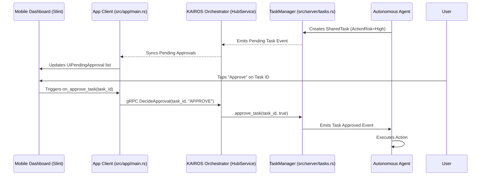

# AI Agent Approval Workflow Engine Architecture

## Title
Implement AI Agent Approval Workflow Engine ("Draft-for-Review")

## Problem Statement
Small business owners (like Maya the baker or Carlos the handyman) need AI agents to offload repetitive tasks such as responding to DMs, generating quotes, and publishing social media posts. However, fully autonomous execution of high-risk external actions (like sending customer emails or publishing posts) can erode trust and lead to brand damage if the AI hallucinates. Business owners need a simple, low-friction way to review and approve these high-risk actions before they go live, right from their mobile dashboard, ensuring they remain in full control of their business's voice and operations.

## Research Report
Current autonomous agent implementations across platforms (e.g., Shopify Sidekick, Wix AI) largely focus on reactive chat interfaces or fully manual generative tools (prompt -> copy/paste). The emerging paradigm in OHC treats AI as a "Teammate" that proactively observes business events and drafts responses or actions.

Our analysis of the OHC codebase reveals:
1.  **UI Preparedness:** The frontend (`src/app/dashboard.slint`) already has UI components for "Drafts Ready for Review" (`UiPendingApproval`), showing the proposed content and an "Approve" button.
2.  **Backend Task Management:** `src/server/tasks.rs` manages the state of `SharedTask`s, including an `approval_status` field (PENDING, APPROVED, REJECTED) and a `proposed_content` field.
3.  **gRPC Interface Gap:** While `HubServiceClient` (used by the frontend in `src/app/main.rs`) registers agents, the actual `DecideApproval` RPC is currently housed in `B2BService` (`src/proto/hub.proto` and `src/server/services/b2b/service.rs`), which uses an in-memory `RwLock<Vec<ApprovalRequest>>` separate from the core `TaskManager`.
4.  **Integration Gap:** In the Slint frontend, clicking the "Approve" button triggers `ui.on_approve_task`, but in `src/app/main.rs`, this callback is not wired up to any gRPC call to the backend; it only has placeholder logic in tests.

**Competitive Analysis:**
-   **Shopify / Wix:** Require the user to initiate the generation process (prompting).
-   **OHC Advantage:** Proactive generation with a 1-tap mobile approval feed. This significantly reduces cognitive load and execution time for the business owner.

## Design Doc

### Architecture Diagram

### Mobile UX Flow
1.  **Notification:** User receives a push notification (or sees a badge on the app icon) indicating a new draft is ready for review.
2.  **Dashboard View (375px):** The "Drafts Ready for Review" section appears prominently at the top of the dashboard feed.
3.  **Action Card:** Each draft is presented as a clean card showing the title (e.g., "Draft Reply to Maya") and the `proposed_content`.
4.  **1-Tap Action:** The user taps the primary "Approve" button.
5.  **Optimistic Update:** The UI immediately removes the card from the pending list and shows a brief success toast, while the background client asynchronously confirms the decision with the Orchestrator via gRPC.

### AI Agent Integration Points
-   **Mission Payload:** Agents must tag actions with an `ActionRisk` level. Low-risk actions (e.g., updating an internal tag) auto-execute. High-risk actions (e.g., sending an email) are created as tasks with `approval_status = "PENDING"` and the `proposed_content` populated.
-   **Execution Block:** Agents polling for tasks must pause execution on high-risk tasks until the `approval_status` transitions to `APPROVED`.

### Key Design Decisions
-   **Consolidate Approvals in HubService:** Move `DecideApproval` out of the isolated `B2BService` (which uses a separate in-memory store) and into the core `HubService` or a dedicated `OrchestrationService` that directly interfaces with the unified `TaskManager` in `src/server/tasks.rs`.
-   **Optimistic UI:** The client (`src/app/main.rs`) must update the Slint model immediately upon clicking approve to ensure a snappy mobile experience, deferring error handling to a toast notification if the gRPC call fails.

## Implementation Prompt
**Objective:** Wire up the "Draft-for-Review" 1-tap approval workflow from the Slint frontend to the central Task Manager.

**Context:** The frontend `UiPendingApproval` component in `src/app/dashboard.slint` triggers `on_approve_task(task_id)`. The backend `TaskManager` in `src/server/tasks.rs` has an `approve_task(task_id, is_approved)` method. However, the connection between them is missing.

**Tasks:**
1.  In `src/app/main.rs`, implement the `ui.on_approve_task` closure. When invoked, it should make a gRPC call (e.g., `DecideApproval`) to the backend Hub or Orchestrator service.
2.  Ensure the target gRPC endpoint (currently in `B2BService`, but should ideally be in the service managing `SharedTasks`) receives the request and calls `task_manager.approve_task(task_id, true)`.
3.  Implement optimistic UI updates in `src/app/main.rs` to immediately remove the approved task from the `pending_approvals` model in the Slint UI.
4.  Write or update Playwright E2E tests (e.g., in `src/e2e/dashboard.spec.ts`) to verify that clicking "Approve" on a draft card successfully updates the backend task status and removes the card from the UI.
5.  Ensure unit tests in `src/app/main.rs` and `src/server/tasks.rs` achieve 100% coverage for the new integration.

**Acceptance Criteria:**
- Clicking "Approve" on a draft in the UI sends a successful gRPC request to the backend.
- The `SharedTask`'s `approval_status` is updated to `"APPROVED"` in the database/task manager.
- The UI reflects the removal of the approved draft.

## Priority
P1 (High)

## Estimated Scope
Medium
