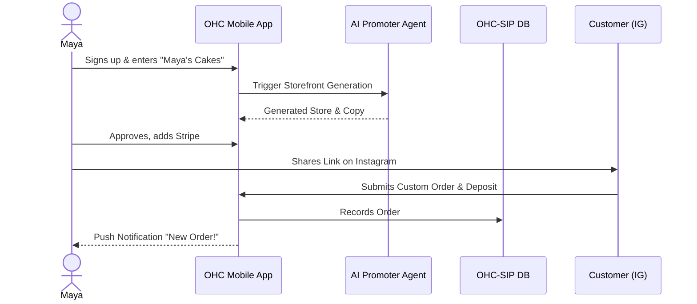
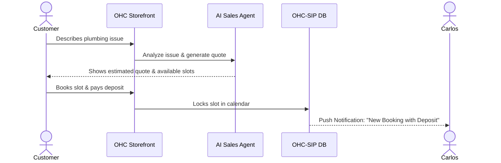
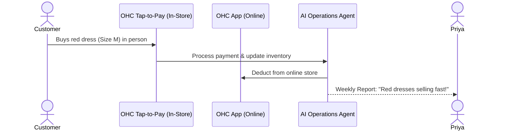

# [Architecture] Business Journey Architecture

## Problem Statement
The OneHumanCorp (OHC) platform aims to let anyone launch a business in under 10 minutes with zero technical knowledge. To achieve this, the end-to-end business journey from acquisition to retention and referral must be meticulously designed. We need a clear architectural view of the user journeys for our key personas (Maya, Carlos, Priya, Leo, and Fatima) to identify friction points and ensure the system architecture, UI/UX, and AI agents seamlessly support these flows. If the journey has any technical jargon or complex setups, non-technical users will abandon it.

## Research Report

### Target Personas & Core Journeys
1. **Maya (The Home Baker, 28)** - Focuses on custom cake orders, deposit payments, and Instagram DM integration. Needs a mobile-only setup.
2. **Carlos (The Freelance Handyman, 42)** - Focuses on service listings, online bookings with deposits, and automated quotes based on customer issues.
3. **Priya (The Boutique Owner, 35)** - Focuses on online+in-store sync, variants, tap-to-pay, and advanced analytics on mobile and desktop.
4. **Leo (The Music Tutor, 22)** - Focuses on recurring lesson subscriptions, Google Calendar sync, Zoom integrations, and a link-in-bio page.
5. **Fatima (The Food Cart Operator, 50)** - Focuses on pre-orders, sold-out toggles, multi-language UI, and low-data mobile performance.

### Key Lifecycle Stages
- **Acquisition**: How users find OHC (TikTok, Instagram, word of mouth).
- **Onboarding**: Zero-to-Live wizard in < 10 mins. Minimum inputs.
- **Activation**: First product sale, first payment processing.
- **Retention**: Daily habit formation (checking orders, AI daily reports).
- **Revenue**: Free -> Starter upgrades triggered by business growth limits.
- **Referral**: Viral loops (e.g., "Powered by OHC").

### Identified Friction Points
- **Account Setup & Domain Registration**: Technical jargon around DNS and custom domains causes drop-offs.
- **Payment Gateway Onboarding**: Stripe KYC can be intimidating for casual side-hustlers.
- **Inventory & Service Setup**: Blank canvas syndrome. Manual entry is tedious.
- **AI Trust**: Users might not trust AI to reply to customers right away without an approval workflow.

## Design Doc

### Mobile UX Flow (375px First)
1. **Landing / Acquisition**: "What's your business name?" -> one-tap Google/Apple Sign-In.
2. **Onboarding Wizard**:
   - Select Business Type (e.g., "Food", "Services").
   - AI generates initial storefront layout and copy.
   - User uploads a few photos or selects stock.
   - Connect bank via Stripe Connect (simplified UI).
3. **Activation**: User shares "Link-in-bio" or storefront URL directly to Instagram/TikTok.
4. **Daily Dashboard (Retention)**:
   - A single, unified inbox for messages, orders, and AI suggestions.
   - "Your business had 3 orders today!" plain-language summary.

### AI Agent Integration Points
- **Onboarding**: "Marketing Agent" designs the initial storefront and writes copy.
- **Activation**: "Sales Agent" suggests first steps (e.g., "Share your link on Instagram").
- **Retention**: "Advisory Agent" generates weekly plain-language reports.
- **Fulfillment**: "Operations Agent" auto-manages inventory toggles (e.g., marking Fatima's food sold out).

### Key Design Decisions
- **No-Code Defaults**: No CSS or layout editors. Only constrained block-based design using the OHC Premium Token library.
- **Deferred KYC**: Delay deep payment onboarding until the first sale is pending, minimizing upfront friction.
- **Progressive Disclosure of AI**: Start AI in "Draft-for-Review" mode, allowing users to switch to "Auto-Execute" as trust builds.

### Architecture Diagrams

#### 1. Maya (The Home Baker) - Acquisition to Activation

#### 2. Carlos (The Freelance Handyman) - Booking Journey

#### 3. Priya (The Boutique Owner) - Omnichannel Sync

## Implementation Prompt
**User-Facing Outcome**: The user should experience a guided, friction-free onboarding flow that takes them from signup to a live, published storefront in under 10 minutes. The flow must dynamically adjust based on the selected business type (Products vs. Services vs. Food).
**Critical User Journey (CUJ)**:
1. User opens the app and selects "Start my business".
2. User provides a business name and category.
3. AI generates a suggested storefront structure.
4. User connects a payout method (Stripe).
5. User clicks "Publish" and receives a live shareable URL.
**Acceptance Criteria**:
- The onboarding wizard is fully responsive down to 375px.
- No manual layout configurations are required.
- The AI dynamically populates placeholder text and images relevant to the business category.
- The user can successfully complete the flow and view their live storefront.

## Priority
P0 (Critical)

## Estimated Scope
Large
