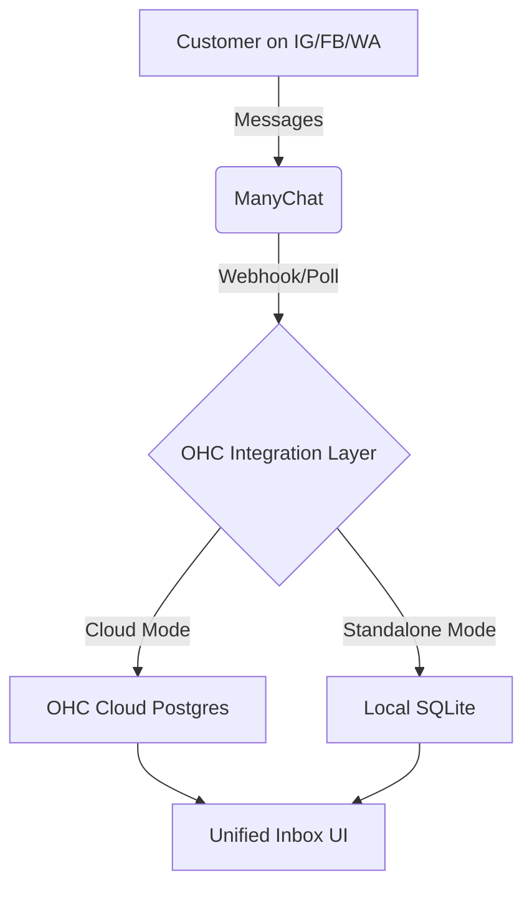
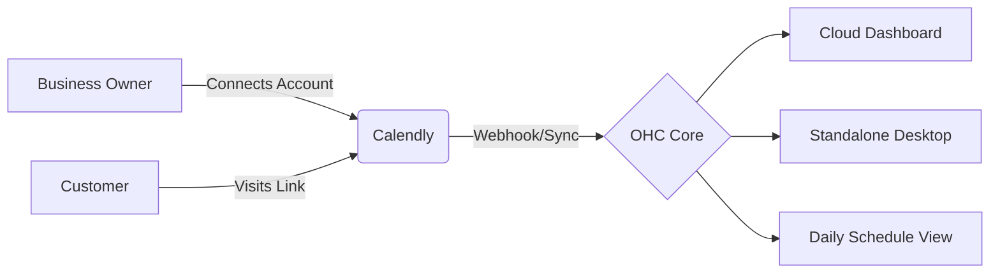
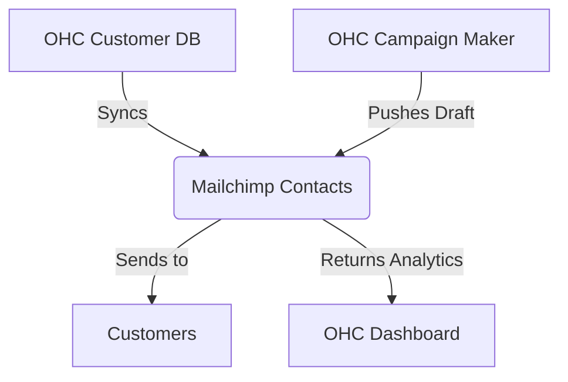
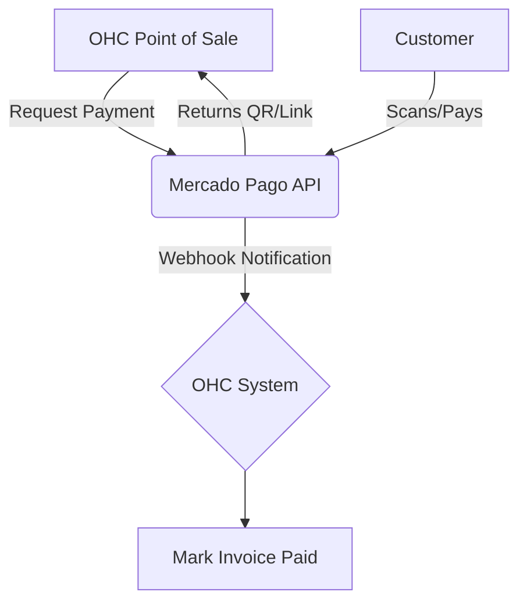
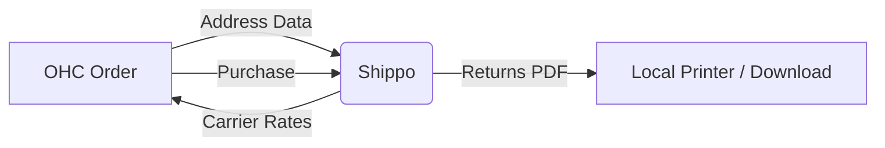
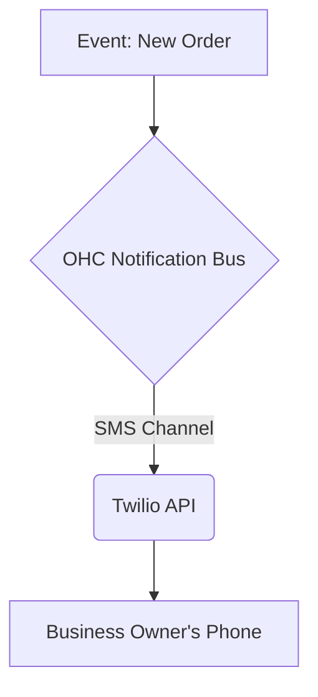
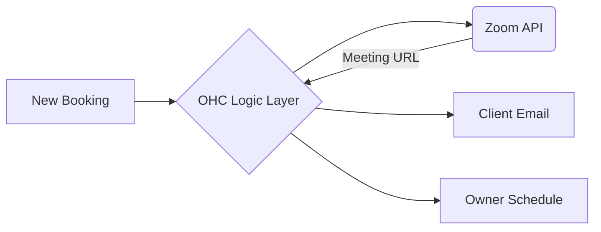

# Research Report: OHC Tool Integration Scout (Q4)

This report outlines 7 tool integrations designed to solve real problems for small business owners in both Cloud and Standalone environments. Every evaluation applies the "Business Owner Lens" and the "Visual Excellence Mandate."

---

## [Social Media] Issue Brief: Universal Inbox Integration via ManyChat

### Title
Integrate ManyChat for a Universal Social Media Inbox

### Problem Statement
Small business owners like food cart operators or independent bakers often juggle customer messages across Instagram DMs, Facebook Messenger, and WhatsApp. Missing a DM means missing a sale. They need a single, unified inbox to view and respond to all social inquiries without constantly switching apps.

### Research Report
**Tool Evaluated:** ManyChat API
**Persona:** Independent Baker, Food Cart Operator
ManyChat provides a unified platform and API to aggregate Meta (Instagram, Facebook, WhatsApp) messages.
- **Ease of Use:** High. Once connected, messages flow into one stream.
- **Pricing:** ~$15/month for Pro features.
- **Reputation:** Industry standard for social chat automation.
- **Cloud vs. Standalone:** In Cloud mode, we can handle webhooks centrally. In Standalone, local polling or proxy webhook servers might be required.

| Feature | ManyChat | Meta Native API |
|---------|----------|-----------------|
| Unified API | Yes | No (Fragmented) |
| Setup Complexity | Low | High |
| Standalone Support | Medium (via proxy) | Low |

### Design Doc

**Mobile UX Flow (375px Viewport):**
1. **Home:** Tap "Unified Inbox" icon.
2. **Inbox:** List of threads with small IG/FB icons indicating the source.
3. **Thread:** Chat interface resembling standard SMS. "Reply" button sends the message back via ManyChat to the native platform.

### Implementation Prompt
Implement a unified inbox experience within OHC. The business owner should authorize their ManyChat account once. Afterward, all incoming messages from connected channels appear in a single scrollable feed. When the user replies, the message is routed back to the correct platform seamlessly. Ensure the UI feels like a simple texting app.

### Priority
P1

### Estimated Scope
Medium

---

## [Calendar] Issue Brief: Zero-Friction Booking via Calendly

### Title
Integrate Calendly for Automated Appointment Booking

### Problem Statement
Service providers like handymen and consultants lose hours each week going back and forth over text trying to find a time to meet. They need a simple link to send customers that securely shows their availability without double-booking.

### Research Report
**Tool Evaluated:** Calendly API
**Persona:** Handyman, Consultant
- **Ease of Use:** Very high for the end customer. The owner just shares a link.
- **Pricing:** Free tier available; $10/month for advanced routing.
- **Reputation:** Market leader in scheduling.
- **Cloud vs. Standalone:** Works seamlessly via OAuth. For Standalone, the user authenticates directly via their local app, interacting with Calendly's API.

| Feature | Calendly | Google Calendar Native |
|---------|----------|------------------------|
| Booking Page | Yes | Clunky |
| Conflict Resolution | Excellent | Good |
| Timezone Handling | Automatic | Manual |

### Design Doc

**Mobile UX Flow (375px Viewport):**
1. **Home:** "My Schedule" card showing today's appointments.
2. **Action:** "Share Booking Link" button copies the personalized URL to clipboard.
3. **Notification:** Push/in-app alert when a new booking is made.

### Implementation Prompt
Provide a 1-click connect flow for Calendly. Once connected, OHC will automatically fetch upcoming appointments and display them on the home dashboard. Include a prominent "Share Link" button so the owner can easily text their booking page to clients.

### Priority
P0

### Estimated Scope
Small

---

## [Email Marketing] Issue Brief: Effortless Campaigns via Mailchimp

### Title
Integrate Mailchimp for Customer List Campaigns

### Problem Statement
A baker wants to let her 500 past customers know about a holiday special, but sending individual emails or blind-copying everyone is unprofessional and gets flagged as spam. They need a simple way to blast updates to their customer list.

### Research Report
**Tool Evaluated:** Mailchimp API
**Persona:** Independent Baker, Retailer
- **Ease of Use:** Drag-and-drop templates are easy, but we can simplify further by auto-generating plain text/simple HTML from OHC.
- **Pricing:** Free for up to 500 contacts.
- **Reputation:** Ubiquitous, high deliverability.
- **Cloud vs. Standalone:** Contact syncing can happen background in both modes via REST API.

| Feature | Mailchimp | SendGrid |
|---------|-----------|----------|
| Marketing Focus | High | Low (Transactional) |
| Template Engine | Excellent | Basic |
| Spam Compliance | Built-in | Manual |

### Design Doc

**Mobile UX Flow (375px Viewport):**
1. **Home:** "Send Update" button.
2. **Compose:** Simple text box with photo attachment option.
3. **Review & Send:** Shows total recipients. "Send Blast" button.

### Implementation Prompt
Create an automatic, one-way sync of OHC customer contacts to a Mailchimp audience list. Provide a simple compose view in OHC where the owner can type a message, attach an image, and click send. OHC handles the API call to create and send the campaign via Mailchimp without the user navigating the complex Mailchimp dashboard.

### Priority
P2

### Estimated Scope
Medium

---

## [Payment Processing] Issue Brief: Localized Payments via Mercado Pago

### Title
Integrate Mercado Pago for LATAM Payment Processing

### Problem Statement
LATAM business owners cannot rely solely on Stripe. They need a payment processor that supports local payment methods (like Pix in Brazil or OXXO in Mexico) to ensure they don't lose sales at checkout.

### Research Report
**Tool Evaluated:** Mercado Pago API
**Persona:** LATAM Food Cart Operator, Local Merchant
- **Ease of Use:** Familiar to LATAM customers. QR code generation is highly utilized.
- **Pricing:** Varies by country, typically ~3-4% + fixed fee.
- **Reputation:** Dominant in Latin America.
- **Cloud vs. Standalone:** Can generate dynamic QR codes for in-person Standalone use; Cloud supports hosted checkouts.

| Feature | Mercado Pago | Stripe |
|---------|--------------|--------|
| LATAM Localization | Excellent | Limited |
| Cash Payments (OXXO) | Yes | Limited |
| Settlement Speed | Instant (varies) | Days |

### Design Doc

**Mobile UX Flow (375px Viewport):**
1. **Checkout:** Enter amount. Tap "Charge via Mercado Pago".
2. **Display:** Screen shows a large QR code.
3. **Success:** Green checkmark overlay automatically appears when payment clears.

### Implementation Prompt
Integrate Mercado Pago as a core payment provider. Focus on generating payment links and QR codes directly from the OHC mobile interface. When the payment is completed, automatically update the OHC ledger and display a visual confirmation to the business owner.

### Priority
P1

### Estimated Scope
Medium

---

## [Shipping] Issue Brief: Streamlined Logistics via Shippo

### Title
Integrate Shippo for 1-Click Shipping Labels

### Problem Statement
E-commerce sellers waste hours manually copying addresses into carrier websites to buy shipping labels. They need a way to instantly see rates and print labels directly from their order view.

### Research Report
**Tool Evaluated:** Shippo API
**Persona:** Craft Maker, E-commerce Retailer
- **Ease of Use:** API handles all carrier logic.
- **Pricing:** Pay-as-you-go ($0.05 per label) + carrier costs.
- **Reputation:** Excellent developer experience and carrier coverage.
- **Cloud vs. Standalone:** API calls work identically; Standalone app can directly send PDFs to local printers.

| Feature | Shippo | EasyPost |
|---------|--------|----------|
| SMB Focus | High | Medium |
| Web App Fallback | Yes | No |
| Label Format | PDF/ZPL | PDF/ZPL |

### Design Doc

**Mobile UX Flow (375px Viewport):**
1. **Order Detail:** Shows customer address. Tap "Get Shipping Rates".
2. **Selection:** List of carriers (USPS, UPS) with prices. Tap one.
3. **Print:** "Buy Label" completes purchase and displays PDF ready for printing.

### Implementation Prompt
Add a shipping module to order details. Connect to Shippo to fetch live rates based on preset box sizes. Allow the owner to purchase the cheapest label with one tap and immediately view/print the shipping label from their device.

### Priority
P2

### Estimated Scope
Medium

---

## [SMS] Issue Brief: Reliable Notifications via Twilio

### Title
Integrate Twilio for Global SMS Notifications

### Problem Statement
Users with low English proficiency or those who rarely check email (like Fatima) miss important platform alerts. They need simple, immediate SMS notifications for critical events like new orders or payment failures.

### Research Report
**Tool Evaluated:** Twilio Programmable SMS
**Persona:** Any (especially low-tech or non-English speaking)
- **Ease of Use:** End user does nothing; they just receive texts.
- **Pricing:** ~$0.0079 per message (US).
- **Reputation:** The gold standard for programmatic SMS.
- **Cloud vs. Standalone:** Cloud can use a centralized pool of numbers. Standalone might require the user to input their own API key, or we proxy it through OHC cloud.

| Feature | Twilio | MessageBird |
|---------|--------|-------------|
| Global Reach | Excellent | Excellent |
| API Reliability | High | High |
| Cost | Standard | Slightly Lower |

### Design Doc

**Mobile UX Flow (375px Viewport):**
1. **Settings:** Toggle "Send me SMS alerts".
2. **Experience:** User receives a standard text message (e.g., "New order for $45.00 from John. Open OHC app to view.")

### Implementation Prompt
Build an SMS alert channel using Twilio. Provide a settings toggle for the business owner to opt-in to SMS alerts for critical events. The implementation should ensure messages are concise, properly formatted for SMS (no HTML), and include localized language support if necessary.

### Priority
P0

### Estimated Scope
Small

---

## [Video Conferencing] Issue Brief: Automated Meeting Links via Zoom

### Title
Integrate Zoom for Auto-Generated Consultations

### Problem Statement
Tutors and consultants have to manually create Zoom meetings and email the links to clients after they book a slot. This is error-prone and tedious. They need the meeting link automatically generated and attached to the booking.

### Research Report
**Tool Evaluated:** Zoom API
**Persona:** Online Tutor, Consultant
- **Ease of Use:** Ubiquitous for clients.
- **Pricing:** Free for 40-min meetings; Pro is $15/month.
- **Reputation:** Most widely used video tool.
- **Cloud vs. Standalone:** OAuth works securely across both modes to generate links on behalf of the user.

| Feature | Zoom | Google Meet |
|---------|------|-------------|
| Client Familiarity | Extremely High | High |
| API Features | Comprehensive | Limited |
| Recording Access | Cloud via API | Google Drive only |

### Design Doc

**Mobile UX Flow (375px Viewport):**
1. **Schedule View:** Appointment card shows "Join Meeting" button.
2. **Action:** Tapping the button launches the native Zoom app or browser directly into the call.

### Implementation Prompt
Provide a Zoom OAuth integration. When a new consultation is scheduled via OHC, automatically call the Zoom API to generate a meeting room. Save the join link to the appointment record, display a "Join" button on the owner's dashboard, and automatically include the link in the customer's confirmation message.

### Priority
P2

### Estimated Scope
Medium
